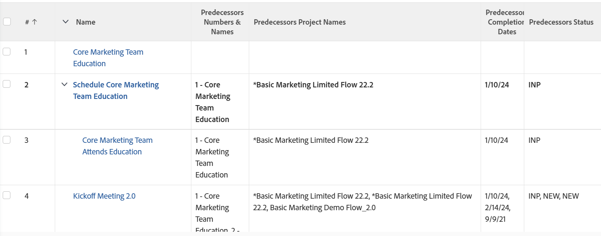

# Visa: föregående information

I den här uppgiftsvyn visas information om föregående aktiviteter för uppgifter som använder en samlingsvy. I en samlingsvy kan du visa information om objekt som finns i en&quot;1:N&quot;-relation. I det här fallet kan varje uppgift (en) ha flera föregående (många). I vyn visas namnet på aktiviteterna samt namnen på Föregående och Föregående, Föregående och Föregående samt Status för Föregående projekt.

Mer information om hur du refererar till samlingar i rapporter finns i [Referenssamlingar i en rapport](../../../reports-and-dashboards/reports/text-mode/reference-collections-report.md).

## Åtkomstkrav

Du måste ha följande åtkomst för att kunna utföra stegen i den här artikeln:

<table style="table-layout:auto"> 
 <col> 
 <col> 
 <tbody> 
  <tr> 
   <td role="rowheader">Adobe Workfront-plan*</td> 
   <td> 
Alla
 </td> 
  </tr> 
  <tr> 
   <td role="rowheader">Adobe Workfront-licens*</td> 
   <td> 
Plan 
 </td> 
  </tr> 
  <tr> 
   <td role="rowheader">Konfigurationer på åtkomstnivå*</td> 
   <td> 
Redigera åtkomst till rapporter, instrumentpaneler och kalendrar
 
Redigera åtkomst till filter, vyer, grupperingar
 
Obs! Om du fortfarande inte har åtkomst frågar du Workfront-administratören om de anger ytterligare begränsningar för din åtkomstnivå. Information om hur en Workfront-administratör kan ändra åtkomstnivån finns i <a href="../../../administration-and-setup/add-users/configure-and-grant-access/create-modify-access-levels.md" class="MCXref xref">Skapa eller ändra anpassade åtkomstnivåer</a>.
 </td> 
  </tr> 
  <tr> 
   <td role="rowheader">Objektbehörigheter</td> 
   <td> 
Hantera behörigheter i en rapport
 
Mer information om hur du begär ytterligare åtkomst finns i <a href="../../../workfront-basics/grant-and-request-access-to-objects/request-access.md" class="MCXref xref">Begär åtkomst till objekt </a>.
 </td> 
  </tr> 
 </tbody> 
</table>

&#42;Kontakta Workfront-administratören om du vill veta vilken plan, licenstyp eller åtkomst du har.

## Visa föregående information

1. Gå till en lista med uppgifter.
1. Från **Visa** nedrullningsbar meny, välja **Ny vy**.

1. I **Förhandsgranska kolumn** -område, ta bort alla kolumner utom en.
1. Klicka på rubriken för den återstående kolumnen och klicka sedan på **Växla till textläge**.
1. För musen över textlägesområdet och klicka **Klicka för att redigera text**.
1. Ta bort den text du hittar i **Textläge** och ersätt den med följande kod:
   <pre>column.0.displayname= column.0.linkedname=direct column.0.namekey=name column.0.querysort=name column.0.valuefield=name column.0.valueformat=HTML column.1.displayName=Predecessors Numbers &amp; Names column.1.listdelimiter=  column.1.listmethod=nested(predecessors).lists column.1.textmode=true column.1.type=iterate column.1.valueexpression=CONCAT({predecessor}).{taskNumber}, -,{predecessor}.{name}) column.1.valueformat=HTML column.2.displayName=Predecessors Project Names column.2.listdelimiter=  column.2.listmethod=nested(predecessors).lists column.2.textmode=true column.2.type=iterate column.2.valueexpression={predecessor}.{project}.{name} column.2.valueformat=HTML column.3.displayName=Predecessors Completion Dates column.3.listdelimiter=  column.3.listmethod=nested(predecessors).lists column.3.textmode=true column.3.type=iterate column.3.valueexpression={predecessor}.{planningCompletionDate} column.3.valueformat=HTML column.4.displayName=Predecessors Status column.4.listdelimiter=  column.4.listmethod=nested(predecessors).lists column.4.textmode=true column.4.type=iterate column.4.valueexpression={predecessor}.{status} column.4.valueformat=HTML</pre>

1. Klicka **Spara vy**.
