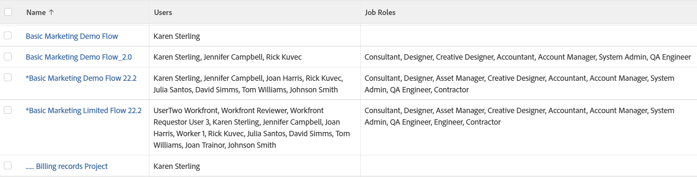

# Visa: projekt med alla användare och roller i projektteamet

I den här projektvyn visas en lista med användare och jobbroller som tilldelats projektteamet.

>[!NOTE]
>
>Om jobbrollen är listad på samma rad som en användare innebär detta inte att användaren fyller den rollen i projektet eller att användaren är tilldelad den rollen i sin profil.

## Åtkomstkrav

Du måste ha följande åtkomst för att kunna utföra stegen i den här artikeln:

<table style="table-layout:auto"> 
 <col> 
 <col> 
 <tbody> 
  <tr> 
   <td role="rowheader">Adobe Workfront-plan*</td> 
   <td> 
Alla
 </td> 
  </tr> 
  <tr> 
   <td role="rowheader">Adobe Workfront-licens*</td> 
   <td> 
Begäran om att ändra en vy 

   
Planera att ändra en rapport
 </td> 
  </tr> 
  <tr> 
   <td role="rowheader">Konfigurationer på åtkomstnivå*</td> 
   <td> 
Redigera åtkomst till rapporter, instrumentpaneler och kalendrar för att ändra en rapport
 
Redigera åtkomst till filter, vyer och grupperingar för att ändra en vy
 
<b>ANMÄRKNING</b>

Om du fortfarande inte har åtkomst frågar du Workfront-administratören om de anger ytterligare begränsningar för din åtkomstnivå. Information om hur en Workfront-administratör kan ändra åtkomstnivån finns i <a href="../../../administration-and-setup/add-users/configure-and-grant-access/create-modify-access-levels.md" class="MCXref xref">Skapa eller ändra anpassade åtkomstnivåer</a>.
 </td>
</tr>  
  <tr> 
   <td role="rowheader">Objektbehörigheter</td> 
   <td> 
Hantera behörigheter i en rapport
 
Mer information om hur du begär ytterligare åtkomst finns i <a href="../../../workfront-basics/grant-and-request-access-to-objects/request-access.md" class="MCXref xref">Begär åtkomst till objekt </a>.
 </td> 
  </tr> 
 </tbody> 
</table>

&#42;Kontakta Workfront-administratören om du vill veta vilken plan, licenstyp eller åtkomst du har.

## Visa ett projekt med alla användare och roller i projektteamet

1. Gå till en lista med projekt.
1. Från **Visa** nedrullningsbar meny, välja **Ny vy**.

1. I **Förhandsgranska kolumn** -område, ta bort alla kolumner utom en.
1. Klicka på rubriken för den återstående kolumnen och klicka sedan på **Växla till textläge**.
1. För musen över textlägesområdet och klicka **Klicka för att redigera text**.
1. Ta bort den text du hittar i **Textläge** och ersätt den med följande kod:
   <pre>column.0.link.linkproperty.0.name=ID column.0.link.linkproperty.0.valuefield=ID column.0.link.linkproperty.0.valueformat=int column.0.link.lookup=link.view column.0.link.valuefield=objCode column.0.link.valueFormat=val column.0.linkedname=direct column.0.listsort=string(name) column.0.namekey=name.abbr column.0.querysort=name column.0.shortview=false column.0.stretch=60 column.0.valuefield=name column.0.valueformat=HTML column.0.width=150 column.1.description=Team Users column.1.link.linkproperty.0.name=ID column.1.link.linkproperty.0.valuefield=userID column.1.link.linkproperty.0.valueformat=int column.1.link.page=/userView.cmd column.1.listdelimiter= column.1.listmethod=nested(projectUsers).lists column.1.namekey=user.plural column.1.stretch=30 column.1.type=iterate column.1.valuefield=user:name column.1.valueformat=HTML column.1.width=150 column.2.description=Team Roles column.2.link.linkproperty.0.name=ID column.2.link.linkproperty.0.valuefield=ID column.2.link.linkproperty.0.valueformat=int column.2.link.page=/roleView.cmd column.2.listdelimiter= column.2.listmethod=nested(roles).lists column.2.namekey=jobrole.plural column.2.stretch=10 column.2.type=iterate column.2.valuefield=name column.2.valueformat=HTML column.2.width=150.stretch=0</pre>

1. Klicka **Spara vy**.
