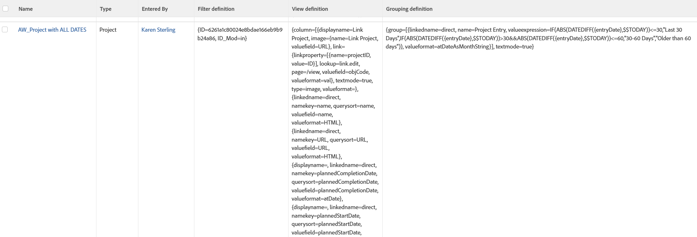

# Visa: rapportelement som används i rapporter

<!--Audited: 11/2024-->

I den här vyn visas den vy, det filter och den gruppering som används för att skapa respektive rapport i Adobe Workfront när du använder den i en lista med rapporter.

Du kan se `valuefields` eller `valueexpressions` som används i alla element i rapporten.



## Åtkomstkrav

+++ Expandera om du vill visa åtkomstkrav för funktionerna i den här artikeln.

Du måste ha följande åtkomst för att kunna utföra stegen i den här artikeln:

<table style="table-layout:auto"> 
 <col> 
 <col> 
 <tbody> 
  <tr> 
   <td role="rowheader">Adobe Workfront</td> 
   <td> <p>Alla</p> </td> 
  </tr> 
  <tr> 
   <td role="rowheader">Adobe Workfront-licens</td> 
   <td> <p> Aktuell: 
   <ul>
   <li>Begäran om att ändra en vy</li> 
   <li>Planera att ändra en rapport</li>
   </ul>
     </p>
     <p> Nytt: 
   <ul>
   <li>Medarbetare som ändrar en vy</li> 
   <li>Standard för att ändra en rapport</li>
   </ul>
     </p>
    </td> 
  </tr> 
  <tr> 
   <td role="rowheader">Konfigurationer på åtkomstnivå*</td> 
   <td> <p>Redigera åtkomst till rapporter, instrumentpaneler och kalendrar för att ändra en rapport</p> <p>Redigera åtkomst till filter, vyer och grupperingar för att ändra en vy</p> </td> 
  </tr> 
  <tr> 
   <td role="rowheader">Objektbehörigheter</td> 
   <td> <p>Hantera behörigheter i en rapport</p> </td> 
  </tr> 
 </tbody> 
</table>

Mer information om informationen i den här tabellen finns i [Åtkomstkrav i Workfront-dokumentationen](/help/quicksilver/administration-and-setup/add-users/access-levels-and-object-permissions/access-level-requirements-in-documentation.md).

+++

## Visa rapportelement som används i rapporter

1. Gå till en lista med rapporter.
1. Välj **Ny vy** i listrutan **Visa**.
1. Ta bort alla kolumner utom en i området **Förhandsvisa kolumn**.
1. Klicka på rubriken för den återstående kolumnen och klicka sedan på **Växla till textläge** > **Redigera textläge**.
1. Ta bort den text du söker i rutan **Redigera textläge** och ersätt den med följande kod:


   ```
   column.0.descriptionkey=name
   column.0.link.linkproperty.0.name=ID
   column.0.link.linkproperty.0.valuefield=ID
   column.0.link.linkproperty.0.valueformat=string
   column.0.link.lookup=link.run
   column.0.link.value=val(objCode)
   column.0.listsort=string(name)
   column.0.namekey=name.abbr
   column.0.querysort=name
   column.0.valuefield=name
   column.0.valueformat=HTML
   column.0.width=200
   column.1.descriptionkey=objecttype
   column.1.listsort=nested(view).string(uiObjCode)
   column.1.namekey=objecttype.abbr
   column.1.querysort=uiObjCode
   column.1.valuefield=uiObjCode
   column.1.valueformat=objCodeMessage
   column.1.width=80
   column.2.descriptionkey=enteredby
   column.2.listsort=nested(enteredBy).string(lastName)
   column.2.namekey=enteredby.abbr
   column.2.querysort=enteredBy:lastName
   column.2.valuefield=enteredBy:name
   column.2.valueformat=HTML
   column.2.width=130
   column.3.displayname=Filter definition
   column.3.textmode=true
   column.3.valuefield=filter:definition
   column.3.valueformat=HTML
   column.4.displayname=View definition
   column.4.textmode=true
   column.4.valuefield=view:definition
   column.4.valueformat=HTML
   column.5.displayname=Grouping definition
   column.5.textmode=true
   column.5.valuefield=groupBy:definition
   column.5.valueformat=HTML
   ```

1. Klicka på **Klar** > **Spara vy**.
