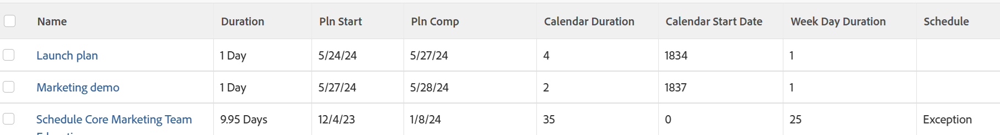

# Visa: aktiviteter som påverkas av schemaundantag

<!--Audited: 11/2024-->

I den här aktivitetsvyn identifieras aktiviteter som måste slutföras sent på grund av helger, personlig tid av eller andra schemaundantag.

I den här vyn visas följande:

* Aktiviteternas längd
* De planerade start- och slutförandedatumen för aktiviteterna
* Aktiviteternas längd enligt antalet dagar mellan aktiviteternas planerade startdatum och planerade slutförandedatum (kalendervaraktighet)
* Antalet dagar i projektets schema när aktiviteten startar (kalenderns startdatum)
* Veckodagslängd för uppgifterna enligt antalet veckodagar mellan planerat start- och slutförandedatum för aktiviteterna (Veckodagslängd)
* Om Veckodagslängd är längre än aktiviteternas längd, vilket betyder att det finns undantagsdagar i aktiviteternas längd, markeras aktiviteterna som ett undantag.\
  

## Åtkomstkrav

+++ Expandera om du vill visa åtkomstkrav för funktionerna i den här artikeln.

<table style="table-layout:auto"> 
 <col> 
 <col> 
 <tbody> 
  <tr> 
   <td role="rowheader">Adobe Workfront package</td> 
   <td> <p>Alla</p> </td> 
  </tr> 
  <tr> 
   <td role="rowheader">Adobe Workfront-licens</td> 
   <td> 
   <p>Medarbetare eller begäran om att ändra en vy </p>
   <p>Standard eller Plan för att ändra en rapport</p>
  </tr> 
  <tr> 
   <td role="rowheader">Konfigurationer på åtkomstnivå</td> 
   <td> <p>Redigera åtkomst till rapporter, instrumentpaneler och kalendrar för att ändra en rapport</p> <p>Redigera åtkomst till filter, vyer och grupperingar för att ändra en vy</p> </td> 
  </tr> 
  <tr> 
   <td role="rowheader">Objektbehörigheter</td> 
   <td> <p>Hantera behörigheter i en rapport</p>  </td> 
  </tr> 
 </tbody> 
</table>

Mer information om informationen i den här tabellen finns i [Åtkomstkrav i Workfront-dokumentationen](/help/quicksilver/administration-and-setup/add-users/access-levels-and-object-permissions/access-level-requirements-in-documentation.md).


+++

## Visa aktiviteter som påverkas av schemaundantag

1. Gå till en lista med uppgifter.
1. Välj **Ny vy** i listrutan **Visa**.
1. Ta bort alla kolumner utom en i området **Förhandsvisa kolumn**.
1. Klicka på rubriken för den återstående kolumnen och klicka sedan på **Växla till textläge** > **Redigera textläge**.
1. Ta bort den text du söker i rutan **Redigera textläge** och ersätt den med följande kod:

   ```
   column.0.descriptionkey=name
   column.0.link.linkproperty.0.name=ID
   column.0.link.linkproperty.0.valuefield=ID
   column.0.link.linkproperty.0.valueformat=int
   column.0.link.lookup=link.view
   column.0.link.valuefield=objCode
   column.0.link.valueformat=val
   column.0.linkedname=direct
   column.0.listsort=string(name)
   column.0.namekey=name.abbr
   column.0.querysort=name
   column.0.shortview=false
   column.0.stretch=100
   column.0.valuefield=name
   column.0.valueformat=HTML
   column.0.width=150
   column.1.descriptionkey=duration
   column.1.linkedname=direct
   column.1.listsort=intAsInt(durationMinutes)
   column.1.namekey=duration.abbr
   column.1.querysort=durationMinutes
   column.1.shortview=false
   column.1.stretch=0
   column.1.valuefield=durationFieldLong
   column.1.valueformat=compound
   column.1.viewalias=duration
   column.1.width=80
   column.2.descriptionkey=plannedstartdate
   column.2.linkedname=direct
   column.2.listsort=atDateAsAtDate(plannedStartDate)
   column.2.namekey=plannedstartdate.abbr
   column.2.querysort=plannedStartDate
   column.2.shortview=false
   column.2.stretch=0
   column.2.valuefield=plannedStartDate
   column.2.valueformat=atDate
   column.2.width=80
   column.3.descriptionkey=plannedcompletiondate
   column.3.linkedname=direct
   column.3.listsort=atDateAsAtDate(plannedCompletionDate)
   column.3.namekey=plannedcompletiondate.abbr
   column.3.querysort=plannedCompletionDate
   column.3.shortview=false
   column.3.stretch=0
   column.3.valuefield=plannedCompletionDate
   column.3.valueformat=atDate
   column.3.width=80
   column.4.aggregator.displayformat=int
   column.4.aggregator.function=SUM
   column.4.aggregator.namekey=id
   column.4.aggregator.valueexpression=DATEDIFF({plannedCompletionDate},
   {plannedStartDate})+1
   column.4.aggregator.valueformat=intAsInt
   column.4.descriptionkey=id
   column.4.linkedname=direct
   column.4.listsort=intAsInt(ID)
   column.4.name=Calendar Duration
   column.4.querysort=ID
   column.4.shortview=false
   column.4.stretch=0
   column.4.valueexpression=DATEDIFF({plannedCompletionDate},{plannedStartDate})+1
   column.4.valueformat=int
   column.4.width=80
   column.5.aggregator.displayformat=int
   column.5.aggregator.function=SUM
   column.5.aggregator.namekey=id
   column.5.aggregator.valueexpression=DATEDIFF({plannedStartDate},{project}.
   {plannedStartDate})+0
   column.5.aggregator.valueformat=intAsInt
   column.5.descriptionkey=id
   column.5.linkedname=direct
   column.5.listsort=intAsInt(ID)
   column.5.name=Calendar Start Date
   column.5.querysort=ID
   column.5.shortview=false
   column.5.stretch=0
   column.5.valueexpression=DATEDIFF({plannedStartDate},{project}.{plannedStartDate})+0
   column.5.valueformat=int
   column.5.width=80
   column.6.aggregator.displayformat=int
   column.6.aggregator.function=SUM
   column.6.aggregator.namekey=id
   column.6.aggregator.valueexpression=WEEKDAYDIFF({plannedStartDate},
   {plannedCompletionDate})+0
   column.6.aggregator.valueformat=HTML
   column.6.descriptionkey=id
   column.6.linkedname=direct
   column.6.listsort=intAsInt(ID)
   column.6.name=Week Day Duration
   column.6.querysort=ID
   column.6.shortview=false
   column.6.stretch=0
   column.6.valueexpression=WEEKDAYDIFF({plannedStartDate},{plannedCompletionDate})+0
   column.6.valueformat=int
   column.6.width=80
   column.7.aggregator.displayformat=int
   column.7.aggregator.expression=IF((WEEKDAYDIFF({plannedStartDate},{plannedCompletionDate}))>({duration}/480),"Exception","")
   column.7.aggregator.function=SUM
   column.7.aggregator.namekey=id
   column.7.aggregator.valueformat=HTML
   column.7.linkedname=direct
   column.7.listsort=intAsInt(ID)
   column.7.name=Schedule
   column.7.querysort=ID
   column.7.shortview=false
   column.7.stretch=0
   column.7.valueexpression=IF((WEEKDAYDIFF({plannedStartDate},{plannedCompletionDate}))>({duration}/480),"Exception","")
   column.7.valueformat=HTML
   column.7.width=80
   ```

1. Klicka på **Klar** > **Spara vy**.
