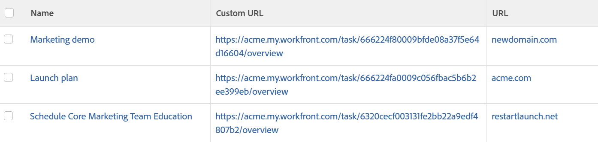

# Visa: extern URL med anpassat datafält

Du kan visa en länk till en intern anpassad URL genom att använda ett **beräknat anpassat fält** med namnet &quot;Anpassad URL&quot; i en **uppgiftsvy**.

Det gör att du snabbt kan länka från vissa objekt i en vy till vissa delar av programmet direkt från dina rapporter.

När du skapar ett beräknat anpassat fält måste du först skapa fältet och sedan skapa vyn.

Följande avsnitt är ett exempel på ett beräknat anpassat fält för uppgifter. Det anpassade fältet kallas Anpassad URL. I den anpassade vyn visas fältets värde samt fältet **URL** för uppgifter.

Med samma steg kan du skapa liknande beräknade anpassade fält och anpassade vyer för alla objekt i systemet som har ett anpassat formulär.

## Åtkomstkrav

Du måste ha följande åtkomst för att kunna utföra stegen i den här artikeln:

<table style="table-layout:auto"> 
 <col> 
 <col> 
 <tbody> 
  <tr> 
   <td role="rowheader">Adobe Workfront-plan*</td> 
   <td> <p>Alla</p> </td> 
  </tr> 
  <tr> 
   <td role="rowheader">Adobe Workfront-licens*</td> 
   <td> <p>Begäran om att ändra en vy </p>
   <p>Planera att ändra en rapport</p> </td> 
  </tr> 
  <tr> 
   <td role="rowheader">Konfigurationer på åtkomstnivå*</td> 
   <td> <p>Redigera åtkomst till rapporter, instrumentpaneler och kalendrar för att ändra en rapport</p> <p>Redigera åtkomst till filter, vyer och grupperingar för att ändra en vy</p> <p><b>ANMÄRKNING</b>

Om du fortfarande inte har åtkomst frågar du Workfront-administratören om de anger ytterligare begränsningar för din åtkomstnivå. Mer information om hur en Workfront-administratör kan ändra åtkomstnivån finns i <a href="../../../administration-and-setup/add-users/configure-and-grant-access/create-modify-access-levels.md" class="MCXref xref">Skapa eller ändra anpassade åtkomstnivåer</a>.</p> </td>
</tr>  
  <tr> 
   <td role="rowheader">Objektbehörigheter</td> 
   <td> <p>Hantera behörigheter i en rapport</p> <p>Mer information om hur du begär ytterligare åtkomst finns i <a href="../../../workfront-basics/grant-and-request-access-to-objects/request-access.md" class="MCXref xref">Begär åtkomst till objekt </a>.</p> </td> 
  </tr> 
 </tbody> 
</table>

&#42;Kontakta Workfront-administratören om du vill veta vilken plan, licenstyp eller åtkomst du har.

## Skapa det beräknade anpassade fältet &quot;Anpassad URL&quot;

Mer information om hur du skapar ett beräknat anpassat fält finns i [Lägg till beräknade fält i ett formulär](/help/quicksilver/administration-and-setup/customize-workfront/create-manage-custom-forms/form-designer/design-a-form/add-a-calculated-field.md).

Om du har tillgång till ett anpassat formulär kan du skapa ett beräknat anpassat fält för uppgifter som kallas &quot;Anpassad URL&quot;. Det här fältet länkar direkt till underfliken **Översikt** på fliken **Uppgiftsinformation**.

1. Skapa ett beräknat anpassat fält.
1. Ange följande kod i fältet Beräkning:

   CONCAT(&#39;https://`<domain>`.my.workfront.com&quot;,&quot;/&quot;,&quot;task/&quot;,ID,&quot;/overview&#39;&#39;)

1. Ersätt `<domain>` med ditt faktiska domännamn, utan hakparenteser.

   The

   ```
   /overview
   ```

   i den här URL:en dirigerar länken till avsnittet **Översikt** i aktivitetens vänstra panel.

1. När du har skapat ditt **beräknade anpassade fält** kopplar du det **anpassade formuläret** med det här fältet till flera uppgifter i Adobe Workfront som du vill visa i den nya vyn.

## Skapa vyn som visar fälten Anpassad URL och URL för aktiviteten

Aktiviteten **Visa** i exemplet nedan visar det **beräknade anpassade fältet** med namnet &quot;Anpassad URL&quot; som en direktlänk till underfliken **Översikt** på fliken **Information** samt aktivitetens **URL** -fält.



Så här anpassar du den här vyn:

1. Gå till en lista med uppgifter.
1. Expandera listrutan **Visa** högst upp i uppgiftslistan.
1. Klicka på **Anpassa vy**.
1. Ta bort alla kolumner i vyn, förutom den första kolumnen.
1. Klicka på den första kolumnens rubrik.
1. Klicka på **Växla till textläge** i det övre högra hörnet av gränssnittet.
1. Klicka på **Klicka för att redigera text**.
1. Klistra in textläget nedan i din enda kolumn.\
   I det här exemplet är &#39;column.1.&#39; visar värdet i fältet Anpassad URL som en länk till aktivitetens **Översikt**. &#39;Kolumn.2.&#39; visar det värde som lagras i aktivitetens **URL-fält**.
   <pre>column.0.descriptionkey=name<br>column.0.link.linkproperty.0.name=ID<br>column.0.link.link.property.0.valuefield=ID<br>column.0.link.link.property.0.valueformat= int<br>column.0.link.lookup=link.view<br>column.0.link.valuefield= objCode<br>5}5} column.0.link.valueFormat= val<br>column.0.linkedname=direct<br>column.0.listsort=string(name)<br>column.0.namekey=name.abbr<br>column.0.querysort=name<br>column.0.shortview=false<br>column.0.stretch=100<br>column.0.valueField=name<br>column.0.valueformat=HTML<br>column.0.width=150<br>column.1.description=Custom URL<br>column.1.link.isnewwindow=true<br>column.1.link.url=customDataLabelsAsString(Custom URL){1 8}column.1.linkedname=direct<br>column.1.listsort=customDataLabelsAsString(Custom URL)<br>column.1.name=Custom URL<br>column.1.querysort=URL<br>column.1.shortview=false<br>column.1.stretch=0<br>column.1 1.valuefield=Custom URL<br>column.1.valueformat=customDataLabelsAsString<br>column.1.width=150<br>column.2.descriptionkey=url<br>column.2.linkedname=direct<br>column.2.listsort=string(URL)<br>column.2.namekey=url.abbr<br>column.2.querysort=URL<br>column.2.shortview=false<br> column.2.stretch=0<br>column.2.valuefield=URL<br>column.2.valueformat=HTML<br>column.2.width=150<br></pre>

1. Klicka på **Spara vy**.
