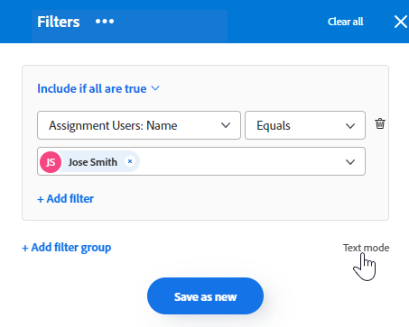
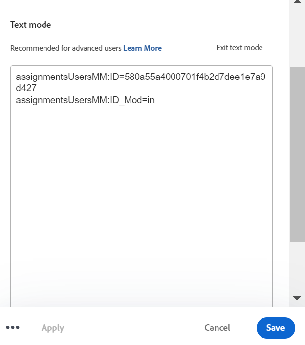
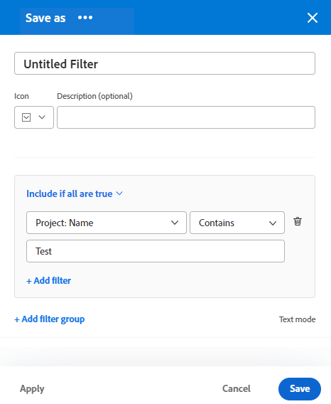

# Skapa eller redigera filter i Adobe Workfront

Du kan begränsa mängden information som visas på skärmen i en lista med objekt med ett filter. Du kan definiera vissa villkor baserat på viss information om ett objekt och bara visa de objekt som uppfyller dessa villkor.

Du kan använda följande typer av filter i Adobe Workfront:

* Snabbfilter i en lista med objekt för att hitta ett objekt med hjälp av ett nyckelord. Det här är temporära filter som du inte kan spara för framtida bruk.

   Mer information om snabbfilter finns i [Använda snabbfiltret på en lista](../../../workfront-basics/navigate-workfront/use-lists/apply-quick-filter-list.md).

* Permanenta filter som du kan spara och använda flera gånger på flera listor och rapporter. I den här artikeln beskrivs hur du skapar ett permanent filter eller redigerar ett befintligt i en lista eller rapport.

* Filter inom andra områden av Workfront, utanför listor och rapporter.

   En lista över alla filter i Workfront och de områden där du kan använda dem finns i [Översikt över filter i Adobe Workfront](../../../reports-and-dashboards/reports/reporting-elements/filters-overview.md).

## Åtkomstkrav

Du måste ha följande åtkomst för att kunna utföra stegen i den här artikeln:

<table style="table-layout:auto"> 
 <col> 
 <col> 
 <tbody> 
  <tr> 
   <td role="rowheader"><strong>Adobe Workfront-plan*</strong></td> 
   <td> 
Alla
 </td> 
  </tr> 
  <tr> 
   <td role="rowheader"><strong>Adobe Workfront-licens*</strong></td> 
   <td> 
Begäran eller senare
 </td> 
  </tr> 
  <tr> 
   <td role="rowheader"><strong>Konfigurationer på åtkomstnivå*</strong></td> 
   <td> 
Redigera åtkomst till filter, vyer och grupperingar
 
Obs! Om du fortfarande inte har åtkomst frågar du Workfront-administratören om de anger ytterligare begränsningar för din åtkomstnivå. Information om hur en Workfront-administratör kan ändra åtkomstnivån finns i <a href="../../../administration-and-setup/add-users/configure-and-grant-access/create-modify-access-levels.md" class="MCXref xref">Skapa eller ändra anpassade åtkomstnivåer</a>.
 </td> 
  </tr> 
  <tr> 
   <td role="rowheader"><strong>Objektbehörigheter</strong></td> 
   <td> 
Hantera behörigheter till ett filter
 
Mer information om hur du begär ytterligare åtkomst finns i <a href="../../../workfront-basics/grant-and-request-access-to-objects/request-access.md" class="MCXref xref">Begär åtkomst till objekt </a>.
 </td> 
  </tr> 
 </tbody> 
</table>

&#42;Kontakta Workfront-administratören om du vill veta vilken plan, licenstyp eller åtkomst du har.

## Typer av gränssnitt som bygger på filter

Du kan skapa filter med hjälp av de typer av filterverktyg som beskrivs i tabellen nedan:

<table style="table-layout:auto">
<col>
<col>
<col>
<tbody>
<tr>
<td><strong>Builder-typ</strong></td>
<td><strong>Filterobjekt</strong></td>
<td><strong>Var finns</strong></td>
</tr>
<tr>
<td>Standard Builder</td>
<td>
<ul>
<li> 
Projekt
 </li>
<li> 
Uppgifter 
 </li>
<li> 
Problem
 </li>
<li> 
Portfolio
 </li>
<li> 
Program
 </li>
<li> 
Användare
 </li>
<li> 
Mallar
 </li>
<li> 
Grupper
 </li>
</ul>
</td>
<td>
<ul>
<li> 
Listor 
 </li>
</ul>
<ul>
<li> 
Projektlistan i scenarioplaneraren
 
Scenario Planner kräver ytterligare licens. Mer information om Workfront Scenario Planner finns i <a href="../../../scenario-planner/scenario-planner-overview.md">Översikt över scenarioplanen</a>. 
 </li>
</ul>

OBS! Standardverktyg för filter är inte tillgängliga i rapporter.
</td>
</tr>
<tr>
<td>Legacy builder</td>
<td>Alla objekt </td>
<td>Listor och rapporter</td>
</tr>
</tbody>
</table>

Mer information om Workfront-objekt finns i [Förstå objekt i Adobe Workfront](/help/quicksilver/workfront-basics/navigate-workfront/workfront-navigation/understand-objects.md).

Tänk på följande när du skapar filter med de olika gränssnitten:

* Du hittar standardverktyget på samma platser som du hittar det gamla filtergränssnittet för de områden som listas i tabellen ovan.
* Standardverktyget är standardgränssnittet för alla områden där det är tillgängligt. Klicka på knappen **Mer** meny intill [!UICONTROL **Filter**] och markera [!UICONTROL **Gå tillbaka till äldre filter**].

   

* Sparade filter är tillgängliga i båda verktygen, oavsett vilken upplevelse du använde när du skapade dem från början. Om du till exempel har skapat ett filter med hjälp av det äldre verktyget kan du även hitta och ändra det i standardgränssnittet för verktyget.

   >[!TIP]
   >
   >Ett Alla-filter ingår inte i standardverktyget eftersom alla listobjekt visas när inga filter används. Klicka [!UICONTROL **Rensa alla**] längst upp till höger i verktyget för att rensa alla aktiva filter och visa alla objekt. If [!UICONTROL **Rensa alla**] är nedtonat och inga filter tillämpas.

* Standardversioner och äldre versioner har en något annorlunda syntax när du skapar flerprogramsfilter som kombinerar operatorerna AND och OR. Det innebär att dessa filter kan visas på olika sätt när du växlar från en byggare till en annan.

   >[!INFO]
   >
   >Följande scenario finns:
   >
   >1. Använd standardverktyget för att skapa ett filter med följande syntax:
   >
   >   `(A OR B) AND C`
   >
   >1. Växla till det äldre verktyget och redigera filtret med syntaxen för det äldre verktyget enligt anvisningarna i [Skapa eller redigera ett filter i det äldre verktyget](#create-filter-in-legacy-builder) i den här artikeln. Syntaxen för den äldre versionen av Builder visar filtersatserna enligt följande:
   >
   >   `A AND C`
   >   `OR`
   >   `B AND C`
   >
   >1. Ändra filtret i det äldre gränssnittet.
   >1. Växla tillbaka till standardverktyget. Filterprogramsatsen visas i enlighet med logiken som stöds i det äldre verktyget, enligt beskrivningen ovan.

   >
   >   Filtret visas i standardgränssnittet i Builder enligt följande:
   >  
   >   `A AND C`
   >   `OR`
   >   `B AND C`
   > 
   >   Det beror på att filtret har ändrats i det äldre gränssnittet.

## Skapa eller redigera ett filter i standardverktyget

Du kan skapa filter med hjälp av standardgränssnittet i Builder på följande sätt:

* Från början
* Redigera ett befintligt filter
* Duplicera ett befintligt filter
* Duplicera ett befintligt filter, redigera det och spara det som ett nytt filter

Skapa ett filter med standardgränssnittet i Builder:

1. Gå till en lista där du vill skapa ett filter eller som innehåller det filter som du vill anpassa.
1. Klicka på **Filter** icon  för att öppna Builder-gränssnittet.

   

1. Granska följande filterlistor:

   <table style="table-layout:auto">
   <col>
   <col>
   <tbody>
   <tr>
   <td role="rowheader"><strong>Favoriter</strong></td>
   <td>Filter som du har markerat som favoriter. När du väljer ett filter visas dess ursprungliga plats under filternamnet och den döljs i den ursprungliga listan om du inte tar bort den som favorit.</td>
   </tr>
   <tr>
   <td role="rowheader"><strong>Sparad</strong></td>
   <td>Filter som du har skapat och sparat själv. Som standard visas sparade filter i den här listan i den ordning som de senast sparades, men filternamnen kan dras för att ändra ordningen på listan manuellt.</td>
   </tr>
   <tr>
   <td role="rowheader"><strong>Systemstandard</strong></td>
   <td>Workfront standardfilter, liksom filter som Workfront-administratören har lagt till i din filterlista, antingen på systemnivå eller i din layoutmall.</td>
   </tr>
   <tr>
   <td role="rowheader"><strong>Delas med mig</strong></td>
   <td>Filter som andra har skapat och delat med dig eller som är gemensamma för hela systemet.</td>
   </tr>
   </tbody>
   </table>

1. Gör något av följande:

   * Klicka **Nytt filter** för att skapa ett filter från grunden.
   * Håll pekaren över ett befintligt filter som du har behörighet att hantera och klicka på **Redigera** icon  för att redigera den.

      eller

      Håll pekaren över ett befintligt filter som du har behörighet att visa och klicka på **Mer** meny och klicka **Duplicera** om du vill kopiera det befintliga filtret och redigera en kopia.
   

1. (Villkorligt) Välj bland följande alternativ beroende på om du vill söka efter objekt som matchar alla eller några programsatser i en filtergrupp:

   <table style="table-layout:auto">
   <col>
   <col>
   <tbody>
   <tr>
   <td role="rowheader"><strong>Inkludera om alla är sanna</strong></td>
   <td>Objekten som hittas av filtret måste matcha alla filtervillkor i en filtergrupp. I det här fallet är filterprogramsatserna anslutna av operatorn AND. Det här är standardvalet.</td>
   </tr>
   <tr>
   <td role="rowheader"><strong>Inkludera om något är sant</strong></td>
   <td>Objekten som hittas av filtret måste matcha eventuella filtervillkor i en filtergrupp. I det här fallet kopplas filterprogramsatserna av operatorn OR.</td>
   </tr>
   </tbody>
   </table>

   

   Mer information om filteroperatorer finns i [Översikt över filter i Adobe Workfront](/help/quicksilver/reports-and-dashboards/reports/reporting-elements/filters-overview.md).

1. Klicka på den nedrullningsbara menyn för att visa en lista över nyligen använda fält och föreslagna fält att filtrera efter. De föreslagna fälten visas för närvarande i listan som du filtrerar.

   Du kan också välja **Bläddra bland fält** om du vill visa en lista med alla fält som du kan filtrera efter. Fälten i den avancerade sökningen grupperas efter objektkategori.

   

1. Klicka på modifieringslistrutan för att välja en modifierare. Standardmodifieringen är &quot;Lika med&quot;.

   Mer information finns i [Filter- och villkorsmodifierare](/help/quicksilver/reports-and-dashboards/reports/reporting-elements/filter-condition-modifiers.md).

   >[!TIP]
   >
   >När du skapar filtret visas resultatet omedelbart i listan. Om filterpanelen täcker listan kan du stänga den för att se visningen. Den information du angav finns kvar i verktyget när du öppnar panelen igen.

1. Börja skriva värdet för ett fält som du vill filtrera efter. Börja med att skriva namnet på ett problem om du vill filtrera efter `Issue:Name`. Markera värdet när det visas i listan.

   >[!TIP]
   >
   >Beroende på vilken modifierare du har valt kan du välja flera värden.

1. Klicka **Lägg till filter** om du vill markera ett annat fält och lägga till ett nytt filtervillkor i filtersatsen.
1. (Valfritt) Klicka på **Ta bort** icon  för att ta bort befintliga filtersatser.

   eller

   Klicka **Rensa alla** för att rensa alla filtervillkor.

1. (Valfritt) Klicka på **Lägg till filtergrupp** om du vill lägga till ytterligare en uppsättning filtervillkor. Standardoperatorn mellan uppsättningarna är AND. Klicka på operatorn för att ändra den till ELLER.

   >[!TIP]
   >
   >Du kan använda en annan filtergrupp om du vill att grupperna ska anslutas av en annan operator än operatorn i en filterprogramsats.

   >[!INFO]
   >
   >När du filtrerar efter projekt som innehåller&quot;marknadsföring&quot; i namnet som inte är fullständigt och som inte är spärrade, kan du använda följande flera filtergrupper:
   >`(Project: Name Contains Marketing AND Project: Percent Complete Does not equal 100)`
   >`OR`
   >`(Project: Name Contains Marketing AND Project: Status Does not equal On Hold)`
   >I det här fallet kopplas varje filterprogramsats av en AND och filtergrupperna kopplas samman med en OR.

1. (Valfritt) Klicka på **Textläge** om du vill fortsätta att skapa filtret i textläge.

   

   Textlägesgränssnittet öppnas.

   

   >[!TIP]
   >
   >Vi rekommenderar att du skapar så mycket av filtret som möjligt med standardgränssnittet för byggaren och bara använder textläget när du måste göra ändringar i filtret som bara stöds i textläge.

   Mer information om hur du skapar ett filter med hjälp av textlägesgränssnittet finns i [Redigera ett filter i textläge](/help/quicksilver/reports-and-dashboards/reports/text-mode/edit-text-mode-in-filter.md).

1. Klicka **Avsluta textläge** för att återgå till standardgränssnittet för byggare.

   >[!WARNING]
   >
   >Vissa textlägessatser stöds inte i standardverktyget eller det äldre gränssnittet. Om du avslutar textläget när du har skapat den här typen av programsatser kan ett varningsmeddelande genereras.

1. (Valfritt) Klicka på **Använd** om du vill använda filtret på listan och se resultatet.

   Om filtret inte ger några resultat kommer listan att vara tom.

1. Klicka **Spara som ny** för att spara filtret för framtida bruk.

   

1. Välj **Namnlöst filter** och skriv i stället namnet på det nya filtret.

   >[!TIP]
   >
   >Ge filtret ett namn så att du kan hitta det senare. Om du inte namnger filtret kallas det Namnlöst filter i systemet.

1. Välj en ikon för det nya filtret på **Ikon** nedrullningsbar meny.

   

1. (Valfritt) Lägg till en beskrivning av filtret för att ange vad som är unikt med det. Beskrivningen visas under filternamnet i filterlistan.

   >[!TIP]
   >
   >Klicka **Avbryt** tar dig när som helst tillbaka till filterområdet.

1. Klicka **Spara**. Filtret sparas i listan Sparat och används i objektlistan.
1. (Valfritt) Om du vill flytta ett filter till favoritlistan håller du pekaren över ett filter i filterlådan och klickar på favoritikonen .

   eller

   Håll pekaren över ett filter i filterlådan och klicka på Mer-menyn och klicka **Favorit**.

1. (Valfritt) Klicka på **Staplingsfilter** för att aktivera staplade filter. Med det här alternativet kan du använda mer än ett sparat filter. Filterreglerna tillämpas i den ordning du markerar dem.

   >[!TIP]
   >
   >Det finns ingen gräns för hur många filter du kan välja.
   >
   >När du markerar flera filter måste alla villkor för dem uppfyllas samtidigt för att matchande resultat ska visas.

   

   Antalet filter som du har valt visas bredvid filterikonen högst upp i objektlistan.

   

1. (Valfritt) Gör något av följande:

   * Dela filtret med andra eller gör det tillgängligt i hela systemet. Mer information finns i [Dela ett filter, en vy eller en gruppering](/help/quicksilver/reports-and-dashboards/reports/reporting-elements/share-filter-view-grouping.md).

   * Ta bort filtret om det inte längre är giltigt eller om det är en dubblett. Du kan bara ta bort filter som du äger. Du kan ta bort filter som delats med dig. Mer information finns i [Ta bort filter, vyer och grupperingar](/help/quicksilver/reports-and-dashboards/reports/reporting-elements/remove-filters-views-groupings.md).

## Skapa eller redigera ett filter i det äldre verktyget {#create-filter-in-legacy-builder}

Du kan skapa äldre filter i listor och rapporter på följande sätt:

* Från början
* Redigera ett befintligt filter och spara det som ett nytt filter

Oberoende av vilken metod du använder för att skapa filter ser det ut ungefär som när du skapar ett filter från början eller från ett befintligt filter.

1. Gå till en lista eller rapport som innehåller filtret som du vill anpassa.
1. Klicka på **Filter** icon .

   >[!TIP]
   >
   >Rapportskaparen måste tillåta att filter kan redigeras för att visa listrutan Filter i en rapport. Standardfiltret Rapport används som standard på en rapport. Standardfiltret för rapporten kan bara anpassas när du redigerar rapporten.

   

1. Klicka **Nytt filter** högst upp i filterlistan.

   eller

   Håll pekaren över det filter du vill ändra och klicka på **Redigera** icon .

   Verktyget för att anpassa filtret startas.

1. Gör något av följande:

   * Ändra befintliga filterregler genom att klicka på den befintliga regeln och välja ett nytt alternativ.
   * Lägga till en filterregel genom att klicka på **Lägg till en annan filterregel** börjar du skriva namnet på det alternativ som du vill lägga till en regel för i **Börja skriva fältnamn** och klicka sedan på den när den visas i listrutan.

      Fält som är kopplade till filterobjektet visas i **Börja skriva fältnamn** box.

   * Klicka **OCH** eller **ELLER** när en ny filterregel läggs till.\
      När du lägger till filterregler använder du filtermodifierarna för att fastställa filtervillkoret. Mer information om filtermodifierare finns i [Filter- och villkorsmodifierare](../../../reports-and-dashboards/reports/reporting-elements/filter-condition-modifiers.md).

      >[!NOTE]
      >
      >När du ansluter en grupp med AND-programsatser med flera OR-programsatser måste du upprepa de fält som inte ändras mellan OR-programsatserna för varje grupp med programsatser.
      >
      >
      >
      >När du skapar ett filter för aktiviteter som innehåller ordet&quot;marknadsföring&quot; och som finns i projekt med statusen Aktuell eller Planering, måste du ha följande filterregler:
      >
      >`Task: Name Contains Marketing`
      >`AND`
      >`Project: Status Equals Current`
      >`OR`
      >`Task: Name Contains Marketing`
      >`AND`
      >`Project: Status Equals Planning`
      >
      >Även om aktivitet: Namnet Innehåller &quot;marknadsföring&quot; ändras inte mellan de två AND-filtergrupperna, det måste upprepas i den andra gruppen.

   * Ta bort en befintlig filterregel genom att klicka på X-ikonen.

1. (Valfritt) Klicka på **Växla till textläge** om du vill lägga till ett filter med hjälp av gränssnittet för textläge.

   Mer information om hur du skapar ett filter med hjälp av textlägesgränssnittet finns i [Redigera ett filter i textläge](../../../reports-and-dashboards/reports/text-mode/edit-text-mode-in-filter.md).

1. Klicka **Spara filter** om du vill skapa ett nytt filter eller ersätta det markerade med dina ändringar.

   eller

   Klicka **Spara som nytt filter** om du vill skapa ett nytt filter från det markerade.

   Det nya filtret visas i filterlistan och tillämpas automatiskt på den lista eller rapport som du har valt.

1. (Valfritt) Gör något av följande:

   * Dela filter som du skapar med andra användare eller gör dem tillgängliga i hela systemet. Mer information finns i [Dela ett filter, en vy eller en gruppering](/help/quicksilver/reports-and-dashboards/reports/reporting-elements/share-filter-view-grouping.md).
   * Ta bort filter som du inte längre vill visa i listan. Mer information finns i [Ta bort filter, vyer och grupperingar](/help/quicksilver/reports-and-dashboards/reports/reporting-elements/remove-filters-views-groupings.md).

