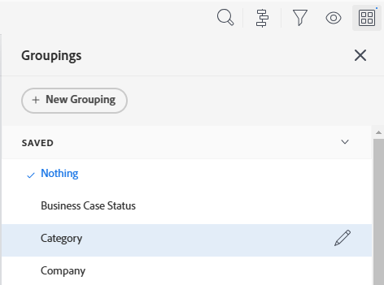

# Redigera befintliga grupperingar

<!--

(NOTE: This is the third part of a former artcle split in 3: two how-tos and one refernece article about creating and customizing groupings)

-->

Du kan anpassa en befintlig gruppering som du ursprungligen skapade eller som delades med dig. Sedan kan du spara den som en ny gruppering.

## Åtkomstkrav

Du måste ha följande åtkomst för att kunna utföra stegen i den här artikeln:

<table style="table-layout:auto"> 
 <col> 
 <col> 
 <tbody> 
  <tr> 
   <td role="rowheader"><strong>Adobe Workfront-plan*</strong></td> 
   <td> 
Alla
 </td> 
  </tr> 
  <tr> 
   <td role="rowheader"><strong>Adobe Workfront-licens*</strong></td> 
   <td> 
Begäran eller senare 
 </td> 
  </tr> 
  <tr> 
   <td role="rowheader"><strong>Konfigurationer på åtkomstnivå*</strong></td> 
   <td> 
Redigera åtkomst till filter, vyer, grupperingar
 
Redigera åtkomst till rapporter, instrumentpaneler och kalendrar för att redigera en gruppering i en rapport
 
Obs! Om du fortfarande inte har åtkomst frågar du Workfront-administratören om de anger ytterligare begränsningar för din åtkomstnivå. Information om hur en Workfront-administratör kan ändra åtkomstnivån finns i <a href="../../../administration-and-setup/add-users/configure-and-grant-access/create-modify-access-levels.md" class="MCXref xref">Skapa eller ändra anpassade åtkomstnivåer</a>.
 </td> 
  </tr> 
  <tr> 
   <td role="rowheader"><strong>Objektbehörigheter</strong></td> 
   <td> 
Hantera behörigheter till en rapport för att redigera en gruppering i en rapport
 
Hantera behörigheter för en gruppering 
 
Mer information om hur du begär ytterligare åtkomst finns i <a href="../../../workfront-basics/grant-and-request-access-to-objects/request-access.md" class="MCXref xref">Begär åtkomst till objekt </a>.
 </td> 
  </tr> 
 </tbody> 
</table>

&#42;Kontakta Workfront-administratören om du vill veta vilken plan, licenstyp eller åtkomst du har.

## Förutsättningar

Du måste skapa en gruppering innan du kan redigera den.

Mer information om hur du skapar en gruppering finns i [Skapa grupperingar i Adobe Workfront](../../../reports-and-dashboards/reports/reporting-elements/create-groupings.md).

## Instruktioner

1. Gå till en lista med objekt som innehåller den gruppering som du vill anpassa.
1. Klicka på **Gruppering** ikon.
1. Markera den gruppering som du vill anpassa och klicka sedan på **Redigera** ikon.

   

   Gränssnittsverktyget för att anpassa grupperingen öppnas.

1. I **Förhandsgranska gruppering** avsnitt, klicka **Lägg till gruppering** för att definiera hur informationen i rapporten ska ordnas. En förhandsgranskning av hur grupperingen ser ut i rapporten visas nedan.

1. Börja skriva namnet på det fält som representerar hur du vill organisera informationen i rapporten och klicka sedan på det när det visas i listrutan.
1. (Valfritt och villkorligt) När du visar en uppdaterad lista väljer du **Komprimera den här grupperingen som standard** om du vill att resultatet i grupperingen ska visas komprimerat i stället för expanderat. Den här inställningen är inaktiverad som standard och resultatet av grupperingen visas alltid i den utökade listan.

   Mer information om uppdaterade och äldre listor finns i avsnittet&quot;Skillnaden mellan uppdaterade och äldre listor&quot; i artikeln [Kom igång med listor i Adobe Workfront](../../../workfront-basics/navigate-workfront/use-lists/view-items-in-a-list.md).

   <!--
   
(NOTE: the tips repeat in the Create grouping article and Common uses of text mode)

   -->

   >[!TIP]
   >
   >* När du justerar grupperingar manuellt när du visar en lista kommer Workfront ihåg dina manuella inställningar tills du loggar ut. När du loggar in igen visas listan enligt den här inställningen.
   >* Resultatet av en gruppering visas alltid utökat när du har öppnat dem från ett diagramelement eller i en äldre lista. I dessa fall ignoreras inställningen.

1. Upprepa steg 4, 5 och 6 för att definiera ytterligare grupperingar.\
   Du kan definiera upp till tre grupperingar för att ordna information. Du kan organisera informationen ytterligare med upp till fyra grupperingar genom att skapa en matrisrapport. Mer information om matrisrapporter finns i [Skapa en matrisrapport](../../../reports-and-dashboards/reports/creating-and-managing-reports/create-matrix-report.md).

1. Klicka **Spara som ny gruppering** om du vill ersätta den aktuella grupperingen med dina ändringar.
