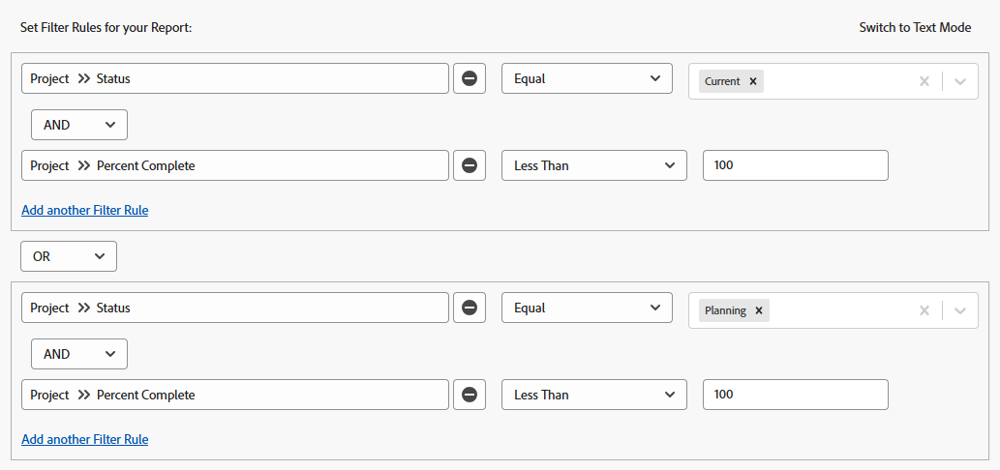

# Översikt över filter

<!-- Audited: 01/2024 -->

Du kan använda filter i Adobe Workfront för att minska mängden information som visas på skärmen i listor, rapporter eller andra områden.

>[!NOTE]
>
>I den här artikeln beskrivs alla områden där du kan använda filter i Workfront, samt allmän information om filter i listor och rapporter. Läs artiklarna som är länkade nedan om du vill veta mer om filter i andra områden än listor och rapporter.

## Olika typer av Workfront-filter

Det finns flera typer av filter i Workfront. Alla filter har samma syfte att begränsa den mängd information som visas på skärmen.

Följande typer av filter kan du använda i Workfront:

<table style="table-layout:auto"> 
 <col> 
 <col> 
 <tbody> 
  <tr> 
   <td><strong>Tillfälliga filter</strong></td> 
   <td> 
Ett snabbfilter som baseras på en nyckelordssökning för att snabbt hitta ett objekt i en lista. 
 </td> 
  </tr> 
  <tr> 
   <td><strong>Permanenta filter för listor och rapporter</strong></td> 
   <td>Skapad av Workfront eller anpassad av dig eller andra användare. Du kan använda dem flera gånger. Om du har rätt åtkomst och behörigheter kan du namnge, spara och återanvända dem på flera områden. Du kan också dela dessa filter med andra användare. De är tillgängliga i listor eller rapporter med objekt. </td> 
  </tr> 
  <tr> 
   <td><strong>Tillfälliga eller permanenta filter för särskilda områden</strong></td> 
   <td>Skapad av Workfront eller anpassad av dig eller andra användare. Du kan spara permanenta filter och använda mer än en gång, eller använda dem tillfälligt för att tillgodose dina behov utan att spara dem. Osparade filter kan inte delas eller tas bort. De är tillgängliga i specialområden, vilket beskrivs i avsnittet <a href="#workfront-filters-for-special-areas" class="MCXref xref">Workfront-filter för specialområden</a> i den här artikeln. </td> 
  </tr> 
 </tbody> 
</table>

## Tillfälliga Workfront-filter

Med snabbfilter kan du söka efter ett objekt på skärmen med hjälp av ett nyckelord. När du har uppdaterat sidan tas det tillfälliga snabbfiltret bort. Du kan inte spara temporära filter för återanvändning.

Mer information om snabbfilter finns i [Använda snabbfiltret i en lista](../../../workfront-basics/navigate-workfront/use-lists/apply-quick-filter-list.md).

## Workfront permanenta filter för listor och rapporter

Du kan använda permanenta filter som du, andra eller Workfront som har skapats i objektlistor eller rapporter.

Mer information om objekt i Workfront och vilka du kan skapa rapporter för finns i [Översikt över Adobe Workfront-objekt](../../../workfront-basics/navigate-workfront/workfront-navigation/understand-objects.md).

Mer information om filter i listor och rapporter finns i följande artiklar:

* [Skapa eller redigera filter i Adobe Workfront](../../../reports-and-dashboards/reports/reporting-elements/create-filters.md)
* [Ta bort filter, vyer och grupperingar](../../../reports-and-dashboards/reports/reporting-elements/remove-filters-views-groupings.md)
* [Dela ett filter, en vy eller en grupp](../../../reports-and-dashboards/reports/reporting-elements/share-filter-view-grouping.md)

## Workfront filter för specialområden {#workfront-filters-for-special-areas}

Du kan antingen använda inbyggda filter eller skapa anpassade filter i följande områden av Workfront:

<!--* Home   
  For information, see the [Filter the Work List](../../../workfront-basics/using-home/using-the-home-area/display-items-in-home-work-list.md#filter-the-work-list) section in the article [Display items in the Work List in the Home area](../../../workfront-basics/using-home/using-the-home-area/display-items-in-home-work-list.md).-->
* Området med förfrågningar. Du kan inte anpassa filter i området Förfrågningar.

  Mer information finns i [Leta rätt på skickade begäranden](../../../manage-work/requests/create-requests/locate-submitted-requests.md).

* Resursplanering\
  Mer information finns i artikeln [Filtrera information i resursplaneraren](../../../resource-mgmt/resource-planning/filter-resource-planner.md).

* Användningsrapport

  Mer information finns i avsnittet [Filteranvändningsinformation](../../../resource-mgmt/resource-utilization/view-utilization-information.md#filter-utilization-information) i artikeln [Visa information om resursutnyttjande](../../../resource-mgmt/resource-utilization/view-utilization-information.md).

* Utjämning av arbetsbelastning

  Mer information finns i [Filtrera information i Arbetsbelastningsutjämnaren](../../../resource-mgmt/workload-balancer/filter-information-workload-balancer.md).

* Analysområde

  Mer information finns i [Använda filter i Förbättrad analys](../../../enhanced-analytics/use-enhanced-analytics-filters.md).

* Utskriftsområde

  Mer information finns i [Installera en plan](../../../administration-and-setup/blueprints/blueprints-install.md).

* Scenarioplan

  Scenario Planner kräver ytterligare licens. Mer information om Workfront Scenarioplan finns i [Översikt över scenarioplanen](../../../scenario-planner/scenario-planner-overview.md).

  >[!TIP]
  >
  >Du kan inte anpassa filter i Scenarioplanen.

  <!--
  
(NOTE: the tip above: this might change with the beta filters??)

  -->

  Du kan använda inbyggda filter för planer, initiativ eller projekt, och du kan anpassa projektfilter i Scenarioplanen.

  Mer information finns i följande artiklar:

   * [Skapa och redigera planer i scenarioplanen](../../../scenario-planner/create-and-edit-plans.md)
   * [Uppdatera eller skapa projekt genom att publicera initiativ i scenarioplanen](../../../scenario-planner/publish-scenarios-update-projects.md)
   * [Importera projekt till planer i scenarioplaneraren](../../../scenario-planner/import-projects-to-plans.md)

* Mål

  Målet kräver ytterligare licens. Mer information om Workfront-mål finns i [Översikt över Adobe Workfront-mål](../../../workfront-goals/goal-management/wf-goals-overview.md).

  Du kan använda inbyggda filtervillkor, men du kan inte skapa anpassade filter som kan återanvändas för målområdet.

  Mer information finns i [Filtrera information i Adobe Workfront-mål](../../../workfront-goals/goal-management/filter-information-wf-goals.md).

* Varumärkena

  Du kan använda inbyggda filter, men du kan inte skapa egna filter som kan återanvändas i området för anslagstavlor.

  Mer information finns i [Filtrera och söka på en anslagstavla](../../../agile/get-started-with-boards/filter-search-in-board.md).

## Översikt över filter i listor och rapporter

När du arbetar med listor och rapporter kan du filtrera information på skärmen med följande typer av filter:

* inbyggda filter
* nya filter som du eller andra skapar från grunden
* anpassade befintliga filter som andra har skapat och delat med dig
* kopierade och redigerade filter baserade på befintliga filter

>[!IMPORTANT]
>
>När du skapar eller redigerar filter i rapporter måste du redigera rapporten för att det nya filtret ska bli rapportens standardfilter. När du bara redigerar filtret uppdateras inte rapportens standardfilter utanför rapportverktyget.\
>Mer information om hur du redigerar en rapport finns i artikeln [Skapa en anpassad rapport](../../../reports-and-dashboards/reports/creating-and-managing-reports/create-custom-report.md).

Mer information om Workfront-listor finns i [Kom igång med listor i Adobe Workfront](../../../workfront-basics/navigate-workfront/use-lists/view-items-in-a-list.md).

Information om Workfront-rapporter finns i [Kom igång med rapporter](../../../reports-and-dashboards/reports/reporting/get-started-reports-workfront.md).

Tänk på följande när du arbetar med filter i listor eller rapporter:

* Du kan anpassa befintliga filter i listor och rapporter. Alla användare som har behörighet till filtren kan också se dina ändringar.

* Din Workfront-administratör måste ge dig behörighet att redigera filter, vyer och grupperingar för att skapa permanenta filter.

  Mer information finns i [Bevilja åtkomst till filter, vyer och grupperingar](../../../administration-and-setup/add-users/configure-and-grant-access/grant-access-fvg.md).

* Din behörighetsnivå för ett filter avgör hur filter sparas. Om du skapade filtret från början kan du spara ändringarna. Annars uppmanas du att spara en ny version av filtret som du ändrar.

  >[!TIP]
  >
  >Tänk på att om du gör ändringar i ett filter som du har delat med andra påverkas även ändringarna.

* Du kan bara anpassa ett filter som delats med dig om den användare som delade det gav dig behörigheten Hantera. Mer information om hur du delar ett filter finns i [Dela ett filter, en vy eller en gruppering](../../../reports-and-dashboards/reports/reporting-elements/share-filter-view-grouping.md).

## Element i ett filter

När du skapar ett filter ansluter du flera element som utgör filtersatser. Du kan ha flera filtersatser som definierar villkoren för filtret.

Detta är ett exempel på standardfilterverktyget:

Det här är ett exempel på den äldre filterverktyget:

Ett filter innehåller följande element:

<table style="table-layout:auto"> 
 <col> 
 <col> 
 <tbody> 
  <tr> 
   <td><strong>Objekt</strong></td> 
   <td> 
Workfront-databasobjektet för filtret. Mer information om vilka objekt som kan rapporteras i Workfront finns i <a href="../../../workfront-basics/navigate-workfront/workfront-navigation/understand-objects.md" class="MCXref xref">Översikt över Adobe Workfront-objekt</a>. 
 
Projekt, uppgifter, ärenden, användare eller dokument kan till exempel vara objekt i ett filter. 
 </td> 
  </tr> 
  <tr> 
   <td><strong>Fält</strong></td> 
   <td> 
Attributet för det objekt som du filtrerar efter. 
 
Du kan till exempel filtrera efter Portfolio namn eller Projektägare. I det här fallet är Namn och ägare fält för objekten Portfolio och Projekt. 
 </td> 
  </tr> 
  <tr> 
   <td><strong>Värde</strong></td> 
   <td>Fältets faktiska namn i Workfront. Complete kan till exempel vara värdet för ett projektstatusfält. </td> 
  </tr> 
  <tr> 
   <td><strong>Operator</strong></td> 
   <td>Kopplar ihop flera filtersatser. Mer information finns i avsnittet <a href="#filter-operators" class="MCXref xref">Filteroperatorer</a> i den här artikeln. </td> 
  </tr> 
  <tr> 
   <td><strong>Modifierare</strong></td> 
   <td>Anger vilken typ av information du vill att dina data ska matcha. Mer information finns i avsnittet <a href="#filter-modifiers" class="MCXref xref">Filtermodifierare</a> i den här artikeln. </td> 
  </tr> 
 </tbody> 
</table>

## Filteroperatorer {#filter-operators}

Workfront har två filteroperatorer som kopplar ihop varje filterprogramsats:

* **AND**: När du kopplar två filterprogramsatser av operatorn AND anger du att du vill att båda filterprogramsatserna ska uppfyllas samtidigt.

  Programsatserna i ett filter förenas som standard med operatorn AND.

* **OR**: När du ansluter två filtersatser av operatorn OR anger du att du vill att någon av programsatserna ska uppfyllas.

  >[!TIP]
  >
  >När du ändrar dina AND-programsatser till OR-programsatser bör antalet objekt i rapporten öka.

## Filtermodifierare {#filter-modifiers}

Du kan använda filtermodifierare för att ange vilken typ av information du vill att dina data ska matcha.

>[!INFO]
>
>**Exempel:**
>Du kan filtrera efter projekt som har Procent färdigt på 100 %. I det här fallet kan du använda modifieraren &quot;equal&quot; i följande filtersats:
>
>`Project: Percent Complete Equal(Case Sensitive) 100`

Mer information om filtermodifierare finns i [Filter- och villkorsmodifierare](../../../reports-and-dashboards/reports/reporting-elements/filter-condition-modifiers.md).

## Skapa filter i verktyget

Du kan skapa ett filter med standardgränssnittet eller det äldre Builder-gränssnittet på följande sätt:

* Från början
* Ändra ett befintligt filter
* Kopiera ett befintligt filter

Mer information om hur du skapar ett filter med standardgränssnittet eller det äldre Builder-gränssnittet finns i [Skapa eller redigera filter i Adobe Workfront](../../../reports-and-dashboards/reports/reporting-elements/create-filters.md).

## Skapa filter med hjälp av textlägesgränssnittet

Du kan skapa filter med hjälp av textlägesgränssnittet. Vi rekommenderar att du skapar de flesta filtersatser med hjälp av standardgränssnittet eller det äldre bygggränssnittet och endast redigerar koden för filtret som ett sista steg. Vi rekommenderar inte att du skapar ett filter från grunden enbart med hjälp av textlägesgränssnittet.

Mer information om hur du skapar ett filter med hjälp av textlägesgränssnittet finns i [Redigera ett filter i textläge](../../../reports-and-dashboards/reports/text-mode/edit-text-mode-in-filter.md).

## Skapa filter för komplexa fält

Du kan skapa filter för komplexa fält, t.ex. fält vars värden innehåller kommatecken och fält vars värden är ett anpassat fält där flera markeringar används.

### Skapa filter för fält vars värden innehåller komma {#create-filters-for-fields-whose-values-contain-commas}

När du skapar ett filter i textläge och filtrerar efter fältvärden som innehåller kommatecken måste du lägga till ett snedstreck (&quot;/&quot;) före kommatecknen som avgränsar värdena, för att se till att värdet läses som ett filteralternativ. Detta gäller endast för följande fälttyper:

* Listrutor
* Alternativknappar
* Kryssrutor

Du har t.ex. ett alternativknappsfält i ett projekt som heter &quot;Färg&quot; och alternativen för det är:

* Röd
* Blå
* Röd, blå

Om du vill skapa ett filter som bara söker efter projekt där det tredje alternativet är markerat, ska filtersatsen i textlägesgränssnittet vara:

`DE:check=red/, blue`

`DE:check_Mod=in`

Den här syntaxen ser till att värdena läses tillsammans som ett alternativ. Om du utelämnar snedstrecket läser Workfront kommatecknet som OR. I så fall markeras bara de projekt som har det första eller det andra alternativet.

Den här syntaxen gäller även när du skapar uppmaningar. Mer information om hur du använder uppmaningar finns i [Lägga till en uppmaning i en rapport](../../../reports-and-dashboards/reports/creating-and-managing-reports/add-prompt-report.md).

### Skapa filter för vars värden är ett anpassat flervalsfält {#create-filters-for-whose-values-are-a-multi-select-custom-field}

Du kan rapportera om anpassade fält som består av flera markeringar. Du kan till exempel rapportera fält som är kryssrutor.

Om du vill utesluta resultat som bara har ett av alternativen markerat, visas alla objekt som har det alternativet och alla andra alternativ markerade.

Om du t.ex. har ett fält med 3 alternativ (A, B och C) och väljer 2 av de 3 alternativen (A och B, men inte C) för ett objekt, kan du skapa en rapport med ett filter med kvalificeraren Inte lika för alternativen A och B, och bara filtrera bort projekt som har både A och B, men inte bara A, och inte bara B markerade. Om du skapar ett filter med en kvalificerare för alternativet Inte lika för A, filtreras bara objekt med bara A markerat, men om A och B markeras visas de fortfarande i rapporten.

## Begränsningar för koppling av flera filterregler

Du kan bara referera till fem objekt, exklusive rapportens objekt, när du skapar ett filter i Workfront.
