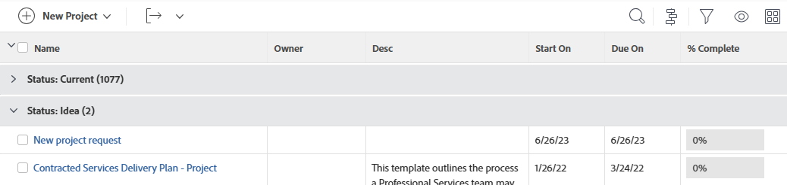

# Översikt över grupperingar i Adobe Workfront

<!-- Audited: 11/2024 -->

<!--(NOTE: This article was supposed to be replaced by "Groupings overview", but decided to keep this here because this is linked in too many places. "Create groupings" and "Edit existing groupings" have been added also (with videos) to replace portions of the old content here.)-->

Du kan lägga till grupperingar för att hantera layouten för informationen i rapporter och listor.

Du kan lägga till grupperingar i rapporter på följande sätt:

* Du kan skapa grupperingar genom att redigera befintliga grupperingar.

  Mer information om hur du anpassar en befintlig gruppering finns i [Redigera befintliga grupperingar](../../../reports-and-dashboards/reports/reporting-elements/edit-existing-groupings.md).

* Du kan skapa grupperingar från grunden.

  Mer information om hur du skapar en gruppering från grunden finns i [Skapa grupperingar i Adobe Workfront](../../../reports-and-dashboards/reports/reporting-elements/create-groupings.md).

Som standard visas grupperingar i en grå markering i rapporten eller listan. Resultatet av rapporten eller listan visas under den enskilda grupperingen, utan någon högdager.

Du kan lägga till upp till tre grupperingar i en rapport. Du kan ordna information med upp till fyra grupperingar genom att skapa en matrisrapport. Mer information om matrisrapporter finns i [Skapa en matrisrapport](../../../reports-and-dashboards/reports/creating-and-managing-reports/create-matrix-report.md).

Siffran inom parentes efter grupperingens namn representerar antalet resultat under den grupperingen. Om rapporten omfattar flera sidor måste du visa *Alla* resultaten i rapporten eller listan för att få en korrekt räkning för resultaten under varje gruppering.

Tänk på följande när du arbetar med grupperingar:

* Du kan anpassa informationen i befintliga grupperingar. Alla användare som kan visa grupperingarna kan också se dina ändringar.
* Din Workfront-administratör måste ge dig åtkomst till Redigera filter, Vyer och Grupperingar för att kunna skapa grupperingar.

  Information om hur du beviljar åtkomst till filter, vyer och grupperingar finns i [Bevilja åtkomst till filter, vyer och grupperingar](../../../administration-and-setup/add-users/configure-and-grant-access/grant-access-fvg.md).

* Din behörighetsnivå för en gruppering avgör hur en gruppering sparas. Om du skapade grupperingen från början kan du spara ändringarna, annars uppmanas du att spara en version av grupperingen. Om du gör ändringar i en gruppering som du har delat med andra påverkas även dessa.
* Du kan bara anpassa en gruppering som delats med dig om den användare som delade den gav dig behörigheten Hantera. Mer information om hur du delar en gruppering finns i [Dela ett filter, en vy eller en gruppering](../../../reports-and-dashboards/reports/reporting-elements/share-filter-view-grouping.md).
* Du kan inte redigera en infogad gruppering.
* Du kan inte gruppera efter anpassade fält som har flera val (till exempel kryssrutor) eller efter fält som kan ha flera värden (till exempel Resurshanteraren).

## Ytterligare information om grupperingar

Du kan hantera rapportinformation ytterligare när du använder grupperingar genom att samla värdena i varje kolumn på grupperingsraden samt sortera informationen efter fältet i grupperingen. Du kan också ta bort en gruppering när den inte längre behövs.

* [Sammanställa värden i grupperingar](#aggregate-values-in-groupings)
* [Sortera efter gruppering](#sort-by-a-grouping)
* [Ta bort en gruppering](#remove-a-grouping)

### Sammanställa värden i grupperingar {#aggregate-values-in-groupings}

Du kan sammanställa de data som visas i rapporten på grupperingsraden genom att sammanfatta värdena i varje kolumn i rapporten. Mer information om att sammanfatta kolumndata i en gruppering finns i [Vyöversikt i Adobe Workfront](../../../reports-and-dashboards/reports/reporting-elements/views-overview.md).

>[!NOTE]
>
>Följande undantag gäller för överordnade objekt (till exempel överordnade uppgifter) när du samlar värden för följande fält i >grupperingar:
>
>* Alla sifferfält, valutafält och datumfält, utom Faktiska timmar, sammanställer värden endast för underordnade uppgifter och fristående uppgifter. De sammanställer inte värden för överordnade uppgifter eller överordnade uppgifter. Om du samlar i nummerfält, valutafält och datumfält i en lista som bara innehåller överordnade uppgifter visas inte ett aggregerat värde i grupperingsfältet.
>
>* Aggregerade värden för faktiska timmar för huvuduppgifter och fristående uppgifter. De sammanställer inte siffrorna för underordnade uppgifter eller överordnade uppgifter. <!--Examples of Actual hours include Planned/Actual Labor Cost, Planned/Actual Expense Cost, Planned/Actual Cost, and Planned Hours.-->
>
>* Anpassade datafält för tal- och valutavärden samlar alla uppgifter: överordnade, underordnade, överordnade och fristående uppgifter.

### Sortera efter en gruppering {#sort-by-a-grouping}

Det går inte att sortera grupperingar. Vyer kan sorteras. Om du vill sortera en lista efter det värde som hämtas i grupperingen måste du ta med det värdet i någon av vykolumnerna och tillämpa sorteringen i vyn. På så sätt sorteras listan efter värdet i grupperingen indirekt (sorteras efter värdet i vyn som också fångas i grupperingen). Mer information om hur du skapar vyer och sorterar efter värden i vyerna finns i [Vyöversikt i Adobe Workfront](../../../reports-and-dashboards/reports/reporting-elements/views-overview.md).

### Ta bort en gruppering {#remove-a-grouping}

Hur du tar bort en gruppering beror på om du först skapade grupperingen eller om grupperingen delades med dig. Du kan inte ta bort en standardgruppering.

* **Om du skapade grupperingen och tog bort den** tas grupperingen bort från Workfront-systemet. Grupperingen är inte längre tillgänglig för användare som du tidigare delat den med.
* **Om grupperingen delades med dig och du tar bort den** tas grupperingen bara bort åt dig. Den användare som ursprungligen skapade den och alla andra användare som den har delats med har fortfarande åtkomst till grupperingen.

Mer information om hur du tar bort en gruppering finns i artikeln [Ta bort filter, vyer och grupperingar](../../../reports-and-dashboards/reports/reporting-elements/remove-filters-views-groupings.md).

<!--Original note

The following exceptions apply for parent objects (for example, parent tasks) when you are aggregating values for the following fields in groupings:
All the number and currency fields except Actual Hours (for example, Planned/ Actual Labor Cost, Planned/ Actual Expense Cost, Planned/ Actual Cost, Planned Hours) aggregate only the values for the children tasks, and standalone tasks. They do not aggregate the values for the parent tasks or parents of parents.
Actual Hours aggregate the values for the main parent and the standalone tasks; they do not aggregate the numbers for the parents of parent tasks or the children tasks.
Custom data fields for number and currency values aggregate all tasks: parents, children, parents of parents, and standalone tasks.

-->