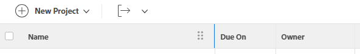

# Ändra kolumnbredd och -ordning

Nedan följer riktlinjer för hur kolumnbredder fungerar i Adobe Workfront:

* Workfront definierar bredden på kolumner i listor och rapporter som standard.
* Workfront justerar automatiskt bredden på kolumnerna enligt `valueformat`information i alla listor och rapporter, om inte annat anges i kolumnens textläge.

   >[!NOTE]
   >
   >Workfront justerar inte bredden på kolumnerna enligt `valueformat` information i listorna som finns under Inställningar och Rapporter.

   The `valueformat` värdet definierar vilken typ av information som visas i kolumnen. Kolumner som visar ett tal är till exempel smalare än kolumner som visar fältet Beskrivning.

* Du kan anpassa bredden på kolumnerna i listor och rapporter i Workfront så att de passar dina behov, beroende på vilken typ av information du vill visa i kolumner.

   Du kan ändra kolumnbredden temporärt, medan du visar en lista eller rapport, eller permanent, genom att justera bredden på kolumnen i vybyggaren. Information om hur du ändrar bredden på kolumner tillfälligt finns i [Att tänka på när du tillfälligt ändrar bredden och ordningen på kolumner](#considerations-when-temporarily-modifying-the-width-and-order-of-columns) i den här artikeln.

* Kolumner som visas i inbyggda vyer har bredder som tidigare definierats av Workfront och som är hårdkodade. Om du vill ändra dessa bredder måste du uppdatera bredden på kolumnerna manuellt med hjälp av textläget i vybyggaren.

   Mer information om hur du ändrar kolumnen i textläge finns i [Visa: redigera bredden på en kolumn permanent](../../../reports-and-dashboards/reports/custom-view-filter-grouping-samples/view-edit-column-width-permanently.md).

## Åtkomstkrav

Du måste ha följande åtkomst för att kunna utföra stegen i den här artikeln:

<table style="table-layout:auto"> 
 <col> 
 <col> 
 <tbody> 
  <tr> 
   <td role="rowheader"><strong>Adobe Workfront-plan*</strong></td> 
   <td> 
Alla
 </td> 
  </tr> 
  <tr> 
   <td role="rowheader"><strong>Adobe Workfront-licens*</strong></td> 
   <td> 
Begäran eller senare 
 </td> 
  </tr> 
  <tr> 
   <td role="rowheader"><strong>Konfigurationer på åtkomstnivå*</strong></td> 
   <td> 
Redigera åtkomst till filter, vyer, grupperingar
 
Redigera åtkomst till rapporter, instrumentpaneler och kalendrar för att redigera vyn i en rapport
 
Obs! Om du fortfarande inte har åtkomst frågar du Workfront-administratören om de anger ytterligare begränsningar för din åtkomstnivå. Information om hur en Workfront-administratör kan ändra åtkomstnivån finns i <a href="../../../administration-and-setup/add-users/configure-and-grant-access/create-modify-access-levels.md" class="MCXref xref">Skapa eller ändra anpassade åtkomstnivåer</a>.
 </td> 
  </tr> 
  <tr> 
   <td role="rowheader"><strong>Objektbehörigheter</strong></td> 
   <td> 
Hantera behörigheter till en rapport för att redigera en vy i en rapport
 
Hantera behörigheter till en vy för att redigera den
 
Mer information om hur du begär ytterligare åtkomst finns i <a href="../../../workfront-basics/grant-and-request-access-to-objects/request-access.md" class="MCXref xref">Begär åtkomst till objekt </a>.
 </td> 
  </tr> 
 </tbody> 
</table>

&#42;Kontakta Workfront-administratören om du vill veta vilken plan, licenstyp eller åtkomst du har.

## Ändra kolumnbredd och -ordning

Du kan ändra kolumnernas bredd och ordning i dina rapporter på följande sätt:

* [Ändra bredden och ordningen på kolumner tillfälligt](#modify-width-and-order-of-columns-temporarily)
* [Ändra kolumnernas bredd och ordning permanent](#modify-width-and-order-of-columns-permanently)

### Ändra bredden och ordningen på kolumner tillfälligt {#modify-width-and-order-of-columns-temporarily}

Du kan dra kolumnkanter för att ändra storlek på kolumner och dra och släppa kolumner för att tillfälligt ändra ordning på dem i de flesta listor på Workfront-webbplatsen. Detta inkluderar rapporter, vyer, rapporter på kontrollpaneler och Gantt-vyn.

Mer information om Workfront-listor finns i artikeln [Kom igång med listor i Adobe Workfront](../../../workfront-basics/navigate-workfront/use-lists/view-items-in-a-list.md).

* [Att tänka på när du tillfälligt ändrar bredden och ordningen på kolumner](#considerations-when-temporarily-modifying-the-width-and-order-of-columns)
* [Ändra storlek på kolumner tillfälligt](#resize-columns-temporarily)
* [Ordna om kolumner tillfälligt](#reorder-columns-temporarily)

#### Att tänka på när du tillfälligt ändrar bredden och ordningen på kolumner {#considerations-when-temporarily-modifying-the-width-and-order-of-columns}

Du kan tillfälligt ändra bredden och ordningen på kolumnerna i en lista utan att redigera vyn.

Tänk på följande när du tillfälligt ändrar storlek på och ordnar kolumner:

* När du ändrar storlek på kolumner lagras de nya kolumnstorlekarna i webbläsarens lokala lager och sparas som standard. Om du använder en annan webbläsare eller rensar cacheminnet eller läser data återställs kolumnstorlekarna till standardvärdet. När du uppdaterar sidan behålls de ändringar du gör i kolumnbredden.
* När du ändrar ordning på kolumner behålls den ordning du väljer bara tills du navigerar bort från listan eller uppdaterar webbläsarsidan. När du har navigerat bort från listan eller uppdaterat webbläsarsidan återgår kolumnerna till sin standardordning.
* För optimala prestanda bör kolumnerna som du ändrar ordning inte ha fler än 100 objekt i listan.
* När du ändrar storlek på kolumner gäller ändringarna bara för den vy du använder och är bara synliga för dig. När du delar en vy med en annan användare delas inte de kolumnstorlekar som du har definierat.
* När du ändrar storlek på en kolumn genom att dra kanten till höger, bevaras bredden på den intilliggande kolumnen förutom i följande:

   * Området Inställningar
   * Området Rapporter
   * Dokumentlistor och rapporter

   >[!NOTE]
   >
   >Du kan inte flytta den vänstra kanten på en kolumn förbi den vänstra kanten på den intilliggande kolumnen i någon lista.

* Om du exporterar en lista till en fil överförs inte kolumnernas tillfälliga ordning till den exporterade filen. Den exporterade filen visar ordningen på kolumnerna i den ursprungliga listan, innan kolumnerna har sorterats om.

Mer information om hur du exporterar data från listor och rapporter finns i artikeln [Exportera data](../../../reports-and-dashboards/reports/creating-and-managing-reports/export-data.md).

#### Ändra storlek på kolumner tillfälligt {#resize-columns-temporarily}

1. Gå till listan som du vill ändra.
1. Dra en kolumns kant tills kolumnen når önskad storlek.\
   

#### Ordna om kolumner tillfälligt {#reorder-columns-temporarily}

1. Gå till listan som du vill ändra.
1. Klicka på en kolumn som du vill flytta till en annan plats för att välja kolumnen.
1. Dra kolumnen till rätt plats.
1. Släpp kolumnen på platsen för att flytta den.

   

>[!TIP]
>
>Detta är särskilt användbart när du visar Gantt-schemat och listvyn samtidigt. När du visar Gantt-schemat kan kolumner bli dolda. Om du vill visa en kolumn när Gantt-diagrammet visas drar du den kolumn som du vill visa så att den visas till vänster på sidan.

### Ändra kolumnernas bredd och ordning permanent {#modify-width-and-order-of-columns-permanently}

Se avsnittet om du vill ändra ordning på kolumner permanent [Skapa eller anpassa en standardvy](../../../reports-and-dashboards/reports/reporting-elements/views-overview.md#customizing-a-standard-view) i artikeln [Översikt över vyer i Adobe Workfront](../../../reports-and-dashboards/reports/reporting-elements/views-overview.md).

Du kan endast ändra bredden på en kolumn permanent genom att använda textläge.

Mer information om hur du använder textläge och ändrar bredden på en kolumn permanent finns i artikeln [Översikt över vanliga användningsområden för textläge](../../../reports-and-dashboards/reports/text-mode/understand-common-uses-text-mode.md).
