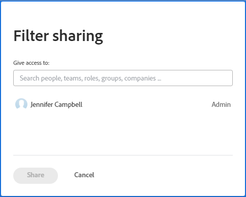
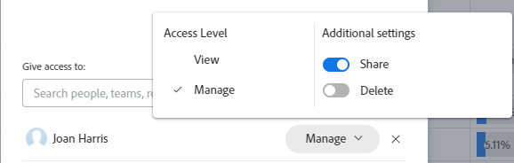

# Dela ett filter, en vy eller en grupp

<!-- Audited: 11/2024 -->

<!--(NOTE: CONSIDER SPLITTING THIS in three articles for each reporting element?)
(NOTE: This is linked from the TOC article in WF Basics > permissions section)-->

Din Adobe Workfront-administratör ger användarna åtkomst till att visa eller redigera objekt när de tilldelar åtkomstnivåer. Mer information om hur du beviljar åtkomst till objekt finns i [Skapa eller ändra anpassade åtkomstnivåer](../../../administration-and-setup/add-users/configure-and-grant-access/create-modify-access-levels.md).

Förutom den åtkomstnivå som användare har beviljats kan du även ge dem behörighet att visa eller redigera specifika objekt som du har skapat eller har åtkomst till att dela. Mer information om åtkomstnivåer och behörigheter finns i [Hur åtkomstnivåer och behörigheter fungerar tillsammans](../../../administration-and-setup/add-users/access-levels-and-object-permissions/how-access-levels-permissions-work-together.md).

Du kan dela filter, vyer och grupperingar som du har tillgång till för att visa med andra användare.

När ett filter, en vy eller en gruppering delas med dig, kan du använda filtret, vyn eller grupperingen i dina listor. Beroende på vilken åtkomst du har kan du eventuellt ändra den och dela den med andra användare.

Mer information om hur du skapar ett filter, en vy eller en gruppering finns i följande artiklar:

* [Översikt över filter](../../../reports-and-dashboards/reports/reporting-elements/filters-overview.md)
* [Vyöversikt i Adobe Workfront](../../../reports-and-dashboards/reports/reporting-elements/views-overview.md)
* [Översikt över grupperingar i Adobe Workfront](../../../reports-and-dashboards/reports/reporting-elements/groupings-overview.md)

## Åtkomstkrav

+++ Expandera om du vill visa åtkomstkrav för funktionerna i den här artikeln.

Du måste ha följande åtkomst för att kunna utföra stegen i den här artikeln:

<table style="table-layout:auto"> 
 <col> 
 <col> 
 <tbody> 
  <tr> 
   <td role="rowheader"><strong>Adobe Workfront-plan*</strong></td> 
   <td> 
Alla 
 </td> 
  </tr> 
  <tr> 
   <td role="rowheader"><strong>Adobe Workfront-licens*</strong></td> 
   <td> 
      
Nytt:

         <ul>
         <li>
Medarbetare eller högre
</li>
         </ul>
      
Aktuell:

         <ul>
         <li>
Begäran eller senare
</li>
         </ul>
   </td>
  </tr> 
  <tr> 
   <td role="rowheader"><strong>Konfigurationer på åtkomstnivå*</strong></td> 
   <td> 
Visa eller ge senare åtkomst till filter, vyer, grupperingar
</td> 
  </tr> 
  <tr> 
   <td role="rowheader"><strong>Objektbehörigheter</strong></td> 
   <td>
Visa eller högre behörigheter med åtkomst till delning till en vy, filter eller gruppering
</td> 
  </tr> 
 </tbody> 
</table>

*Mer information finns i [Åtkomstkrav i Workfront-dokumentation](/help/quicksilver/administration-and-setup/add-users/access-levels-and-object-permissions/access-level-requirements-in-documentation.md).

+++

## Dela ett filter, en vy eller en grupp

<!--(NOTE: when the beta filters/ groupings come out either consider splitting this in different kinds of FVGs or splitting this article in FVGs for showing sharing on each one of them??)-->

Delningsfiltren i valda listor skiljer sig åt beroende på vilket gränssnitt du använder för att dela filtret från: standard eller äldre. Mer information om olika typer av gränssnitt för filteruppbyggnad finns i [Skapa eller redigera filter i Adobe Workfront](/help/quicksilver/reports-and-dashboards/reports/reporting-elements/create-filters.md).

Du kan bara dela vyer och grupperingar i det äldre gränssnittet.

### Dela filter med standardgränssnittet i Builder

Du kan dela ett filter i standardgränssnittet från listor med projekt, uppgifter, utgåvor, portfolior, program, användare, mallar eller grupper. Standardbygggränssnittet för filter är inte tillgängligt för andra objekt eller för vyer eller grupperingar.

Dela ett filter med standardgränssnittet i Builder:

1. Gå till en lista med projekt, uppgifter eller problem.
1. Klicka på ikonen **Filter**  .

   

1. Granska följande filterlistor:

   <table style="table-layout:auto">
   <col>
   <col>
   <tbody>
   <tr>
   <td role="rowheader"><strong>Favoriter</strong></td>
   <td>Filter som du markerade som favoriter. När du väljer ett filter visas dess ursprungliga plats under filternamnet och den döljs i den ursprungliga listan om du inte tar bort den som favorit.</td>
   </tr>
   <tr>
   <td role="rowheader"><strong>Sparad</strong></td>
   <td>Filter som du har skapat och sparat själv. Som standard visas sparade filter i den här listan i den ordning som de senast sparades, men filternamnen kan dras för att ändra ordningen på listan manuellt.</td>
   </tr>
   <tr>
   <td role="rowheader"><strong>Systemstandard</strong></td>
   <td>Workfront standardfilter, liksom filter som Workfront-administratören har lagt till i din filterlista, antingen på systemnivå eller i din layoutmall.</td>
   </tr>
   <tr>
   <td role="rowheader"><strong>Delas med mig</strong></td>
   <td>Filter som andra har skapat och delat med dig eller som är gemensamma för hela systemet.</td>
   </tr>
   </tbody>
   </table>

1. Håll muspekaren över ett filter som du har tillgång till, åtminstone visa och dela, och klicka sedan på menyn **Mer**  och sedan på **Dela**.

   

   Rutan Filterdelning visas.

1. Börja skriva namnen på de användare, team, roller, grupper eller företag som du vill dela med i fältet **Ge åtkomst till**.

   

1. (Valfritt) Klicka på högerpilen bredvid namnet på en enhet för att redigera deras behörigheter till filtret och aktivera sedan antingen alternativet **Visa** eller **Hantera**. **Vyn** är standard.

   

1. (Valfritt) Aktivera eller inaktivera ytterligare behörigheter för en enhet genom att göra något av följande:

   1. Klicka på **Visa** och inaktivera alternativet **Dela**. Den är aktiverad som standard.
   1. Klicka på **Hantera** och inaktivera alternativet **Dela** eller **Ta bort**. De är aktiverade som standard.

      >[!NOTE]
      >
      >Om du aktiverar Hantera-åtkomst med alternativet Ta bort kan dessa användare ta bort filtret från alla användare, även om de inte äger filtret.

   >[!TIP]
   >
   >Användare kan inte få en högre behörighet än deras åtkomstnivå. Om de inte har åtkomst till redigeringsfilter på åtkomstnivån kan de inte få behörighet att hantera ett filter. Workfront inaktiverar alternativet Hantera för dessa användare och alternativet är nedtonat.

1. Klicka på **Dela**. Filtret delas med de enheter som du har angett.

   >[!TIP]
   >
   >När du delar med grupper får filtret behörigheter till medlemmarna i gruppen och alla undergrupper.

   Filtren som du delade visas i avsnittet **Delade med mig** på filterpanelen för dessa entiteter.

   

### Dela filter, vyer och grupperingar med det äldre gränssnittet

Delningsfilter, vyer och grupperingar i det äldre gränssnittet är identiska.

1. Gå till en lista med objekt eller en rapport.
1. (Villkorligt) I en lista klickar du på ikonen **Filter**, **Visa** eller **Gruppera** och för pekaren över det filter, den vy eller den gruppering som du vill dela. Klicka sedan på ikonen **Mer**  och **Dela** .

   Klicka på listrutan **Filter**, **Visa** eller **Gruppering** i en rapport och välj sedan det filter, den vy eller den gruppering som du vill dela.

1. (Villkorligt) Om du delar från en rapport klickar du på listrutan **Filter**, **Visa** eller **Gruppering** igen och sedan på **Dela filter**, **Dela vy** eller **Dela gruppering** .\
   Dialogrutan **Filteråtkomst**, **Visa åtkomst** eller **Grupperingsåtkomst** visas.

   

1. Fyll i något av följande, beroende på vem du vill dela med:

   **Så här delar du med enskilda användare, team, roller, grupper eller företag:** I fältet som anges börjar du skriva namnet på den användare, det team, den roll, den grupp eller det företag som du vill dela med och klickar sedan på namnet i listrutan.\
   Upprepa den här processen om du vill dela åtkomst med flera användare, team, roller, grupper eller företag.

   >[!TIP]
   >
   >När du delar med grupper får du behörighet till filtret, vyn eller grupperingen till medlemmarna i gruppen och till alla undergrupper.

   **Så här delar du med alla användare i systemet:** Klicka på ikonen **Inställningar** och sedan på **Gör den här synliga systemomfattande**.\
   Administratören måste markera alternativet Dela hela systemet för att det här alternativet ska vara tillgängligt. Mer information finns i artiklarna [Skapa eller ändra anpassade åtkomstnivåer](../../../administration-and-setup/add-users/configure-and-grant-access/create-modify-access-levels.md) och [Dela rapporter, instrumentpaneler och kalendrar](../../../workfront-basics/grant-and-request-access-to-objects/permissions-reports-dashboards-calendars.md).

1. (Villkorligt) Om du delar med enskilda användare, team, roller, grupper eller företag, klickar du på den nedrullningsbara menyn för att definiera den åtkomstnivå som du vill bevilja.

   Du kan välja mellan följande alternativ:

   <table style="table-layout:auto"> 
    <col> 
    <col> 
    <tbody> 
     <tr> 
      <td role="rowheader"><strong>Se det</strong></td> 
      <td> 
Välj det här alternativet om du bara vill tillåta delningsmottagare att använda det delade filtret, vyn eller grupperingen. När det här alternativet är markerat kan mottagarna inte göra några ändringar i det delade objektet.
 </td> 
     </tr> 
     <tr> 
      <td role="rowheader"><strong>Hantera det</strong></td> 
      <td> 
Välj det här alternativet om du vill tillåta att delningsmottagare använder och ändrar det delade filtret, vyn eller grupperingen.
 </td> 
     </tr> 
     <tr> 
      <td role="rowheader"><strong>Dela</strong></td> 
      <td> 
Klicka på <strong>Avancerade inställningar</strong> och markera eller avmarkera alternativet <strong>Dela</strong>, beroende på om du vill att mottagarna ska kunna dela med andra.
 </td> 
     </tr> 
    </tbody> 
   </table>

1. Klicka på **Spara**.

   Användare som du har delat filtret, vyn eller grupperingen med kan komma åt den genom att klicka på listrutan **Filter**, **Visa** eller **Gruppering** eller ikonen och rulla ned till avsnittet **Delat med mig**.

