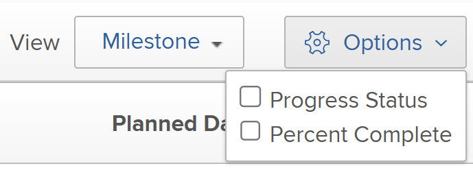

# Använda vyn Milstolpe

<!-- Audited: 1/2024 -->

Du kan använda vyn Milstolpe på en projektlista eller rapport.

Innan du kan använda milstolpevyn måste milstolpar konfigureras, milstolpbanor måste läggas till i projekt och milstolpar måste kopplas till uppgifter, vilket beskrivs i artiklarna [Skapa en milstolpe-bana](../../../administration-and-setup/customize-workfront/configure-approval-milestone-processes/create-milestone-path.md) och [Koppla milstolpar till uppgifter](../../../manage-work/tasks/manage-tasks/associate-milestones-with-tasks.md).

Vyn Milstolpe är tillgänglig när du visar en projektlista eller en projektrapport. I följande avsnitt beskrivs hur du visar och använder milstolpevyn.

## Åtkomstkrav

+++ Expandera om du vill visa åtkomstkrav för funktionerna i den här artikeln.

Du måste ha följande åtkomst för att kunna utföra stegen i den här artikeln:

<table style="table-layout:auto"> 
 <col> 
 </col> 
 <col> 
 </col> 
 <tbody> 
  <tr> 
   <td role="rowheader"><strong>Adobe Workfront</strong></td> 
   <td> 
Alla
 </td> 
  </tr> 
  <tr> 
   <td role="rowheader"><strong>Adobe Workfront-licens</strong></td> 
   <td> 
   
Nytt: Standard

   
Aktuell: Arbete eller högre 
 </td> 
  </tr> 
  <tr> 
   <td role="rowheader"><strong>Konfigurationer på åtkomstnivå*</strong></td> 
   <td> 
Visa eller öka åtkomst till rapporter, instrumentpaneler och kalendrar
</td> 
  </tr> 
  <tr> 
   <td role="rowheader"><strong>Objektbehörigheter</strong></td> 
   <td> 
Visa behörigheter för en projektrapport om du vill använda milstolpevyn på en rapport
 </td> 
  </tr> 
 </tbody> 
</table>

Mer information om tabellen finns i [Åtkomstkrav i Workfront-dokumentation](/help/quicksilver/administration-and-setup/add-users/access-levels-and-object-permissions/access-level-requirements-in-documentation.md).

+++

## Växla till vyn Milstolpe {#switch-to-the-milestone-view}

{{step1-to-projects}}

1. Klicka på **Visa** nedrullningsbar meny och klicka sedan på **Milstolpe**.

   Listan eller rapporten visas i en milstolpe-vy.

   Mer information om milstolpevyn finns i avsnittet [Översikt över milstolpe](#milestone-view-overview) i den här artikeln.

## Översikt över milstolpe {#milestone-view-overview}

Vyn Milstolpe är tillgänglig i projektlistor och projektrapporter. I den här vyn kan du snabbt visa alla milstolpar som är kopplade till uppgifter i projekt som du visar.

>[!NOTE]
>
>Vyn Milstolpe är inte tillgänglig i följande områden:
>
>* Tidrapporter, i projektlistan när du lägger till ett projekt.

Mer information om hur du växlar till vyn milstolpe finns i avsnittet [Växla till vyn Milstolpe](#switch-to-the-milestone-view) i den här artikeln.

### Vyavsnitt för milstolpe

När du använder vyn Milstolpe på en lista med projekt visas projekten i följande avsnitt:

* De projekt som är associerade med en milstolpbana visas först, listade under namnet på deras respektive milstolpbanor.

  Workfront sorterar projekten i det första avsnittet efter följande kriterier, i denna ordning:

   1. Sökväg-ID för milstolpe. Du kan visa ID för milstolpe-sökväg i en rapport för milstolpe-sökväg.

   2. Det fält som valts som det första sorteringsfältet för projektlistan i den vy som tidigare använts på projektlistan, innan du valde vyn Milstolpe.

* De projekt som inte är associerade med en Milestobe Path visas därefter i avsnittet Ej tilldelad. Workfront sorterar projekten i avsnittet Ej tilldelad efter det fält som valts som det första sorteringsfältet för projektlistan i den vy som tidigare använts på projektlistan, innan du valde vyn Milstolpe.

### Projektinformation i milstolpevyn

När du visar en projektlista eller en projektrapport i vyn Milstolpe är följande information tillgänglig:

* **Planerade datum eller planerade datum:** Ange om du vill visa Planerade datum eller Projicerade datum i vyn Milstolpe.\
  Datum visas för Start och Slutförande samt för varje milstolpe i milstolpen.\
  Om du visar Planerade datum och även har Hantera-åtkomst till projektet kan du redigera följande datum direkt från vyn Milstolpe: (Om du visar Projicerade datum kan datumen inte redigeras eftersom Projicerade datum beräknas och inte kan ändras manuellt.)

   * **Startdatum för projekt:** Om ett projekt är schemalagt från startdatumet kan du ändra startdatumet för projektet manuellt och sedan beräknas slutdatumet.
   * **Slutförandedatum för projekt:** Om ett projekt har schemalagts från Slutförandedatumet kan du ändra projektets Slutförandedatum manuellt och sedan beräknas startdatumet.
   * **Datum för slutförande av uppgift:** Du kan uppdatera Slutföring manuellt för uppgifter direkt från vyn Milstolpe.

* **Procent färdigt:** Visar procentandelen slutförande för varje uppgift och projekt.\
  Du kan inaktivera procentandelen slutförande så att den inte visas, vilket beskrivs i avsnittet [Konfigurera vilken information som ska visas i vyn Milstolpe](#configure-what-information-displays-in-the-milestone-view) i den här artikeln.\
  Du kan justera procentandelen för slutförande direkt från milstolpevyn enligt beskrivningen i avsnittet [Justera procent färdigt för uppgifter i vyn Milstolpe](#adjust-percent-complete-for-tasks-in-the-milestone-view) i den här artikeln.

* **Ikoner för aktivitetsstatus:** En statusikon visas bredvid varje projekt och uppgift i vyn Milstolpe.

   * I tid\
     

   * Bakom\
     

   * Risk\
     

   * Sena\
     

  Du kan inaktivera att dessa statusikoner visas, vilket beskrivs i avsnittet [Konfigurera vilken information som ska visas i vyn Milstolpe](#configure-what-information-displays-in-the-milestone-view) i den här artikeln.\
  Mer information om respektive statustyp finns i artikeln [Översikt över status för åtgärdsförlopp](../../../manage-work/tasks/task-information/task-progress-status.md).

* **Uppgiftsstatusskuggning för slutförda uppgifter**: När en uppgift har markerats som Slutförd skuggas bakgrunden för uppgiften i vyn Milstolpe för att ange om uppgiften slutfördes i tid eller sent:

   * **Röd skuggning för aktivitetskolumn**: Bakgrunden för en uppgift är röd när förloppsstatusen är **Sena**.

   * **Grön skuggning för aktivitetskolumn**: Bakgrunden för en uppgift är grön när förloppsstatusen är **I tid**.

* **Projektstatusskuggning för kolumnerna Start och Slutförd**:

   * **Projektets startkolumn**: Bakgrunden i projektstartkolumnen är endast röd eller grön när det faktiska startdatumet har fyllts i:

      * **Röd skuggning för projektets startkolumn**: Bakgrunden i kolumnen Projektstart är röd när projektets förloppsstatus är **Sena**.

      * **Grön skuggning för projektstartkolumn**: Bakgrunden i kolumnen Projektstart är grön när projektets förloppsstatus är **I tid**.

   * **Projektslutförandekolumn**: Bakgrunden i kolumnen Projektslutförande är endast röd eller grön när Faktiskt slutförandedatum har fyllts i:

      * **Röd skuggning för kolumnen Projektslutförande**: Bakgrunden i kolumnen Projektslutförande är röd när projektets förloppsstatus är **Sena**.

      * **Grön skuggning för kolumnen Projektslutförande**: Bakgrunden i kolumnen Projektslutförande är grön när projektets förloppsstatus är **I tid**.

   * Ingen färgskuggning tilldelas till kolumnerna Start och Slutförd när aktiviteterna har statusvärdet Vid risk eller Efter.

  

* **Projektnamn**: Projektnamnet visas med en länk till projektet.
* **Ikon för projektvillkor**: En ikon visas bredvid projektnamnet som anger projektets villkor.

## Konfigurera vilken information som ska visas i vyn Milstolpe {#configure-what-information-displays-in-the-milestone-view}

Du kan konfigurera om följande element ska visas i vyn Milstolpe:

* Statusikoner för förlopp
* Procent färdigt med projekt och uppgifter

Som standard visas projektstatusikoner och procent färdigt projekt.

De ändringar du gör i dessa alternativ gäller bara dig. Övriga användare påverkas inte. De ändringar du gör behålls nästa gång du loggar in på Adobe Workfront.

Så här konfigurerar du om projektstatusikoner och procent slutförda projekt ska visas:

{{step1-to-projects}}

1. Klicka på **Visa** nedrullningsbar meny och klicka sedan på **Milstolpe**.\
   Om du visar en lista med projekt i ett Portfolio eller ett program väljer du **Milstolpe** underflik.

1. Klicka **Alternativ** i det övre högra hörnet av vyn Milstolpe.\
   

1. Välj bland följande alternativ:

   <table style="table-layout:auto"> 
    <col> 
    <col> 
    <tbody> 
     <tr> 
      <td role="rowheader">Status för förlopp</td> 
      <td> 
Välj det här alternativet om du vill visa förloppsikoner bredvid varje projekt och uppgift.
 
Det här alternativet är aktiverat som standard.
 </td> 
     </tr> 
     <tr> 
      <td role="rowheader">Procent färdigt</td> 
      <td> 
Välj det här alternativet om du vill visa procentandelen för slutförande bredvid varje projekt och uppgift.
 
Det här alternativet är aktiverat som standard.
 </td> 
     </tr> 
    </tbody> 
   </table>

## Justera procent färdigt för uppgifter i vyn Milstolpe {#adjust-percent-complete-for-tasks-in-the-milestone-view}

Du kan justera Procent färdigt för uppgifter i vyn Milstolpe. Du kan inte justera Procent färdigt för en överordnad aktivitet (en aktivitet som innehåller underaktiviteter).

Så här justerar du procentandelen färdigt för en aktivitet i vyn Milstolpe:

{{step1-to-projects}}

1. Klicka på **Visa** nedrullningsbar meny och klicka sedan på **Milstolpe**.

1. (Villkorligt) Om procentsatser för slutförande inte visas i vyn Milstolpe klickar du på **Alternativ** i det övre högra hörnet av vyn Milstolpe kontrollerar du sedan att **Procent färdigt** är aktiverat.

1. Klicka på procentsatsen för slutförande under en uppgift, ange en ny procentsats och tryck sedan på Retur.
