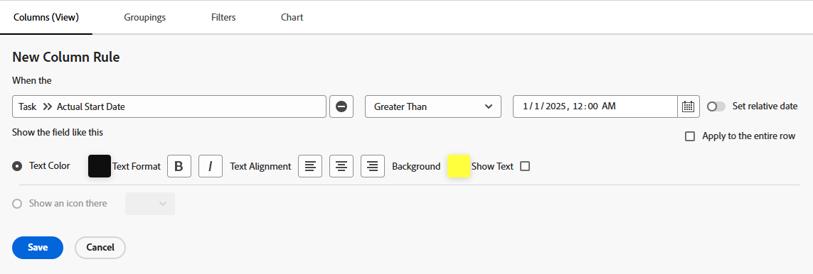

# Jämför fält i villkorlig formatering

Du kan använda villkorsstyrd formatering för att jämföra två olika fält i en vy och markera dem när vissa villkor uppfylls mellan fälten.

## Åtkomstkrav

Du måste ha följande åtkomst för att kunna utföra stegen i den här artikeln:

<table style="table-layout:auto"> 
 <col> 
 <col> 
 <tbody> 
  <tr> 
   <td role="rowheader">Adobe Workfront-plan*</td> 
   <td> <p>Alla</p> </td> 
  </tr> 
  <tr> 
   <td role="rowheader">Adobe Workfront-licens*</td> 
   <td> <p>Plan </p> </td> 
  </tr> 
  <tr> 
   <td role="rowheader">Konfigurationer på åtkomstnivå*</td> 
   <td> <p>Redigera åtkomst till filter, vyer, grupperingar</p> <p>Redigera åtkomst till rapporter, instrumentpaneler och kalendrar för att redigera vyn i en rapport</p> <p>Obs! Om du fortfarande inte har åtkomst frågar du Workfront-administratören om de anger ytterligare begränsningar för din åtkomstnivå. Mer information om hur en Workfront-administratör kan ändra åtkomstnivån finns i <a href="../../../administration-and-setup/add-users/configure-and-grant-access/create-modify-access-levels.md" class="MCXref xref">Skapa eller ändra anpassade åtkomstnivåer</a>.</p> </td> 
  </tr> 
  <tr> 
   <td role="rowheader">Objektbehörigheter</td> 
   <td> <p>Hantera behörigheter till en rapport för att redigera vyn i en rapport</p> <p>Hantera behörigheter till en vy</p> <p>Mer information om hur du begär ytterligare åtkomst finns i <a href="../../../workfront-basics/grant-and-request-access-to-objects/request-access.md" class="MCXref xref">Begär åtkomst till objekt </a>.</p> </td> 
  </tr> 
 </tbody> 
</table>

&#42;Kontakta Workfront-administratören om du vill veta vilken plan, licenstyp eller åtkomst du har.

## Exempel: Jämför faktiskt startdatum och planerat startdatum

Om t.ex. det faktiska startdatumet för en uppgift infaller efter det planerade startdatumet kan du markera kolumnen Planerat startdatum med villkorsstyrd formatering.

Så här jämför du det planerade startdatumet och det faktiska startdatumet för aktiviteten med villkorsstyrd formatering:

1. Gå till en uppgiftsvy eller en rapport.
1. (Villkorligt) Om du arbetar med en rapport går du till fliken **Kolumner (Visa)** och klickar på rubriken för den kolumn som du vill formatera för att markera den.\
   Markera till exempel kolumnen **Faktiskt startdatum** om du vill lägga till den villkorliga formateringen genom att jämföra fälten Planerat startdatum och Faktiskt startdatum.

1. Klicka på **Avancerade alternativ** och sedan på Lägg till en **regel för den här kolumnen**.

1. Ange jämförelsevillkoren med hjälp av befintliga värden som finns i verktyget och ange villkorsstyrd formatering.\
   Vi vill t.ex. markera uppgifter där det faktiska startdatumet är senare än ( eller större än) det planerade startdatumet. Markera modifieringen Större än och välj ett faktiskt datum i datumfältet.\
     

1. (Valfritt) Välj **Använd på hela raden** om du vill använda formateringen på hela raden.
1. Klicka på **Lägg till regel** och sedan **Klar**.

1. Markera kolumnen **Faktiskt startdatum** och klicka sedan på **Växla till textläge**.

1. **Klicka för att redigera text** och lägg sedan till följande textrad:

   ```
   styledef.case.0.comparison.rightmethod= <field to compare>
   ```

   I vårt exempel: 

   ```
   styledef.case.0.comparison.rightmethod=plannedStartDate
   ```

   >[!NOTE]
   >
   >Om du jämför ett Workfront-fält använder du kamelversionssyntax för fältets namn. Om du jämför ett anpassat fält använder du **DE:Faktiskt namn för fältet** för det namnfält som du jämför med det första fältet.\
   >Om du till exempel jämför **Faktiskt startdatum** med ett anpassat fält med namnet **Leveransdatum** lägger du till följande programsats i textlägeskoden:
   >
   >`styledef.case.0.comparison.rightmethod=DE:Delivery Date`

1. Kontrollera att kodraden `righttext` matchar satsen i kodraden `rightmethod`.

   

1. Klicka på **Spara**.
1. Klicka på **Spara + Stäng**.

   Kolumnen markerar de fält som uppfyller villkoren.
