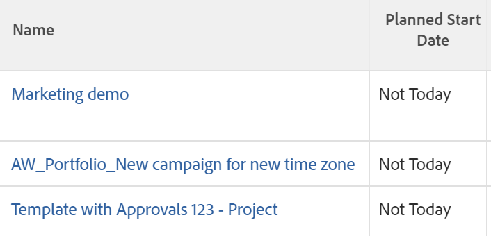

# Använda villkorsstyrd formatering i textläge

<!--Audited: 01/2025-->

Standardgränssnittsverktyget ger stor flexibilitet när det gäller att skapa rapportelement som uppfyller organisationens behov.

Du kan använda villkorsstyrd formatering i en vy med standardgränssnittet.\
Mer information om hur du använder villkorsstyrd formatering i en vy finns i [Använda villkorsstyrd formatering i vyer](../../../reports-and-dashboards/reports/reporting-elements/use-conditional-formatting-views.md).

## Åtkomstkrav

+++ Expandera om du vill visa åtkomstkrav för funktionerna i den här artikeln.

Du måste ha följande:

<table style="table-layout:auto"> 
 <col> 
 <col> 
 <tbody> 
  <tr> 
   <td role="rowheader">Adobe Workfront</td> 
   <td> <p>Alla</p> </td> 
  </tr> 
  <tr> 
   <td role="rowheader">Adobe Workfront-licens</td> 
   <td> 
      <p>Nytt:</p>
         <ul>
         <li><p>Standard</p></li>
         </ul>
      <p>Aktuell:</p>
         <ul>
         <li><p>Plan</p></li>
         </ul>
   </td>
  </tr> 
  <tr> 
   <td role="rowheader">Konfigurationer på åtkomstnivå</td> 
   <td> <p>Redigera åtkomst till filter, vyer, grupperingar</p> <p>Redigera åtkomst till rapporter, instrumentpaneler och kalendrar för att redigera vyer i en rapport</p> </td> 
  </tr> 
  <tr> 
   <td role="rowheader">Objektbehörigheter</td> 
   <td> <p>Hantera behörigheter till en rapport för att redigera vyer i en rapport</p> <p>Hantera behörigheter till en vy för att redigera den</p> </td> 
  </tr> 
 </tbody> 
</table>

Mer information finns i [Åtkomstkrav i Workfront-dokumentationen](/help/quicksilver/administration-and-setup/add-users/access-levels-and-object-permissions/access-level-requirements-in-documentation.md).

+++

## Villkorsstyrd formatering i textläge

I textläget kan du skapa mer komplexa vyer, filter, grupperingar och uppmaningar genom att låta dig använda fält som inte finns i standardgränssnittet.

En fullständig lista över alla våra rapportbara fält finns i [API-utforskaren](../../../wf-api/general/api-explorer.md).

Mer information om hur du använder syntax i textläge finns i [Syntaxöversikt i textläge](../../../reports-and-dashboards/reports/text-mode/text-mode-syntax-overview.md).

Du kan också använda textläge för att formatera vyer i rapporter och listor. Med villkorsstyrd formatering kan du ändra rapportens vyer genom att ändra teckensnittstyp och bakgrund för resultaten i rapporten samt ikoner och flaggor. Vi rekommenderar att du alltid bygger upp dina vyer med standardgränssnittet först och växlar till textlägesgränssnittet endast när det är absolut nödvändigt.

>[!NOTE]
>
> Det går inte att anpassa villkorsstyrd formatering med CSS-format. Du måste i stället använda de fördesignade formateringsalternativen som finns i Adobe Workfront.

## Lägga till villkorsstyrd formatering i vyer

Mer information om hur du använder villkorsstyrd formatering i en vy i standardgränssnittet i Builder finns i [Använda villkorsstyrd formatering i vyer](../../../reports-and-dashboards/reports/reporting-elements/use-conditional-formatting-views.md).

Så här lägger du till villkorsstyrd formatering i en vy i textlägesgränssnittet:

1. Gå till en lista med objekt.
1. Expandera den nedrullningsbara menyn för en vy där du vill lägga till villkorsstyrd formatering.
1. Klicka på **Anpassa vy**.
1. Klicka på den kolumn i vyn som du vill använda villkorsstyrd formatering på.
1. Klicka på **Växla till textläge**.
1. Klicka på **Klicka för att redigera text** i området **Visa i den här kolumnen:**.
1. Lägg till kodexemplen som finns i [Formatera vyer med textläget ](#format-views-using-text-mode) längst ned i texten i den markerade kolumnen.
1. Klicka på **Spara** och sedan på **Spara vy**.

## Formatera vyer med textläge {#format-views-using-text-mode}

Du kan lägga till följande komponenter i en kolumn i en vy om du vill formatera den villkorligt i textläge:

* [Kolumninställningar](#column-settings)
* [Kolumnregler](#column-rules)
* [Villkorligt formatera ett värdeuttryck](#conditionally-format-a-valueexpression)

### Kolumninställningar {#column-settings}

Du måste känna till textlägesgränssnittet innan du kan lägga till villkorsstyrd formatering i vyerna.

Du kan anpassa följande element i en kolumn när du använder villkorsstyrd formatering i en vy:

* [Kolumnrubriker](#column-headers)
* [Formatera datum](#format-dates)
* [Formatera tal](#format-numbers)

#### Kolumnrubriker {#column-headers}

Om du vill ändra den kolumnrubrik som visas lägger du till följande kod i kolumnen: `displayname= [Name of column]`. Om du till exempel vill namnge en kolumn som Projektägare ser textkoden ut så här:

`displayname=Project Owner`

#### Formatera datum {#format-dates}

Datum kan konfigureras för visning i olika format.

Mer information finns i [Formatera datum i textlägesrapporter](../../../reports-and-dashboards/reports/text-mode/format-dates-in-text-mode-reports.md).

#### Formatera tal {#format-numbers}

Du kan formatera numeriska värden för att visa information som bäst passar dina rapporteringsbehov.

Mer information finns i [Formatera tal, valuta och procentvärden i textlägesrapporter](../../../reports-and-dashboards/reports/text-mode/format-numbers-in-text-mode-reports.md).

### Kolumnregler {#column-rules}

Med kolumnregler kan du lägga till bilder, färg, formatering och textåsidosättningar i en vy. Kolumnregler kan upprättas oberoende av varandra eller innehålla flera villkor för en kolumn.

* [Villkorsstyrd formatering](#conditional-formatting)
* [Flera villkorliga format](#multiple-conditional-formats)
* [Använd text](#apply-text)
* [Använd radformat](#apply-row-formats)
* [Använd bilder](#apply-images)

#### Villkorsstyrd formatering {#conditional-formatting}

En specifik textlägesprogramsats måste användas när färg eller formatering infogas.

>[!NOTE]
>
>Villkorsstyrd formatering kanske inte stöds i sammanslagna kolumner.\
>Mer information om hur du sammanfogar kolumner med textläge finns i [Visa: sammanfogningsinformation från flera kolumner i en delad kolumn](../../../reports-and-dashboards/reports/custom-view-filter-grouping-samples/view-merge-columns.md).

Infoga följande kod i en kolumn där du vill lägga till villkorsstyrd formatering:

```
styledef.case.0.comparison.leftmethod= [field name]
styledef.case.0.comparison.lefttext= [field name]
styledef.case.0.comparison.righttext= [field value]
styledef.case.0.comparison.operator= [qualifier]
styledef.case.0.comparison.operatortype= [data type]
styledef.case.0.comparison.icon=false
styledef.case.0.comparison.truetext= 
styledef.case.0.comparison.trueproperty.0.name= [format option]
styledef.case.0.comparison.trueproperty.0.value= [format style]
```

>[!NOTE]
>
>Raden `styledef.case.0.comparison.icon` är alltid false om du inte arbetar med ikoner.
>
>Raden `styledef.case.0.comparison.truetext` lämnas alltid tom tills du arbetar med att skriva över text.
>
>Raden `styledef.case.0.comparison.righttext` är tom när kvalificeraren inte är tom.

Om vi till exempel vill visa företagsnamnet i grön text i en projektrapport kan du använda följande kod:

```
styledef.case.0.comparison.leftmethod=company:name
styledef.case.0.comparison.lefttext=company:name ;
styledef.case.0.comparison.righttext= 
styledef.case.0.comparison.operator=notblank
styledef.case.0.comparison.operatortype=string
styledef.case.0.comparison.icon=false
styledef.case.0.comparison.truetext=
styledef.case.0.comparison.trueproperty.0.name=textcolor
styledef.case.0.comparison.trueproperty.0.value=03a219
```

>[!NOTE]
>
>* Även om den här programsatsen kan användas för en företagsnamnkolumn, kan den även användas för andra kolumner i rapporten. Grön text visas bara om projektet har ett associerat företag. Kom ihåg enheten `[field name]`, `[value]` och `[qualifier]` oavsett om konditioneringen visas i kolumnen eller inte.
>* När du arbetar med kvalificerare rekommenderar vi att du använder `cicontains` i stället för `equal`. Som standard söker `equal` efter ID-nummer. Med kvalificeraren `cicontains` kan du komma åt objekt efter deras namn.

{width="500"}


{width="400"}

Oavsett om Textfärg, Justering, Teckensnittsformat eller Bakgrundsfärg används i ett textläge används samma programsats (se ovan).

Följande rader måste ändras för att återspegla motsvarande formatering som behövs för kolumnen:

```
styledef.case.0.comparison.trueproperty.0.name= [format option]
styledef.case.0.comparison.trueproperty.0.value= [format style]
```

Använd följande tabeller för att identifiera vilka rader som måste ändras och vilka värden du bör ange för att definiera kolumnformatet:

| **Textfärg** | **Rad: textcolor=** |
|---|---|
| Svart | `000000` |
| Mörk blå | `0c6aca` |
| Blågrön | `1b878c` |
| Grön | `03a219` |
| Lila | `6408c4` |
| Grå | `767676` |
| Röd | `d30519` |
| Gul | `e19503` |

{style="table-layout:auto"}

| **Justering** | **Rad: align=** |
|---|---|
| Vänsterjustering | `left` |
| Högerjustering | `right` |
| Centrera | `center` |

{style="table-layout:auto"}

| Teckensnitt | Rad: ***fontstyle=*** |
|---|---|
| Fet | `bold` |
| Kursiv | `italic` |

{style="table-layout:auto"}

| **Bakgrundsfärg** | **Rad: bgcolor=** |
|---|---|
| Blågrön | `dcf6f7` |
| Grön | `def6e2` |
| Grå | `e8e8e8` |
| Blå | `e8f1ff` |
| Lila | `e9def4` |
| Röd | `eac6c9` |
| Gul | `feecc8` |
| Vit | `ffffff` |

{style="table-layout:auto"}

#### Flera villkorsstyrda format {#multiple-conditional-formats}

Du kan använda mer än ett formateringsformat på en sats. Programsatsen core förblir oförändrad och eventuella ytterligare formateringsuttryck läggs till i programsatsen.

Om du till exempel använder den tidigare programsatsen för att inkludera företagsnamn i grön fetstilt. Programsatsen skulle skrivas med följande kod:

```
styledef.case.0.comparison.leftmethod=company:name
styledef.case.0.comparison.lefttext=company:name
styledef.case.0.comparison.righttext=
styledef.case.0.comparison.operator=notblank
styledef.case.0.comparison.operatortype=string
styledef.case.0.comparison.icon=false
styledef.case.0.comparison.truetext= 
styledef.case.0.comparison.trueproperty.0.name=textcolor
styledef.case.0.comparison.trueproperty.0.value=03a219
styledef.case.0.comparison.trueproperty.1.name=fontstyle
styledef.case.0.comparison.trueproperty.1.value=bold
```

>[!NOTE]
>
>Om du inkluderar mer än ett villkorsstyrt formateringsuttryck måste varje uttryck i programsatsen identifieras numeriskt. Observera att uttryck 0 och uttryck 1 har identifierats.

#### Använd text {#apply-text}

Om du vill ersätta de standardvärden som finns i en kolumn med ett valfritt värde, är det möjligt att använda text i kolumnen.

I en projektrapport anger du till exempel att kolumnvärdet för Planerat startdatum inte ska visa det planerade startdatumet för projektet, utan istället texten&quot;Inte idag&quot;. Använd följande kod för kolumnen Planerat startdatum:

```
case.0.comparison.leftmethod=plannedStartDate
case.0.comparison.lefttext=plannedStartDate
case.0.comparison.righttext=2013-04-10T10:45:00:000
case.0.comparison.operator=ne
case.0.comparison.operatortype=date
case.0.comparison.icon=false
case.0.comparison.truetext=not today
styledef.case.0.comparison.leftmethod=plannedStartDate
styledef.case.0.comparison.lefttext=plannedStartDate
styledef.case.0.comparison.righttext=2013-04-10T10:45:00:000 
styledef.case.0.comparison.operator=ne
styledef.case.0.comparison.operatortype=date&
styledef.case.0.comparison.icon=false
styledef.case.0.comparison.truetext=not today
```

>[!NOTE]
>
>Raderna som börjar med `case.0.` använder falljämförelser till att identifiera textanvändning. Raderna som börjar med `styledef.case.0.` är tidiga villkorsstyrda formateringssatser där vi identifierar textanvändning via uttrycket `truetext`. Ange `truetext` till ett värde i stället för att lämna det tomt.

{width="500"}

{width="400"}

#### Använda radformat {#apply-row-formats}

Om du vill använda ett villkor för hela raden använder du följande kod tillsammans med kolumnkoden:

```
styledef.case.0.comparison.icon=false
styledef.case.0.comparison.isrowcase=true
styledef.case.0.comparison.leftmethod= [field name]
styledef.case.0.comparison.lefttext= [field name]
styledef.case.0.comparison.operator= [qualifier]
styledef.case.0.comparison.operatortype= [data type]
styledef.case.0.comparison.righttext= [field value]
styledef.case.0.comparison.trueproperty.0.name= [format option]
styledef.case.0.comparison.trueproperty.0.value= [format style]
styledef.case.0.comparison.truetext=
row.0.styledef.applyallcases=true
row.0.styledef.case.0.comparison.icon=false
row.0.styledef.case.0.comparison.isrowcase=true
row.0.styledef.case.0.comparison.leftmethod= [field name]
row.0.styledef.case.0.comparison.lefttext= [field name]
row.0.styledef.case.0.comparison.operator= [qualifier]
row.0.styledef.case.0.comparison.operatortype= [data type]
row.0.styledef.case.0.comparison.righttext= [field value]
row.0.styledef.case.0.comparison.trueproperty.0.name= [format option]
row.0.styledef.case.0.comparison.trueproperty.0.value= [format style]
row.0.styledef.case.0.comparison.truetext=
```

#### Använd bilder {#apply-images}

På samma sätt som för formatering med text kan bilder användas för att visa information i rapporter. Workfront har ett antal inbyggda bilder för att förmedla visuell information i en rapportinställning. Om du vill använda bilder i den villkorliga formateringsinställningen krävs följande programsats:

```
image.case.0.comparison.leftmethod= [field name]
image.case.0.comparison.lefttext= [field name]
image.case.0.comparison.righttext= [field value]
image.case.0.comparison.operator= [qualifier]
image.case.0.comparison.operatortype= [data type]
image.case.0.comparison.icon=true
image.case.0.comparison.truetext=
```

Om du till exempel har en projektrapport vill du skapa en kolumn där du vill visa ett urholkat ansikte för varje planerat slutförandedatum som inte är lika med dagens datum. Använd följande textlägeskod för att lägga till ikonen i kolumnen:

```
image.case.0.comparison.leftmethod=plannedCompletionDate
image.case.0.comparison.lefttext=plannedCompletionDate
image.case.0.comparison.righttext=2013-04-10T13:00:00:000 
image.case.0.comparison.operator=ne 
image.case.0.comparison.operatortype=date
image.case.0.comparison.icon=true
image.case.0.comparison.truetext=/interface/images/v4_redux/icons/casebuilder/emoticon_frown.gif
```

>[!NOTE]
>
>Observera att uttrycket `icon=true` används i programsatsen. Den här programsatsen skiljer sig också från andra villkorliga formateringssatser eftersom den inte använder formatet `style.def`, utan snarare ett unikt bildformat.

{width="500"}

{width="400"}

Om du vill använda de bilder som är tillgängliga använder du följande kod och värden:

| **Ikon** | **Rad: image.case.0.comparison.truetext=** |
|---|---|
| Frown Face  | =`/interface/images/v4_redux/icons/casebuilder/emoticon_frown.gif` |
| Glad yta  | =`/interface/images/v4_redux/icons/casebuilder/emoticon_smile.gif` |
| Blå flagga  | =`/interface/images/v4_redux/icons/casebuilder/flag_blue.gif` |
| Grön flagga  | =`/interface/images/v4_redux/icons/casebuilder/flag_green.gif` |
| Röd flagga  | =`/interface/images/v4_redux/icons/casebuilder/flag_red.gif` |
| Gul flagga  | =`/interface/images/v4_redux/icons/casebuilder/flag_yellow.gif` |
| Svart cirkel  | =`/interface/images/v4_redux/icons/casebuilder/light_black.gif` |
| Blå cirkel  | =`/interface/images/v4_redux/icons/casebuilder/light_blue.gif` |
| Grå cirkel  | =`/interface/images/v4_redux/icons/casebuilder/light_grey.gif` |
| Grön cirkel  | =`/interface/images/v4_redux/icons/casebuilder/light_green.gif` |
| Orange cirkel  | =`/interface/images/v4_redux/icons/casebuilder/light_orange.gif` |
| Rosa cirkel  | =`/interface/images/v4_redux/icons/casebuilder/light_pink.gif` |
| Lila cirkel  | =`/interface/images/v4_redux/icons/casebuilder/light_purple.gif` |
| Röd cirkel  | =`/interface/images/v4_redux/icons/casebuilder/light_red.gif` |
| Vit cirkel  | =`/interface/images/v4_redux/icons/casebuilder/light_white.gif` |
| Gul cirkel  | =`/interface/images/v4_redux/icons/casebuilder/light_yellow.gif` |

{style="table-layout:auto"}

### Formatera `valueexpression` på ett villkor {#conditionally-format-a-valueexpression}

Om du vill visa ett beräknat värde i en kolumn kan du ersätta kodraden `valuefield` i kolumnen med `valueexpression`. Med ett beräknat värde kan du visa ett nytt värde för ett objekt baserat på beräkningen mellan två befintliga fält på samma objekt.

Mer information om hur du formaterar `valueexpression line` finns i [Syntaxöversikt för textläge](../../../reports-and-dashboards/reports/text-mode/text-mode-syntax-overview.md).

Du kan inte villkorligt formatera en kolumn som innehåller en `valueexpression`-kodrad. I stället kan du lägga till ett beräknat anpassat fält i ett anpassat formulär och koppla det till de objekt som visas i rapporten. Sedan kan du villkorligt formatera kolumnerna som visar det här fältet.

Mer information om beräknade anpassade fält finns i [Lägg till beräknade fält i ett formulär](/help/quicksilver/administration-and-setup/customize-workfront/create-manage-custom-forms/form-designer/design-a-form/add-a-calculated-field.md).

## Lägga till ett aggregeringsvärde i en textlägeskolumn

Vi rekommenderar att du skapar kolumnen i Builder-gränssnittet först, lägger till aggregeringsvärdet där och sedan redigerar kolumnen i textläge.

Tänk på följande när du lägger till aggregerare i en kolumn i textläge:

* Värdena i kolumnen måste ha ett format som kan sammanfattas. De måste till exempel ha något av följande format:

   * Nummer
   * Datum
   * Valuta

* Du kan lägga till en aggregator i en kolumn som visar en beräkning. Det aggregerade värdet visas i grupperingen av vyn eller rapporten. Mer information finns i [Gruppering: visa resultatet av att samla flera beräknade värden i en gruppering](../../../reports-and-dashboards/reports/custom-view-filter-grouping-samples/grouping-calculation-between-two-fields-aggregated-in-grouping.md).
* Kodraderna för definitionen av kolumnen måste vara identiska med kodraderna som inför aggregatorn och föregås av &quot;aggregator&quot;. Om du till exempel har en kolumn där du visar Planerade timmar i ett projekt, är textläget för kolumnhuvudraderna:

```
  valuefield=workRequired
  valueformat=compound
```

När du vill samla in värdena för alla rader i grupperingen av vyn kan vi lägga till följande kod för att lägga till aggregeringsvärdena:

`aggregator.valuefield=workRequired` (raden `aggregator.valuefield` måste vara densamma som `valuefield` som beskriver kolumnen)

`aggregator.valueformat=compound` (raden `aggregator.valueformat` måste ha samma värde som `valueformat` som beskriver kolumnen)

`aggregator.function=SUM` (det här är en obligatorisk rad som anger hur du vill aggregera kolumnen, och i det här fallet vill du lägga till alla enskilda planerade timmar i ett nummer i grupperingsraden)

`aggregator.displayformat=minutesAsHoursString` (eftersom timmar lagras i Workfront på några minuter vill vi ange `displayformat` för timmar när de lagras i minuter)
