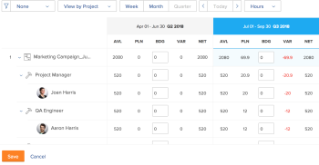
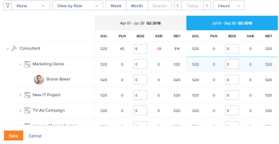
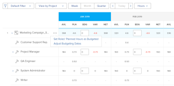

# Budgetresurser i resursplaneraren med projekt- och rollvyerna

<!--

(NOTE: broken off of another larger article (Planning in the RP); reformat, restructure, relink)

-->

Huvudfunktionen i resursplaneraren är att budgetera dina resurser för det arbete som måste slutföras i projekt.

>[!IMPORTANT]
>
>Du kan bara budgetera dina resurser om du använder vyerna **Visa efter projekt** eller **Visa efter roll** i resursplaneraren.

Läs följande artiklar innan du börjar budgetera information i resursplaneraren:

* [Resursplanering - översikt](../../resource-mgmt/resource-planning/get-started-resource-planner.md)
* [Åtkomst krävs för att budgetera resurser i Adobe Workfront](../../resource-mgmt/resource-planning/access-needed-to-budget-resources.md)
* [Översikt över timmar, heltidsanställda och kostnadsinformation i projekt- och rollvyerna i resursplaneraren](../../resource-mgmt/resource-planning/overview-of-planner-hour-fte-cost-information-in-role-project-views.md)

## Åtkomstkrav

+++ Expandera om du vill visa åtkomstkrav för funktionerna i den här artikeln.

<table style="table-layout:auto"> 
 <col> 
 <col> 
 <tbody> 
  <tr> 
   <td>Adobe Workfront package</td> 
   <td>
Alla
</td>
  </tr> 
  <tr> 
   <td>Adobe Workfront-licens</td> 
   <td>
Standard

       
Plan
</td> 
  </tr> 
  <tr> 
   <td>Konfigurationer på åtkomstnivå</td> 
   <td> 
Redigera åtkomst till resurshantering som inkluderar åtkomst till Redigera prioriteringar och budgettimmar i Resursplanering
 
Redigera åtkomst till finansiella data som innefattar tillgång till Redigera kostnadstariffer och Redigera allmänna finanser, till budgetresurser per kostnad
 
Redigera åtkomst till projekt och användare
</td> 
  </tr> 
  <tr> 
   <td>Objektbehörigheter</td> 
   <td> 
Hantera behörigheter för de projekt som du vill budgetera information för
</td> 
  </tr> 
 </tbody> 
</table>

Mer information finns i [Åtkomstkrav i Workfront-dokumentationen](/help/quicksilver/administration-and-setup/add-users/access-levels-and-object-permissions/access-level-requirements-in-documentation.md).

+++

## Budgetresurser i resursplaneraren

* [Budgetresurser i projektvyn](#budget-resources-in-the-project-view)
* [Budgetresurser i rollvyn](#budget-resources-in-the-role-view)
* [Budgetresurser i bulk](#budget-resources-in-bulk)

### Budgetresurser i projektvyn {#budget-resources-in-the-project-view}

<!--

(NOTE: this section is linked to the Budgeting Project Resources in the Business Case article)

-->

{{step1-to-resourcing}}

1. **Planeraren** visas som standard.
1. (Villkorligt) Välj vyn **Visa efter projekt**.
1. Expandera projekten och jobbrollerna för att hantera allokeringen för projektet, jobbrollerna eller användarna.
1. Gör något av följande för att budgetera allokering för användare:

   * I kolumnen **BDG** anger du manuellt antal budgeterade timmar, FTE eller kostnader för användarna.

   * Klicka på menyn **Mer** för användarens jobbroll och klicka sedan på **Ange användares planerade timmar som budgeterade**.\
     Varje användares budgeterade timmar beräknas med följande formel:

     `User Budgeted Hours = User Planned Hours`

1. Gör något av följande om du vill budgetera allokering för jobbroller:

   * I kolumnen **BDG** anger du manuellt antalet budgeterade timmar, FTE eller kostnad för jobbrollen.

     >[!NOTE]
     >
     >Rollens budgeterade timmar läggs till i projektets budgeterade timmar.

   * (Villkorligt) Om du har budgeterat timmar för användare klickar du på menyn **Mer** för jobbrollen och sedan på **Totalt antal användares budgeterade timmar för rollen**.\
     Budgeterade timmar för varje roll beräknas med följande formel:

     `Role Budgeted Hours = SUM(User Budgeted Hours)`

   * Klicka på menyn **Mer** för projektet och klicka sedan på **Ange rollernas planerade timmar som budgeterade**.\
     Budgeterade timmar för varje roll beräknas med följande formel:\
     &#x200B;*

     `Role Budgeted Hours = Role Planned Hours`

     >[!NOTE]
     >   
     >* Rollens budgeterade timmar läggs till i projektets budgeterade timmar.
     >* Användare kan budgeteras för både primära och andra (eller sekundära) roller.
     >* **Procentandelen FTE-tillgänglighet** för användarens roller måste vara ett annat tal än 0 % för tillgängliga timmar för att visa ett värde i resursplaneraren för en jobbroll. Om en användare är associerad med en roll med 0 % **procent FTE-tillgänglighet** är värdet för tillgängliga timmar noll för den jobbrollen. I det här fallet kan rollen visa ett negativt **nettovärde**.\
     >Mer information om **procentandelen FTE-tillgänglighet** för jobbroller finns i artikeln [Redigera en användares profil](../../administration-and-setup/add-users/create-and-manage-users/edit-a-users-profile.md).

   * I kolumnen **BDG** anger du manuellt antal budgeterade timmar, heltidsekvivalenter eller kostnader för projektet. Detta fördelar antalet projektbudgeterade timmar för varje roll i projektet. Följande scenarier finns:

      * Om antalet projektbudgeterade timmar som du anger är lika med antalet projektplanerade timmar, matchar rollens budgeterade timmar rollplanerade timmar.
      * Om det antal projektbudgeterade timmar som du anger inte är lika med antalet projektplanerade timmar, fördelas rollens budgeterade timmar enligt den procentandel av Planerade timmar som behövs för varje roll.\
        Om ett projekt till exempel har 20 planerade timmar, och de fördelas mellan två jobbroller (Konsult kräver 12 planerade timmar och Konstruktör kräver 8 planerade timmar) och du budgeterar 30 timmar för projektet, fördelas timmarna enligt följande: Konsultrollen får 18 budgeterade timmar och rollen Konstruktör får 12 budgeterade timmar.

1. Gör något av följande om du vill budgetera för projektet:

   * Budgetera rollerna under projektet enligt beskrivningen i steg 7.\
     Projektets budgeterade timmar beräknas enligt följande formel:

     `Project Budgeted Hours = SUM(Role Budgeted Hours)`

   * I kolumnen **BDG** anger du manuellt antal budgeterade timmar, heltidsekvivalenter eller kostnader för projektet.\
     Detta uppdaterar rollbudgeterade timmar enligt beskrivningen i steg 7.\
     

1. Klicka på **Spara**.\
   När du har budgeterat dina resurser i resursplaneraren visas de budgeterade timmarna för dina resurser och eventuella kostnader som är kopplade till dem i affärsärendet för varje projekt.\
   Mer information om hur du förstår resursbudgeteringsområdet för affärsärendet finns i avsnittet Resursbudgetering i artikeln [Översikt över områden i affärsärendet](../../manage-work/projects/define-a-business-case/areas-of-business-case.md).

1. (Valfritt) Välj användarvyn om du vill se eventuella användaröverbeläggningar eller underutnyttjande mellan Tillgängliga och Planerade timmar för varje användare. Budgeterade timmar visas inte i användarvyn.

   Mer information om hur Workfront beräknar tillgängligheten för en användare finns i [Konfigurera inställningar för resurshantering](../../administration-and-setup/set-up-workfront/configure-system-defaults/configure-resource-mgmt-preferences.md).

### Budgetresurser i rollvyn {#budget-resources-in-the-role-view}

<!--

(NOTE: THIS IS WRONG - I LOGGED A BUG TO FIX THIS LINK - IT SHOULD GO TO"ACCESS NEEDED TO BUDGET IN THE RP":

Planning in the resource planner has links to the UI - ensure Flare notes are there for this: https://workfront.zendesk.com/hc/en-us/articles/115006356928 - the "Budgeting resources in the role view" is linked to this tooltip: ***This is linked to the product in the RP when the user does not have Manage rights on one of the projects under the role. This tool tip is linked here: "You don't have Manage permissions for all projects. Budget hours by individual project instead. Learn more...")

-->

Du måste ha behörigheten Redigera för Resurshantering och Ekonomisk information och Hantera ekonomi för projekten för att kunna budgetera resurser i Resursplaneraren. Om du bara har Visa-åtkomst till minst ett projekt som listas under en jobbroll, kan du inte budgetera allokeringar för rollen i rollvyn. Du kan fortfarande budgetallokera för de projekt där du har behörigheten Hantera.

Mer information om åtkomsten som krävs för budgetresurser finns i artikeln [Åtkomst krävs för att budgetera resurser i Adobe Workfront](../../resource-mgmt/resource-planning/access-needed-to-budget-resources.md).

Om du vill budgetera allokeringar i resursplaneraren i rollvyn***:

1. Klicka på ikonen **Huvudmeny**  i det övre högra hörnet av Adobe Workfront.

1. Klicka på **Resurs**.
1. **Planeraren** visas som standard.
1. (Villkorligt) Välj vyn **Visa efter roll**.
1. Expandera jobbrollerna och projekten för att hantera tilldelningen för projektet, jobbrollerna eller användarna.
1. Gör något av följande om du vill budgetera allokering för användare:

   * I kolumnen **BDG** anger du manuellt antal budgeterade timmar, FTE eller kostnader för användarna.
   * Klicka på menyn **Mer** för projektet och klicka sedan på **Ange användares planerade timmar som budgeterade**.\
     Varje användares budgeterade timmar beräknas med följande formel:

     `User Budgeted Hours = User Planned Hours`

1. Gör något av följande om du vill budgetera allokering för jobbroller:

   * I kolumnen **BDG** anger du manuellt antalet budgeterade timmar, FTE eller kostnad för jobbrollerna.\
     Detta fördelar rollbudgeterade timmar till projektbudgeterade timmar för de projekt som du har tillgång till för att hantera.

   * Klicka på menyn **Mer** för jobbrollen och klicka sedan på **Ange projektens planerade timmar som budgeterade.**&#x200B;Rollbudgeterade timmar beräknas med följande formel:\
     &#x200B;*

     `Role Budgeted Hours = SUM(Project Budgeted Hours)`

     *Projektets budgeterade timmar beräknas med följande formel:

     `Project Budgeted Hours = Project Planned Hours`

   * I kolumnen **BDG** anger du manuellt antal budgeterade timmar, heltidsekvivalenter eller kostnader för de projekt som listas under jobbrollen.\
     Detta lägger till antalet projektbudgeterade timmar i rollen.

   >[!NOTE]
   >
   >Användare kan budgeteras för både primära och andra (eller sekundära) roller. **Procentandelen FTE-tillgänglighet** för användarens roller måste vara ett annat tal än 0 % för tillgängliga timmar för att visa ett värde i resursplaneraren för en jobbroll. Om en användare är associerad med en roll med 0 % **procent FTE-tillgänglighet** är värdet för tillgängliga timmar noll för den jobbrollen. I det här fallet kan rollen visa ett negativt **nettovärde**.\
   >Mer information om **procentandelen FTE-tillgänglighet** för jobbroller finns i artikeln [Redigera en användares profil](../../administration-and-setup/add-users/create-and-manage-users/edit-a-users-profile.md).

1. Gör något av följande om du vill budgetera för projektet:

   * I kolumnen **BDG** anger du manuellt antal budgeterade timmar, heltidsekvivalenter eller kostnader för projekten.\
     Detta uppdaterar även budgeterade timmar för de roller som projektet är listat under.

   * Klicka på menyn **Mer** för jobbrollen och klicka sedan på **Ange projektens planerade timmar som budgeterade**.\
     Projektets budgeterade timmar beräknas enligt följande formel:

     `Project Budgeted Hours = Project Planned Hours`

     Projektets budgeterade timmar läggs till i rollens budgeterade timmar.

   * (Villkorligt) Om du har budgeterat timmarna för användarna klickar du på menyn **Mer** för projektet och sedan på **Totalt antal användares budgeterade timmar för projektet**.\
     Projektets budgeterade timmar beräknas med följande formel:

     `Project Budgeted Hours = SUM(User Budgeted Hours)`

     

1. Klicka på **Spara**.\
   När du har budgeterat dina resurser i resursplaneraren visas de budgeterade timmarna för dina resurser och eventuella kostnader som är kopplade till dem i affärsärendet för varje projekt.
Mer information om hur du förstår resursbudgeteringsområdet för affärsärendet finns i artikeln [Budgetresurser i affärsärendet](../../manage-work/projects/define-a-business-case/budget-resources-in-business-case.md).

1. (Valfritt) Markera vyn **Visa efter användare** om du vill att användaröverbeläggningar eller underutnyttjande mellan tillgängliga och planerade timmar ska visas för varje användare. Budgeterade timmar visas inte i vyn Visa efter användare.

### Budgetresurser i bulk {#budget-resources-in-bulk}

Du kan budgetera allokeringar för dina resurser i grupp när du använder snabblänkar. Snabblänkarna är bara tillgängliga för projekt- och rollvyerna.

>[!NOTE]
>
>När du använder snabblänkar till budgetallokeringar för resurser tillämpas budgeteringen automatiskt bara på de tidsperioder som visas på skärmen. Om tidslinjen för ett projekt sträcker sig över en längre tid än den som visas på skärmen måste du rulla från vänster till höger och sedan använda snabblänkarna för att automatiskt budgetera dina resurser.

Så här budgeterar du flera resurser samtidigt:

1. Gå till .\
   Mer information om åtkomst till resursplaneraren finns i avsnittet Åtkomst till resursplaneraren i artikeln [Översikt över resursplaneraren](../../resource-mgmt/resource-planning/get-started-resource-planner.md).\
   En lista med projekt som du kan hantera visas i listan.

1. (Valfritt) Expandera varje projekt för att visa en lista över jobbroller som är kopplade till det.\
   eller
1. (Valfritt) Välj **Visa efter roll** och expandera sedan varje roll för att visa en lista över projekt som är kopplade till den.
1. Håll muspekaren över namnet på ett projekt eller en jobbroll.
1. Klicka på ikonen **Mer** som visas längst till höger om projektet eller rollnamnet.

1. Klicka på ett av de tillgängliga alternativen för att automatiskt ange BDG (Budgeted Hours) för andra objekt.

   Beroende på om du har klickat på ikonen Mer i ett projekt eller en roll, skiljer sig alternativen för att budgetera satsvis. Tabellen nedan visar vilka alternativ som är tillgängliga för projekt och roller:

   <table style="table-layout:auto"> 
    <col> 
    <col> 
    <col> 
    <tbody> 
     <tr> 
      <td> </td> 
      <td><strong>Projektvy</strong> </td> 
      <td><strong>Rollvy</strong> </td> 
     </tr> 
     <tr> 
      <td>Projektalternativ</td> 
      <td> 
       <ul> 
        <li><strong>Ange rollernas planerade timmar som budgeterade</strong>: Välj det här alternativet om du vill att rollens budgeterade timmar ska vara identiska med deras planerade timmar. Summan av budgeterade timmar för rollerna visas för projektbudgeterade timmar. </li> 
        <li><strong>Justera budgetdatum</strong> : Välj det här alternativet om du vill flytta budgeterade timmar till en annan tidsram. Mer information om hur du justerar budgeteringsdatum finns i <a href="../../resource-mgmt/resource-planning/adjust-budgeting-dates.md" class="MCXref xref">Justera budgeteringsdatum i Resursplanering</a>.</li> 
       </ul> </td> 
      <td> 
       <ul> 
        <li><strong>Ange användares planerade timmar som budgeterade</strong>: Välj det här alternativet om du vill att användarens budgeterade timmar ska vara identiska med användarens planerade timmar. </li> 
        <li><strong>Totalt antal användares budgeterade timmar för projekt</strong>: Välj det här alternativet om du vill lägga ihop alla användarbudgeterade timmar och visa summan som budgeterade timmar för projektet och för rollen. Vi rekommenderar att du använder det här alternativet när du antingen har budgeterat dina användare manuellt eller när du har använt det föregående alternativet först. </li> 
       </ul> </td> 
     </tr> 
     <tr> 
      <td>Rollalternativ</td> 
      <td> 
       <ul> 
        <li><strong>Ange användares planerade timmar som budgeterade</strong>: Välj det här alternativet om du vill att användarens budgeterade timmar ska vara identiska med användarens planerade timmar. </li> 
        <li><strong>Totalt antal användares budgeterade timmar för rollen</strong>: Välj det här alternativet om du vill lägga till alla användarens budgeterade timmar tillsammans och visa summan som budgeterade timmar för rollen och projektet. Vi rekommenderar att du använder det här alternativet när du antingen har budgeterat dina användare manuellt eller när du har använt det föregående alternativet först. </li> 
       </ul> </td> 
      <td> 
       <ul> 
        <li><strong>Ange projektens planerade timmar som budgeterade</strong>: Välj det här alternativet om du vill att projektets budgeterade timmar ska vara identiska med projektets planerade timmar. </li> 
       </ul> </td> 
     </tr> 
    </tbody> 
   </table>

   >[!NOTE]
   >
   >Vissa av alternativen kanske inte visas om några av förutsättningarna för att arbeta i resursplaneraren saknas.
   >
   >
   >Mer information om vilka krav som måste uppfyllas för korrekt budgetering i resursplaneraren finns i avsnittet Krav för att arbeta i resursplaneraren i artikeln [Resursplaneringsöversikt](../../resource-mgmt/resource-planning/get-started-resource-planner.md).\
   >En del alternativ kanske inte visas i följande scenarier:
   >
   >   
   >   
   >   * När projekt inte är associerade med resurspoolen
   >   * När resurspooler som är associerade med projekt inte innehåller användare
   >   * När resurspooler som är associerade med projekt innehåller användare som inte är associerade med någon jobbroll.
   >   
   >
