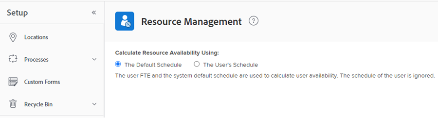

# Översikt över beräkning av timmar och heltidsekvivalent för användare och roller i resursplaneraren

<!--

(NOTE: Alina:KEEP THIS:***Linked to: Configuring My Settings, Editing User Accounts, Planning in the Resource Planner -- *** Some of this documentation is also duplicated in this article (Scheduling): https://support.workfront.com/hc/en-us/articles/360000557174)

-->

Du kan visa allokeringen och tillgängligheten för dina resurser i resursplaneraren efter timmar, heltid eller kostnad.\
Mer information om hur du beräknar kostnader i resursplaneraren finns i [Beräkna kostnader i resursplaneraren](../../resource-mgmt/resource-planning/calculate-costs-resource-planner.md).

&quot;FTE&quot; står för Full Time Equivalent. Det är ett tidsmått som representerar antalet timmar som är dedikerade till verkligt arbete under en dag eller vecka för en användare eller jobbroll.

Följande uppsättningar med resursinformation beräknas på olika sätt i resursplaneraren:

* Tillgängliga timmar eller FTE-värden beräknas utifrån hur systemadministratören konfigurerar inställningarna för resurshantering i systemet.\
  Mer information om hur värdena för Tillgängliga timmar och FTE beräknas finns i [Beräkna tillgängliga timmar eller FTE för användare och jobbroller i resursplaneraren](#calculate-available-hours-or-fte-for-users-and-job-roles-in-the-resource-planner).\
  Mer information om hur du definierar inställningar för resurshantering för Adobe Workfront-systemet finns i [Konfigurera inställningar för resurshantering](../../administration-and-setup/set-up-workfront/configure-system-defaults/configure-resource-mgmt-preferences.md).

* Alla andra FTE-värden beräknas baserat på systemets standardschema.\
  Mer information om hur alla andra värden visas i resursplaneraren när du använder FTE finns i avsnittet [Beräkna alla andra timma- och FTE-värden för användare och jobbroller i resursplaneraren](#calculate-all-other-hour-and-fte-values-for-users-and-job-roles-in-the-resource-planner) i den här artikeln.

Det är viktigt att förstå vad FTE är för var och en av dina användare och deras jobbroller för att hantera dina resurser korrekt när du tilldelar dem till arbetet.

## Beräkna tillgängliga timmar eller heltidsanställda för användare och jobbroller i resursplaneraren {#calculate-available-hours-or-fte-for-users-and-job-roles-in-the-resource-planner}

* [Beräkna tillgängliga timmar och FTE för en användare i resursplaneraren](#calculate-the-available-hours-and-fte-for-a-user-in-the-resource-planner)
* [Beräkna tillgängliga timmar och FTE för en jobbroll i resursplaneraren](#calculate-the-available-hours-and-fte-for-a-job-role-in-the-resource-planner)
* [Beräkna tillgängliga timmar och heltidsanställda för en användare i resursplaneraren (exempel)](#calculate-the-available-hours-and-fte-for-a-user-in-the-resource-planner-example)

### Beräkna tillgängliga timmar och heltidsanställda för en användare i resursplaneraren {#calculate-the-available-hours-and-fte-for-a-user-in-the-resource-planner}

Workfront-administratören avgör hur den tillgängliga tiden för en användare beräknas genom att välja att använda något av följande i området Resurshantering i installationsprogrammet:

* Standardschemat för systemet och användarens FTE.
* Användarens schema.

>[!NOTE]
>
>Detta avgör hur resurstillgängligheten beräknas på systemnivå. Mer information om hur du definierar inställningar för resurshantering för systemet finns i [Konfigurera inställningar för resurshantering](/help/quicksilver/administration-and-setup/set-up-workfront/configure-system-defaults/configure-resource-mgmt-preferences.md).

Baserat på hur den här inställningen är konfigurerad beräknas tillgängligheten för användarna i resursplaneraren (timmar och FTE-tillgänglighet) på följande sätt:

* **Standardschemat**: Standardschemat för systemet och användarens FTE används för att fastställa tillgängliga timmar och FTE-värde för användaren i resursplaneraren. Användarens schema ignoreras. I detta fall:

   * **Tillgängliga timmar** i resursplaneraren beräknas med följande formel:

     `User Available Hours = Default Schedule Hours * User FTE value`

     Om till exempel standardschemat har 40 timmar i veckan tillgängligt för arbete och användaren FTE är 0,5, kan användaren arbeta 20 timmar i veckan i Resursplaneraren.

     Mer information om scheman, inklusive standardschemat, finns i [Skapa ett schema](/help/quicksilver/administration-and-setup/set-up-workfront/configure-timesheets-schedules/create-schedules.md).

   * **Tillgänglig FTE** för användaren i resursplaneraren är samma som användarens FTE som anges i användarinställningarna.

     Om användaren till exempel har FTE 0,5 i användarinställningarna är användarens tillgängliga FTE 0,5 i Resursplaneraren. Mer information om värdet för användarens FTE så som det visas i användarinställningarna finns i [Redigera en användares profil](/help/quicksilver/administration-and-setup/add-users/create-and-manage-users/edit-a-users-profile.md).

* **Användarens schema**: Användarens schema används för att fastställa användarens tillgänglighet i resursplaneraren. Värdet för användarens FTE ignoreras. I detta fall:

   * **Tillgängliga timmar** i resursplaneraren är samma som timmarna i schemat för användaren.

     Om till exempel användarens schema har 40 timmar i veckan tillgängligt för arbete, kan användaren arbeta 40 timmar i veckan i Resursplaneraren.

   * **Tillgänglig FTE** i resursplaneraren beräknas enligt följande formel:

     `User Available FTE = Hours from the Schedule of the User/ Default Schedule Hours`

     Om till exempel användarens schema har 20 timmar tillgängligt att arbeta och standardschemat i Workfront har 40 timmar tillgängliga att arbeta, är användarens heltidsanställd 0,5.

     Mer information om scheman, inklusive standardschemat, finns i [Skapa ett schema](/help/quicksilver/administration-and-setup/set-up-workfront/configure-timesheets-schedules/create-schedules.md).

>[!NOTE]
>
>Om användaren inte är associerad med ett schema beräknas användarens tillgängliga timmar med hjälp av standardschemat.

### Beräkna tillgängliga timmar och heltidsanställda för en jobbroll i resursplaneraren {#calculate-the-available-hours-and-fte-for-a-job-role-in-the-resource-planner}

Först måste du beräkna användartillgängligheten och sedan kan du beräkna tillgängligheten för varje jobbroll.

Tillgängligheten för jobbroller i resursplaneraren tar hänsyn till användarens totala tillgänglighet och till den **procentandel FTE-tillgänglighet** som är associerad med användarens roller.\

Mer information om hur du associerar ett **procentvärde för FTE-tillgänglighet** med en jobbroll för en användare finns i [Redigera en användares profil](../../administration-and-setup/add-users/create-and-manage-users/edit-a-users-profile.md).

Om värdet för Tillgängliga timmar för en användare till exempel är 40 och de kan fylla en primär roll för 75 % av den tiden, och en annan roll för 25 % av den tiden, visar resursplaneraren att värdet **Tillgängliga timmar** för den primära rollen för en vecka är 30 timmar och att värdet **Tillgängliga timmar** för den andra rollen är 30 timmar är tio timmar. I det här fallet är heltidsanställda för den primära rollen 0,75 och heltidsanställda för den andra rollen 0,25.

>[!NOTE]
>
>Den totala tillgängliga tiden för användaren beräknas med en av de två metoder som beskrivs i avsnittet [Beräkna tillgängliga timmar och FTE för en användare i avsnittet Resursplanering](#calculate-the-available-hours-and-fte-for-a-user-in-the-resource-planner) i den här artikeln.

När du visar resursplaneraren i rollvyn är tillgängligheten för en jobbroll en total tillgänglighet för alla användare som kan slutföra den jobbrollen.\
Mer information om tillgängliga resurser i resursplaneraren finns i [Resursplaneringsöversikten](../../resource-mgmt/resource-planning/get-started-resource-planner.md).

### Beräkna tillgängliga timmar och heltidsanställda för en användare i resursplaneraren (exempel) {#calculate-the-available-hours-and-fte-for-a-user-in-the-resource-planner-example}

Följande tabell visar hur Tillgängliga timmar och Tillgängliga FTE beräknas för användaren i resursplaneraren, beroende på vilken metod som används av systemadministratören för FTE-beräkningen i Resurshanteringsinställningar.

I det här exemplet använder vi följande tal:

* Ett standardschema för system på 40 timmar
* Ett användarschema på 20 timmar
* En användares FTE på 0,8

| Metod för FTE-beräkning (systeminställning) | **Timmar från användarens schema** | **Timmar från standardschemat** | **FTE-fält för användare** | **Tillgängliga timmar i resursplaneraren** | **Tillgänglig FTE i resursplaneraren** |
|---|---|---|---|---|---|
| **Standardschemat** | Ignorerad | 40 | 0,8 | **32** (beräknad) | **0.8** |
| **Användarens schema** | 20 | 40 | Ignorerad | **20** | **0.5** (beräknat) |

Schemalagda undantag och ledig tid kan påverka antalet planerade timmar eller heltidsekvivalenter. Mer information finns i [Konfigurera inställningar för resurshantering](../../administration-and-setup/set-up-workfront/configure-system-defaults/configure-resource-mgmt-preferences.md).

Exempel på resursplaneringsvy efter användare och timmar:

Exempel på resursplaneringsvy efter användare och FTE:

## Beräkna alla andra timma- och FTE-värden för användare och jobbroller i resursplaneraren {#calculate-all-other-hour-and-fte-values-for-users-and-job-roles-in-the-resource-planner}

Förutom Tillgängliga timmar eller FTE visas även följande tidsinformation i resursplaneraren:

* Planerade timmar
* Budgeterade timmar
* Timavvikelse
* Nettotimmar\
  Mer information om de här värdena finns i [Översikt över timmar, FTE och kostnadsinformation i projekt- och rollvyerna i resursplaneraren](../../resource-mgmt/resource-planning/overview-of-planner-hour-fte-cost-information-in-role-project-views.md)

* Timdifferens\
  Mer information om vad det här värdet representerar finns i [Översikt över timmar, FTE och kostnadsinformation i projekt- och rollvyerna i resursplaneraren](../../resource-mgmt/resource-planning/overview-of-planner-hour-fte-cost-information-in-role-project-views.md).

Du kan visa samma information i resursplaneraren som FTE eller som timmar.

Workfront använder följande formel för att visa alla andra värden som FTE i resursplaneraren:

`FTE = Resource Planner Hours/ Default Schedule Hours`

>[!NOTE]
>
>Användarens schema ignoreras vid beräkning av FTE för alla värden utom för tillgängliga (AVL) FTE-värden i resursplaneraren. Endast standardschemat tas med i beräkningen.

Denna beräkning gäller för följande värden:

* Planerad heltidsekvivalent (zloty)
* Budgeterad heltidsanställd
* FTE-avvikelse (VAR)
* NET FTE
* FTE-differens (DIF)
