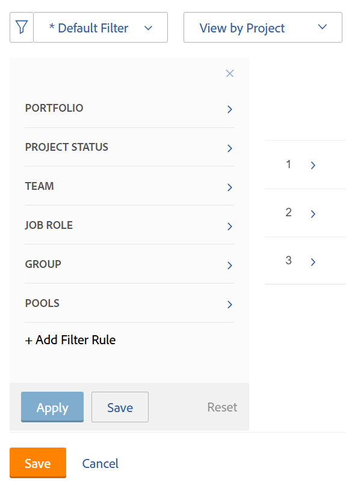

# Filtrera information i resursplaneraren

<!--

(AL:*Iterate on this article: filtering by custom data. Other enhancements? Special characters caveat might change - follow the story to know when. It originally came in Beta 3 17.3.)

-->

Med hjälp av filter kan du ändra vilken information som visas i resursplaneraren utifrån all information som lagras i systemet.

## Åtkomstkrav

Du måste ha följande:

<table style="table-layout:auto"> 
 <col> 
 <col> 
 <tbody> 
  <tr> 
   <td role="rowheader">Adobe Workfront-plan*</td> 
   <td> 
Pro och högre
 </td> 
  </tr> 
  <tr> 
   <td role="rowheader">Adobe Workfront-licens*</td> 
   <td> 
Granska eller högre<!--
      <MadCap:conditionalText data-mc-conditions="QuicksilverOrClassic.Draft mode">
        (this seems to be the case in NWE only, not classic. Waiting on Vazgen's response for this)
      </MadCap:conditionalText>
     -->
 </td> 
  </tr> 
  <tr> 
   <td role="rowheader">Konfigurationer på åtkomstnivå*</td> 
   <td> 
Visa eller öka åtkomst till projekt, användare och resurshantering 
 
<b>ANMÄRKNING</b>

Om du fortfarande inte har åtkomst frågar du Workfront-administratören om de anger ytterligare begränsningar för din åtkomstnivå. Mer information om hur en Workfront-administratör kan ändra åtkomstnivån finns i <a href="../../administration-and-setup/add-users/configure-and-grant-access/create-modify-access-levels.md" class="MCXref xref">Skapa eller ändra anpassade åtkomstnivåer</a>.
 </td>
</tr> 
  <tr> 
   <td role="rowheader">Objektbehörigheter</td> 
   <td> 
Visa behörigheter eller högre för projekt
 
Mer information om hur du begär ytterligare åtkomst finns i <a href="../../workfront-basics/grant-and-request-access-to-objects/request-access.md" class="MCXref xref">Begär åtkomst till objekt </a>.
 </td> 
  </tr> 
 </tbody> 
</table>

*Kontakta Workfront-administratören om du vill veta vilken plan, licenstyp eller åtkomst du har.

## Översikt över filter för resursplanering

För att minimera mängden information som visas i resursplaneraren tillhandahåller Adobe Workfront ett standardfilter med förkonfigurerade villkor. Mer information om standardfiltret finns i avsnittet [Översikt över standardfiltret i resursplaneraren](#overview-of-the-default-filter-in-the-resource-planner) i den här artikeln.

Du kan också skapa anpassade filter. Information om hur du anpassar filter i resursplaneraren finns i avsnittet [Skapa resursplaneringsfilter](#create-resource-planner-filters) i den här artikeln.

Tänk på följande när du använder filter i resursplaneraren:

* De filter du skapar är bara synliga för dig. Du kan dela filter för att göra dem tillgängliga för andra användare.
* Som Workfront-administratör kan du bara se filter som du skapar eller som delas med dig.
* De filtrerade resultaten ändras inte när du väljer en annan vy för resursplaneraren.\
  Mer information om hur du ändrar vyn i resursplaneraren finns i avsnittet Projekt/roll/användarvy i navigeringsöversikten för [Resursplanering](../../resource-mgmt/resource-planning/resource-planner-navigation.md).

* När du använder ett filter ändras inte allokerings- och tillgänglighetsdata i resursplaneraren för projekt, roller eller användare. Ett filter ändrar bara antalet objekt som visas i resursplaneraren.
* Filtreringen gäller för alla objekt som visas i resursplaneraren samtidigt. Om du till exempel filtrerar efter en viss användare visas endast följande resultat i resursplaneraren:

   * Projekt där den användaren är en del av resurspoolen (för projekt- och rollvyerna) eller har en tilldelning i projektet (för användarvyn)
   * Roller som är associerade med användaren i dessa projekt\
     Andra roller eller användare i de projekt som användaren är kopplad till visas inte.

## Översikt över standardfiltret i resursplaneraren {#overview-of-the-default-filter-in-the-resource-planner}

När du öppnar resursplaneraren för första gången använder Workfront standardfiltret. Du kan redigera standardfiltret för att filtrera efter endast de objekt som du vill visa. Mer information om hur du ändrar filter finns i avsnittet [Redigera ett filter i resursplaneraren](#edit-a-filter-in-the-resource-planner) i den här artikeln.

Tänk på följande när du använder standardfiltret:

* Standardfiltret hämtar endast information från projekt med följande:

   * Ett planerat slutförandedatum som infaller efter det första datumet i den aktuella månaden
   * Ett planerat startdatum som infaller före den sista dagen i den fjärde månaden från dagens datum
   * Status för aktuell eller planerad

  >[!IMPORTANT]
  >
  >Standardfiltret hämtar information från projekt som alltid inträffar inom fyra månader från och med den första dagen i den aktuella månaden, oavsett vilken tidsram du väljer för visningen i resursplaneraren.

* I användarvyn visas alla användare i systemet, men endast de användare som är associerade med de filtrerade projekten visar timinformation.
* Du kan redigera informationen i standardfiltret utan att spara filtret.
* Du kan duplicera och redigera en kopia av standardfiltret, ändra önskade villkor i det och sedan spara det som ett nytt filter.
* Du kan inte ta bort eller dela standardfiltret.

  

## Skapa resursplaneringsfilter {#create-resource-planner-filters}

<!--

(Alina: **^ This section is somewhat duplicated (format more than content) from the "Filtering Utilization Information" section in "Viewing Utilization Information for Projects, Programs, and Portfolios.")

-->

Att skapa ett filter i resursplaneraren är identiskt för alla vyer.

Kontrollera att förutsättningarna för att visa rätt information i resursplaneraren finns innan du skapar ett filter.\
Information om hur du uppfyller de nödvändiga kraven för att arbeta med resursplaneraren finns i avsnittet Krav för att arbeta i resursplaneraren i artikeln [Resursplaneringsöversikt](../../resource-mgmt/resource-planning/get-started-resource-planner.md).

Tänk på följande när du skapar ett filter:

* Det finns ingen gräns för hur många objekt du kan filtrera efter samtidigt.
* De tillgängliga fälten som du kan lägga till i en filterändring beroende på vilket objekt i vyn som du använder i resursplaneraren. Du kan till exempel bara filtrera fälten Problem och Aktivitet i användarvyn eftersom dessa objekt bara visas i användarvyn. Om du skapar ett filter för Problem eller Uppgifter i användarvyn och sedan tillämpar det på projekt- eller rollvyerna, ignoreras det eftersom fälten inte finns i projekt- eller rollvyerna. I så fall är filtret inte tillgängligt.

Så här skapar du ett filter i resursplaneraren:

1. Klicka på ikonen **Huvudmeny**  i det övre högra hörnet av Adobe Workfront.

1. Klicka på **Resurs**.

   **Planeraren** visas som standard.

   Första gången du öppnar resursplaneraren används som standard <strong>standardfiltret</strong>. Mer information om standardfiltret finns i avsnittet <a href="#overview-of-the-default-filter-in-the-resource-planner" class="MCXref xref">Översikt över standardfiltret i resursplaneraren</a> i den här artikeln.

1. Klicka på ikonen **Filter** i det övre vänstra hörnet av .\
   \
   eller\
   Expandera listrutan **Filter** och klicka på **Lägg till nytt filter**.\
   

1. Om du vill skapa ett filter med hjälp av de inbyggda villkoren anger du något av följande fält:

   * **Portfolio**: Börja skriva namnet på portföljen som innehåller den information du vill inkludera i resursplaneraren och klicka sedan på namnet när den visas i listan.\
     Upprepa den här processen om du vill inkludera information från flera portföljer.

   * **Projektstatus**: Expandera den nedrullningsbara menyn Projektstatus och välj en eller flera projektstatusar som är tillgängliga i listan.
   * **Team**: Börja skriva namnet på ett eller flera team som är associerade med användarna som är tilldelade till aktiviteter i de projekt som du vill visa.
   * **Jobbroll**: Börja skriva namnet på en eller flera jobbroller som är associerade med användare som är tilldelade till aktiviteter i de projekt som du vill visa.
   * **Pooler**: Börja skriva namnet på en eller flera resurspooler som är associerade med projekten (för projektvyn), användarna (för användarvyn) eller associerade med både projekten och användarna (för rollvyn) som du vill visa.
   * **Grupp**: Börja skriva namnet på en eller flera grupper som är associerade med användarna (i användarvyn) eller projekten (i projekt- och rollvyerna) som du vill visa.

1. Klicka på **Lägg till filterregel** och skriv sedan in fältnamnet som du vill filtrera efter i rutan **Typ för att filtrera objekt**. Om fältet är tillgängligt fylls det i för varje objekt där det kan kopplas.

   >[!IMPORTANT]
   >
   >När du refererar till anpassade fält måste du ange fältnamnet och inte fältetiketten. Fältetiketten visas i ett anpassat formulär som är kopplat till ett objekt. Mer information om skillnaden mellan etiketten och namnet på ett anpassat fält finns i [Designa ett formulär med formulärdesignern](/help/quicksilver/administration-and-setup/customize-workfront/create-manage-custom-forms/form-designer/design-a-form/design-a-form.md).

1. Klicka på fältets namn för att lägga till det i filtret när det visas i listan.\
   Mer information om fälten som visas i listan finns i [Ordlista för Adobe Workfront-terminologi](../../workfront-basics/navigate-workfront/workfront-navigation/workfront-terminology-glossary.md).

1. (Valfritt) Välj filter och villkorsmodifierare för filtret. De tillgängliga modifierarna beskrivs i [Filter- och villkorsmodifierare](../../reports-and-dashboards/reports/reporting-elements/filter-condition-modifiers.md).

   Du kan använda användarbaserade eller datumbaserade jokertecken för att filtrera efter information som är kopplad till den inloggade användaren.\
   Mer information om vilka jokertecken som stöds i filter finns i [Översikt över variabler för jokertecken](../../reports-and-dashboards/reports/reporting-elements/understand-wildcard-filter-variables.md).

1. Klicka på **Spara** för att spara filterregeln.
1. (Valfritt) Klicka på **Lägg till filterregel** om du vill lägga till en ny regel för ett annat objekt eller fält.
1. Klicka på **Använd** om du vill använda filtret utan att spara det.

   eller

   Klicka på **Spara filter** för att spara filtret.\
   

1. (Villkorligt) När du har klickat på **Spara** anger du ett namn för filtret i rutan **Filternamn** i dialogrutan **Spara filter** . Detta är ett obligatoriskt fält.\
   

   >[!NOTE]
   >
   >Om filternamnet innehåller specialtecken använder du endast följande tecken:
   >
   >* Komma
   >* Snedstreck
   >* Bindestreck
   >* Understreck

1. Klicka på **Spara**.

   Resultaten i resursplaneraren filtreras nu efter informationen som du angav i filterreglerna.

## Använda ett befintligt filter

När du eller någon med åtkomst till resursplaneraren sparar ett filter blir det tillgängligt för alla som använder resursplaneraren.

Så här använder du ett befintligt filter:

1. Gå till Resursplaneraren.
1. Expandera listrutan **Filter** i det övre vänstra hörnet.

   I den här menyn kan du se filter som du har skapat eller andra som delats med dig.\
   

1. Välj ett filter i listrutan. Du kan se filter som du eller andra användare har skapat på den här menyn.\
   När du väljer ett filter minskar det automatiskt mängden information som visas i resursplaneraren.

## Redigera ett filter i Resursplanering {#edit-a-filter-in-the-resource-planner}

Du kan redigera ett filter i resursplaneraren på något av följande sätt:

* [Byt namn på ett filter](#rename-a-filter)
* [Redigera informationen i ett filter](#edit-the-information-in-a-filter)
* [Duplicera ett filter](#duplicate-a-filter)

När du redigerar ett filter uppdateras det för alla användare i systemet som har tillgång till resursplaneraren.

### Byta namn på ett filter {#rename-a-filter}

Du kan ändra namnet på ett filter utan att ändra villkoren för det. Vi rekommenderar att du informerar andra användare i systemet om den här ändringen eftersom filter är synliga för andra användare. Den här ändringen påverkar listorna med filter för alla som kan se resursplaneraren.

1. Gå till resursplaneraren och expandera listrutan **Filter** för att välja ett sparat filter.
1. Expandera den nedrullningsbara menyn **Filter**. Leta reda på filtret som du vill byta namn på och hovra över namnet.
1. Välj ikonen **Byt namn på filter** bredvid filtrets namn.

   

1. Ange ett nytt namn för filtret i rutan **Filternamn**.
1. Klicka på **Spara**.\
   Informationen i filtret är densamma och namnet uppdateras.

### Redigera informationen i ett filter {#edit-the-information-in-a-filter}

Du kan ändra den information som du inkluderar i ett filter utan att ändra dess namn. Vi rekommenderar att du informerar andra användare i systemet om den här ändringen eftersom filter är synliga för dem. Den här ändringen påverkar listorna med filter för alla som kan se resursplaneraren.

1. Gå till resursplaneraren och expandera listrutan **Filter** i det övre vänstra hörnet.
1. Markera ett befintligt filter som du vill redigera.
1. Klicka på ikonen **Filter** .\
   

1. Lägg till nya fält i filtret.\
   Mer information om hur du skapar filter finns i [Skapa resursplaneringsfilter](#create-resource-planner-filters).

1. Håll pekaren över de fält som är markerade för filtret och klicka på ikonen **Redigera** om du vill markera ett annat fält eller på ikonen **Ta bort** om du vill ta bort fältet.\
   

1. (Valfritt) Klicka på **Lägg till filterregel** för att lägga till nya fält i filtret.\
   Mer information om hur du definierar filtervillkor finns i [Skapa resursplaneringsfilter](#create-resource-planner-filters).

1. Klicka på **Använd** om du vill använda filtret utan att spara det.

   eller

   Klicka på **Spara** för att spara filtret.\
   Filtret sparas med samma namn men med nya filtervillkor.

### Duplicera ett filter {#duplicate-a-filter}

Du kan duplicera ett befintligt filter. De ursprungliga filtervillkoren är desamma i det duplicerade filtret och du kan spara det nya filtret med ett nytt namn.

1. Gå till resursplaneraren och expandera listrutan **Filter** i det övre vänstra hörnet.
1. Håll pekaren över namnet på ett sparat filter som du vill duplicera.
1. Klicka på ikonen **Duplicera** .

   \
   Rutan Duplicera filter visas.

1. I fältet **Filternamn** anger du ett nytt namn för det duplicerade filtret.\
   Standardnamnet för det nya filtret är *`<Original Filter Name>`(kopia)*.

1. Klicka på **Spara**. Ett nytt filter skapas med samma villkor som det ursprungliga filtret och med ett nytt namn.

   >[!NOTE]
   >
   >Även om du kan ha två filter med samma namn och med identiska villkor rekommenderar vi att du sparar filter med unika filtervillkor och namn i resursplaneraren för att undvika förvirring.

## Ta bort ett filter

Du kan ta bort ett filter när det inte längre behövs. Du kan inte ta bort standardfiltret.

Mer information om standardfiltret finns i [Översikt över standardfiltret i avsnittet Resursplanering](#overview-of-the-default-filter-in-the-resource-planner) i den här artikeln.

När du tar bort ett filter tas filtret bort för alla Workfront-användare som har tillgång till resursplaneraren. Innan du tar bort det kontrollerar du att det filter du vill ta bort inte längre används av någon annan som arbetar i resursplaneraren. Ett borttaget filter kan inte återskapas.

Ta bort ett filter:

1. Gå till Resursplaneraren.
1. Expandera den nedrullningsbara menyn **Filter**.
1. Leta reda på filtret som du vill ta bort och hovra över namnet.
1. Markera ikonen **Ta bort filter** bredvid filtrets namn.

   

1. Klicka på **Ta bort** i dialogrutan **Ta bort filter**.

1. Filtret tas bort från resursplaneraren.

## Dela ett filter

Du kan dela ett filter som du har skapat eller som du har åtkomst till att dela med andra användare. Du kan inte dela standardfiltret, men du kan duplicera det och dela kopian.

>[!NOTE]
>
>Alla användare, inklusive Workfront-administratörer, har bara åtkomst till filter som de har skapat eller som har delats med dem. Du kan dela ett filter med specifika användare för att göra ett filter tillgängligt för alla resursplaneringsanvändare.

Mer information om standardfiltret finns i [Översikt över standardfiltret i avsnittet Resursplanering](#overview-of-the-default-filter-in-the-resource-planner) i den här artikeln.

Mer information om att duplicera filter finns i avsnittet [Duplicera ett filter](#duplicate-a-filter) i den här artikeln.

1. Gå till Resursplaneraren.
1. Expandera den nedrullningsbara menyn **Filter**.
1. Leta reda på filtret som du vill dela och hovra över namnet.
1. Välj ikonen **Dela filter** bredvid filtrets namn.

   

   Dialogrutan Filteråtkomst visas.

1. (Valfritt) Om du vill göra filtret tillgängligt för alla resursplaneringsanvändare klickar du på ikonen **Inställningar** och väljer sedan **Gör det synligt i hela systemet**.

   

1. I rutan **Ge resursplaneringsfiltret åtkomst till:** börjar du skriva namnen på de användare, team, roller, grupper eller företag som du vill dela filtret med.
1. Välj bland följande behörighetsnivåer:

   * Visa
   * Hantera

     Mer information om behörigheter i Workfront finns i [Översikt över delningsbehörigheter för objekt](../../workfront-basics/grant-and-request-access-to-objects/sharing-permissions-on-objects-overview.md)

1. (Valfritt) Klicka på **Avancerade inställningar** om du vill lägga till behörigheter för varje nivå genom att markera dem eller ta bort behörigheter för varje nivå genom att avmarkera dem.

   

1. Klicka på **Spara**.

   Filtret delas med de enheter som du har markerat och visas i området **Delat med mig**.

   
