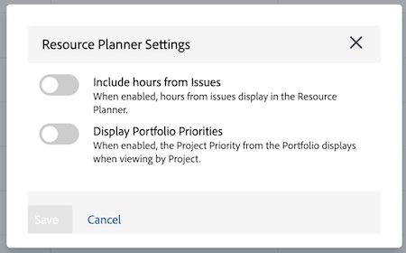

# Översikt över navigering i resursplanering

<!-- Audited: 5/2025 -->

Adobe Workfront Resource Planner hjälper dig att enkelt förstå tillgängligheten och den tid som behövs för att slutföra arbetet i dina projekt. Du kan sedan hantera tilldelningen av dina användare och deras jobbroller i de projekt de har tilldelats.

>[!TIP]
>
>Du kan inte hantera grupptilldelningen för de uppgifter som de har tilldelats i resursplaneraren.

Du måste uppfylla kraven för att kunna använda resursplaneraren fullt ut. Mer information om resursplaneraren finns i [Översikt över resursplaneraren](../../resource-mgmt/resource-planning/get-started-resource-planner.md).

I följande avsnitt beskrivs alla områden i resursplaneraren.

## Tidslinje för projekt

Använd kalendern högst upp i resursplaneraren för att navigera på tidslinjen för de projekt som du visar. Tidslinjen börjar som standard med dagens månad.

Mer information om hur du ändrar tidsramen för tidslinjen som du visar i resursplaneraren finns i avsnittet [Val av tidsram](#timeframe-selection) i den här artikeln.

## Val av tidsram  {#timeframe-selection}

Resursplaneraren visar som standard resursinformation i 3 eller 4 månader i taget, med början den aktuella månaden. Hur många tidsperioder som visas beror på skärmens bredd.

>[!TIP]
>
>Du kan inte visa mer än fyra tidsperioder i taget i resursplaneraren.

Navigera i tidslinjen genom att klicka på bakåt- och framåtpilarna för att gå bakåt och framåt på tidslinjen. Du kan sedan välja mellan följande datumintervallalternativ i Resursplanering genom att klicka på lämpliga knappar:

<table style="table-layout:auto"> 
    <col> 
    <col> 
    <tbody> 
     <tr> 
      <td role="rowheader">Vecka</td> 
      <td>Visar information per vecka. Antalet veckor visas bredvid datumen i kolumnrubriken. </td> 
     </tr> 
     <tr> 
      <td role="rowheader">Månad</td> 
      <td> Visar information per månad.</td> 
     </tr> 
     <tr> 
      <td role="rowheader">Kvartal</td> 
      <td>Visar information per kvartal. Numret på kvartalet visas bredvid datumen i kolumnrubriken. Anpassade kvartal visas inte i resursplaneraren. </td> 
     </tr> 
     <tr> 
      <td role="rowheader">Idag</td> 
      <td>Återgår till dagens månad, vecka eller kvartal.</td> 
     </tr> 
    </tbody> 
   </table>

## Projekt/roll/Val av användarvy

Du kan ändra vyn i resursplaneraren beroende på hur du vill att informationen ska visas.

Resursplaneraren visas som standard i användarvyn. Du kan ändra vyn till projekt- eller rollvyer. När du ändrar den till en annan vy blir ditt val standardvy.

När du ändrar vyn ändras även följande information:

* Objekthierarkin (information i rader i resursplaneraren).
* Information om timallokering (information i kolumnerna i resursplaneraren).

  Mer information om vad kolumnerna visas i resursplaneraren, beroende på vilken vy du väljer, finns i [Granska resurstillgänglighet och allokering med Adobe Workfront resursplanerare](../../resource-mgmt/resource-planning/resource-availability-allocation-resource-planner.md).

För att kunna visa korrekt information i resursplaneraren måste du uppfylla en uppsättning krav. Mer information om förutsättningarna finns i Förutsättningar för arbete i avsnittet Resursplanering i artikeln [Resursplaneringsöversikt](../../resource-mgmt/resource-planning/get-started-resource-planner.md) .

Om du vill ändra vyn i resursplaneraren väljer du en av följande vyer i listrutan Visa efter:

* [Visa efter projekt](#view-by-project)
* [Visa efter roll](#view-by-role)
* [Visa efter användare](#view-by-user)

### Visa efter projekt {#view-by-project}

Tänk på följande när du väljer projektvyn i resursplaneraren:

* Du kan se projekt som du har behörighet att visa.
* När du öppnar resursplaneraren för första gången kan du se projekt som filtreras med standardfiltret.\
  Mer information finns i [Filtrera information i resursplaneraren](../../resource-mgmt/resource-planning/filter-resource-planner.md).

* Antalet objekt som du visar eller kan exportera från projektvyn är begränsat för att förbättra prestandan.\
  Mer information finns i avsnittet Begränsningar i projektvyn i artikeln [Resursplaneringsbegränsningar](../../resource-mgmt/resource-planning/resource-planner-display-limitations.md) .

* Projekten listas i den ordning de har i projektvyn.\
  Mer information finns i avsnittet [Projektplaneringsprioritet](#project-planning-priority) i den här artikeln.

* När du expanderar varje projekt kan du visa de jobbroller som är kopplade till det.

* När du expanderar varje roll kan du visa användare som är kopplade till den. Rulla för att läsa in fler roller och användare under varje projekt.

* När den här vyn används lägger rolltimmarna, FTE eller Kostnaden till högst projekttimmarna, FTE eller Kostnad.

* Du kan visa följande timma-, FTE- eller kostnadsinformation i projektvyn:

   * Tillgänglig
   * Planerad
   * Budgeterad
   * Varians
   * Net

     Mer information finns i [Budgetresurser i resursplaneraren med projekt- och rollvyerna](../../resource-mgmt/resource-planning/budget-resources-project-role-views-resource-planner.md).

### Visa efter roll {#view-by-role}

Tänk på följande när du väljer rollvyn i resursplaneraren:

* Du måste ha minst behörigheten Visa åtkomst till resurshantering och visa behörigheter för projekt för att kunna visa rollerna som är kopplade till dessa projekt.
* Du kan expandera varje roll för att visa en lista över projekt och varje projekt för att visa en lista över användare som kan uppfylla de rollerna i projekten.
* Antalet objekt som du visar eller kan exportera från rollvyn är begränsat, vilket förbättrar prestandan.\
  Mer information finns i Begränsningar i rollvyn i [Resursplaneringsbegränsningar](../../resource-mgmt/resource-planning/resource-planner-display-limitations.md).

* Projekten listas under jobbrollen i samma prioriteringsordning som de listas i projektvyn.
* När den här vyn används läggs projekttimmar, heltidsekvivalenter eller kostnad till upp till rolltimmarna, heltidsekvivalenten eller kostnaden.
* Du kan visa följande timma-, FTE- eller kostnadsinformation i rollvyn:

   * Tillgänglig
   * Planerad
   * Budgeterad
   * Varians
   * Net

     Mer information finns i [Budgetresurser i resursplaneraren med projekt- och rollvyerna](../../resource-mgmt/resource-planning/budget-resources-project-role-views-resource-planner.md).

### Visa efter användare {#view-by-user}

Du kan visa resursplaneraren i användarvyn för att förstå skillnaden mellan den planerade och tillgängliga timmar eller FTE för dina användare eller för att se hur många faktiska timmar de har loggat.

Du kan inte budgetera dina resurser när du använder användarvyn i resursplaneraren. Du måste budgetera dina resurser med projekt- eller rollvyerna och använda användarvyn för att granska användarnas allokering och tillgänglighet i relation till det planerade arbetet.

Användarvyn är standardvyn för resursplaneraren.

Tänk på följande när du väljer användarvyn i resursplaneraren:

* Du kan se alla användare som du har behörighet att visa, upp till 2 000 användare, som är aktiva och har loggat in på Adobe Workfront minst en gång. Filtrera användarlistan efter team, jobbroll eller pooler för att visa användare som bara är associerade med dessa entiteter.
* Om du har filtrerat listan över användare efter projekt kan bara de användare som är kopplade till de filtrerade projekten expanderas och visa timinformation.\
  Mer information finns i [Filtrera information i resursplaneraren](../../resource-mgmt/resource-planning/filter-resource-planner.md).

* Antalet objekt som du visar eller kan exportera från användarvyn är begränsat för att förbättra prestandan.\
  Mer information finns i avsnittet Begränsningar i användarvyn i [Resursplaneringsbegränsningar](../../resource-mgmt/resource-planning/resource-planner-display-limitations.md) .

* Projekten listas under användarens namn i samma prioritetsordning som de listas i projektvyn.\
  Mer information finns i avsnittet [Projektplaneringsprioritet](#project-planning-priority) i den här artikeln.

* Om användare inte har någon jobbroll kopplad till sig, visas timarna eller FTE-värdena under avsnittet Ingen roll.
* När den här vyn används läggs projekttimmar eller FTE till i användar- eller FTE-tider.

  >[!TIP]
  >
  >Du kan inte visa allokeringen och tillgängligheten för användarna per kostnad i användarvyn.

* Dina projekt- och uppgiftsbehörigheter avgör vad som visas under namnen på de användare som visas i användarvyn.

  Följande scenarier finns:

   * Om du inte har behörighet att visa projekt och de uppgifter eller problem som är tilldelade användarna visas i resursplaneraren, visas dessa objekt i avsnittet Ej tillgängliga objekt. I det här fallet ersätter de här avsnitten projekt- och aktivitetsavsnitten.

   * När du inte har behörighet att visa projekten, men du har tillgång till uppgifterna eller problemen i projekten, listas projekten, aktiviteterna och problemen under namnen på de användare som tilldelats dem.
   * När du har behörighet att visa projekten, men inte några uppgifter eller problem i projekten, visas projektnamnet och aktiviteterna och problemen listas under Ej tillgängliga objekt.

     Mer information finns i [Översikt över delningsbehörigheter för objekt](../../workfront-basics/grant-and-request-access-to-objects/sharing-permissions-on-objects-overview.md).

* Du kan visa följande timma- och FTE-information i användarvyn:

   * Tillgänglig
   * Planerad
   * Faktisk
   * Skillnad mellan planerad och faktisk
   * Procentandel av planerad allokering

     Mer information finns i [Visa tillgängliga, planerade och faktiska timmar eller FTE i resursplaneraren när du använder användarvyn](../../resource-mgmt/resource-planning/view-hours-fte-user-view-resource-planner.md)

## Projektnamn

Följande projekt visas i resursplaneraren:

* Projekt som du har behörighet att visa. Du måste även ha åtkomst till Visa resurshantering på din åtkomstnivå.

  Mer information finns i [Åtkomst krävs för att budgetera resurser i Adobe Workfront](../../resource-mgmt/resource-planning/access-needed-to-budget-resources.md).

* Projekt som begränsas av filtret som används i resursplaneraren.

  Mer information finns i [Filtrera information i resursplaneraren](../../resource-mgmt/resource-planning/filter-resource-planner.md).

  >[!NOTE]
  >
  >Vi rekommenderar att du använder filter för att minska antalet projekt som visas i resursplaneraren.

## Projektplaneringsprioritet {#project-planning-priority}

Projekt listas i prioritetsordning i resursplaneraren med det viktigaste projektet överst. Prioriteten anges med ett nummer framför projektnamnet.

Du kan även aktivera en inställning för att visa projektprioriteter utifrån deras portföljer när de är kopplade till en portfölj. Mer information finns i [Prioritera projekt i resursplaneraren](../../resource-mgmt/resource-planning/prioritize-projects-resource-planner.md).

## Namn på jobbroll

Följande kategorier av jobbroller visas i resursplaneraren:

* Jobbrollerna som är tilldelade till uppgifter.
* De jobbroller som inte har tilldelats aktiviteter, men som är de primära jobbrollerna för användarna som är kopplade till projektens resurspooler.
* De sekundära jobbrollerna för användare som är tilldelade till uppgifter i de jobbrollerna.
* De sekundära jobbrollerna för användare som har en giltig procentandel FTE-tillgänglighet i sin profil.\
  Mer information om procentandelen FTE-tillgänglighet för jobbroller finns i [Redigera en användares profil](../../administration-and-setup/add-users/create-and-manage-users/edit-a-users-profile.md).

>[!NOTE]
>
>Jobbroller som tilldelats till ärenden listas också när inställningen Inkludera timmar från ärende är aktiverad. Mer information om hur du aktiverar problemtimmar i resursplaneraren finns i avsnittet [Inställningar](#settings).

## Användarnamn

De användare som visas i projekt- och rollvyerna i resursplaneraren tillhör de resurspooler som är associerade med projekten.\
Mer information finns i [Associera resurspooler med användare](../../resource-mgmt/resource-planning/resource-pools/associate-resource-pools-with-users.md).

Alla användare som du har åtkomst till Visa och som har loggat in på Workfront minst en gång visas i användarvyn.

I projekt- och rollvyerna kan användare visas i listan under följande typer av jobbroller:

* Deras primära arbetsroll
* Deras sekundära jobbroll i följande scenarier:

   * Om den sekundära jobbrollen har ett giltigt nummer för procentandelen FTE-tillgänglighet i sin användarprofil.
   * Om användaren är tilldelad aktiviteter i dessa roller.

Mer information om procentandelen FTE-tillgänglighet för en jobbroll finns i [Redigera en användares profil](../../administration-and-setup/add-users/create-and-manage-users/edit-a-users-profile.md) .

## Inga roller och inga användaravsnitt

### Inget rollavsnitt  {#no-role-section}

När en användare tillhör en resurspool som är associerad med ett projekt, men inte har någon jobbroll associerad med dem, visas de i avsnittet Ingen roll i stället för under en specifik jobbroll.

Du kan inte budgetera timmar för en användare i ett Ingen roll-avsnitt. Användaren måste ha minst en associerad jobbroll för att kunna budgeteras för arbete.

### Inget användaravsnitt  {#no-user-section}

När du tilldelar en uppgift till ett team, eller låter den vara otilldelad, visas Planerade timmar under avsnittet Ingen användare, som visas under Ingen roll i Resursplaneraren. Dessa uppgifter visas inte i resursplaneraren när du använder vyn Visa efter användare.

Du kan se antalet planerade timmar som tilldelats aktiviteter i projektet i avsnittet Ingen användare i resursplaneraren, men du kan inte budgetera för dessa allokeringar.

## Filter

Med filter kan du begränsa den information som visas i resursplaneraren.

Mer information om filtrering i resursplaneraren finns i [Filtrera information i resursplaneraren](../../resource-mgmt/resource-planning/filter-resource-planner.md) .

## Inställningar {#settings}

I området Inställningar kan du aktivera eller inaktivera alternativ för att visa eller dölja information i resursplaneraren. Om du vill öppna dialogrutan Resursplaneringsinställningar klickar du på ikonen Inställningar i det övre högra hörnet på sidan.

Här kan du aktivera en eller båda av följande inställningar:

* **Inkludera timmar från problem**: Här visas planerade timmar från problem.

  Tänk på följande när du aktiverar den här inställningen:

   * Namnet på den användare som är tilldelad problemen visas under den jobbroll som är associerad med dem i utgåvan. Du kan ange budgeterade timmar för användaren och jobbrollen i projekt- och rollvyerna.
   * De problem som användarna tilldelas visas under namnen på jobbrollerna i användarvyn.

     >[!IMPORTANT]
     >
     >När de planerade start- och slutförandedatumen för utgåvan ligger utanför tidslinjen för projektet visas de planerade timmarna för utgåvan enligt datumet för utgåvan. Om projekttidslinjen till exempel är mellan januari och mars, men tidslinjen för problemen är i augusti, visas de planerade timmarna för utgåvorna under tidsperioden i augusti.

* **Visa Portfolio-prioriteringar**: Visar projektprioriteter enligt den Portfolio som de har tilldelats.

  Mer information om hur du prioriterar projekt i resursplaneraren finns i [Prioritera projekt i resursplaneraren](../../resource-mgmt/resource-planning/prioritize-projects-resource-planner.md).

  

## Helskärmsläge

Du kan visa resursplaneraren i helskärmsläge för att förstora mängden information som du kan visa på skärmen. Det här alternativet är tillgängligt för alla vyer.

Om du vill visa resursplaneraren i helskärmsläge klickar du på ikonen Helskärm i det övre högra hörnet på sidan.

När skärmen har expanderats kan du klicka på ikonen Stäng helskärm för att återgå till den tidigare visningen.

## Exportalternativ

Du kan exportera information till en Excel-fil (.xlsx) från valfri vy i resursplaneraren.

Mer information om att exportera information från resursplaneraren finns i [Exportera information från resursplaneraren](../../resource-mgmt/resource-planning/export-resource-planner.md).

Du kan hantera mängden information och visningen av den exporterade filen.

Mer information om vilken information du kan exportera från resursplaneraren och hur du hanterar utseendet på den exporterade filen finns i [Visningsbegränsningar för resursplanering](../../resource-mgmt/resource-planning/resource-planner-display-limitations.md).
