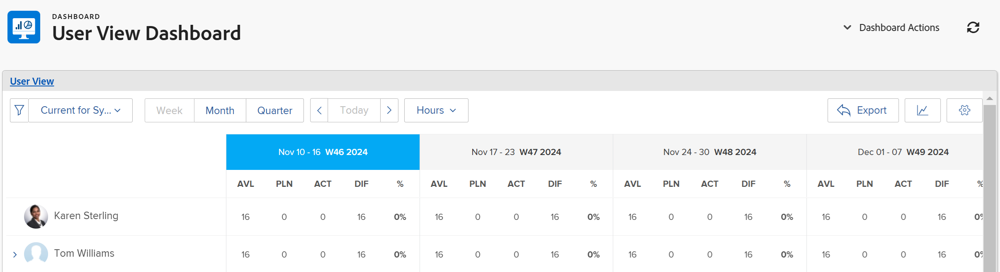

# Dela vyn Resursplaneringsanvändare med en länk

Adobe Workfront kan generera en unik URL för användarvyn i resursplaneraren som du kan bädda in som en extern sida på en kontrollpanel, eller öppna separat på en ny flik i webbläsaren. Detta är praktiskt när du delar resursplaneringsinformation med användare som kanske inte har direkt åtkomst till resursområdet.

## Åtkomstkrav

+++ Expandera om du vill visa åtkomstkrav för funktionerna i den här artikeln.

Du måste ha följande åtkomst för att kunna utföra stegen i den här artikeln:

<table style="table-layout:auto"> 
 <col> 
 <col> 
 <tbody> 
  <tr> 
   <td role="rowheader">Adobe Workfront</td> 
    <td>
Nytt: Alla

       
eller

       
Aktuell: Pro eller högre
 </td> 
  </tr> 
  <tr> 
   <td role="rowheader">Adobe Workfront-licens</td> 
   <td>
Nytt: Standard

       
eller

       
Aktuell: Planera
</td> 
  </tr> 
  <tr> 
   <td role="rowheader">Konfigurationer på åtkomstnivå</td> 
   <td> 
Visa eller ge senare åtkomst till resurshantering, projekt och användare
 
Visa åtkomst till finansiella data för att visa kostnadsinformation
</td> 
  </tr> 
  <tr> 
   <td role="rowheader">Objektbehörigheter</td> 
   <td> 
Visa eller högre behörigheter för de projekt som du vill visa i resursplaneraren
</td> 
  </tr> 
 </tbody> 
</table>

Mer information om informationen i den här tabellen finns i [Åtkomstkrav i Workfront-dokumentationen](/help/quicksilver/administration-and-setup/add-users/access-levels-and-object-permissions/access-level-requirements-in-documentation.md).

+++

Tänk på följande när du genererar den unika URL:en för användarvyn i resursplaneraren:

* Du kan bara hämta en unik URL-adress för användarvyn. Alternativet att generera URL:en finns inte i projekt- eller rollvyerna.
* Du kan dela URL-adressen med andra användare, inklusive användare med arbets- och granskningsbehörighet.\
  De måste ha tillgång till andra användare för att kunna visa informationen i resursplaneraren från den URL som du delar med dem.
* Följande information sparas när du delar URL-adressen med andra användare:

   * Typ av tidsperioder (vecka, månad, kvartal).
   * De filter som du använder.
   * Typ av visning (timmar eller FTE).

Så här får du en unik URL-adress i användarvyn för resursplaneraren och delar den med andra användare:

{{step1-to-resourcing}}

1. Välj **Visa efter användare**.
1. (Valfritt) Välj den tidsram inom vilken du vill visa informationen i resursplaneraren. Välj bland följande:

   * Vecka
   * Månad
   * Kvartal

1. (Valfritt) Välj om du vill visa informationen med **FTE** eller **Timmar**.\
   

1. (Valfritt) Använd filter i resursplaneraren.\
   Mer information om hur du använder filter finns i [Filterinformation i resursplaneraren](../../resource-mgmt/resource-planning/filter-resource-planner.md) .

1. Klicka på ikonen **hyperlänk** .\
   

1. Klicka på **Kopiera URL**.\
   Detta kopierar den unika URL:en för resursplaneraren i användarvyn till Urklipp.

1. (Valfritt) Gör något av följande:  

   * Klistra in URL:en i ett annat program för att skicka den till en annan användare.\
     Användaren måste vara inloggad på Workfront för att kunna visa resursplaneraren i användarvyn.
   * Öppna en ny flik eller ett nytt fönster i webbläsaren och klistra in länken som du kopierade. Klicka sedan på Enter på tangentbordet för att öppna resursplaneraren på en ny flik eller i ett nytt fönster.
   * Gör följande:

     <!--   
     <MadCap:conditionalText data-mc-conditions="QuicksilverOrClassic.Draft mode">   
     (NOTE:&nbsp;turn this into a numbered list)   
     </MadCap:conditionalText>   
     -->

      1. Gå till **Rapportering**>**Kontrollpaneler**>**Ny instrumentpanel**>**Lägg till extern sida.**

      1. Klistra in länken som du kopierade till Urklipp i fältet **URL** .
      1. Klicka på **Spara** och sedan på **Spara + stäng**.\
         Detta bäddar in URL-adressen i kontrollpanelen och användarvyn för resursplaneraren visas på en separat kontrollpanel.

1. (Valfritt) Om du bäddar in URL-adressen i en kontrollpanel kan du lägga till den i en layoutmall eller dela den med andra användare som kanske inte har tillgång till resurshanteringsområdet.\
   Mer information om hur du lägger till kontrollpaneler i en layoutmall finns i [Skapa och hantera layoutmallar](../../administration-and-setup/customize-workfront/use-layout-templates/create-and-manage-layout-templates.md) .\
   Mer information om att dela instrumentpaneler finns i [Dela en instrumentpanel](../../reports-and-dashboards/dashboards/creating-and-managing-dashboards/share-dashboard.md) .\
   När du visar den delade URL:en kan användarna se informationen med de inställningar som du ursprungligen tillämpade på resursplaneraren. De måste vara inloggade på Workfront för att kunna visa den delade URL:en.\
   
