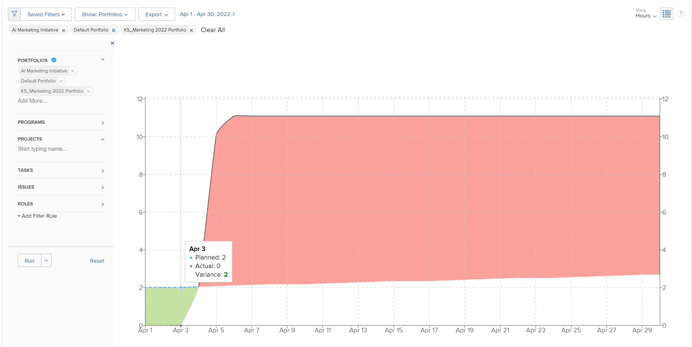

# Visa information om resursutnyttjande {#view-resource-utilization-information}

>[!CONTEXTUALHELP]
>id="wf-resourcing-utilization"
>title="Användningsrapport"
>abstract="Med användningsrapporten kan du visa förloppet, kostnaden eller intäkterna för ett projekt, program eller en portfölj i en enda rapport. Du kan också jämföra intäkter med kostnad."

<!-- Audited: 01/2024 -->

<!--

(NOTE:&nbsp;this is linked to the UI from the Utilization report. ALWAYS keep this information. DO NOT DELETE!!)

-->

Du kan visa hur dina resurser används i användningsrapporten.

<!--

(NOTE: Vazgen's response about these hours ie below and he asked us to NOT document them:

It queries Assignments first to get the tasks, issues, projects to display in the view. And then from those gets the hours.

In some cases, like for Planned Hours, it takes them from Assignments

But Budgeted Hours come from projects.

And Actual Hours are their own object - Hour)

-->

<!--

This report displays information about the assignments on work items for projects in your environment, like Planned, Actual, and Budgeted Hours, FTE, or Cost.&nbsp;These are hours,&nbsp;FTE, or costs associated with the assignments and not with the tasks and issues themselves.(PRIVATE NOTE:&nbsp;Vazgen's response about these hours: It queries Assignments first to get the tasks, issues, projects to display in the view. And then from those gets the hours. In some cases, like for Planned Hours, it takes them from Assignments; But Budgeted Hours come from projects. And Actual Hours are their own object - Hour.)

-->

## Åtkomstkrav

+++ Expandera om du vill visa åtkomstkrav för funktionerna i den här artikeln.

Du måste ha följande för att få tillgång till användningsrapporten:

<table style="table-layout:auto"> 
 <col> 
 <col> 
 <tbody> 
  <tr> 
   <td role="rowheader">Adobe Workfront</td> 
   <td>
Nytt: Alla

       
eller

       
Aktuell: Pro eller högre
 </td> 
  </tr> 
  <tr> 
   <td role="rowheader">Adobe Workfront-licens</td> 
   <td>
Nytt: Standard

       
eller

       
Aktuell: Planera
 </td> 
  </tr> 
  <tr> 
   <td role="rowheader">Konfigurationer på åtkomstnivå</td> 
   <td> 
Visa eller öka åtkomsten till följande:
 
    <ul> 
     <li> 
Resurshantering 
 </li> 
     <li> 
Projekt
 </li> 
     <li> 
Portföljer
 </li> 
     <li> 
Program
 </li> 
     <li> 
Finansiella data, om du vill visa information efter kostnad
 </li> 
    </ul> </td> 
  </tr> 
  <tr> 
   <td role="rowheader">Objektbehörigheter</td> 
   <td> 
Visa åtkomst till projekt, portföljer och program för att komma åt användningssektionen i resursområdet
 
  
 
Hantera åtkomst till ett projekt för att få åtkomst till projektdelen Använda
 
  </td> 
  </tr> 
 </tbody> 
</table>

Mer information om informationen i den här tabellen finns i [Åtkomstkrav i Workfront-dokumentationen](/help/quicksilver/administration-and-setup/add-users/access-levels-and-object-permissions/access-level-requirements-in-documentation.md).

+++

<!--

You must have View access to the projects you want to view utilization information for as described in this section. If you are still unable to access this information, contact your Workfront administrator. (NOTE:&nbsp;replaced with above table)

-->

<!--

<h2>Prerequisites for accessing utilization information</h2>

(NOTE: drafted, replaced with above table)

To access utilization information as described in this section, ensure that the following conditions are met:

<ul>
<li>You have at least&nbsp;View access to the project, program, or portfolio for which you want to view the utilization information.</li>
<li>Your Workfront administrator must grant you at least View access to&nbsp;Financial&nbsp;Data in your Access Level to be able to view cost and revenue information in the Utilization report. The Workfront administrator must enable both View Role Billing & Cost Rates as well as View User Billing &&nbsp;Cost Rates when they grant you the View access to Financial Data. For information about granting access to&nbsp;Financial&nbsp;Data, see <a href="../../administration-and-setup/add-users/configure-and-grant-access/grant-access-financial.md" class="MCXref xref">Grant access to financial data</a>. </li>
<li>

(NOTE:&nbsp;drafted. No longer the case.) 

The Utilization tab is included on any layout template that is assigned to you and that is applied to either the projects you view or to the Reporting area. 

The Utilization section is included on any layout template that is assigned to you and that is applied to either the projects you view or to the Resourcing area. 

</li>
<li>

The Utilization tab is available by default in the Reporting area if the system administrator has not assigned a custom layout template to you. 

The Utilization section is available by default in the Resourcing area if the system administrator has not assigned a custom layout template to you. 

</li>
</ul>

-->

## Översikt över användningsrapporten {#overview-of-the-utilization-report}

Med användningsrapporten kan du visa förloppet, kostnaden eller intäkterna för ett projekt, program eller en portfölj i en enda rapport. Du kan också jämföra intäkter med kostnad.

Du kan visa användningsrapporten i området Resurser om du vill visa användning för flera projekt, eller så kan du visa den på nivån för ett projekt, om du vill visa användning för de enskilda resurser (jobbroller och användare) som är associerade med projektet.

Mer information om hur du får åtkomst till och använder användningsrapporten finns i avsnittet [Spåra förlopp, kostnad och intäkter med användningsrapporten](#track-progress-cost-and-revenue-with-the-utilization-report) i den här artikeln.

### Spåra timmar (förlopp) {#track-hours-progress}

Du kan följa förloppet genom att visa hur budgeterade och planerade timmar jämförs med faktiska timmar.

När du håller reda på förloppet för ett projekt, program eller en portfölj inkluderas framsteg mot både uppgifter och problem i användningsrapporten.

Följande information finns i användningsrapporten när timmar spåras:

<table style="table-layout:auto"> 
 <col> 
 <col> 
 <thead> 
  <tr> 
   <th><strong>Kolumnrubrik vid visning av timmar</strong> </th> 
   <th><strong>Funktion</strong> </th> 
  </tr> 
 </thead> 
 <tbody> 
  <tr> 
   <td scope="col"><strong>Budgeterade timmar</strong> </td> 
   <td scope="col"> 
Det totala antalet budgeterade timmar för de inkluderade projekten. Du kan visa det totala antalet budgeterade timmar för den totala livslängden för de inkluderade projekten, eller så kan du visa det totala budgeterade timmarna endast för det angivna datumintervallet (du kan ange en enskild vecka eller månad). 
 
Budgeterade timmar fylls i från information som är tillgänglig i området Resursbudgetering i affärsärendet eller resursplaneraren <em>.</em>
 
Budgeterade timmar visas i användningsrapporten på någon av följande rader:
 
    <ul> 
     <li> Budgeterade timmar summeras efter jobbroll och av enskilda användare i utnyttjanderapporten enligt följande: <strong>Enskild användare:</strong> Budgeterade timmar summeras för varje användare i utnyttjanderapporten. Dessa budgeterade timmar är associerade med de uppgifter och utgåvor som användaren är tilldelad till i de inkluderade projekten. (Du kan expandera raden för motsvarande jobbroll om du vill visa en lista över användare med den jobbrollen.) <strong>Jobbroll:</strong> Budgeterade timmar summeras av jobbrollen i utnyttjanderapporten. Budgeterade timmar visas i en viss jobbroll som ett resultat av något av följande scenarier:
     <ul>
     <li>Jobbrollen definieras som den primära jobbrollen för användaren som är tilldelad uppgiften eller utleveransen där de budgeterade timmarna är associerade. </li> 
       <li>När du visar användningsinformation för ett enskilt projekt används jobbrollen för användaren som tilldelats timarna, oavsett om det inte finns någon tilldelning för uppgiften eller utgåvan, en annan användare tilldelas utan jobbrolltilldelning, en annan användare tilldelas med en annan jobbroll eller ett annat team tilldelas.</li> 
       <li>När du visar användningsinformation för flera projekt, program eller portföljer, används endast jobbrollen för användaren som tilldelats timmarna när rollen tilldelas för en aktivitet eller utgåva i ett projekt. </li> 
       <li>Jobbrollen tilldelas till uppgiften eller utgåvan som har associerade budgeterade timmar och användaren som är tilldelad uppgiften eller utgåvan har inte någon jobbroll definierad i systemet.</li> 
      </ul></li> 
    </ul> 
    <ul> 
     <li> 
<strong>Ej allokerade timmar</strong>: Budgeterade timmar visas i användningsrapporten i avsnittet Ej allokerade timmar när budgeterade timmar är associerade med en aktivitet eller utgåva och det inte finns någon användare eller roll tilldelad till uppgiften eller utgåvan. Det här avsnittet visas bara när det finns timmar i projektet som matchar den här beskrivningen och när du visar användningsrapporten från eller från ett projekt. 
 
Det här avsnittet visas bara när det finns timmar i projektet som matchar den här beskrivningen och när du visar användningsrapporten från eller från ett projekt. 
 </li> 
    </ul> 
Mer information om budgeterade timmar finns i <a href="/help/quicksilver/manage-work/projects/project-finances/budgeted-labor-cost.md#locate-the-budgeted-hours-of-a-project">Hitta budgeterade timmar för ett projekt</a> i <a href="/help/quicksilver/manage-work/projects/project-finances/budgeted-labor-cost.md">Förstå budgeterade arbetskostnader och budgeterade timmar för projekt</a>.
 </td> 
  </tr> 
  <tr> 
   <td scope="col"><strong>Planerade timmar</strong> </td> 
   <td scope="col">

Planerade timmar för de inkluderade projekt som är associerade med tilldelningarna för varje uppgift och utgåva. Du kan visa det totala antalet planerade timmar för alla tilldelningar i projektet under den totala tiden för de inkluderade projekten, eller så kan du bara visa totalt antal planerade timmar för det angivna datumintervallet (du kan ange en enskild vecka eller månad).

<strong>TIPS </strong>

De planerade timmarna från artiklar med en varaktighet på 0 räknas inte. 

Planerade timmar i användningsrapporten tar hänsyn till om de planerade timmarna har omfördelats under en uppgifts- eller utgivningsperiod. 

När användarens dagliga allokering för timmar har ändrats med hjälp av arbetsbelastningsutjämnaren, kan informationen i användningsrapporten påverkas om de datum som valts i användningsrapporten bara innehåller en del av en uppgifts eller ärendets varaktighet. 

Mer information om hur du ändrar allokeringar för användare finns i <a href="../workload-balancer/manage-user-allocations-workload-balancer.md">Hantera användarallokeringar i Utjämning av arbetsbelastning</a>.

Planerade timmar visas på användningsrapporten på någon av följande rader:

<ul>

<li>Planerade timmar sammanfattas efter jobbroll och av enskilda användare i utnyttjanderapporten enligt följande: 
<ul>

<li><strong>Enskild användare</strong>: Planerade timmar sammanfattas för varje användare i användningsrapporten. De här planerade timmarna är kopplade till de uppgifter och utgåvor som användaren är tilldelad till i de inkluderade projekten. (Du kan expandera raden för motsvarande jobbroll om du vill visa en lista över användare med den jobbrollen.)

<li><strong>Jobbroll</strong>: Planerade timmar sammanfattas av jobbrollen i utnyttjanderapporten för ett enskilt projekt. Planerade timmar visas i en viss jobbroll som ett resultat av något av följande scenarier:  
<ul>

<li>Jobbrollen definieras som den primära jobbrollen för användaren som är tilldelad till uppgiften eller utgåvan där de planerade timmarna är associerade.

<li>När du visar användningsinformation för ett enskilt projekt visas inte timmarna som är associerade med en jobbroll för jobbrollen i följande scenarier:   
<ul>

<li>Det finns ingen tilldelning för aktiviteten eller problemet

<li>En användare har tilldelats utan jobbrolltilldelning

<li>En användare har tilldelats en annan jobbroll

<li>Ett team har tilldelats uppgiften eller utgåvan
</li>   
</ul>

<li>När du visar användningsinformation för flera projekt, program eller portföljer, används endast jobbrollen för användaren som tilldelats timmarna när rollen tilldelas för en aktivitet eller utgåva i ett projekt. Jobbrollstimmar visas inte separat när du visar användningsrapporten för flera projekt.

<li>Jobbrollen tilldelas till uppgiften eller utgåvan som har associerade planerade timmar och användaren som är tilldelad uppgiften eller utgåvan har inte någon jobbroll definierad i systemet.
</li>  
</ul>

<li><strong>Ej allokerade timmar</strong>: Planerade timmar visas i användningsrapporten i avsnittet Ej allokerade timmar när Planerade timmar är associerade med en aktivitet eller utgåva och det inte finns någon användare eller roll tilldelad till uppgiften eller utgåvan. Det här avsnittet visas bara när det finns timmar i projektet som matchar den här beskrivningen och när du visar användningsrapporten för ett enskilt projekt.  Mer information om planerade timmar finns i <a href="../../manage-work/tasks/task-information/planned-hours.md">Översikt över planerade timmar</a>.
</li> 
</ul>
</li> 
</ul> </td> 
  </tr> 
  <tr> 
   <td><strong>Faktiska timmar</strong> </td> 
   <td> 
 Det totala antalet timmar som loggats på aktiviteter, utgåvor,  och i projektet  för de inkluderade projekten. Du kan visa de totala faktiska timmarna för den övergripande livstiden för de inkluderade projekten, eller så kan du bara visa de totala faktiska timmarna för det angivna datumintervallet (du kan ange en enskild vecka eller månad). 
 
<strong>Varning!</strong> Användningsrapporten innehåller timmar som har loggats till projektet, underordnade aktiviteter, utgåvor och överordnade aktiviteter som har minst en tilldelning. Det omfattar inte timmar som loggats till överordnade uppgifter utan tilldelningar. Vi rekommenderar att du inte använder överordnade uppgifter som arbetsuppgifter och endast tilldelar underordnade uppgifter till dina resurser. 
 
Faktiska timmar visas i användningsrapporten på någon av följande rader:
 
    <ul> 
     <li> Faktiska timmar summeras efter jobbroll och av enskilda användare i utnyttjanderapporten för ett projekt enligt följande: <strong>Enskild användare:</strong> Faktiska timmar visas i utnyttjanderapporten på raden för den användare som loggade timmarna. (Du kan expandera raden för motsvarande jobbroll för att visa en lista över användare med den jobbrollen som har loggade timmar.) <strong>Jobbroll:</strong> Faktiska timmar som loggas av användare som är associerade med dessa roller sammanfattas i användningsrapporten på raden för motsvarande jobbroll. Faktiska timmar visas i en viss jobbroll som ett resultat av något av följande scenarier: 
      <ul> 
       <li>Jobbrollen definieras som den primära jobbrollen för användaren som loggade timmarna</li> 
       <li>Det finns ingen tilldelning för aktiviteten eller problemet</li> 
       <li>En annan användare har tilldelats utan jobbrolltilldelning</li> 
       <li>En annan användare har tilldelats en annan jobbroll</li> 
       <li> 
Ett team har tilldelats
 </li> 
      </ul></li>  
     
Om användaren som loggar timmarna inte har någon jobbroll associerad med sin profil, är den jobbroll som används för användningsrapporten den jobbroll som tilldelats uppgiften eller utgåvan där timmar loggas eller den jobbroll som är associerad med den primära ägaren av uppgiften eller utgåvan. 
 
     <li><strong>Andra timmar:</strong> Faktiska timmar visas i användningsrapporten i avsnittet Andra timmar, på raden för användaren som loggade in timmarna. Timmar visas i det här avsnittet när användaren som loggade timmarna inte har någon jobbroll definierad i systemet. Det här avsnittet visas bara när det finns timmar i projektet som matchar den här beskrivningen. </li> 
    </ul> </td> 
  </tr> 
  <tr> 
   <td><strong>Budgeterad avvikelse (för timmar)</strong> </td> 
   <td> 
Det totala antalet budgeterade timmar minus det totala antalet faktiska timmar för de inkluderade projekten. Du kan visa den totala budgeterade avvikelsen för den totala livslängden för de inkluderade projekten, eller så kan du visa den totala budgeterade avvikelsen endast för det angivna datumintervallet (du kan ange en enskild vecka eller månad). 
 
Om värdet är positivt visas det i grönt. Detta anger att det totala antalet budgeterade timmar är större än de faktiska timmarna.
 
Om värdet är negativt visas det i rött. Detta anger att det totala antalet budgeterade timmar är mindre än de faktiska timmarna.
 
  
 </td> 
  </tr> 
  <tr> 
   <td><strong>Planerad avvikelse (för timmar)</strong> </td> 
   <td> 
Det totala antalet planerade timmar minus det totala antalet faktiska timmar i de inkluderade projekten. Du kan visa den totala planerade avvikelsen för den övergripande livslängden för de inkluderade projekten, eller så kan du bara visa den totala planerade avvikelsen för det angivna datumintervallet (du kan ange en enskild vecka eller månad).
 
Om värdet är positivt visas det i grönt. Detta anger att det totala antalet planerade timmar är större än de faktiska timmarna.
 
Om värdet är negativt visas det i rött. Detta anger att det totala antalet planerade timmar är mindre än det faktiska antalet timmar.
 </td> 
  </tr> 
 </tbody> 
</table>

### Spåra kostnad {#track-cost}

Du kan spåra kostnader genom att visa hur de budgeterade kostnaderna och de planerade kostnaderna jämförs med de faktiska kostnaderna.

När du spårar kostnaderna för ett projekt, program eller en portfölj kommer information i användningsrapporten från uppgifter. Kostnadsinformation från uppgifter finns alltid i användningsrapporten. Kostnaden för uppgifter beräknas baserat på uppgiftens kostnadstyp. Information om kostnadstypen för uppgifter finns i [Hur Workfront beräknar kostnadstyper för uppgifter](/help/quicksilver/manage-work/projects/project-finances/track-costs.md#how-workfront-calculates-cost-types-for-tasks) i [Spåra kostnader](/help/quicksilver/manage-work/projects/project-finances/track-costs.md).

Du kan visa kostnadsinformation i användningsrapporten på följande sätt:

* För en viss vecka eller månad, eller för hela projektet, programmet eller portföljen
* Per roll eller individ, för projekt

Valutan i utnyttjanderapporten bestäms av den valuta som har angetts för projektet. Mer information om hur du justerar valutan för ett projekt finns i [Ändra projektvalutan](../../manage-work/projects/project-finances/change-project-currency.md).

Följande information finns i användningsrapporten när du spårar kostnader:

<table style="table-layout:auto"> 
 <col> 
 <col> 
 <thead> 
  <tr> 
   <th><strong>Kolumnrubrik vid visning av kostnad</strong> </th> 
   <th> 
<strong>Funktion</strong> 
 </th> 
  </tr> 
 </thead> 
 <tbody> 
  <tr> 
   <td scope="col"><strong>Budgeterad kostnad</strong> </td> 
   <td scope="col"> 
Budgeterad kostnad för de inkluderade projekten. Du kan visa den totala budgeterade kostnaden för den övergripande livscykeln för de inkluderade projekten, eller så kan du bara visa den totala budgeterade kostnaden för det angivna datumintervallet (du kan ange en enskild vecka eller månad).
 
Eftersom den budgeterade kostnaden i användningsrapporten är inriktad på kostnad per roll är beräkningen densamma som den budgeterade arbetskostnaden inom andra områden i Workfront. Mer information om hur Budgeterad arbetskostnad beräknas finns i <a href="../../manage-work/projects/project-finances/budgeted-labor-cost.md" class="MCXref xref">Förstå budgeterad arbetskostnad och budgeterade timmar för projekt</a>.
 </td> 
  </tr> 
  <tr> 
   <td scope="col"><strong>Planerad kostnad</strong> </td> 
   <td scope="col"> 
Den totala planerade kostnaden för de inkluderade projekten. Du kan visa den totala planerade kostnaden för den totala livscykeln för de inkluderade projekten, eller så kan du bara visa den totala planerade kostnaden för det angivna datumintervallet (du kan ange en enskild vecka eller månad).
 
Observera att för vyerna vecka, månad och kvartal beräknas de planerade kostnaderna som ett genomsnitt av den valda perioden när kostnadstarifferna för jobbroller eller användare är gällande.

Information om hur den planerade kostnaden för projektet beräknas finns i <a href="/help/quicksilver/manage-work/projects/project-finances/track-costs.md#how-workfront-calculates-planned-budgeted-and-actual-costs">Hur Workfront beräknar planerade, budgeterade och faktiska kostnader</a> i <a href="/help/quicksilver/manage-work/projects/project-finances/track-costs.md">Spåra kostnader</a>.
 </td>
  </tr> 
  <tr> 
   <td scope="col"><strong>Faktisk kostnad</strong> </td> 
   <td scope="col"> 
Den totala faktiska kostnaden för de inkluderade projekten. Du kan visa den totala faktiska kostnaden för den övergripande livscykeln för de inkluderade projekten, eller så kan du bara visa den totala faktiska kostnaden för det angivna datumintervallet (du kan ange en enskild vecka eller månad).
 
Information om hur den faktiska kostnaden för projektet beräknas finns i <a href="/help/quicksilver/manage-work/projects/project-finances/track-costs.md#how-workfront-calculates-planned-budgeted-and-actual-costs">Hur Workfront beräknar planerade, budgeterade och faktiska kostnader</a> i <a href="/help/quicksilver/manage-work/projects/project-finances/track-costs.md">Spåra kostnader</a>.
 </td>
  </tr> 
  <tr> 
   <td><strong>Budgeterad avvikelse (för kostnad)</strong> </td> 
   <td scope="col"> 
Den totala budgeterade kostnaden minus den totala faktiska kostnaden för de inkluderade projekten. Du kan visa den totala budgeterade avvikelsen för den totala livslängden för de inkluderade projekten, eller så kan du visa den totala budgeterade avvikelsen endast för det angivna datumintervallet (du kan ange en enskild vecka eller månad).
 
Om värdet är positivt visas det i grönt. Detta anger att den totala budgeterade kostnaden är större än den faktiska kostnaden.
 
Om värdet är negativt visas det i rött. Detta anger att den totala budgeterade kostnaden är mindre än den faktiska kostnaden.
 </td>
  </tr> 
  <tr> 
   <td><strong>Planerad avvikelse (för kostnad)</strong> </td> 
   <td> 
Den totala planerade kostnaden minus den totala faktiska kostnaden för de inkluderade projekten. Du kan visa den totala planerade avvikelsen för den övergripande livslängden för de inkluderade projekten, eller så kan du bara visa den totala planerade avvikelsen för det angivna datumintervallet (du kan ange en enskild vecka eller månad). 
 
Om värdet är positivt visas det i grönt. Detta anger att den totala planerade kostnaden är större än den faktiska kostnaden.
 
Om värdet är negativt visas det i rött. Detta anger att den totala planerade kostnaden är mindre än den faktiska kostnaden.
 </td> 
  </tr> 
 </tbody> 
</table>

### Spåra intäkter {#track-revenue}

Du kan spåra intäkter genom att visa hur de budgeterade och planerade intäkterna jämförs med de faktiska intäkterna.

När du spårar intäkten för ett projekt, program eller en portfölj inkluderas endast intäkter från uppgifter i användningsrapporten.

Informationen i följande tabell är tillgänglig i användningsrapporten när du spårar intäkt.

Information om fälten och hur Workfront beräknar dem finns även i [Spåra kostnader](../../manage-work/projects/project-finances/track-costs.md) och [Översikt över Fakturering och intäkter](../../manage-work/projects/project-finances/billing-and-revenue-overview.md).

<table style="table-layout:auto"> 
 <col> 
 <col> 
 <thead> 
  <tr> 
   <th><strong>Kolumnrubrik vid visning av intäkt</strong> </th> 
   <th> <strong>Funktion</strong></th> 
  </tr> 
 </thead> 
 <tbody> 
  <tr> 
   <td scope="col"><strong>Budgeterad intäkt</strong> </td> 
   <td scope="col"> 
Den totala budgeterade timmen multiplicerad med Roll Billing Rate för de inkluderade projekten. Du kan visa den totala budgeterade intäkten för den övergripande livslängden för de inkluderade projekten, eller så kan du bara visa den totala budgeterade intäkten för det angivna datumintervallet (du kan ange en enskild vecka eller månad).
 </td> 
  </tr> 
  <tr> 
   <td scope="col"><strong>Planerad intäkt</strong> </td> 
   <td scope="col"> 
Planerad intäkt i användningsrapporten är den intäkt som är associerad med de planerade timmarna som tilldelats resurserna för aktiviteterna i projektet.
 
Workfront beräknar projektets planerade inkomster för utnyttjanderapporten enligt följande formel:
 
<code>Project Planned Revenue = SUM (All Tasks Planned Revenue)</code> 
 
   
<b>OBS!</b>
   
Projektets planerade inkomster som visas i utnyttjanderapporten skiljer sig från den planerade intäkten som visas i området Projektinformation och projektrapporter. 
 
Planerad intäkt i området Projektinformation återspeglar aktivitetsintäkten och projektets fasta intäkt. Planerad intäkt i användningsrapporten visar planerad intäkt som bara är associerad med aktiviteterna i projektet. 
 
     
Example: </b>">  
      
Om projektet har 1 uppgift med 10 timmar, som tilldelats en konsult med en timtaxa på 20 USD och projektet har en fast intäkt på 100 USD, visar användningsrapporten 200 USD för planerad intäkt (den planerade intäkten som är associerad med timmarna för uppgiften). I avsnittet Projektinformation visas $300 (den planerade intäkten från aktiviteten och den fasta intäkten för projektet). 
 
     
 
Mer information om planerad intäkt utanför användningsrapporten för aktiviteten och projektet finns i <a href="../../manage-work/projects/project-finances/billing-and-revenue-overview.md" class="MCXref xref">Översikt över fakturering och intäkt</a>.
 
 
Hur användningsrapporten beräknar och visar planerade intäkter för de inkluderade projekten tar hänsyn till uppgiftens intäktstyp. 
 
Beroende på intäktstypen för varje uppgift i projektet finns följande scenarier: 
 
<strong>Fast intäkt:</strong> Oberoende av aktivitetstilldelningar beräknas alltid aktivitetens intäkt med det fasta belopp som har angetts för aktiviteten.
 
<b>VIKTIGT</b>

Till skillnad från inom andra områden av Workfront beräknar användningsrapporten Planerad intäkt för uppgifter med fast intäkt genom att dividera Fast intäkt jämnt med antalet planerade timmar för uppgiften. 
 
En aktivitet har till exempel en intäkt på $200. Om aktiviteten har 4 planerade timmar blir varje timme 50 dollar. Detta distribueras på användar- och rollnivå. Distributionen är unik för användningsrapporten.
 
<b>OBS!</b>

Om du har en aktivitet med fast intäkt och det inte finns några planerade timmar för uppgiften, visas inte Intäkter i användningsrapporten eftersom det inte går att distribuera den till timmarna. Om du har planerat timmar för uppgifter med fast intäkt och inga tilldelningar visas Intäkter som Ej allokerad intäkt. 
 
<strong>Roll per timme:</strong> Inkomsterna för aktiviteten beräknas med den faktureringsfrekvens som angetts för en viss roll, multiplicerat med antalet planerade timmar som associeras med den rollen. Workfront använder följande formel:
 
<code>Planerad intäkt per timme för roll = SUM(Planerade timmar från roll för alla aktiviteter) * Faktureringshastighet för roll</code>

<b>Obs!</b> Timpriset för fakturering i formeln tar hänsyn till eventuella datumändringar i tariffen.
   
<strong>Användartimme:</strong> Inkomsterna för aktiviteten beräknas med den faktureringsfrekvens som angetts för en viss användare, multiplicerat med det antal planerade timmar som är associerat med den användaren. Workfront använder följande formel:
 
<code>Planerad intäkt per timme för användare = SUM(Planerade timmar från användare för alla aktiviteter) * Faktureringshastighet för användare</code> 
 
<b>Obs!</b> Timpriset för fakturering i formeln tar hänsyn till eventuella datumändringar i tariffen.
 
<b>Roll timvis eller Användare timvis plus fast</b> 
 
<b>VIKTIGT</b>

Till skillnad från andra områden i Workfront beräknar användningsrapporten den planerade intäkten genom att dividera den fasta intäkten jämnt med antalet planerade timmar för uppgiften. 
 
Följande fall finns: 

<ul>
<li> 
<strong>Roll timvis plus fast:</strong> Inkomsten för aktiviteten beräknas med den faktureringsfrekvens som angetts för en viss roll, multiplicerat med antalet planerade timmar som associeras med rollen. Dessutom läggs ett fast belopp som anges för aktiviteten till i rollfrekvensen. Workfront använder följande formel:
 
<code>Roll timvis plus fast planerad intäkt = [SUM(planerad timma från roll för alla aktiviteter) * Roll faktureringsgrad] + SUM(aktivitetens tak eller fasta belopp/aktivitetens planerade timmar)</code> 
 </li>
<li> 
<strong>En fast användartimma plus användare:</strong> Den angivna faktureringshastigheten för en viss användare, multiplicerad med antalet planerade timmar för aktiviteten från den användaren. Dessutom läggs ett fast belopp som anges för aktiviteten till i användarfrekvensen. Workfront använder följande formel:
 
<code>Planerad intäkt per timme för användare plus fast planerad intäkt = [SUM(Planerad timma från användare för alla uppgifter) * Faktureringshastighet för användare] + SUM(aktivitetens tak eller fasta belopp/aktivitetens planerade timmar)</code> 
 </li>
</ul> 
<b>Roll eller användar-timme med ände</b> 
 
<b>VIKTIGT</b>

Till skillnad från i andra områden i Workfront, om den planerade inkomsten överskrider taket, anses beloppet över det högsta beloppet som en fast intäkt. Planerad intäkt beräknas genom att den fasta intäkten delas jämnt med antalet planerade timmar för uppgiften och sedan läggs till i beloppet för Socket och rollen eller användarens timintäkt.  
 
Följande fall finns: 

<ul>
<li> 
<strong>Roll per timme med versaler:</strong> Uppgifter faktureras per timme som i Roll per timme, men de har ett maximalt värde som du kan ange. Workfront använder följande formel:
 
<code>Roll timvis med planerad kostnad = [SUM(planerad timme från roll för alla aktiviteter och ärenden) * Roll faktureringsgrad] + takbelopp för aktiviteten + SUM(belopp över aktivitetens schemalagda belopp / planerade timmar)</code> 
 </li>
<li> 
<strong>Användarens timma utan kap:</strong> Uppgifter faktureras timvis som i användarens timma, men de har ett maximalt värde som du kan ange. Workfront använder följande formel: 
 
<code>Användartimma med planerad kostnad = [SUM(Planerad timma från användare för alla aktiviteter) * Faktureringshastighet för användare] + Mappningsmängd för aktiviteten + SUM(Belopp över aktivitetens schemalagda belopp/Planerade timmar)</code> 
 </li>
</ul> 
Mer information om vilken roll eller användare som ska beaktas vid beräkning av planerad intäkt finns i <a href="../../manage-work/projects/project-finances/billing-and-revenue-overview.md" class="MCXref xref">Översikt över fakturering och intäkt</a>.
 </td>
</tr> 
  <tr> 
   <td><strong>Faktisk intäkt</strong> </td>
   <td> 
Faktisk intäkt är den intäkt som är associerad med aktivitetens och projektets faktiska timmar. Mer information om faktisk intäkt finns i <a href="/help/quicksilver/manage-work/projects/project-finances/billing-and-revenue-overview.md#track-revenue-amounts">Spåra intäktsbelopp</a> i <a href="/help/quicksilver/manage-work/projects/project-finances/billing-and-revenue-overview.md">Översikt över fakturering och intäkt</a>.

Hur användningsrapporten beräknar faktisk intäkt för de inkluderade projekten varierar beroende på vilken intäktstyp som har angetts för uppgiften, enligt följande:
 
<strong>Fast intäkt:</strong> Oberoende av aktivitetstilldelningar beräknas alltid aktivitetens intäkt med det fasta belopp som har angetts för aktiviteten.
 
<b>VIKTIGT</b>

Till skillnad från i andra områden i Workfront beräknar användningsrapporten Faktisk intäkt genom att dividera Fast intäkt jämnt med antalet timmar som loggats för uppgiften. 
 
 
 
En aktivitet har till exempel en faktisk intäkt på $200. Om aktiviteten har fyra faktiska timmar blir varje timme 50 USD. Detta distribueras på användar- och rollnivå. Distributionen är unik för användningsrapporten.
 
<b>OBS!</b>

Om du har en aktivitet med fast intäkt och det inte finns några faktiska timmar för uppgiften, visas inte den faktiska intäkten i användningsrapporten eftersom det inte finns något sätt att fördela timmar. 
 
<strong>Rolltimme:</strong> Inkomsterna för aktiviteten beräknas med den faktureringsfrekvens som angetts för en viss roll, multiplicerat med antalet faktiska timmar.
 
Workfront använder följande formel:
 
<code>Verklig intäkt per timme för roll = SUM (faktisk tid från roll för alla aktiviteter) * Faktureringshastighet för roll</code> 
 
<b>Obs!</b> Timpriset för fakturering i formeln tar hänsyn till eventuella datumändringar i tariffen.
 
<strong>Användartimme:</strong> Inkomsterna för aktiviteten beräknas med den faktureringsfrekvens som angetts för en viss användare, multiplicerat med antalet timmar som loggats mot uppgiften från den användaren. Workfront använder följande formel:
 
<code>Verklig intäkt per timme för användare = SUM(faktisk tid från användare för alla aktiviteter) * Faktureringshastighet för användare</code>
 
<b>Obs!</b> Timpriset för fakturering i formeln tar hänsyn till eventuella datumändringar i tariffen.
 
<b>Roll eller användarens timlön plus fast</b> 
 
<b>VIKTIGT</b>

Till skillnad från i andra områden i Workfront beräknar användningsrapporten Faktisk intäkt genom att dividera Fast intäkt jämnt med antalet timmar som loggats för uppgiften. 
 
Följande fall finns: 

<ul>
<li> 
<strong>Roll timvis plus fast:</strong> Faktureringsfrekvensen som angetts för en viss roll multiplicerat med antalet timmar som loggats mot aktiviteten från en användare med den rollen. Dessutom läggs ett fast belopp som anges för aktiviteten till i rollfrekvensen. 
 
Workfront använder följande formel:
 
<code>Roll timvis plus fast faktisk intäkt = [SUM(faktisk tid från roll för alla aktiviteter) * Roll faktureringsgrad] + SUM(värde eller fast belopp för aktiviteten / aktivitetens faktiska timmar)</code> 
 </li>
<li> 
<strong>En fast användartimma plus användare:</strong> Faktureringsfrekvensen som angetts för en viss användare multiplicerat med antalet timmar som loggats mot uppgiften från den användaren. Dessutom läggs ett fast belopp som anges för aktiviteten till i användarfrekvensen. 
 
Workfront använder följande formel:
 
<code>Användaren per timme plus fast faktisk intäkt = [SUM(faktisk tid från rollen för alla aktiviteter) * Faktureringshastighet för användare] + SUM(värde eller fast belopp för aktiviteten/användarens timmar)</code> 
 </li>
</ul> 
<b>Roll eller användar-timme med ände</b> 
 
<b>VIKTIGT</b>

Till skillnad från i andra områden i Workfront, om den planerade inkomsten överskrider taket, anses beloppet över det högsta beloppet som en fast intäkt. Planerad intäkt beräknas genom att den fasta intäkten delas jämnt med antalet planerade timmar för uppgiften och sedan läggs till i beloppet för Socket och rollen eller användarens timintäkt.  
 
Följande fall finns:

<ul>
<li> 
<strong>Roll per timme med versaler:</strong> Uppgifter faktureras per timme som i Roll per timme, men de har ett maximalt värde som du kan ange. Workfront använder följande formel:
 
<code>Roll timvis med total avkastning = [SUM(faktisk tid från roll för alla aktiviteter och ärenden) * Faktureringsgrad för roll] + ändpunkt Belopp för aktiviteten + SUM(belopp över aktivitetens basbelopp / faktiska timmar)</code>
 </li>
<li> 
<strong>Användarens timma utan kap:</strong> Uppgifter faktureras timvis som i användarens timma, men de har ett maximalt värde som du kan ange.
 
 Workfront använder följande formel:
 
<code>Användarens timma med den faktiska omsättningen = [SUM(faktiska timmar från rollen för alla aktiviteter och utleveranser) * Faktureringshastighet för användare] + AKTIVERINGENS KAPACITET + SUM(Belopp över aktivitetens ursprungliga belopp/faktiska timmar)</code> 
 </li>
</ul>

<strong>Projektintäkter</strong>: Inkomsterna som är kopplade till de timmar som är inloggade i projektet beräknas med hänsyn till faktureringsbeloppet per timme för den primära jobbrollen för användaren som loggar tiden. Vi rekommenderar inte att du loggar på projektet. 

<b>OBS!</b>

Om användaren inte är associerad med en jobbroll eller om fakturering per timme för den primära rollen är noll, beräknar Workfront faktisk intäkt med användarens faktureringsbelopp per timme. Om användaren inte har ett faktureringsbelopp per timme i sin profil är Faktisk intäkt noll. 

</td> 
  </tr> 
  <tr> 
   <td><strong>Budgeterad avvikelse (för intäkt)</strong> </td> 
   <td> 
Total faktisk intäkt minus budgeterad intäkt för de inkluderade projekten. Du kan visa den totala budgeterade avvikelsen för den totala livslängden för de inkluderade projekten, eller så kan du bara visa den totala budgeterade avvikelsen för det angivna datumintervallet (du kan ange en enskild vecka eller månad).
 
Om värdet är positivt visas det i grönt. Detta anger att den totala budgeterade inkomsten är större än den faktiska inkomsten.
 
Om värdet är negativt visas det i rött. Detta anger att den totala budgeterade inkomsten är mindre än den faktiska inkomsten.
 </td>
  </tr> 
  <tr> 
   <td><strong>Planerad avvikelse (för intäkt)</strong> </td> 
   <td> 
Total faktisk intäkt minus den totala planerade intäkten för de inkluderade projekten. Du kan visa den totala planerade avvikelsen för den totala livslängden för de inkluderade projekten, eller så kan du bara visa den totala planerade avvikelsen för det angivna datumintervallet (du kan ange en enskild vecka eller månad). 
 
Om värdet är positivt visas det i grönt. Detta anger att den totala planerade intäkten är större än den faktiska intäkten.
 
Om värdet är negativt visas det i rött. Detta anger att den totala planerade intäkten är mindre än den faktiska intäkten.
 </td>
  </tr> 
 </tbody> 
</table>

<!--Note from the table about Actual revenue: 
     
Actual Revenue is displayed in the Utilization report only after the task is marked as Complete or Done (or a status that equates with Complete).

    -->

<!--More notes from the table: 
     
(NOTE:&nbsp;the note below is duplicated in this article: /Content/Manage work/Projects/Project Finances/billing-and-revenue-overview.html and in the glossary)

   -->

### Jämför intäkter med planerade och faktiska kostnader {#compare-revenue-against-planned-and-actual-costs}

Du kan visa planerad eller faktisk kostnad tillsammans med planerad intäkt. Marginalen (%) visas också (marginalen beräknas som Intäkter - Kostnad / Intäkter).

Följande information finns i användningsrapporten när du jämför intäkter med planerade och faktiska kostnader:

<table style="table-layout:auto"> 
 <col> 
 <col> 
 <thead> 
  <tr> 
   <th><strong>Kolumnrubrik vid visning av intäkter kontra kostnad (planerad)</strong> </th> 
   <th> <strong>Funktion</strong></th> 
  </tr> 
 </thead> 
 <tbody> 
  <tr> 
   <td scope="col"><strong>Planerad kostnad</strong> </td> 
   <td scope="col"> Den totala planerade kostnaden för de inkluderade projekten. Du kan visa den totala planerade kostnaden för den totala livscykeln för de inkluderade projekten, eller så kan du bara visa den totala planerade kostnaden för det angivna datumintervallet (du kan ange en enskild vecka eller månad). </td> 
  </tr> 
  <tr> 
   <td scope="col"><strong>Planerad intäkt</strong> </td> 
   <td scope="col"> 
Planerad intäkt är den intäkt som är associerad med aktiviteternas planerade timmar. 
 
Hur utnyttjanderapporten beräknar och visar planerade intäkter för de inkluderade projekten varierar beroende på vilken typ av intäkter som har angetts för aktiviteten, vilket beskrivs i avsnittet <a href="#track-revenue" class="MCXref xref">Spåra intäkter</a> i den här artikeln.
 </td> 
  </tr> 
  <tr> 
   <td scope="col"><strong>Marginal</strong> </td> 
   <td scope="col"> 
Marginalprocenten beräknas enligt följande:
 
<code>Planned Revenue - Planned Cost / Planned Revenue * 100. </code>
 
<b>ANMÄRKNING</b>

Om Planerad intäkt är lika med 0 visas Marginal som 0. 
 </td>
</tr> 
  <tr> 
   <td scope="col"> 
<strong>Kolumnrubrik vid visning av intäkter kontra kostnad (faktisk)</strong> 
  </td> 
   <td scope="col">
<strong>Funktion</strong>
</td> 
  </tr> 
  <tr> 
   <td scope="col"><strong>Faktisk kostnad</strong> </td> 
   <td scope="col"> 
Den totala faktiska kostnaden för de inkluderade projekten. Du kan visa den totala faktiska kostnaden för den övergripande livscykeln för de inkluderade projekten, eller så kan du bara visa den totala faktiska kostnaden för det angivna datumintervallet (du kan ange en enskild vecka eller månad).
 </td> 
  </tr> 
  <tr> 
   <td scope="col"><strong>Faktisk intäkt</strong> </td> 
   <td> 
Faktisk intäkt är den intäkt som är associerad med aktiviteternas faktiska timmar.
 
Faktisk intäkt visas i användningsrapporten först när uppgiften har markerats som Fullständig eller Klar (eller en status som motsvarar Fullständig).
 
Hur användningsrapporten beräknar faktisk intäkt för de inkluderade projekten varierar beroende på vilken intäktstyp som har angetts för aktiviteten, vilket beskrivs i avsnittet <a href="#track-revenue" class="MCXref xref">Spåra intäkt</a> i den här artikeln. 
 </td> 
  </tr> 
  <tr> 
   <td scope="col"><strong>Marginal</strong> </td> 
   <td> 
Marginalprocenten beräknas enligt följande:
 
Faktisk omsättning - faktisk kostnad/faktisk intäkt * 100. 
 
<b>ANMÄRKNING</b>

Om Faktisk omsättning är lika med 0 visas Marginal som 0. 
 </td>
</tr> 
 </tbody> 
</table>

<!--Note from the table from above "Function" header in the middle of the table; right after the "Planned Revenue"/"Margin" definition: 
     
(NOTE: This needs to be either split in two tables of formatted differently)

    -->

## Följ upp framsteg, kostnader och intäkter med användningsrapporten {#track-progress-cost-and-revenue-with-the-utilization-report}

Du kan spåra förloppet eller kostnaden för ett projekt, program eller en portfölj.

Du kan visa information om utnyttjanderapporten för en viss vecka eller månad, eller under hela projekttiden.

Så här spårar du förloppet eller kostnaden för ett eller flera projekt med en utnyttjanderapport:

1. Gör något av följande, beroende på om du visar användningsinformation för ett enskilt projekt, flera projekt, ett program eller en portfölj:

   * Så här visar du användningsinformation för ett enskilt projekt:

      1. Gå till ett projekt som du vill visa användningsinformation för och klicka sedan på **Visa mer> Utnyttjande**.
      1. Användningsinformation visas automatiskt när du visar ett enskilt projekt och du behöver inte använda ett filter.\
         Om du vill filtrera användningsrapporten kan du använda ett filter och sedan klicka på **Kör**.\
         Mer information om hur du filtrerar användningsrapporten finns i [Filtrera användningsinformation](#filter-utilization-information) i den här artikeln.\
         Användningsinformation visas för enskilda användare och roller (användarna grupperas i sin associerade roll).

   * Så här visar du användningsinformation för flera projekt:

     {{step1-to-utilization-report}}

      1. Tillämpa ett filter på användningsrapporten och klicka sedan på **Kör**.
Du måste ange ett eller flera projekt i filtret innan du kör användningsrapporten. Mer information om hur du filtrerar användningsrapporten finns i [Filtrera användningsinformation](#filter-utilization-information) i den här artikeln.\
         Användningsinformation visas för enskilda roller och projekt (roller grupperas i deras associerade projekt).

   * Så här visar du användningsinformation för ett program:

     {{step1-to-utilization-report}}

      1. Klicka på **Visa**>**Program**.
      1. Tillämpa ett filter på användningsrapporten och klicka sedan på **Kör**.\
         Du måste ange ett eller flera program i filtret innan du kör användningsrapporten. Mer information om hur du filtrerar användningsrapporten finns i [Filtrera användningsinformation](#filter-utilization-information) i den här artikeln.\
         Användningsinformation visas för enskilda projekt och program (projekten grupperas inom det tillhörande programmet).

   * Så här visar du användningsinformation för en portfölj:

     {{step1-to-utilization-report}}

      1. Klicka på **Visa**>**Portföljer**.
      1. Tillämpa ett filter på användningsrapporten och klicka sedan på **Kör**.\
         Du måste ange en eller flera portföljer i filtret innan du kör användningsrapporten. Mer information om hur du filtrerar användningsrapporten finns i [Filtrera användningsinformation](#filter-utilization-information) i den här artikeln.\
         Användningsinformation visas för enskilda projekt, program och portföljer (projekten grupperas i respektive tillhörande program och programmen grupperas i respektive associerad portfölj).

1. Klicka på **Visa** i det övre högra hörnet av användningsrapporten och välj sedan något av följande på menyn:

   * **Kostnad**
   * **Timmar**
   * **Intäkter**
   * **Intäkter kontra kostnad (planerad)**
   * **Intäkter kontra kostnad (faktisk)**

   Det alternativ du väljer avgör vilka kolumner och vilken information som är tillgänglig i rapporten.
   

1. (Valfritt) Välj det datumintervall som utnyttjandeinformationen ska visas för. Du kan visa information för en viss vecka eller månad till vänster om kolumnen **Övergripande**. Information för det övergripande projektet, programmet eller portföljen visas alltid i kolumnen **Allmänt** .\
   Mer information finns i [Justera datumintervallet som information visas för](#adjust-the-date-range-for-which-information-is-displayed) i den här artikeln.

1. (Valfritt) Klicka på en kolumnrubrik om du vill sortera användningsrapporten efter informationen i den kolumnen. Sortering fungerar bara när du inkluderar flera objekt i rapporten. Du kan till exempel sortera resultatet av rapporten när du tittar på mer än ett projekt (eller portfölj eller program). Du kan inte sortera resultaten när du bara tittar på ett projekt (eller en portfölj eller ett program) åt gången.
1. Använd informationen i avsnittet [Översikt över användningsrapporten](#overview-of-the-utilization-report) i den här artikeln om du vill veta mer om varje kolumn i användningsrapporten.

## Information om filteranvändning {#filter-utilization-information}

Du kan filtrera innehållet som visas i en användningsrapport för ett projekt. Du kan filtrera på uppgifter, ärenden, roller och anpassade data. När du tillämpar ett filter innehåller användningsrapporten information som baseras på de villkor du väljer.

Du kan skapa ett nytt filter eller använda ett filter som du har skapat tidigare.

### Skapa eller ändra ett filter {#create-or-modify-a-filter}

När du skapar ett filter har alla Workfront-användare som har tillgång till användningsrapporten även tillgång till det filter som du skapar. När du ändrar ett befintligt filter ändras filtret på samma sätt för alla användare som har tillgång till användningsrapporten.

Så här skapar eller ändrar du ett filter:

1. Öppna användningsrapporten.
Se [Spåra förlopp, kostnad och intäkter med användningsrapporten](#track-progress-cost-and-revenue-with-the-utilization-report) för att göra detta.

1. Klicka på ikonen **Filter** för att visa filteralternativen.
1. (Villkorligt) Om du vill ändra ett befintligt filter klickar du på listrutan **Filter** och väljer sedan det filter som du vill ändra.
1. Ange följande information för att skapa eller ändra filtret:

   * **Portföljer:** Börja skriva namnet på portföljen som innehåller den information du vill inkludera i användningsrapporten och klicka sedan på namnet när det visas i listrutan.\
     Upprepa den här processen om du vill inkludera information från flera portföljer i användningsrapporten.\
     Om du vill inkludera alla portföljer från systemet i filtret klickar du på **Lägg till alla**. (Det här alternativet är endast tillgängligt om du har färre än 10 portföljer i systemet.)

   * **Program:** Börja skriva namnet på programmet som innehåller den information du vill inkludera i användningsrapporten och klicka sedan på namnet när det visas i listrutan.\
     Upprepa den här processen om du vill inkludera information från flera uppgifter i användningsrapporten.\
     Om du redan har definierat några portföljer i filtret måste det program du anger finnas bland de portföljer som redan ingår i filtret. Om så inte är fallet inkluderas inte data från programmet i användningsrapporten.\
     Om du vill inkludera alla program från systemet i filtret klickar du på **Lägg till alla**. (Det här alternativet är bara tillgängligt om du har färre än 20 program i systemet.)

   * **Projekt:** Börja skriva namnet på det projekt som innehåller den information du vill inkludera i användningsrapporten och klicka sedan på namnet när det visas i listrutan.\
     Upprepa den här processen om du vill inkludera information från flera projekt i användningsrapporten.\
     Om du redan har definierat några portföljer eller program i filtret måste projektet du anger finnas i någon av portföljerna eller programmen som redan ingår i filtret. Om så inte är fallet inkluderas inte data från projektet i användningsrapporten.\
     Om du vill inkludera alla projekt från systemet i filtret klickar du på **Lägg till alla**. (Det här alternativet är bara tillgängligt om du har färre än 250 projekt i systemet.)

   * **Uppgifter:** Börja skriva namnet på uppgiften som innehåller den information som du vill inkludera i användningsrapporten och klicka sedan på namnet när den visas i listrutan.\
     Upprepa den här processen om du vill inkludera information från flera uppgifter i användningsrapporten.\
     Om du redan har definierat portföljer, program eller projekt i filtret måste den uppgift du anger finnas i någon av portföljerna, programmen eller projekten som redan ingår i filtret. Om så inte är fallet inkluderas inte data från uppgiften i användningsrapporten.

   * **Problem:** Börja skriva namnet på problemet som innehåller den information du vill inkludera i användningsrapporten och klicka sedan på namnet när det visas i listrutan.\
     Upprepa den här processen om du vill inkludera information från flera utgåvor i användningsrapporten.\
     Om du redan har definierat portföljer, program eller projekt i filtret måste den utgåva du anger finnas i någon av portföljerna, programmen eller projekten som redan ingår i filtret. Om så inte är fallet inkluderas inte data från problemet i användningsrapporten.\
     Kostnadsinformation för utleveranser ingår inte alltid i användningsrapporten. Mer information om när kostnadsinformation om problem ingår i användningsrapporten finns i [Spåra förlopp, kostnad och intäkter med användningsrapporten](#track-progress-cost-and-revenue-with-the-utilization-report) i den här artikeln.

   * **Roller:** Börja skriva namnet på rollen som du vill ska representeras i användningsrapporten och klicka sedan på namnet när det visas i listrutan. Upprepa den här processen om du vill ta med ytterligare roller.
Användningsrapporten innehåller endast information om de roller du anger. En uppgift innehåller till exempel 10 faktiska timmar. Sex av dessa timmar kommer från en Designer-roll och fyra är från en utvecklarroll. Om du filtrerar användningsrapporten efter roll för Designer tas de fyra timmarna som kommer från utvecklarrollen inte med i rapporten.

   * **Lägg till filterregel:** Klicka på **Lägg till filterregel**, klicka i textfältet och börja skriva det fältnamn som du vill filtrera på. Om fältet är tillgängligt fylls det i för varje objekt där det kan kopplas. Klicka på fältets namn för att lägga till det i filtret.

     >[!IMPORTANT]
     >
     >Du måste ange fältnamnet och inte fältetiketten. Fältetiketten visas i ett anpassat formulär som är kopplat till ett objekt. Mer information om skillnaden mellan etiketten och namnet på ett anpassat fält finns i [Skapa ett anpassat formulär](/help/quicksilver/administration-and-setup/customize-workfront/create-manage-custom-forms/form-designer/design-a-form/design-a-form.md).

     Mer information om fälten som visas i kolumnerna finns i [Ordlista för Adobe Workfront-terminologi](../../workfront-basics/navigate-workfront/workfront-navigation/workfront-terminology-glossary.md).\
     Välj filter och villkorsmodifierare för filtret. De tillgängliga modifierarna beskrivs i [Filter- och villkorsmodifierare](../../reports-and-dashboards/reports/reporting-elements/filter-condition-modifiers.md).

1. Klicka på **Spara filter** om du vill skapa ett nytt filter.\
   eller\
   Om du vill ändra ett befintligt filter klickar du på pilen bredvid knappen **Spara filter** och sedan på **Spara nytt filter** .
Skriv ett namn för filtret i fältet **Filternamn** och klicka på **Spara**.
Användningsområdet filtreras med den information som du har inkluderat i filtret.

### Använda ett sparat filter {#apply-a-saved-filter}

1. Öppna användningsrapporten.
Se [Spåra förlopp, kostnad och intäkter med användningsrapporten](#track-progress-cost-and-revenue-with-the-utilization-report) för att göra detta.

1. Klicka på **Sparade filter** och välj sedan det filter som du vill använda i listrutan.

### Duplicera ett filter {#duplicate-a-filter}

1. Öppna användningsrapporten.
Se [Spåra förlopp, kostnad och intäkter med användningsrapporten](#track-progress-cost-and-revenue-with-the-utilization-report) för att göra detta.

1. Klicka på **Sparade filter**, hovra över det filter som du vill duplicera och klicka på ikonen **Duplicera** .

   

   Dialogrutan Duplicera filter visas.

1. Skriv ett namn för det nya filtret i fältet **Filternamn** och klicka på **Spara**.

### Byta namn på ett filter {#rename-a-filter}

När du byter namn på ett filter ser alla Workfront-användare som har åtkomst till användningsrapporten det nya namn som du angav.

Byta namn på ett filter:

1. Öppna användningsrapporten.
Se [Spåra förlopp, kostnad och intäkter med användningsrapporten](#track-progress-cost-and-revenue-with-the-utilization-report) för att göra detta.

1. Klicka på **Sparade filter**, håll muspekaren över filtret som du vill byta namn på och klicka på ikonen **Byt namn** .

   

   Dialogrutan Byt namn på filter visas.

1. Skriv ett namn för det nya filtret i fältet **Filternamn** och klicka på **Spara**.

### Ta bort ett filter {#delete-a-filter}

När du tar bort ett filter tas filtret bort för alla Workfront-användare som har tillgång till användningsrapporten.

Ta bort ett filter:

1. Öppna användningsrapporten.
Se [Spåra förlopp, kostnad och intäkter med användningsrapporten](#track-progress-cost-and-revenue-with-the-utilization-report) för att göra detta.

1. Klicka på **Sparade filter**, hovra över filtret som du vill ta bort och klicka på ikonen **Ta bort** .

   

1. Klicka på **Ta bort** när du uppmanas att ta bort filtret.

## Justera det datumintervall som information visas för {#adjust-the-date-range-for-which-information-is-displayed}

Du kan justera det datumintervall för vilket användningsinformation visas. Du kan välja ett tidigare eller framtida datum. De ändringar du gör visas bara för dig.

1. Öppna användningsrapporten.
Se [Spåra förlopp, kostnad och intäkter med användningsrapporten](#track-progress-cost-and-revenue-with-the-utilization-report) för att göra detta.

1. Klicka på datumintervallet bredvid knappen **Exportera**.

   Den aktuella veckan är markerad som standard.

1. Välj bland följande alternativ:

   * **Vecka:** Välj det här alternativet om du vill välja en viss vecka (från söndag till lördag).
   * **Månad:** Välj det här alternativet om du vill välja en viss månad.

   Datumintervallet du väljer visas i användningsrapporten till vänster om kolumnen **Allmänt** .\
   Workfront kommer ihåg om du vill visa en vecka- eller månadsvy. Nästa gång du öppnar användningsrapporten visas aktuell vecka eller aktuell månad, beroende på vilket alternativ du väljer.

## Exportera användningsinformation

Du kan exportera användningsinformation för ett projekt, ett program eller en portfölj från Workfront. Information kan bara exporteras i XLSX-, TSV- och PDF-format.

När negativa tal visas i Microsoft Excel visas de inom parentes.

Så här exporterar du användningsinformation:

1. Öppna användningsrapporten.
Se [Spåra förlopp, kostnad och intäkter med användningsrapporten](#track-progress-cost-and-revenue-with-the-utilization-report) för att göra detta.

1. Klicka på **Exportera** längst upp till vänster i rapporten.

1. Välj bland följande alternativ:

   * **PDF:** Exporterar rapporten i PDF-format. Det här är det rekommenderade formatet om du tänker skriva ut rapporten.\
     Välj antingen **Letter - stående**, **Letter - liggande** eller **Andra storlekar** (innehåller alternativ för export i juridisk form (8,5 x 14 tum), Redovisning (11 x 17 tum) och A4).
Beroende på vilket operativsystem du använder kan du ha möjlighet att öppna eller spara filen. Öppna filen med det associerade programmet eller spara den på datorn.

   * **Excel:** Exporterar rapporten i XLSX-format. Detta är det rekommenderade formatet om du tänker analysera data i Excel ytterligare.
Beroende på vilket operativsystem du använder kan du ha möjlighet att öppna eller spara filen. Öppna filen med det associerade programmet eller spara den på datorn.

   * **Tabbavgränsad:** Exporterar rapporten i TSV-format. Detta är det rekommenderade formatet om du tänker importera data till tredjepartsprogram för ytterligare analys.
Beroende på vilket operativsystem du använder kan du ha möjlighet att öppna eller spara filen. Öppna filen med det associerade programmet eller spara den på datorn.

1. Läs informationen i artikeln [Exportera data](../../reports-and-dashboards/reports/creating-and-managing-reports/export-data.md) om du vill veta hur du använder den exporterade filen.

## Visa användningsinformation i ett diagram

Du kan visualisera data från användningsrapporten i en diagramvy.

1. Öppna användningsrapporten.
Se [Spåra förlopp, kostnad och intäkter med användningsrapporten](#track-progress-cost-and-revenue-with-the-utilization-report) för att göra detta.

1. Klicka på ikonen **Diagram** i det övre högra hörnet i användningsrapporten.

   

   Användningsrapporten visas i en diagramvy.

1. (Valfritt) Konfigurera diagrammet för att visa projekt, program eller portföljer genom att välja lämpligt alternativ i listrutan **Visa**.
1. (Valfritt) Hovra över en viss tidpunkt i rapporten för att visa data för den tidpunkten.

   

1. (Valfritt) Justera filtren för att ändra vilken information som visas i diagrammet. Mer information om hur du justerar filtren finns i [Information om filteranvändning](#filter-utilization-information) i den här artikeln.
1. (Valfritt) Konfigurera tidsramen för diagramrapporten enligt beskrivningen i [Justera datumintervallet som informationen visas för](#adjust-the-date-range-for-which-information-is-displayed) i den här artikeln.
