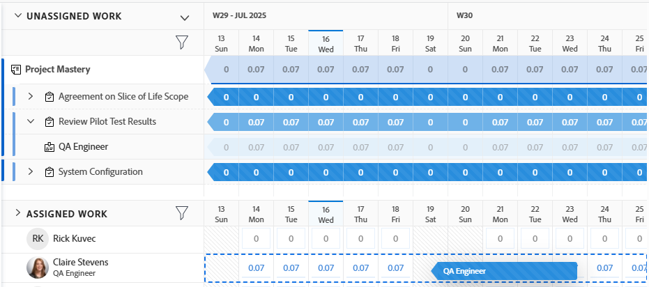

# Tilldela arbete i belastningsutjämnaren genom att dra och släppa

{{preview-fast-release-general}}

Du kan tilldela arbetsobjekt med Adobe Workfront Workload Balancer genom att dra och släppa arbetsobjekt till rätt användare.

Allmän information om hur du tilldelar arbete till användare med hjälp av arbetsbelastningsutjämnaren finns i [Översikt över hur du tilldelar arbete i belastningsutjämnaren](../../resource-mgmt/workload-balancer/assign-work-in-workload-balancer.md).

## Åtkomstkrav

+++ Expandera om du vill visa åtkomstkrav för funktionerna i den här artikeln. 

Du måste ha följande åtkomst för att kunna utföra stegen i den här artikeln:

<table style="table-layout:auto"> 
 <col> 
 <col> 
 <tbody> 
  <tr> 
   <td role="rowheader">Adobe Workfront</td> 
   <td> 
Alla 
 </td> 
  </tr> 
  <tr> 
   <td role="rowheader">Adobe Workfront-licens</td> 
   <td>
Nytt: Standard

       
eller

       
Aktuell: Planera att tilldela arbete i arbetsbelastningsutjämnaren i resursområdet: 
       Arbeta, för att tilldela arbete i belastningsutjämnaren för ett team eller projekt
</td>
  </tr>
  <tr> 
   <td role="rowheader">Konfigurationer på åtkomstnivå</td> 
   <td> 
Redigera åtkomst till följande:
 
    <ul> 
     <li>Resurshantering</li> 
     <li>Projekt</li> 
     <li>Uppgifter</li> 
     <li>Problem</li> 
    </ul>
   </td> 
  </tr> 
  <tr> 
   <td role="rowheader">Objektbehörigheter</td> 
   <td>Contribute-behörigheter eller högre för projekt, uppgifter och ärenden som innehåller Skapa uppdrag</td> 
  </tr> 
 </tbody> 
</table>

Mer information om informationen i den här tabellen finns i [Åtkomstkrav i Workfront-dokumentationen](/help/quicksilver/administration-and-setup/add-users/access-levels-and-object-permissions/access-level-requirements-in-documentation.md).

+++

## Tilldela ett objekt genom att dra och släppa

Du kan tilldela en artikel från området Ej tilldelat arbete till en användare, eller så kan du tilldela om en redan tilldelad artikel till en annan användare i området Tilldelad arbetsyta.

1. Gå till den arbetsbelastningsutjämnare där du vill tilldela arbete.

   Du kan tilldela användare arbete med hjälp av belastningsutjämnaren i resursområdet, i projektet eller på teamnivå. Mer information om var arbetsbelastningsutjämnaren finns i Workfront finns i [Hitta arbetsbelastningsutjämnaren](../../resource-mgmt/workload-balancer/locate-workload-balancer.md).

1. (Valfritt) Gå till området **Ej tilldelat arbete** och tillämpa ett filter för att visa aktiviteter, utgåvor,  och rolltilldelningar som inte har tilldelats användare

   eller

   Gå till området **Tilldelad arbetsplats** och expandera namnet på en användare för att visa de arbetsobjekt som har tilldelats dem, om du vill tilldela om deras objekt.

   >[!NOTE]
   >
   >Rolltilldelningar visas under arbetsobjekt i området Ej tilldelat arbete när inställningen Visa rolltilldelningar är aktiverad. Mer information finns i [Anpassa vyn](/help/quicksilver/resource-mgmt/workload-balancer/navigate-the-workload-balancer.md#customize-the-view) i [Navigera i arbetsbelastningsutjämnaren](/help/quicksilver/resource-mgmt/workload-balancer/navigate-the-workload-balancer.md).

1. (Villkorligt) Klicka på ikonen **Visa alla användare**  i Utjämning av arbetsbelastning för ett projekt om du vill visa alla Workfront-användare.

   Detta visar alla användare som du har åtkomst till för att visa.

   De användare som också är en del av projektteamet och redan är tilldelade till objekt i projektet har en projektikon till höger om sitt namn på den tilldelade arbetsytan.

   

   >[!TIP]
   >
   >* Alternativet Visa alla användare är bara tillgängligt i arbetsbelastningsutjämnaren för ett projekt.
   >* Använd filter om du bara vill visa de användare som är viktiga för dig. Använd till exempel ett filter om du bara vill visa användare från dina team eller grupper.

1. Klicka på fältet för en arbetsuppgift  eller rolltilldelning som anger den planerade eller den planerade tidslinjen och dra den över timmarna för en användare i området **Tilldelad**.

   Användaren som du för pekaren över för att släppa arbetsobjektet markeras.

   När du drar och släpper rolltilldelningar markeras användaren i orange om deras aktuella roll inte matchar rolltilldelningen. Du kan fortfarande tilldela användaren arbetet när rollerna inte matchar.

   >[!TIP]
   >
   >De planerade timmarna för den användare som du hovrar över uppdateras i realtid med antalet planerade timmar per dag från arbetsuppgiften, för att visa vilken effekt det kan ha om ett nytt objekt läggs till i den totala allokeringen.

   Exempelbild i förhandsvisningsmiljön:
   

   Exempelbild i produktionsmiljön:
   

1. När du är klar släpper du den valda arbetsposten  eller rolltilldelningen på samma rad som användarens namn i det tilldelade området. Artikeln tilldelas och de tilldelade planerade timmarna uppdateras för användaren med de nya timmarna från arbetsuppgiften.

   Om inställningen Visa rolltilldelningar inte är aktiverad, och arbetsuppgiften har tilldelats en jobbroll som användaren inte kan fylla, visas objektet under användarens namn i området Tilldelad arbetsyta. Den finns även kvar i området Ej tilldelat arbete för att ange att den jobbroll som är associerad med den ännu inte har ersatts av en användare.

   >[!TIP]
   >
   >* Om du har aktiverat Gruppera efter projekt i området Inställningar visas den tilldelade uppgiften under motsvarande projekt. Om inställningen är inaktiverad visas den tilldelade uppgiften i användarområdet.
   >
   >
   >     Objektet visas enligt kriterierna för belastningsutjämnare för arbetsbelastning för sortering av arbetsobjekt. Mer information finns i [Navigera i arbetsbelastningsutjämnaren](../../resource-mgmt/workload-balancer/navigate-the-workload-balancer.md).
   >
   >
   >* Om du har aktiverat Visa alla användare i belastningsutjämnaren för ett projekt och tilldelade objekt till användare som inte tidigare har tilldelats till objekt i projektet, läggs användarna till i projektgruppen. Mer information finns i [Hantera projektteam](../../manage-work/projects/planning-a-project/manage-project-team.md).

1. (Valfritt) Klicka på fältet för ett arbetsobjekt under namnet på en användare i området Tilldelat arbete och dra det sedan över området Ej tilldelat arbete för att ta bort tilldelningen. Artikeln har inte tilldelats från användaren, men den kan fortfarande tilldelas en jobbroll. I så fall visas den i området Ej tilldelat arbete. Om objektet är tilldelat en annan användare finns det kvar i området Tilldelad arbetsyta under namnet på den användare som fortfarande är tilldelad.
1. (Valfritt) Klicka på ikonen **Visa allokeringar**  och klicka sedan på menyn **Mer**  > **Redigera allokeringar** .

   <!--
   (make sure these are still called this, and that the icon has not changed)
   -->
   eller

   Dubbelklicka på en daglig eller veckovis allokering för att ändra den tid som användaren tilldelas arbetsuppgiften.

   Mer information om hur du ändrar användartilldelningar i arbetsbelastningsutjämnaren finns i avsnittet &quot;Ändra användartilldelningar&quot; i artikeln [Hantera användartilldelningar i arbetsbelastningsutjämnaren](../../resource-mgmt/workload-balancer/manage-user-allocations-workload-balancer.md).

   Mer information om hur du tar bort tilldelningar från ett arbetsobjekt med hjälp av arbetsbelastningsutjämnaren finns i [Ta bort tilldelning av arbete i arbetsbelastningsutjämnaren](../../resource-mgmt/workload-balancer/unassign-work-in-workload-balancer.md).

