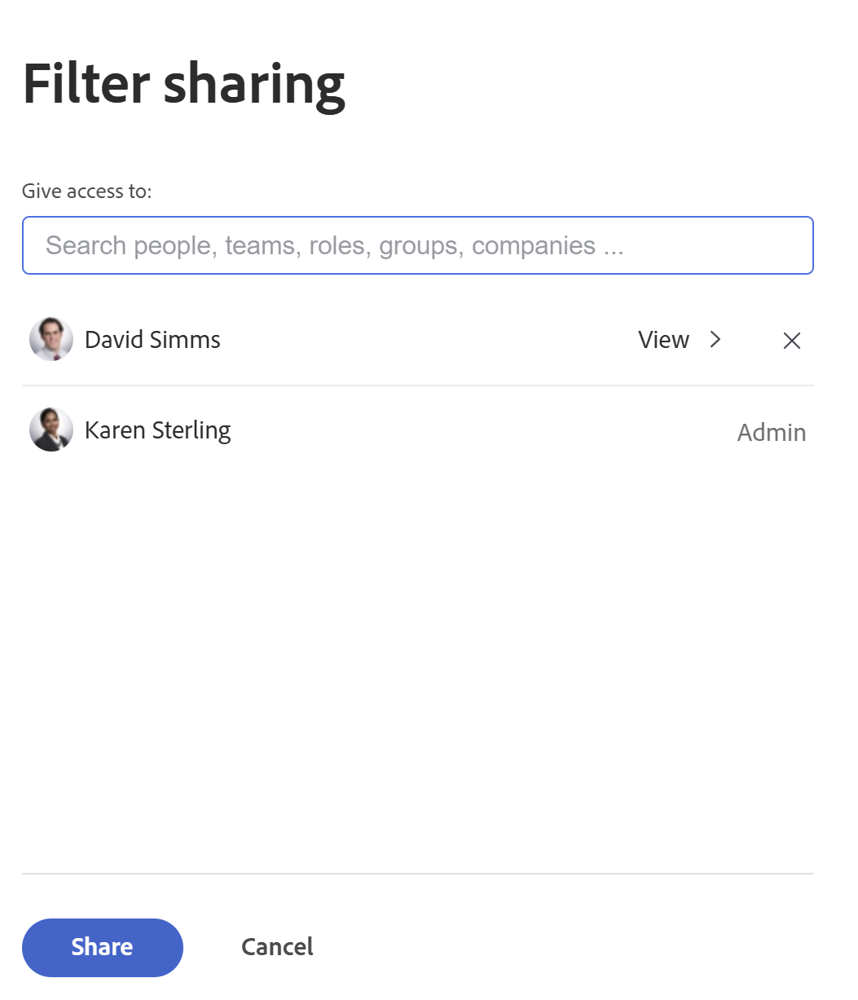

# Filtrera information i Utjämning av arbetsbelastning

<!--
(when they add custom fields to fitlering, add the caveat you added for the Resource Planner : only field NAMES and not LABELS are to be found in the drop-down >> ADD THIS IN THE STEP BELOW WHEN ADDING A FILTER)
-->

Som resurshanterare kan du använda arbetsbelastningsutjämnaren för att visa och hantera arbetsbelastningen för dina användare. Mer allmän information om belastningsutjämnaren finns i följande artiklar:

* [Översikt över belastningsutjämnare](../../resource-mgmt/workload-balancer/overview-workload-balancer.md)
* [Navigera till arbetsbelastningsutjämnaren](../../resource-mgmt/workload-balancer/navigate-the-workload-balancer.md)

>[!IMPORTANT]
>
>För att effektivt hitta arbetsobjekt och fokusera på de användare eller objekt du hanterar rekommenderar vi att du använder filter i Utjämning av arbetsbelastning. På så sätt kan du visa rätt information innan du börjar hantera tilldelningarna av dina resurser.
>
>När du sparar och använder ett nytt filter, och sedan navigerar bort från arbetsbelastningsutjämnaren, bevaras filtret även när du har loggat ut och loggat in igen.

Den här artikeln innehåller information om filter i Utjämning av arbetsbelastning. Mer information om filter i Workfront finns i [Översikt över filter](../../reports-and-dashboards/reports/reporting-elements/filters-overview.md).

## Åtkomstkrav

Du måste ha följande:

<table style="table-layout:auto"> 
 <col> 
 </col> 
 <col> 
 </col> 
 <tbody> 
  <tr> 
   <td role="rowheader">Adobe Workfront-plan*</td> 
   <td> 
Alla planer
 </td> 
  </tr> 
  <tr> 
   <td role="rowheader">Adobe Workfront-licens*</td> 
   <td> 
Planera, när du använder arbetsbelastningsutjämnaren i resursområdet

   
Arbeta, när du använder belastningsutjämnaren för ett team eller projekt

 </td> 
  </tr> 
  <tr> 
   <td role="rowheader">Åtkomstnivå*</td> 
   <td> 
Visa eller öka åtkomsten till följande:
 
    <ul> 
     <li> 
Resurshantering
 </li> 
     <li> 
Projekt
 </li> 
     <li> 
Uppgifter
 </li> 
     <li> 
Problem
 </li> 
     <li data-mc-conditions="QuicksilverOrClassic.Quicksilver"> 
Filter, vyer och grupperingar
 </li> 
    </ul> 
Redigera åtkomst till filter, vyer och grupperingar när du skapar eller redigerar filter 
 
<b>ANMÄRKNING</b>

Om du fortfarande inte har åtkomst frågar du Workfront-administratören om de anger ytterligare begränsningar för din åtkomstnivå. Information om hur en Workfront-administratör kan ändra åtkomstnivån finns i <a href="../../administration-and-setup/add-users/configure-and-grant-access/create-modify-access-levels.md" class="MCXref xref">Skapa eller ändra anpassade åtkomstnivåer</a>.
 </td>
</tr> 
  <tr> 
   <td role="rowheader">Objektbehörigheter</td> 
   <td> 
Visa eller högre behörigheter för projekt, uppgifter, utgåvor

   
Hantera behörigheter för de filter som du vill redigera eller ta bort

     
 
Mer information om hur du begär ytterligare åtkomst finns i <a href="../../workfront-basics/grant-and-request-access-to-objects/request-access.md" class="MCXref xref">Begär åtkomst till objekt </a>.
 </td> 
  </tr> 
 </tbody> 
</table>

*Kontakta Workfront-administratören om du vill veta vilken plan, licenstyp eller åtkomst du har.

## Översikt över filter i Utjämning av arbetsbelastning

Tänk på följande när du arbetar med filter i Arbetsbelastningsutjämnaren:

* Beroende på varifrån du öppnar arbetsbelastningsutjämnaren kan Workfront redan filtrera informationen åt dig. Mer information om fördefinierade filter finns i avsnittet [Förtillämpade filter i Utjämning av arbetsbelastning](#pre-applied-filters-in-the-workload-balancer) i den här artikeln.
* Du kan skapa och använda ett filter utan att spara det, eller så kan du spara ett filter och återanvända det senare.
* När du tillämpar ett filter utan att spara det kan du återgå till de ursprungliga listorna genom att uppdatera sidan.
* Du kan visa filter som du har skapat eller filter som andra användare har skapat och delat med dig.
* När du tar bort eller redigerar ett delat filter tas det även bort eller redigeras för alla som det delas med.
* När du skapar filter i Utjämning av arbetsbelastning i ett område är de inte tillgängliga i andra områden.

  Filter som skapas i resursområdet är till exempel inte tillgängliga i arbetsbelastningsutjämnaren för ett projekt eller ett team.

  Mer information om var du hittar belastningsutjämnaren finns i [Leta reda på arbetsbelastningsutjämnaren](../../resource-mgmt/workload-balancer/locate-workload-balancer.md).

* Du kan bara visa de objekt som matchar de valda filtren som också matchar datumen i tidslinjen som visas på skärmen i Utjämning av arbetsbelastning.

## Förtillämpade filter i Utjämning av arbetsbelastning {#pre-applied-filters-in-the-workload-balancer}

I Utjämning av arbetsbelastning visas information i två olika områden:

* **Ej tilldelad arbetsyta**: arbetsposter som ännu inte har tilldelats användare.
* **Den tilldelade arbetsytan**: arbetsposter som tilldelas användare.

  Mer information om vad som visas i de olika områdena finns i [Navigera till arbetsbelastningsutjämnaren](../../resource-mgmt/workload-balancer/navigate-the-workload-balancer.md).

>[!IMPORTANT]
>
>Varje område i belastningsutjämnaren har en egen uppsättning filter som fungerar oberoende av varandra. Du måste konfigurera båda filtren så att de anger vilken information du vill se i varje område.

I belastningsutjämnaren visas användare och deras arbetsobjekt.
Arbetsobjekten som tilldelats användarna visas bara när datumen för objekten matchar den tidsram som visas på skärmen.

Beroende på var du kommer åt arbetsbelastningsutjämnaren från, filtreras områdena Ej tilldelat och Tilldelad redan med vissa villkor, vilket beskrivs i följande tabell:

<table style="table-layout:auto"> 
 <col> 
 <col> 
 <col> 
 <tbody> 
  <tr> 
   <td role="rowheader"><strong>Workfront-område där du har åtkomst till belastningsutjämnaren för arbetsbelastning</strong></td> 
   <td><b>Objekt som visas i Ej tilldelat arbetsområde som standard</b> </td> 
   <td><b>Objekt som visas i den tilldelade arbetsytan som standard</b> </td> 
  </tr> 
  <tr> 
   <td role="rowheader">Resursområdet</td> 
   <td>Inga objekt visas här som standard. Du måste anpassa filter för att kunna visa arbetsobjekt i det här området.</td> 
   <td>Användare som är medlemmar i något av dina team och deras arbetsuppgifter. </td> 
  </tr> 
  <tr> 
   <td role="rowheader">Ett team</td> 
   <td>Arbetsobjekt som tilldelats teamet eller teamet och en jobbroll. </td> 
   <td> 
Användare som är medlemmar i det valda teamet och deras arbetsuppgifter.
 </td> 
  </tr> 
  <tr> 
   <td role="rowheader">Ett projekt</td> 
   <td> 
Ej tilldelade arbetsuppgifter eller artiklar som tilldelats team eller jobbroller i det valda projektet visas i det här området.
 </td> 
   <td> 
Användare som har tilldelats minst en arbetsuppgift i det valda projektet och deras arbetsposter i projektet när systemets standardfilter <b>Det här projektets arbetsobjekt</b> är markerat. 

När systemets standardfilter <b>Det här projektets arbetsobjekt</b> är avmarkerat visas alla arbetsobjekt för användare som är tilldelade till minst ett objekt i det valda projektet på arbetsytan Tilldelad arbetsyta i ett projekt.  
 Det här filtret är som standard avmarkerat.

<b>ANMÄRKNING</b>

Du kan aktivera alternativet Visa alla användare i ett projekts arbetsbelastningsutjämnare om du vill visa alla användare i systemet. Mer information finns i <a href="../workload-balancer/navigate-the-workload-balancer.md" class="MCXref xref">Navigera till arbetsbelastningsutjämnaren</a>

</td> 
  </tr> 
 </tbody> 
</table>

## Skapa filter för belastningsfördelning

Processen för att skapa filter för områdena Ej tilldelat arbete och Tilldelat arbete i Utjämning av arbetsbelastning är identisk, oavsett varifrån du öppnar Utjämning av arbetsbelastning. Mer information om hur du hittar belastningsutjämnaren finns i [Leta reda på arbetsbelastningsutjämnaren](../../resource-mgmt/workload-balancer/locate-workload-balancer.md).

Du kan skapa ett filter från grunden eller redigera något av de fördefinierade filtren. Information om befintliga filter som du kan redigera finns i [Redigera ett befintligt filter i Utjämning av arbetsbelastning](#edit-an-existing-filter-in-the-workload-balancer) i den här artikeln.

1. Gå till Utjämning av arbetsbelastning.

   Mer information om hur du använder belastningsutjämnaren finns i [Navigera till arbetsbelastningsutjämnaren](../../resource-mgmt/workload-balancer/navigate-the-workload-balancer.md).

1. Klicka på **Filter** icon  i det övre högra hörnet av antingen **Ej tilldelat arbete** eller **Tilldelat arbete** områden.

   Filterverktygslådan visas till höger. Namnet på området som du skapar filtret för visas i rutans sidhuvud.

   

1. (Valfritt och villkorligt) Om du använder Utjämning av arbetsbelastning i området Resurser kan det fördefinierade standardfiltret redan användas på området Tilldelat arbete. Du kan redigera och spara en kopia av standardfiltret.

   >[!TIP]
   >
   >Filtret Standard visar användare som tillhör någon av dina team och deras arbetsuppgifter. Du kan redigera en kopia av det här filtret.

   Om du öppnar [!UICONTROL Workload Balancer] från ett projekt,[!UICONTROL This project's work items]filtret kan redan användas. Detta visar endast arbetsobjekt som tilldelats användare i det här projektet. Du kan duplicera och spara en kopia av det här filtret.

   Som standard är [!UICONTROL Workload Balancer] för ett projekt visas alla arbetsobjekt som tilldelats alla användare i projektet.

1. Klicka **Nytt filter.**

   

1. Så här skapar du ett filter:

   1. Välj ett fältnamn i den första listrutan eller klicka på **Bläddra bland fält** om du vill skriva namnet på ett fält som inte visas som standard.

      >[!IMPORTANT]
      >
      >När du refererar till anpassade fält måste du ange fältnamnet och inte fältetiketten. Fältetiketten visas i ett anpassat formulär som är kopplat till ett objekt. Mer information om skillnaden mellan etiketten och namnet på ett anpassat fält finns i [Skapa eller redigera ett anpassat formulär](../../administration-and-setup/customize-workfront/create-manage-custom-forms/create-or-edit-a-custom-form.md).

   1. (Villkorligt) Om du klickade **Bläddra bland fält** skriver du namnet på ett fält i **Sök** och markera det när det visas i listan.

      

      >[!TIP]
      >
      >Du kan välja ett fält i följande avsnitt:
      >
      >* **Senaste markeringar**: de fält som du nyligen har filtrerat efter.
      >* **Föreslagna fält**: de fält som används oftast.

   1. Välj en modifierare i den andra listrutan. Mer information om Workfront filtermodifierare finns i [Filter och villkorsmodifierare](../../reports-and-dashboards/reports/reporting-elements/filter-condition-modifiers.md).
   1. Välj eller ange ett värde för fältet som du filtrerar efter.

      >[!NOTE]
      >
      > När du vill visa arbetsobjekt från en viss portfölj kan du använda följande filter:&quot;Portfolio name contains marketing&quot;. Här visas arbetsuppgifter som tillhör en portfölj som innehåller&quot;marknadsföring&quot; i namnet.
      >
      >

      >[!NOTE]
      >
      >Om du vill exkludera projekt med statusen Spärrat måste du använda följande filter: &quot;Projekt: Status är inte lika med Spärrat&quot;. Detta förhindrar att arbetsobjekt från projekt som är parkerade visas i arbetsbelastningsutjämnaren.

   1. (Valfritt) Klicka på **Ta bort** icon  för att ta bort filtervillkor.

1. (Valfritt) Klicka på **Lägg till filter** om du vill lägga till ytterligare filtervillkor upprepar du åtgärderna från steg 4.

   <!--(NOTE: ensure this stays correct)-->

1. Klicka **Använd** om du vill använda filtrets resultat på det markerade området för belastningsfördelning utan att spara det.

   Listan med arbetsuppgifter uppdateras till vänster.

   >[!IMPORTANT]
   >
   >Resultaten visas i Utjämning av arbetsbelastning när alla filtersatser som du har lagt till samtidigt är sanna.

   Filtret bevaras tills du uppdaterar sidan.

   The **Använd** knappen ersätts med **Spara som ny** -knappen.

1. Klicka **Spara som ny** för att spara filtret för framtida bruk.

   

   >[!TIP]
   >
   >Klicka **Avbryt** tar dig när som helst tillbaka till filterområdet.

1. Välj **Namnlöst filter** och ange namnet på det nya filtret i stället.
1. Välj en ikon för det nya filtret på **Ikon** listruta.

   

1. (Valfritt) Lägg till en beskrivning av filtret för att ange vad som är unikt med det. Beskrivningen visas under filternamnet i filterlistan.
1. Klicka **Spara**.

   Sparade filter visas under Mina filter i filterrutan.

   Mer information om hur du använder sparade filter finns i avsnittet [Ta bort ett sparat filter i Utjämning av arbetsbelastning](#delete-a-saved-filter-in-the-workload-balancer) i den här artikeln.

1. (Villkorlig) Mus över **Filterikon**  i det övre högra hörnet av **Ej tilldelat arbete** eller **Tilldelat arbete** för att visa ett verktygstips med namnet eller antalet filter som används.

   

## Duplicera ett filter

Du kan duplicera och redigera ett filter för att skapa ett nytt.

1. Gå till Utjämning av arbetsbelastning.

   Mer information om hur du använder belastningsutjämnaren finns i [Navigera till arbetsbelastningsutjämnaren](../../resource-mgmt/workload-balancer/navigate-the-workload-balancer.md).

1. Klicka på **Filter** icon  i det övre högra hörnet av antingen **Ej tilldelat arbete** eller **Tilldelat arbete** områden.

   Rutan för filterverktyget visas till höger. Namnet på området som du skapar filtret för visas i rutans sidhuvud.

1. För musen över ett befintligt filter och klicka på **Mer** meny och sedan klicka **Duplicera**.

   

   >[!TIP]
   >
   > När du redigerar ett filter kan du klicka på **Mer** i det nedre vänstra hörnet av rutan Redigera filter och klicka sedan på **Duplicera**.

1. Redigera följande information för det duplicerade filtret:

   * Namn

     Som standard är det nya filternamnet&quot;(ursprungligt filternamn) Kopiera&quot;.

   * Ikon
   * Beskrivning
   * Alla fält, modifierare eller värden.

1. (Valfritt) Klicka på **Lägg till filter** om du vill lägga till fler programsatser i det duplicerade filtret.
1. Klicka **Spara** för att spara det duplicerade filtret i **Mina filter** område.

   Det ursprungliga filtret ändras inte och det duplicerade filtret sparas som ett nytt filter.

## Redigera ett befintligt filter i Utjämning av arbetsbelastning {#edit-an-existing-filter-in-the-workload-balancer}

Du kan redigera ett sparat filter i Utjämning av arbetsbelastning.

>[!TIP]
>
>När du redigerar ett filter som delas med andra ser de också de ändringar du gör.

1. Gå till Utjämning av arbetsbelastning.

   Mer information om hur du använder belastningsutjämnaren finns i [Navigera till arbetsbelastningsutjämnaren](../../resource-mgmt/workload-balancer/navigate-the-workload-balancer.md).

1. Klicka på **Filterikon**  i det övre högra hörnet av **Ej tilldelad** eller **Tilldelat arbete** områden.\
   Filterverktyget visas till höger.

1. För musen över det filter du vill redigera och klicka sedan på **Redigera** .

   

1. Gör något av följande:

   * Ändra någon av filtersatserna
   * Klicka **Lägg till filter** lägga till nya filterprogramsatser
   * Klicka på **Ta bort** icon  för att ta bort befintliga filtersatser.

1. (Valfritt) Klicka på **Använd**.

   Resultaten uppdateras i Utjämning av arbetsbelastning till vänster för att illustrera de ändringar du har gjort i filtret.

1. Klicka **Spara.**

   Resultaten uppdateras i Utjämning av arbetsbelastning till vänster och filtret uppdateras med den nya informationen som du har valt.

## Ta bort ett sparat filter i Utjämning av arbetsbelastning {#delete-a-saved-filter-in-the-workload-balancer}

Tänk på följande innan du tar bort ett filter:

* Du kan inte återställa borttagna filter.
* Du kan inte ta bort fördefinierade filter.
* Du kan inte ta bort ett osparat filter. De tas bort automatiskt efter utloggning och inloggning på Workfront.
* När du tar bort ett delat filter tas det även bort för alla användare som det delas med.
* När du har tagit bort alla sparade filter visas belastningsutjämnaren enligt de ursprungliga standardvärdena.

>[!NOTE]
>
>När du tar bort ett filter som delas med andra tas det också bort för dem.

1. Gå till Utjämning av arbetsbelastning
1. Klicka på **Filterikon**  i det övre högra hörnet av **Ej tilldelat arbete** eller **Tilldelat arbete** områden.\
   Filterverktygslådan visas till höger.

1. För musen över ett filter och klicka sedan på **Mer** meny och sedan klicka **Ta bort**.
   

   >[!TIP]
   >
   >När du redigerar ett filter kan du klicka på **Mer** i det nedre vänstra hörnet av rutan Redigera filter och klicka sedan på **Ta bort**.

1. (Valfritt) Klicka på **Avbryt** för att undvika att tas bort och återgå till filterlistan.
1. Klicka **Ta bort** för att bekräfta borttagningen.

   Filtret tas bort för dig och alla användare som har behörighet till det.

## Dela ett filter i Utjämning av arbetsbelastning

Du kan dela ett filter som du har skapat eller som delats med dig av andra användare.

Tänk på följande när du delar filter i Utjämning av arbetsbelastning:

* Du kan dela filter med aktiva användare, team, roller och företag eller göra dem synliga för alla i din Workfront-instans.
* Filter som du delar i resursområdet visas inte i arbetsbelastningsutjämnaren för ett projekt eller ett team.
* De filter för belastningsutjämning som du delar med andra visas inte i andra områden av Workfront.

Dela ett filter:

1. Gå till Utjämning av arbetsbelastning
1. Klicka på **Filterikon**  i det övre högra hörnet av **Ej tilldelat arbete** eller **Tilldelat arbete** områden.\
   Filterverktygslådan visas till höger.

1. För musen över ett filter och klicka sedan på **Mer** meny och sedan klicka **Dela.**

   

   >[!TIP]
   >
   > När du redigerar ett filter kan du klicka på **Mer** i det nedre vänstra hörnet av rutan Redigera filter och klicka sedan på **Dela**.

   Rutan Filterdelning visas.

1. Aktivera **Visa hela systemet** inställning. Detta ger alla i Workfront behörighet att visa filtret.

   eller

   Börja skriva namnen på de användare, team, roller, grupper eller företag som du vill dela filtret med i **Ge åtkomst till** fält.

   

1. (Valfritt) Klicka på högerpilen bredvid namnet på en enhet för att redigera deras behörigheter till filtret och aktivera sedan antingen **Visa** eller **Hantera** alternativ.

   

1. (Valfritt) Aktivera eller inaktivera ytterligare behörigheter för en enhet genom att göra något av följande:

   1. Klicka **Visa** och inaktivera **Dela** alternativ. Den är aktiverad som standard.

   1. Klicka **Hantera** och inaktivera antingen **Dela** eller **Ta bort** alternativ. De är aktiverade som standard.

   >[!TIP]
   >
   >Användare kan inte få en högre behörighet än deras åtkomstnivå. Om de inte har åtkomst till redigeringsfilter på åtkomstnivån kan de inte få behörighet att hantera ett filter. Workfront inaktiverar alternativet Hantera för dessa användare och alternativet är nedtonat.

1. Klicka **Dela**. Filtret delas med de enheter som du har angett.

   Filtren som du delade visas i **Delas med mig** filterrutans område.

   

<!--   

## Add a filter to your favorites list

You can mark a filter as a favorite for quicker access to it. 

The filters that you mark as a favorite do not count towards your system Favorites list. There is no limit for how many filters you can favorite. 

1. Go to the Workload Balancer
1. Click the **Filter** icon  in the upper-right corner of the **Unassigned Work** or **Assigned Work** areas. The filter builder box displays on the right. 
1. Mouse over a filter, then click the **Favorite** . 
(NOTE: insert screen shot here with Favorite as part of this menu - same as above ones but with Favorite)
1. The filter is listed in the **Favorited** section inside the filter panel. 
1. (Optional) Click the **Favorite** icon again to remove the filter from the list of favorite filters
(I logged bugs for "Favorited" and "Unfavorite" wordings - make sure these have not updated)
-->
