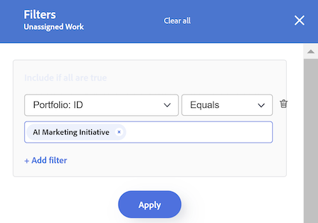

# Filtrera information i Utjämning av arbetsbelastning

<!-- Audited: 6/2025 -->

<!--
(when they add custom fields to fitlering, add the caveat you added for the Resource Planner : only field NAMES and not LABELS are to be found in the drop-down >> ADD THIS IN THE STEP BELOW WHEN ADDING A FILTER)
-->

Som resurshanterare kan du använda arbetsbelastningsutjämnaren för att visa och hantera arbetsbelastningen för dina användare. Mer allmän information om belastningsutjämnaren finns i följande artiklar:

* [Översikt över belastningsutjämnaren](../../resource-mgmt/workload-balancer/overview-workload-balancer.md)
* [Navigera till arbetsbelastningsutjämnaren](../../resource-mgmt/workload-balancer/navigate-the-workload-balancer.md)

>[!IMPORTANT]
>
>För att effektivt hitta arbetsobjekt och fokusera på de användare eller objekt du hanterar rekommenderar vi att du använder filter i Utjämning av arbetsbelastning. På så sätt kan du visa rätt information innan du börjar hantera resurstilldelningarna.
>
>När du navigerar bort från arbetsbelastningsutjämnaren efter att du har sparat och använt ett nytt filter tillämpas filtret fortfarande även efter att du har loggat ut och loggat in igen.

Den här artikeln innehåller information om filter i Utjämning av arbetsbelastning. Mer information om filter i Workfront finns i [Översikt över filter](../../reports-and-dashboards/reports/reporting-elements/filters-overview.md).

## Åtkomstkrav

<table style="table-layout:auto"> 
 <col> 
 <col>
 <tbody> 
  <tr> 
   <td>Adobe Workfront package</td> 
   <td>
Alla
</td>
  </tr>
  <tr> 
   <td>Adobe Workfront-licens</td> 
   <td>
Standard

       
Planera, när du använder belastningsutjämnaren för arbetsbelastning i resursområdet; Arbeta när du använder belastningsutjämnaren för ett team eller projekt
</td>
  </tr>
  <tr> 
   <td>Konfigurationer på åtkomstnivå</td> 
   <td> 
Visa eller öka åtkomsten till följande:
 
    <ul> 
     <li>Resurshantering</li> 
     <li>Projekt</li> 
     <li>Uppgifter</li> 
     <li>Problem</li>
     <li>Filter, vyer och grupperingar</li>
    </ul>
    
Redigera åtkomst till filter, vyer och grupperingar när du skapar eller redigerar filter 
 </td>
  </tr> 
  <tr> 
   <td>Objektbehörigheter</td> 
   <td> 
Visa eller högre behörigheter för projekt, uppgifter, utgåvor

   
Hantera behörigheter för de filter som du vill redigera eller ta bort

   </td> 
  </tr> 
 </tbody> 
</table>

Mer information finns i [Åtkomstkrav i Workfront-dokumentationen](/help/quicksilver/administration-and-setup/add-users/access-levels-and-object-permissions/access-level-requirements-in-documentation.md).

## Översikt över filter i Utjämning av arbetsbelastning

Tänk på följande när du arbetar med filter i Arbetsbelastningsutjämnaren:

* Beroende på varifrån du öppnar arbetsbelastningsutjämnaren kan Workfront redan filtrera informationen åt dig. Mer information finns i följande avsnitt i den här artikeln: [Förtillämpade filter i Utjämning av arbetsbelastning](#pre-applied-filters-in-the-workload-balancer).
* Du kan skapa och använda ett filter utan att spara det, eller så kan du spara ett filter och återanvända det senare.
* När du tillämpar ett filter utan att spara det kan du återgå till de ursprungliga listorna genom att uppdatera sidan.
* Du kan visa filter som du har skapat eller filter som andra användare har skapat och delat med dig.
* När du tar bort eller redigerar ett delat filter tas det även bort eller redigeras för alla som du har delat det med.
* När du skapar filter i Utjämning av arbetsbelastning i ett område är de inte tillgängliga i andra områden.

  Filter som skapas i området Resurser är till exempel inte tillgängliga i ett projekt eller i gruppens belastningsutjämnare.

  Mer information om var du hittar arbetsbelastningsutjämnaren finns i [Hitta arbetsbelastningsutjämnaren](../../resource-mgmt/workload-balancer/locate-workload-balancer.md).

* Du kan bara visa objekt som matchar de valda filtren om de också matchar datumen i tidslinjen som visas på skärmen för belastningsutjämning.

## Förtillämpade filter i Utjämning av arbetsbelastning {#pre-applied-filters-in-the-workload-balancer}

I Utjämning av arbetsbelastning visas information i två olika områden:

* **Den otilldelade arbetsytan**: Arbetsobjekt som ännu inte har tilldelats användare.
* **Den tilldelade arbetsytan**: Arbetsobjekt som är tilldelade användare.

  Mer information om vad som visas i vart och ett av områdena finns i [Navigera i arbetsbelastningsutjämnaren](../../resource-mgmt/workload-balancer/navigate-the-workload-balancer.md).

>[!IMPORTANT]
>
>Varje område i belastningsutjämnaren har en egen uppsättning filter som fungerar oberoende av varandra. Du måste konfigurera båda filtren så att de anger vilken information du vill se i varje område.

I belastningsutjämnaren visas användare och deras arbetsobjekt.
Arbetsobjekten som tilldelats användarna visas bara när datumen för objekten matchar den tidsram som visas på skärmen.

Beroende på var du kommer åt arbetsbelastningsutjämnaren från, filtreras områdena Ej tilldelat och Tilldelad redan med vissa villkor, vilket beskrivs i följande tabell:

<table style="table-layout:auto"> 
 <col> 
 <col> 
 <col> 
 <tbody> 
  <tr> 
   <td role="rowheader"><strong>Workfront-område där du har åtkomst till belastningsutjämnaren för arbetsbelastning</strong></td> 
   <td><b>Objekt som visas i området Ej tilldelat arbete som standard</b> </td> 
   <td><b>Objekt som visas i den tilldelade arbetsytan som standard</b> </td> 
  </tr> 
  <tr> 
   <td role="rowheader">Resursområdet</td> 
   <td>Inga objekt visas här som standard. Du måste anpassa filter för att kunna visa arbetsobjekt i det här området.</td> 
   <td>Användare som är medlemmar i något av dina team och deras arbetsuppgifter. </td> 
  </tr> 
  <tr> 
   <td role="rowheader">Ett team</td> 
   <td>Arbetsobjekt som tilldelats teamet eller teamet och en jobbroll. </td> 
   <td> 
Användare som är medlemmar i det valda teamet och deras arbetsuppgifter.
 </td> 
  </tr> 
  <tr> 
   <td role="rowheader">Ett projekt</td> 
   <td> 
Ej tilldelade arbetsuppgifter eller artiklar som tilldelats team eller jobbroller i det valda projektet visas i det här området.
 </td> 
   <td> 
Användare som har tilldelats minst en arbetsuppgift i det valda projektet och deras arbetsobjekt i projektet när <b>projektets standardfilter för arbetsobjekt</b> har valts. 

När <b>projektets standardfilter för arbetsobjekt</b> är avmarkerat visas alla arbetsobjekt för användarna som är tilldelade till minst ett objekt i det valda projektet på arbetsytan för ett projekt.    Det här filtret är som standard avmarkerat.

 <b>Obs!</b>: Du kan aktivera alternativet <b>Visa alla användare</b> i projektets arbetsbelastningsutjämnare för att visa alla användare i systemet. Mer information finns i <a href="../workload-balancer/navigate-the-workload-balancer.md" class="MCXref xref">Navigera i arbetsbelastningsutjämnaren</a>

</td> 
  </tr> 
 </tbody> 
</table>

## Skapa filter för belastningsfördelning

Processen för att skapa filter för områdena Ej tilldelat arbete och Tilldelat arbete i Utjämning av arbetsbelastning är identisk oavsett varifrån du öppnar Utjämning av arbetsbelastning. Mer information om hur du hittar arbetsbelastningsutjämnaren finns i [Leta reda på arbetsbelastningsutjämnaren](../../resource-mgmt/workload-balancer/locate-workload-balancer.md).

Du kan skapa ett filter från grunden eller redigera något av de fördefinierade filtren. Mer information om befintliga filter som du kan redigera finns i avsnittet [Redigera ett befintligt filter i avsnittet Arbetsbelastningsutjämning](#edit-an-existing-filter-in-the-workload-balancer) i den här artikeln.

1. Gå till Utjämning av arbetsbelastning.

   Mer information om hur du får åtkomst till arbetsbelastningsutjämnaren finns i [Navigera i arbetsbelastningsutjämnaren](../../resource-mgmt/workload-balancer/navigate-the-workload-balancer.md).

1. Klicka på ikonen **Filter** **Filter** i det övre högra hörnet av antingen **Ej tilldelat arbete** eller  . Rutan **Filter** visas till höger och namnet på området som du skapar filtret för visas i sidhuvudet.

   

1. (Valfritt och villkorligt) Om du använder Utjämning av arbetsbelastning i området **Resurs** kan det fördefinierade standardfiltret redan användas i området **Tilldelat arbete**. Du kan redigera och spara en kopia av standardfiltret.

   >[!TIP]
   >
   >Filtret Standard visar användare som tillhör någon av dina team och deras arbetsuppgifter. Du kan redigera en kopia av det här filtret.

   Om du får åtkomst till [!UICONTROL Workload Balancer] från ett projekt kan det hända att filtret **Det här projektets arbetsobjekt** redan används. Detta visar endast arbetsobjekt som tilldelats användare i det här projektet. Du kan duplicera och spara en kopia av det här filtret.

   Som standard visar projektets [!UICONTROL Workload Balancer] alla arbetsobjekt som tilldelats alla användare i projektet.

1. Klicka på **Nytt filter**.

1. Så här skapar du ett filter:

   1. Välj ett fältnamn i den första listrutan eller klicka på **Bläddra i fält** längst ned i listrutan för att skriva namnet på ett fält som inte visas som standard.

      >[!IMPORTANT]
      >
      >När du refererar till anpassade fält måste du ange fältnamnet och inte fältetiketten. Fältetiketten visas i ett anpassat formulär som är kopplat till ett objekt. Mer information om skillnaden mellan etiketten och namnet på ett anpassat fält finns i [Skapa ett anpassat formulär](/help/quicksilver/administration-and-setup/customize-workfront/create-manage-custom-forms/form-designer/design-a-form/design-a-form.md).

   1. (Villkorligt) Om du klickade på **Bläddra bland fält** skriver du namnet på ett fält i fältet **Sök** och markerar det när det visas i listan.

      

      >[!TIP]
      >
      >Du kan välja ett fält i följande avsnitt:
      >
      >* **Senaste markeringar**: de fält som du nyligen har filtrerat efter.
      >* **Föreslagen**: de fält som används oftast.

   1. Välj en modifierare i den andra listrutan. Mer information om Workfront filtermodifierare finns i [Filter och villkorsmodifierare](../../reports-and-dashboards/reports/reporting-elements/filter-condition-modifiers.md).
   1. Välj eller ange ett värde för fältet som du filtrerar efter.

      >[!NOTE]
      >
      > När du vill visa arbetsobjekt från en viss portfölj kan du använda följande filter: Portfolio ID är lika med &lt; PORTFOLIO NAME >.
      >
      >
      >
      >Om du vill utesluta projekt med statusen Spärrad måste du använda följande filter: Projekt: Status motsvarar inte Spärrad. Detta förhindrar att arbetsobjekt i projekt som är parkerade visas i arbetsbelastningsutjämnaren.
      >
      >

   1. (Valfritt) Klicka på ikonen **Ta bort**  om du vill ta bort ett filtervillkor.

1. (Valfritt) Klicka på **Lägg till filter** för att lägga till ytterligare filtervillkor och upprepa sedan åtgärderna från steg 4.

   <!--(NOTE: ensure this stays correct)-->

1. Klicka på **Använd** om du vill använda resultatet av filtret på det markerade området för belastningsfördelning utan att spara det. Listan med arbetsuppgifter uppdateras till vänster.

   >[!IMPORTANT]
   >
   >Resultaten visas i Utjämning av arbetsbelastning när alla filtersatser som du har lagt till samtidigt är sanna.

   Filtret bevaras tills du uppdaterar sidan och knappen **Använd** ersätts med knappen **Spara som ny** .

1. Klicka på **Spara som ny** om du vill spara filtret för framtida bruk.

   >[!TIP]
   >
   >När du klickar på **Avbryt** återgår du till filterbyggområdet.

1. Ange det nya filternamnet i fältet **Namnlöst filter**.
1. (Valfritt) Välj en ikon för det nya filtret i listrutan **Ikon** .

   

1. (Valfritt) Lägg till filtret **Beskrivning**. Beskrivningen visas under filternamnet i filterlistan.
1. Klicka på **Spara**. Det sparade filtret visas i området **Mina filter** i filterrutan.

   Mer information om hur du använder sparade filter finns i avsnittet [Ta bort ett sparat filter i Utjämning av arbetsbelastning](#delete-a-saved-filter-in-the-workload-balancer) i den här artikeln.

1. (Villkorligt) För musen över ikonen **Filter**  i det övre högra hörnet av området **Ej tilldelat arbete** eller **Tilldelat arbete** för att visa ett verktygstips med namnet eller antalet filter som används.

   

## Duplicera ett filter

Du kan duplicera och redigera ett filter för att skapa ett nytt.

1. Gå till Utjämning av arbetsbelastning.

   Mer information om hur du får åtkomst till arbetsbelastningsutjämnaren finns i [Navigera i arbetsbelastningsutjämnaren](../../resource-mgmt/workload-balancer/navigate-the-workload-balancer.md).

1. Klicka på ikonen **Filter** **Filter** i det övre högra hörnet av antingen **Ej tilldelat arbete** eller  .  Rutan **Filter** visas till höger och namnet på området som du duplicerar filtret för visas i sidhuvudet.

1. Håll pekaren över ett befintligt filter och klicka sedan på menyn **Mer**  .
1. Klicka på **Duplicera**.

   >[!TIP]
   >
   > När du redigerar ett filter kan du klicka på menyn **Mer**  i det nedre vänstra hörnet av rutan **Redigera filter** och sedan klicka på **Duplicera** .

1. Redigera följande information för det duplicerade filtret:

   * Namn
   * Ikon
   * Beskrivning
   * Alla fält, modifierare eller värden.

1. (Valfritt) Klicka på **Lägg till filter** om du vill lägga till fler programsatser i det duplicerade filtret.
1. Klicka på **Spara** för att spara det duplicerade filtret i området **Mina filter**. Det ursprungliga filtret ändras inte och det duplicerade filtret sparas som ett nytt filter.

## Redigera ett befintligt filter i Utjämning av arbetsbelastning {#edit-an-existing-filter-in-the-workload-balancer}

Du kan redigera ett sparat filter i Utjämning av arbetsbelastning.

>[!TIP]
>
>När du redigerar ett filter som delas med andra ser de också de ändringar du gör.

1. Gå till Utjämning av arbetsbelastning.

   Mer information om hur du får åtkomst till arbetsbelastningsutjämnaren finns i [Navigera i arbetsbelastningsutjämnaren](../../resource-mgmt/workload-balancer/navigate-the-workload-balancer.md).

1. Klicka på ikonen **Filter** **Filter** i det övre högra hörnet av områdena **Ej tilldelat** eller  . Filterverktyget visas till höger.

1. För musen över det filter som du vill redigera och klicka sedan på ikonen **Redigera**  .

1. Gör något av följande:

   * Ändra någon av filtersatserna.
   * Klicka på **Lägg till filter** för att lägga till nya filtersatser.
   * Klicka på ikonen **Ta bort**  om du vill ta bort befintliga filtersatser.

1. (Valfritt) Klicka på **Använd**. Resultaten uppdateras i Utjämning av arbetsbelastning till vänster för att illustrera de ändringar du har gjort i filtret.

1. Klicka på **Spara**. Resultaten uppdateras i Utjämning av arbetsbelastning till vänster och filtret uppdateras med den nya informationen som du har valt.

## Ta bort ett sparat filter i Utjämning av arbetsbelastning {#delete-a-saved-filter-in-the-workload-balancer}

Tänk på följande innan du tar bort ett filter:

* Det går inte att återställa borttagna filter.
* Du kan inte ta bort fördefinierade filter.
* Du kan inte ta bort ett osparat filter. De tas bort automatiskt efter utloggning och inloggning på Workfront.
* När du tar bort ett delat filter tas det även bort för alla användare som det delas med.
* När du har tagit bort alla sparade filter visas belastningsutjämnaren enligt de ursprungliga standardvärdena.

>[!NOTE]
>
>När du tar bort ett filter som delas med andra tas det också bort för dem.

1. Gå till Utjämning av arbetsbelastning.

   Mer information om hur du får åtkomst till arbetsbelastningsutjämnaren finns i [Navigera i arbetsbelastningsutjämnaren](../../resource-mgmt/workload-balancer/navigate-the-workload-balancer.md).

1. Klicka på ikonen **Filter** **Filterikon** i det övre högra hörnet av områdena **Ej tilldelat arbete** eller . Rutan **Filter** visas till höger.

1. För musen över ett filter, klicka på menyn **Mer**  och klicka sedan på **Ta bort**.

   >[!TIP]
   >
   >När du redigerar ett filter kan du klicka på menyn **Mer**  i det nedre vänstra hörnet av rutan **Redigera filter** och sedan klicka på **Ta bort** .

1. (Valfritt) Klicka på **Avbryt** om du vill avbryta borttagningen och återgå till filterlistan.
1. Klicka på **Ta bort** för att bekräfta borttagningen. Filtret tas bort för dig och alla användare som har behörighet till det.

## Dela ett filter i Utjämning av arbetsbelastning

Du kan dela ett filter som du har skapat eller som delats med dig av andra användare.

Tänk på följande när du delar filter i Utjämning av arbetsbelastning:

* Du kan dela filter med aktiva användare, team, roller och företag eller göra dem synliga för alla i din Workfront-instans.
* Filter som du delar i resursområdet visas inte i arbetsbelastningsutjämnaren för ett projekt eller ett team.
* De filter för belastningsutjämning som du delar med andra visas inte i andra områden av Workfront.

Dela ett filter:

1. Gå till Utjämning av arbetsbelastning.

   Mer information om hur du får åtkomst till arbetsbelastningsutjämnaren finns i [Navigera i arbetsbelastningsutjämnaren](../../resource-mgmt/workload-balancer/navigate-the-workload-balancer.md).

1. Klicka på ikonen **Filter** **Filterikon** i det övre högra hörnet av områdena **Ej tilldelat arbete** eller . Rutan **Filter** visas till höger.

1. Håll pekaren över ett filter och klicka sedan på menyn **Mer**  .

1. Klicka på **Dela**. Rutan **Filterdelning** visas.

   >[!TIP]
   >
   > När du redigerar ett filter kan du klicka på menyn **Mer**  i det nedre vänstra hörnet av rutan **Redigera filter** och sedan klicka på **Dela** .

1. I fältet **Ge åtkomst till** skriver du namnen på de användare, team, roller, grupper eller företag som du vill dela filtret med och markerar dem när de visas.

1. (Valfritt) Om du vill redigera filterbehörigheterna för en entitet klickar du på högerpilen bredvid namnet och väljer sedan **Visa** eller **Hantera**.

   

1. (Valfritt) Aktivera eller inaktivera ytterligare behörigheter för en enhet genom att göra något av följande:

   1. Klicka på **Visa** och inaktivera alternativet **Dela**. Detta är aktiverat som standard.

   1. Klicka på **Hantera** och aktivera alternativet **Dela** eller **Ta bort**.

   >[!TIP]
   >
   >Användare kan inte få en högre behörighet än deras åtkomstnivå. Om de inte har åtkomst till Redigera filter på åtkomstnivån kan de inte få behörighet att hantera ett filter. Workfront inaktiverar alternativet Hantera för dessa användare.

1. Klicka på **Dela**. Filtret delas med de enheter som du har angett och det delade filtret visas i området **Delat med mig** i rutan **Filter**.

   

<!--   

## Add a filter to your favorites list

You can mark a filter as a favorite for quicker access to it. 

The filters that you mark as a favorite do not count towards your system Favorites list. There is no limit for how many filters you can favorite. 

1. Go to the Workload Balancer
1. Click the **Filter** icon  in the upper-right corner of the **Unassigned Work** or **Assigned Work** areas. The filter builder box displays on the right. 
1. Mouse over a filter, then click the **Favorite** . 
(NOTE: insert screen shot here with Favorite as part of this menu - same as above ones but with Favorite)
1. The filter is listed in the **Favorited** section inside the filter panel. 
1. (Optional) Click the **Favorite** icon again to remove the filter from the list of favorite filters
(I logged bugs for "Favorited" and "Unfavorite" wordings - make sure these have not updated)
-->
