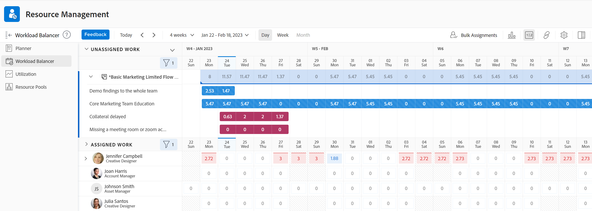
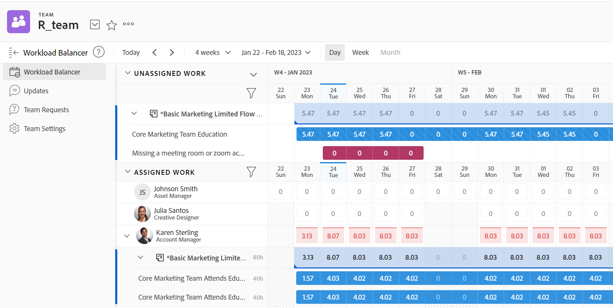
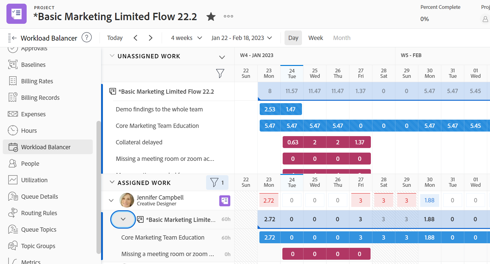
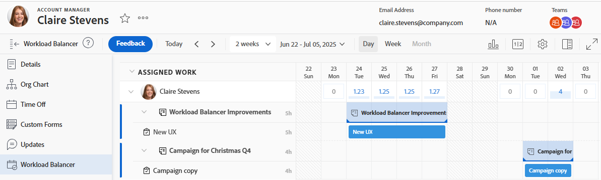

# Leta reda på arbetsbelastningsutjämnaren

Du kan använda belastningsutjämnaren för att schemalägga resurser för arbete eller granska deras tillgänglighet och aktuella allokeringar.

Du kommer åt Utjämning av arbetsbelastning på följande sätt:

* Från flera områden som fördefinierats av Adobe Workfront
* Genom att lägga till den på den vänstra panelen som en kontrollpanel

I den här artikeln beskrivs de områden där du kan komma åt belastningsutjämnaren.

>[!NOTE]
>
>Oavsett vilken metod du använder för att komma åt arbetsbelastningsutjämnaren är navigeringen och hanteringen av resurser identiska.
>
>Mer information om belastningsutjämnaren för arbetsbelastning och hur du använder den för att hantera och schemalägga resurser för arbete finns i följande artiklar:
>
>* [Översikt över belastningsutjämnaren](../../resource-mgmt/workload-balancer/overview-workload-balancer.md)
>* [Navigera i arbetsbelastningsutjämnaren](../../resource-mgmt/workload-balancer/navigate-the-workload-balancer.md)
>* [Översikt över tilldelning av arbete i arbetsbelastningsutjämnaren](../../resource-mgmt/workload-balancer/assign-work-in-workload-balancer.md)
>* [Hantera användarallokeringar i arbetsbelastningsutjämnaren](../../resource-mgmt/workload-balancer/manage-user-allocations-workload-balancer.md)

## Åtkomstkrav

+++ Expandera om du vill visa åtkomstkrav för funktionerna i den här artikeln.

<table style="table-layout:auto"> 
 <col> 
 <col> 
 <tbody> 
  <tr> 
   <td>Adobe Workfront package</td> 
   <td>
Alla
</td>
  </tr> 
  <tr> 
   <td>Adobe Workfront-licens</td> 
   <td>
Standard

       
Planera, när du använder belastningsutjämnaren för arbetsbelastning i resursområdet; Arbeta när du använder belastningsutjämnaren för ett team eller projekt

       
Obs! Alla användare har tillgång till arbetsbelastningsutjämnaren i sina egna användarprofiler, utan några licenskrav.
</td>
  </tr> 
   <td>Konfigurationer på åtkomstnivå</td> 
   <td> 
Visa eller öka åtkomsten till följande:
 
    <ul> 
     <li>Resurshantering</li> 
     <li>Projekt</li> 
     <li>Uppgifter</li> 
     <li>Problem</li> 
    </ul> </td> 
  </tr> 
  <tr> 
   <td>Objektbehörigheter</td> 
   <td>Visa behörigheter eller högre för projekt, uppgifter och ärenden</td> 
  </tr> 
 </tbody> 
</table>

Mer information finns i [Åtkomstkrav i Workfront-dokumentationen](/help/quicksilver/administration-and-setup/add-users/access-levels-and-object-permissions/access-level-requirements-in-documentation.md).

+++

## Åtkomst till belastningsutjämnaren i fördefinierade områden

Följande avsnitt visar var du kan komma åt Utjämning av arbetsbelastning i Workfront.

### Få åtkomst till belastningsutjämnaren för flera projekt i resursområdet

{{step1-to-resourcing}}

1. Klicka på **Utjämning av arbetsbelastning** i den vänstra panelen.

   

   I Utjämning av arbetsbelastning visas följande som standard i området Resurser:

   * **Ej tilldelat arbete**: Inga ej tilldelade arbetsuppgifter.
   * **Tilldelat arbete**: Alla aktiva användare i systemet.

     Vi rekommenderar att du använder filter när du visar användare i området Tilldelat arbete. Mer information finns i [Filtrera information i Utjämning av arbetsbelastning](../workload-balancer/filter-information-workload-balancer.md).

### Åtkomst till belastningsutjämnaren för ett team

Mer information om team i Workfront finns i [Teams overview](/help/quicksilver/people-teams-and-groups/create-and-manage-teams/teams-overview.md).

{{step1-to-team}}

Hemteamets sida visas.

1. Klicka på **Utjämning av arbetsbelastning** i den vänstra panelen.

   

   Arbetsbelastningsutjämnaren för ett team visar följande information som standard:

   * **Ej tilldelat arbete**: Objekt som tilldelats teamet och inte tilldelats användare.
   * **Tilldelat arbete**: Alla medlemmar i teamet med alla deras tilldelningar.

     >[!TIP]
     >
     >Teammedlemmar kan tilldelas till arbete som även tilldelats teamet eller till arbete som tilldelats andra team eller roller.

### Åtkomst till belastningsutjämnaren för ett projekt

{{step1-to-projects}}

1. Klicka på namnet på ett projekt för att öppna projektsidan.
1. Klicka på **Utjämning av arbetsbelastning** i den vänstra panelen.

   Utjämning av arbetsbelastning för projektet visas.

   

   I arbetsbelastningsutjämnaren för ett projekt visas följande som standard:

   * **Ej tilldelat arbete**: Objekt från projektet som har tilldelats till jobbroller eller team och som inte har tilldelats användare.
   * **Tilldelad arbetsuppgift**: Användare tilldelade till objekt i projektet.

     >[!TIP]
     >
     >Du kan visa alla användare i systemet i stället för endast de som finns i projektet (i området Tilldelad arbetsyta) genom att aktivera alternativet Visa alla användare. Mer information finns i [Navigera i arbetsbelastningsutjämnaren](../workload-balancer/navigate-the-workload-balancer.md).

### Åtkomst till arbetsbelastningsutjämnaren för en användare

Alla användare har tillgång till arbetsbelastningsutjämnaren för sina egna profiler. Utjämningsdata för arbetsbelastning för en användare är skrivskyddade. Du kan inte tilldela arbete, ta bort tilldelning av arbete eller justera allokeringar på användarnivå.

Alla visningsinställningar är tillgängliga för en användares arbetsbelastningsutjämnare. Mer information finns i [Navigera i arbetsbelastningsutjämnaren](/help/quicksilver/resource-mgmt/workload-balancer/navigate-the-workload-balancer.md).

{{step1-click-profile-pic}}

1. Klicka på **Utjämning av arbetsbelastning** i den vänstra panelen.

   Arbetsbelastningsutjämnaren för användaren visas.

   

   I arbetsbelastningsutjämnaren för en användare visas följande som standard:

   * **Tilldelat arbete**: Aktiviteter och ärenden som tilldelats den specifika användaren.

## Lägg till belastningsutjämnaren för arbetsbelastning på den vänstra panelen som en kontrollpanel

Du kan lägga till belastningsutjämnaren som en kontrollpanel på den vänstra panelen med objekt som tillåter anpassning.

De flesta anpassningar som du redan har tillämpat på Utjämning av arbetsbelastning bevaras när du lägger till dem på den vänstra panelen.

1. Gå till Utjämning av arbetsbelastning genom att gå till något av följande:

   * Resursområdet
   * Ett team
   * Ett projekt

1. Hämta en delbar länk och kopiera den till Urklipp enligt beskrivningen i [Dela arbetsbelastningsutjämnaren med en länk](../../resource-mgmt/workload-balancer/share-link-for-workload-balancer.md).
1. Skapa en instrumentpanel med en extern sida enligt beskrivningen i [Bädda in en extern webbsida i en instrumentpanel](../../reports-and-dashboards/dashboards/creating-and-managing-dashboards/embed-external-web-page-dashboard.md). Använd den delningsbara länken som du fick i steg 2 för den externa sidan.

   <!--
      (NOTE: ensure this stays correct)
      -->

1. Lägg till en kontrollpanel i den vänstra navigeringspanelen för ett objekt, så som beskrivs i [Lägg till en kontrollpanel i den vänstra panelen för ett Workfront-objekt eller -område](../../workfront-basics/manage-your-account-and-profile/configuring-your-user-profile/create-custom-tabs.md) för att placera kontrollpanelen på den anpassade fliken.

   När du öppnar Utjämning av arbetsbelastning från kontrollpanelen kan du visa den som om du använde den direkt från ett av dess ursprungliga områden som listas i steg 1.

   <!--
      (NOTE: ensure this stays correct)
     -->

1. (Valfritt) Dela instrumentpanelen i en layoutmall enligt beskrivningen i [Anpassa den vänstra panelen med en layoutmall](../../administration-and-setup/customize-workfront/use-layout-templates/customize-left-panel.md) .

<!--
For a team:

* From the Workload Balancer section of a team.

  You can adjust allocations and review or assign work from multiple projects to individual team members.

For a project:

  You can do the following when you use the Workload Balancer within a project:

   * Assign work on the project to users already assigned other work on the project.
   * Assign work to any user that might not be on the project.

   * View additional work that users are assigned to on other projects.
   * Adjust user allocations to work items.
   -->
