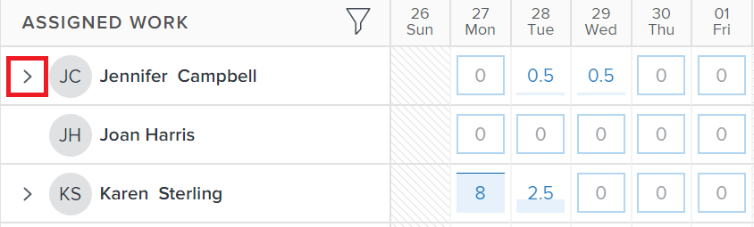

# Hantera användarallokeringar i Utjämning av arbetsbelastning

<!-- Audited: 01/2024 -->

{{highlighted-preview}}

Som resurshanterare kan du tilldela användare arbete och hantera deras dagliga, veckovisa eller månadsvisa tilldelningar från belastningsutjämnaren för att se till att de tilldelas ett antal timmar som passar i deras tillgängliga scheman.

## Åtkomstkrav {#access-requirements}

+++ Expandera om du vill visa åtkomstkrav för funktionerna i den här artikeln.

Du måste ha följande:

<table style="table-layout:auto"> 
 <col> 
 <col> 
 <tbody> 
  <tr> 
   <td role="rowheader">Adobe Workfront</td> 
   <td> 
Alla 
 </td> 
  </tr> 
  <tr> 
   <td role="rowheader">Adobe Workfront-licens</td> 
   <td>
   
När du använder Utjämning av arbetsbelastning i resursområdet behöver du:

   
Nytt: Standard

   
eller

   
Aktuell: Planera

   
När du använder belastningsutjämnaren för ett team eller projekt behöver du:

   
Nytt: Standard

   
eller

   
Aktuell: Arbete

 </td> 
  </tr> 
  <tr> 
   <td role="rowheader">Åtkomstnivåkonfiguration</td> 
   <td> 
Redigera åtkomst till följande:
 
    <ul> 
     <li> 
Resurshantering
 </li> 
     <li> 
Projekt
 </li> 
     <li> 
Uppgifter
 </li> 
     <li> 
Problem
 </li> 
    </ul> </td> 
  </tr> 
  <tr> 
   <td role="rowheader">Objektbehörigheter</td> 
   <td> 
Contribute-behörigheter eller högre som innehåller Gör tilldelningar till de uppgifter och utgåvor som du vill hantera tilldelningar för. 
 
eller 
 
Hantera behörigheter för de uppgifter som du vill uppdatera de planerade timmarna för, förutom att uppdatera allokeringar. Information om hur du uppdaterar planerade timmar i arbetsbelastningsutjämnaren finns i <a href="#update-task-planned-hours-when-managing-user-allocations">Uppdatera planerade timmar för aktiviteter vid hantering av användarallokeringar</a> i den här artikeln.
 </td> 
  </tr> 
 </tbody> 
</table>

Mer information om tabellen finns i [Åtkomstkrav i Workfront-dokumentation](/help/quicksilver/administration-and-setup/add-users/access-levels-and-object-permissions/access-level-requirements-in-documentation.md).

+++

## Förstå användarallokeringar

Användartilldelningar är timtals som anger hur mycket en användare ska tillbringa en viss dag eller veckodag, vecka eller månad för att slutföra arbetsuppgiften. De ingår i arbetsuppgiftens planerade timmar.

I den här artikeln beskrivs hur du uppdaterar dagliga, veckovisa eller månadsvisa tilldelningar för användare som har tilldelats uppgifter eller utgåvor. Information om hur du hanterar övergripande allokeringar för användare och jobbroller till uppgifter finns i [Hantera användar- och rollallokeringstimmar för uppgifter](../../manage-work/tasks/assign-tasks/manage-allocation-hours-on-tasks.md).

### Översikt över användarallokering {#user-allocation-overview}

Du kan visa användarallokering som timmar eller som ett procentvärde i Utjämning av arbetsbelastning. Du kan justera timmar eller procenttal.

Användarallokeringar inkluderas i antalet planerade timmar för en arbetsuppgift. Mer information om planerade timmar finns i [Översikt över planerade timmar](../../manage-work/tasks/task-information/planned-hours.md).

Aktivitetens planerade timmar fördelas jämnt mellan alla dagar inom aktivitetens varaktighet för användaren som tilldelats uppgiften. Om en aktivitet till exempel har en varaktighet på 5 dagar och totalt 10 planerade timmar, är antalet dagliga allokeringar för aktiviteten 2 timmar. Veckotilldelningen är 10 timmar. Det innebär att en användare tilldelas att arbeta med uppgiften i två timmar varje dag. Du kan dock ändra den dagliga allokeringen för användaren manuellt med hjälp av Utjämning av arbetsbelastning.

>[!CAUTION]
>
>Utjämning av arbetsbelastning visar endast upp till 1 000 planerade timmar per arbetsuppgift och upp till 1 000 dagar av ett objekts varaktighet. Allokeringarna i Utjämning av arbetsbelastning visas som noll när gränsen på 1 000 timmar eller 1 000 dagar har uppnåtts. Vi rekommenderar att du delar upp uppgifter i mindre underaktiviteter för ett större antal planerade timmar eller för varaktigheter på mer än 1 000 dagar.

Tänk på följande när du söker efter dagliga, veckovisa eller månadsvisa tilldelningar för uppgifter eller utgåvor i Utjämning av arbetsbelastning:

* Du kan visa dagliga, veckovisa och månadsvisa allokeringar av användarna till deras arbetsposter. Aktivera vyn Vecka eller Månad om du vill visa varje vecka- eller månadstilldelning.
* Du kan använda Utjämning av arbetsbelastning för att ändra den dagliga, veckovisa eller månadsvisa fördelningen av användarna till uppgifter eller utgåvor. Mer information om hur du justerar vyn för belastningsutjämnaren finns i [Navigera till arbetsbelastningsutjämnaren](../../resource-mgmt/workload-balancer/navigate-the-workload-balancer.md).

  >[!NOTE]
  >
  >Vi rekommenderar att du bestämmer vilken tidsram (varje dag, varje vecka eller varje månad) som du alltid vill använda när du hanterar användartilldelningar och inte växlar mellan dem för samma arbetsobjekt. Om du uppdaterar veckoallokeringar för samma användare som du tidigare har uppdaterat dagliga allokeringar för ändras den dagliga allokeringen för användaren.

* Du kan uppdatera allokeringar för både arbetsdagar och arbetsdagar som inte är arbetsdagar.
* Tidsstämplarna för planerad start och planerad slutförandedatum för arbetsuppgifterna samt schemat för projektet är viktiga när Workfront automatiskt beräknar den dagliga allokeringen för uppgiften.

  >[!INFO]
  >
  > En aktivitet kan till exempel ha en varaktighet på 2 dagar och 2 planerade timmar och en planerad starttid på 12:00 på den första dagen i varaktigheten med en användare och ett projektschema som slutar klockan 17:00. Användarens kapacitet för första dagen är fem timmar. Användarens kapacitet för den andra dagen är 8 timmar (om schemat börjar klockan 09:00).
  >
  >Workfront beräknar fördelningen av de två timmarna under de två dagarna i tidsperioden med hjälp av följande formel:
  >
  >`Daily allocation hours = (Total Planned Hours / Total of available hours) * Daily available hours`
  >
  >Till exempel är de dagliga tilldelningstimmarna för varje dag:
  >   
  >(2 / 13) * 5 = 0,77 allokeringstimmar för första dagen
  >
  >(2 / 13) * 8 = 1,23 allokeringstimmar för den andra dagen
  >
  >I ovanstående beräkningar är 13 det totala antalet tillgängliga timmar för uppgiften: 5 + 8 = 13

* Två användare i olika tidszoner eller scheman i andra tidszoner än de tilldelade användarnas kan få allokeringsbeloppen att se annorlunda ut för två användare som visar samma arbetsobjekt.

* När en användare har schemalagt en ledig tid visas dagen eller delen av dagen i grå bakgrund, och en flygplansikon anger att tiden är avstängd. Om Workfront-administratören har aktiverat inställningen för användartid av i inställningsområdet för att ta hänsyn till användarens ledig tid, flyttas de tilldelade timmarna till nästa tillgängliga dag i tidslinjen. Om inställningen är inaktiverad finns de tilldelade timmarna kvar den dag som är markerad som ledig och användaren visas som överallokerade. Mer information finns i [Konfigurera systemomfattande projektinställningar](../../administration-and-setup/set-up-workfront/configure-system-defaults/set-project-preferences.md).

  >[!TIP]
  >
  >Om tidsgränsen markerades efter att användaren tilldelades en arbetsuppgift, måste du beräkna om projektets tidslinje för att visa den flyttade allokeringen. Mer information finns i [Beräkna om projekttidslinjer](../../manage-work/projects/manage-projects/recalculate-project-timeline.md).

   * När flera användare tilldelas till en aktivitet och den primära tilldelande har en schemalagd tid av, flyttas tidslinjen (om datumen inte är fasta) och de planerade timmarna för alla tilldelningar fördelas över aktivitetens nya varaktighet. Om aktiviteten har fasta datum ändras inte tidslinjen på grund av ledig tid, och timmarna fördelas om mellan de återstående dagarna.
   * Om allokeringar görs manuellt, kommer de planerade timmarna inte att allokeras om efter tidpunkten för avtilldelningen.

* Om det finns flera användare tilldelade till uppgiften, fördelas antalet planerade timmar jämnt till varje användare först, sedan jämnt till varje dag under uppgiftens varaktighet. Distributionen blir den allokering som varje användare tilldelas till uppgiften.

  Följande scenarier kan finnas:

   * För en aktivitet med en varaktighet på 2 dagar och med 10 planerade timmar tilldelade till en användare, är daglig allokering för användaren 5 timmar för varje dag som standard.
   * För en uppgift med en varaktighet på 2 dagar och med 10 planerade timmar tilldelade till två användare, är daglig allokering för varje användare 2,5 timmar för varje dag som standard.

* Om en uppgift eller ett problem har slutförts före det planerade slutförandedatumet, nås antalet allokerade timmar för återstående dagar och räknas inte av mot användarens totala allokering. Detta visas bara när både ikonen Visa allokeringar och inställningen Visa planerade datum är aktiverad. Mer information om hur du aktiverar inställningar i Utjämning av arbetsbelastning finns i [Navigera till arbetsbelastningsutjämnaren](../../resource-mgmt/workload-balancer/navigate-the-workload-balancer.md).

  

* När en användare är överallokerad visas deras tilldelade timmar med en röd bakgrund i användarfältet.
* När användaren är underallokerad eller tilldelad ett lika stort antal timmar till sin schemalagda tillgängliga tid visas timmarna med en blå bakgrund.
* Du kan visa användarens allokering i en diagramvy på användarraden. Mer information om hur du aktiverar diagramvyn för användartilldelningar finns i avsnittet Navigera i arbetsbelastningsutjämnaren i artikeln [Navigera till arbetsbelastningsutjämnaren](../../resource-mgmt/workload-balancer/navigate-the-workload-balancer.md).

  

### Kriterier som återställer användartilldelningar {#criteria-that-reset-user-allocations}

Alla aktivitetsändringar utlöser inte de ändrade allokeringarna för omfördelning. Det finns dock vissa åtgärder som kan återställa de redan justerade allokeringarna för dina resurser och distribuera dem jämnt till alla dagar under arbetsuppgiftens varaktighet för var och en av de tilldelade.

>[!NOTE]
>
>Om du inte har ändrat den automatiska fördelningen av allokeringar för arbetsobjekt, fördelas timmarna jämnt mellan alla tilldelningar när antalet tilldelningar, varaktigheten för en uppgift eller antalet planerade timmar för arbetsobjektet ändras.

#### Åtgärder som återställer justerade allokeringar {#actions-that-reset-adjusted-allocations}

Följande åtgärder återställer eller ändrar dagliga, veckovisa eller månadsvisa tilldelningar för användare efter att du har justerat dem manuellt enligt beskrivningen i [Ändra användarallokeringar](#modify-user-allocations) i den här artikeln:

* När du förkortar längden på en arbetsuppgift som förkortar antalet dagar i varaktigheten, läggs de justerade allokerade timmarna från de förlorade dagarna till i allokeringsbeloppet för den sista dagen i arbetsuppgiften.
* När du ändrar antalet planerade timmar för ett uppdrag eller för arbetsuppgiften, fördelas det nya antalet planerade timmar jämnt över hela varaktigheten för arbetsuppgiften.
* När du lägger till eller tar bort en tilldelad till en arbetsuppgift och det gör att de planerade timmarna för uppgiften ändras, fördelas de justerade värdena jämnt.

#### Åtgärder som inte återställer justerade allokeringar {#actions-that-do-not-reset-adjusted-allocations}

Följande ändringar av en arbetsuppgift utlöser inte de justerade allokeringarna för att återställa eller ändra:

* När du flyttar dagar för en arbetsuppgift men antalet dagar i varaktigheten inte ändras, ändras inte de justerade allokerade värdena och flyttas till de nya datumen.
* När du ökar Varaktighet för en arbetsuppgift som ökar antalet dagar i Varaktighet, förblir de justerade allokerade timmarna desamma för de justerade dagarna. Ytterligare dagar läggs till i arbetsuppgiften med 0 allokerade timmar.
* När du lägger till eller tar bort en tilldelad till en arbetsuppgift och detta inte medför att objektets planerade timmar ändras, ändras inte de justerade värdena.

## Hitta planerade timmar i arbetsbelastningsutjämnaren

Du kan ändra användartilldelningar för uppgifter eller ärenden med hjälp av Utjämning av arbetsbelastning genom att hitta de planerade timmarna för uppgifter eller ärenden som tilldelats användare.

Tänk på följande när du visar Planerade timmar i Utjämning av arbetsbelastning:

* Det totala antalet planerade timmar för en aktivitet eller ett problem visas bredvid uppgifts- eller problemnamnet till vänster om arbetsbelastningsutjämnaren.

* Det totala antalet planerade timmar för ett projekt visas bredvid projektnamnet till vänster om arbetsbelastningsutjämnaren. Detta representerar det totala antalet planerade timmar för alla aktiviteter och utgåvor som listas under projektet i Utjämning av arbetsbelastning och inte alla planerade timmar för projektet.
* Den tid som tilldelas dagligen eller veckovis för alla uppgifter och för alla projekt visas bara när du manuellt aktiverar inställningen Visa allokeringar. Mer information om hur du aktiverar inställningar i Arbetsbelastningsutjämnaren finns i [Navigera till arbetsbelastningsutjämnaren](../../resource-mgmt/workload-balancer/navigate-the-workload-balancer.md).

## Ändra användarallokeringar {#modify-user-allocations}

Som en del av tilldelningen av arbete till användare kan du ändra användarallokeringar i Utjämning av arbetsbelastning för att se till att de aldrig överfördelas, eller för att säkerställa en korrekt balans mellan timmarna mellan dina resurser. Mer information om hur du identifierar om en användare är överbelagd finns i avsnittet [Översikt över användarallokering](#user-allocation-overview) i den här artikeln.

1. Se till att du har uppgifter och ärenden tilldelade till användarna. Mer information om hur du tilldelar användare arbete i Utjämning av arbetsbelastning finns i [Översikt över tilldelning av arbete i belastningsutjämnaren](../../resource-mgmt/workload-balancer/assign-work-in-workload-balancer.md).
1. Gå till Utjämning av arbetsbelastning.
1. (Valfritt) Klicka på **Vecka** eller **Månad** för att hantera vecko- eller månadstilldelning för användare.

   

1. I **Tilldelat arbete** söker du efter användaren som du vill ändra allokeringen för manuellt och klickar på högerpilen till vänster om användarnamnet för att utöka användaren.

   

1. Klicka på högerpilen till vänster om projektnamnet för att expandera projektet och visa arbetsobjekten som användaren har tilldelats.

   >[!TIP]
   >
   >Du kan endast ändra användartilldelningar för uppgifter och ärenden. Du kan inte ändra användarallokeringar för projekt.

1. (Valfritt) Klicka på **Visa allokeringar** icon  för att visa allokeringar för alla arbetsobjekt.

   Namnet på aktiviteterna och projekten ersätts med användarens tilldelning för uppgiften eller projektet.

1. (Valfritt) Klicka på **Inställningar** icon  och välj något av följande alternativ:

   1. **Inkludera timmar från utleveranser**. På så sätt kan du hantera utleveransallokeringar utöver uppgiftsallokeringar.
   1. **Visa slutfört arbete**. Här visas artiklar som har slutförts och schemalagts under tidslinjen som du hanterar allokeringar för.
   1. **Visa återstående tid**. Det totala antalet timmar för varje användare (på användarraden) ändras. När den här inställningen är aktiverad visas de timmar som varje användare har tillgängligt för arbete i stället för det antal timmar som de har tilldelats.

      >[!TIP]
      >
      >Om du ändrar allokeringar när den här inställningen är aktiverad minskar det totala antalet på användarraden.

   1. **Projekt** i **Välj färgtema** -avsnitt. Detta visar varje projekt och dess respektive arbetsobjekt i unika färger och gör det lättare att förstå vilka objekt som tillhör vilket projekt.
   1. **Procent** i **Visa användarallokering i** -avsnitt. Detta visar allokeringar som ett procentvärde. Användarens kapacitet enligt schemat anses vara 100 %. Om en användare till exempel är associerad med ett schema på 8 timmar per dag är 8 timmar lika med 100 % kapacitet. Om du vill tilldela användaren fyra timmar per dag uppdaterar du hans/hennes tilldelning till 50 %.

      >[!NOTE]
      >
      >Workfront-administratören bestämmer vilket schema som ska användas i hela systemet för att beräkna användarens kapacitet i området Resurshantering i installationsprogrammet. Mer information finns i [Konfigurera inställningar för resurshantering](../../administration-and-setup/set-up-workfront/configure-system-defaults/configure-resource-mgmt-preferences.md).

1. Klicka på **Mer** meny  för en arbetsuppgift, klicka sedan på **Redigera allokeringar**.

   

   eller

   Dubbelklicka på dag, vecka eller månad i fältet för en uppgift eller ett problem.

   Allokeringsrutorna kan redigeras.

1. Klicka i rutan för varje daglig, veckovis eller månadsvis tilldelning för att manuellt uppdatera timbeloppet eller procentvärdet som du vill att användaren ska tilldelas för varje dag, vecka eller månad. Klicka sedan på **Spara** icon .

   >[!TIP]
   >
   >Klicka på **Avbryt** icon  för att ta bort de allokeringar du har justerat.

   

   Allokeringar för användaruppdateringen.

   >[!TIP]
   >
   >Om en uppgift eller ett problem har slutförts före det planerade slutförandedatumet, nås antalet allokerade timmar för återstående dagar och räknas inte av mot användarens totala allokering. Detta visas bara när båda **Visa allokeringar** -ikonen och **Visa planerade datum** inställningen är aktiverad.

   Följande scenarier finns:

   * För uppgifter med varaktighetstyper som inte är enkla eller för utgåvor måste totalsumman för allokeringarna matcha aktiviteten Planerade timmar innan du kan klicka på bockmarkeringsikonen.
   * För uppgifter med en enkel varaktighetstyp kan summan av allokeringarna vara högre eller lägre än de planerade timmarna och du kan klicka på bockmarkeringsikonen även om de inte matchar. Detta uppdaterar även mängden planerade timmar för aktiviteten. Du måste ha rätt behörighet och åtkomst för att kunna uppdatera planerade timmar för uppgifter från Utjämning av arbetsbelastning.

     >[!TIP]
     >
     >En låsikon visas till höger om aktivitetsnamnet när du börjar justera dina allokeringar för att ange att aktiviteten har en enkel varaktighetstyp.

     

   Mer information om villkoren som måste uppfyllas för att schemalagda timmar ska kunna uppdateras i arbetsbelastningsutjämnaren finns i [Uppdatera planerade timmar för aktiviteter vid hantering av användarallokeringar](#update-task-planned-hours-when-managing-user-allocations) i den här artikeln. Mer information om aktivitetens varaktighetstyper finns i [Översikt över aktivitetsvaraktighet och varaktighetstyp](../../manage-work/tasks/taskdurtn/task-duration-and-duration-type.md).

1. (Villkorligt) Om uppgiften har tilldelats fler än en användare upprepar du de här stegen för varje användare som har tilldelats uppgiften för att uppdatera allokeringarna för varje användare.

   Alla som har åtkomst till att visa arbetsbelastningsutjämnaren och visar samma användare och samma projekt som du hanterade, visar nu den uppdaterade allokeringen för de användare som du hanterade.

>[!TIP]
>
>En pennikon visas till höger om arbetsobjektets namn för att ange att det justerats manuellt.

## Uppdatera planerade timmar för aktiviteter vid hantering av användarallokeringar {#update-task-planned-hours-when-managing-user-allocations}

Du kan uppdatera de planerade timmarna för en uppgift när du hanterar användartilldelningar i Utjämning av arbetsbelastning för uppgiften. Detta inträffar när det totala antalet uppdaterade allokerade timmar inte matchar det ursprungliga antalet planerade timmar för en aktivitet.

>[!IMPORTANT]
>
>* Om du uppdaterar planerade timmar för uppgifter kan det påverka projektets förlopp.
>* Manuell uppdatering av Planerade timmar genom att ändra dagliga allokeringar kan påverka Planerade timmar när tilldelningar tas bort från aktiviteterna i framtiden. Mer information finns i [Översikt över planerade timmar](../../manage-work/tasks/task-information/planned-hours.md).
>
>* Det går inte att uppdatera planerade timmar för utgåvor genom att uppdatera allokeringar i Utjämning av arbetsbelastning.

Detta är möjligt när följande villkor är uppfyllda:

* Du har rätt behörigheter och åtkomst för att hantera planerade timmar från arbetsbelastningsutjämnaren. Bland dessa finns följande:

   * Hantera behörigheter för aktiviteterna.
   * Uppdatera planerade timmar i åtkomsten till belastningsutjämnaren för arbetsbelastning i resurshanteringsområdet på åtkomstnivån.

  Mer information om åtkomsten som behövs för att använda belastningsutjämnaren finns i [Åtkomstkrav](#access-requirements) i den här artikeln.

* Aktiviteten har varaktighetstypen Enkel.

