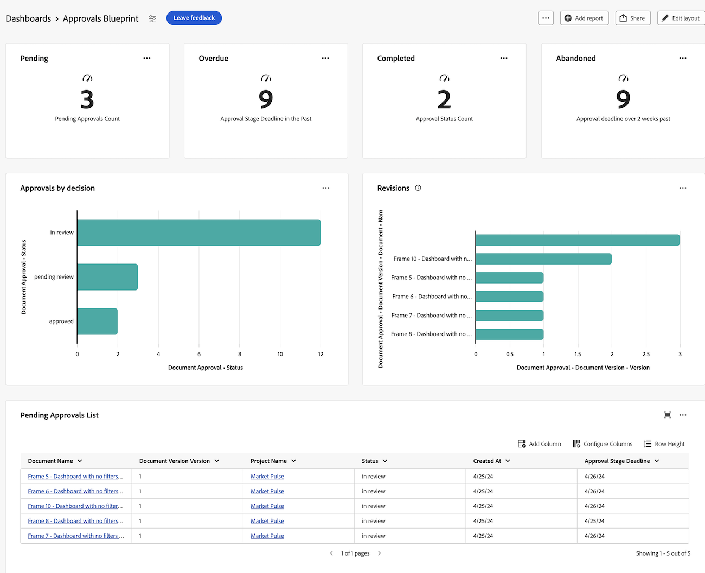

# Skapa en rapportkontrollpanel för granskning och godkännande

Du kan skapa en rapportkontrollpanel i Canvas Dashboards-området för att visa både högnivåinformation och detaljerad information om granskningar och godkännanden med den nya funktionen för dokumentgodkännanden.

>[!IMPORTANT]
>
>Den här funktionaliteten är endast tillgänglig för kunder som använder den nya tjänsten för dokumentgodkännande och som är inskrivna i betaversionen av Canvas Dashboards.

## Skapa en instrumentpanel

{{step1-to-dashboards}}

1. Klicka på **Arbetsytans kontrollpaneler** i den vänstra panelen.
1. Klicka på **Ny instrumentpanel**.
1. Ge instrumentpanelen ett namn.
1. (Valfritt) Lägg till en beskrivning.
1. Klicka på **Skapa**.
   

När du har skapat en kontrollpanel kan du börja lägga till KPI:er, diagram och tabeller. Mer information finns i följande avsnitt:

* [Lägg in gransknings- och godkännandeinformation på hög nivå med nyckeltal och diagram](#add-high-level-review-and-approval-information-with-kpis-and-charts)
* [Lägg in detaljerad gransknings- och godkännandeinformation i tabeller](#add-detailed-review-and-approval-information-with-tables)

## Lägg in gransknings- och godkännandeinformation på hög nivå med nyckeltal och diagram

Du kan visa högnivåinformation om dokumentgodkännanden med nyckeltal och diagram. Det finns för närvarande ingen detaljinformation i betaversionen.

### KPI:er

#### Väntande godkännanden

1. [Skapa en instrumentpanel](#create-a-dashboard) enligt beskrivningen i avsnittet ovan.
1. Klicka på **Lägg till** på **KPI**-kortet.
1. Skriv _Väntande_ i textrutan **KPI-titel**.
1. Skriv _Väntande godkännanden_ i textrutan **KPI-beskrivning**. Den här texten beskriver vad KPI:n visar.
1. Klicka på **Välj KPI-fält** överst på sidan.
1. Bläddra nedåt och hitta mappen **Dokumentgodkännande**.
1. Välj **Status** och sedan **Antal** i listrutan.
1. Klicka på **Redigera filter** > **Lägg till villkor**.
   1. Klicka på det tomma villkorsfiltret, klicka på **Välj ett fält** och välj sedan **Status**.
   1. Låt operatorn vara **lika med** och skriv _väntande granskning_ i textrutan.
      
1. Klicka på **Klar** i skärmens övre högra hörn.

#### Försenade godkännanden

1. [Skapa en instrumentpanel](#create-a-dashboard) enligt beskrivningen i avsnittet ovan.
1. Klicka på **Lägg till** på **KPI**-kortet.
1. Skriv _Försenad_ i textrutan **KPI-titel**.
1. Skriv _Deadline för godkännandefas i textrutan Senaste_ i **KPI-beskrivningen**. Den här texten beskriver vad KPI:n visar.
1. Klicka på **Välj KPI-fält** överst på sidan.
1. Bläddra nedåt och hitta mappen **Dokumentgodkännande**.
1. Välj **Status** och sedan **Antal** i listrutan.
1. Klicka på **Redigera filter** > **Lägg till villkor**:
   1. Klicka på det tomma villkorsfiltret, klicka på **Välj ett fält** och välj sedan **Deadline**.
   1. Ändra operatorn till **Mindre än** och växla Relativt datum till På. Skriv sedan _$$TODAY_ i textrutan.
      
1. Klicka på **Lägg till villkor**:
   1. Klicka på det tomma villkorsfiltret, klicka på **Välj ett fält** och välj sedan **Status**.
   1. Ändra operatorn till **Innehåller inte** och skriv sedan _godkänt_ i textrutan.
      
1. Klicka på **Klar** i skärmens övre högra hörn.

#### Slutförda godkännanden

1. [Skapa en instrumentpanel](#create-a-dashboard) enligt beskrivningen i avsnittet ovan.
1. Klicka på **Lägg till** på **KPI**-kortet.
1. Skriv _Slutförd_ i textrutan **KPI-titel**.
1. Skriv _Antal godkännandestatus_ i textrutan **KPI-beskrivning**. Den här texten beskriver vad KPI:n visar.
1. Klicka på **Välj KPI-fält** överst på sidan.
1. Bläddra nedåt och hitta mappen **Dokumentgodkännande**.
1. Välj **Status** och sedan **Antal** i listrutan.
1. Klicka på **Redigera filter** > **Lägg till villkor**:
   1. Klicka på det tomma villkorsfiltret, klicka på **Välj ett fält** och välj sedan **Status**.
   1. Ändra operatorn till **Innehåller** och skriv _godkänt_ i textrutan.
      
1. Klicka på **Lägg till villkor**:
   1. Klicka på **And** om du vill ändra den till **Or**.
   1. Klicka på det tomma villkorsfiltret, klicka på **Välj ett fält** och välj sedan **Status**.
   1. Ändra operatorn till **Lika med** och skriv sedan _Granskad_ i textrutan.
      
1. Klicka på **Klar** i skärmens övre högra hörn.

#### Övergivna godkännanden

1. [Skapa en instrumentpanel](#create-a-dashboard) enligt beskrivningen i avsnittet ovan.
1. Klicka på **Lägg till** på **KPI**-kortet.
1. Skriv _Borttagen_ i textrutan **KPI-titel**.
1. Skriv _Deadline för godkännande över två veckor efter_ i textrutan **KPI-beskrivning**. Den här texten beskriver vad KPI:n visar.
1. Klicka på **Välj KPI-fält** överst på sidan.
1. Bläddra nedåt och hitta mappen **Document Approval Stage**.
1. Välj **Deadline** och sedan **Count** i listrutan.
1. Klicka på **Redigera filter** > **Lägg till villkor**:
   1. Klicka på det tomma villkorsfiltret, klicka på **Välj ett fält** och välj sedan **Status**.
   1. Ändra operatorn till **Innehåller inte** och skriv _godkänt_ i textrutan.
      
1. Klicka på **Lägg till villkor**:
   1. Klicka på det tomma villkorsfiltret, klicka på **Välj ett fält** och välj sedan **Deadline**.
   1. Ändra operatorn till **mindre än**, växla sedan Relativt datum till På och skriv _$$TODAY-2w_ i textrutan.
      
1. Klicka på **Klar** i skärmens övre högra hörn.

### Diagram

#### Godkännanden per beslutsstapeldiagram

1. [Skapa en instrumentpanel](#create-a-dashboard) enligt beskrivningen i avsnittet ovan.
1. Klicka på **Lägg till** på kortet **Diagram**.
1. Skriv _Godkännanden genom beslut_ i textrutan **Namn**.
1. (Valfritt) Skriv en beskrivning i textrutan **Beskrivning**. Den här texten visas som ett verktygstips bredvid diagramnamnet.
1. Klicka på **Öppna diagraminformation**.
1. Låt **Stapeldiagram** vara markerat på den nedrullningsbara menyn **Diagramtyp**.
1. Låt **Enkel** vara markerat i den nedrullningsbara menyn **Stapeltyp**.
1. Klicka på **Uppdatera fält** för **undre (X) axeln** och välj den första **Dokumentgodkännande**-mappen och sedan **Status**.
1. Ställ in aggregeringstypen på **Count**.
1. Klicka på **Uppdatera fält** för axeln **Vänster (Y)** och välj det första alternativet **Dokumentgodkännande** och sedan **Status**.
1. Klicka på filterfliken .
1. Klicka på **Redigera filter** > **Lägg till villkor**:
   1. Klicka på det tomma villkorsfiltret, klicka på **Välj ett fält** och välj sedan **Dokumentversion**.
   1. Ändra operatorn till **Är inte null**.
      
1. Klicka på **Klar** i skärmens övre högra hörn.

#### Diagram över ändringar

1. [Skapa en instrumentpanel](#create-a-dashboard) enligt beskrivningen i avsnittet ovan.
1. Klicka på **Lägg till** på kortet **Diagram**.
1. Skriv _Revisioner_ i textrutan **Namn**.
1. Skriv _Antal revisioner för dokument med ofullständiga beslut som planeras före månadens slut_ i textrutan **Beskrivning**. Den här texten visas som ett verktygstips bredvid diagramnamnet.
1. Klicka på **Öppna diagraminformation**.
1. Låt **Stapeldiagram** vara markerat på den nedrullningsbara menyn **Diagramtyp**.
1. Låt **Enkel** vara markerat i den nedrullningsbara menyn **Stapeltyp**.
1. Klicka på **Uppdatera fält** för **undre (X) axeln** och välj den första **Dokumentgodkännande**-mappen och sedan **Dokumentversion** > **Version**.
1. Ställ in aggregeringstypen på **Count**.
1. Klicka på **Uppdatera fält** för axeln **Vänster (Y)** och välj det första alternativet **Dokumentgodkännande** och sedan **Dokumentversion** > **Dokument** > **Namn**.
1. Klicka på filterfliken .
1. Klicka på **Redigera filter** > **Lägg till villkor**:
   1. Klicka på det tomma villkorsfiltret, klicka på **Välj ett fält** och välj sedan **Beslutsdatum för godkännandescendeltagare**.
   1. Ändra operatorn till **Är null**.
      
1. Klicka på **Redigera filter** > **Lägg till villkor**:
   1. Klicka på det tomma villkorsfiltret, klicka på **Välj ett fält** och välj sedan **deadlinen för godkännandefasen**.
   1. Ändra operatorn till **mindre än eller lika med**, och växla sedan Ange relativt datum på och skriv _$$TODAYem_ i textrutan.
      
1. Klicka på **Klar** i skärmens övre högra hörn.

## Lägg in detaljerad gransknings- och godkännandeinformation i tabeller

### Väntande godkännandelista

1. [Skapa en instrumentpanel](#create-a-dashboard) enligt beskrivningen i avsnittet ovan.
1. Klicka på **Lägg till** på kortet **Tabell**.
1. Skriv _Väntande godkännanden_ i textrutan **Namn**.
1. (Valfritt) Skriv en beskrivning i textrutan **Beskrivning**. Den här texten visas som ett verktygstips bredvid diagramnamnet.
1. Klicka på **Öppna kolumninställningar**.
1. Klicka på **Lägg till kolumn**, rulla nedåt och klicka på den första mappen **Dokumentgodkännanden** och välj sedan **Status**.
1. Lägg till följande kolumner:

   <table>
    <tr>
    <td><strong>Projektnamn</strong></td>
    <td>Dokumentversion &gt; Dokument &gt; Projekt &gt; Namn</td>
    </tr>
    <tr>
    <td><strong>Dokumentnamn</strong></td>
    <td>Dokumentversion &gt; Dokument &gt; skriv _Name_ i sökrutan.</td>
    </tr>
    <tr>
    <td><strong>Dokumentversion</strong></td>
    <td>Dokumentversion &gt; Dokument &gt; Version</td>
    </tr>
    <tr>
    <td><strong>Deadline</strong></td>
    <td>Dokument &gt; Godkännandefas &gt; Deadline</td>
    </tr>
    <tr>
    <td><strong>Begärd av</strong></td>
    <td>Dokument &gt; Godkännandefas &gt; Deltagare i godkännandefas* &gt; Beställare &gt; skriv _Name_ i sökrutan.</td>
    </tr>
     <tr>
    <td><strong>Begärt datum</strong></td>
    <td>Dokument &gt; Godkännandefas &gt; Deltagare i godkännandefas* &gt; Skapat på</td>
    </tr>
     <tr>
    <td><strong>Godkännare</strong></td>
    <td>Dokument &gt; Godkännandesteg &gt; Deltagare i godkännandefasen* &gt; Deltagare &gt; skriv _Name_ i sökrutan.</td>
    </tr>
    <table>

   *Deltagare i godkännandefasen trunkeras till godkännandesteg Pa..

1. Fortsätt till [Lägg till det nödvändiga filtret nedan](#add-the-required-filter).

#### Lägg till nödvändigt väntande godkännandefilter

1. Klicka på filterfliken .
1. Klicka på **Redigera filter** > **Lägg till villkor**:
   1. Klicka på det tomma villkorsfiltret, klicka på **Välj ett fält** och välj sedan **Status**.
   1. Ändra operatorn till **Lika med** och skriv sedan _Väntande godkännande_.
      
1. Lägg till valfria filter enligt beskrivningen nedan eller klicka på **Klar** i skärmens övre högra hörn.

**Valfria filter**

Om du vill visa mer specifik information beroende på hur du använder exemplet kan du lägga till ytterligare filtervillkor. Du kanske vill återskapa tabellen och lägga till nya filtervillkor per användningsfall.

+++ Expandera om du vill visa ytterligare filteralternativ

**Mina projekt**

1. Klicka på **Redigera filter** > **Lägg till villkor**:
   1. Klicka på det tomma villkorsfiltret, klicka på **Välj ett fält** och välj sedan **Dokumentversion** > **Dokument** > **Projekt** > **Ägare** > skriv _Namn_ i sökrutan.
   1. Ändra operatorn till **Lika med** och välj sedan **Jag (inloggad användare)** för att visa projekt i Workfront där du är markerad som projektägare.
      
1. Klicka på **Klar** i skärmens övre högra hörn.

**Godkännanden jag har skickat**

1. Klicka på **Redigera filter** > **Lägg till villkor**:
   1. Klicka på det tomma villkorsfiltret, klicka på **Välj ett fält** och välj sedan **Godkännandefas** > **Deltagare i godkännandefas** > **Beställare** > skriv _Namn_ i sökrutan.
   1. Ändra operatorn till **Lika med** och välj sedan **Jag (inloggad användare)** för att visa projekt i Workfront där du är markerad som projektägare.
      
1. Klicka på **Klar** i skärmens övre högra hörn.

+++

### Lista över försenade godkännanden

1. [Skapa en instrumentpanel](#create-a-dashboard) enligt beskrivningen i avsnittet ovan.
1. Klicka på **Lägg till** på tabellkortet.
1. Skriv _Försenade godkännanden_ i textrutan **Namn**.
1. (Valfritt) Skriv en beskrivning i textrutan **Beskrivning**. Den här texten visas som ett verktygstips bredvid diagramnamnet.
1. Klicka på **Öppna kolumninställningar**.
1. Klicka på **Lägg till kolumn**, rulla nedåt och klicka på den första mappen **Dokumentgodkännanden** och välj sedan **Status**.
1. Lägg till följande kolumner:

   <table>
    <tr>
    <td><strong>Projektnamn</strong></td>
    <td>Dokumentversion &gt; Dokument &gt; Projekt &gt; Namn</td>
    </tr>
    <tr>
    <td><strong>Dokumentnamn</strong></td>
    <td>Dokumentversion &gt; Dokument &gt; skriv _Name_ i sökrutan.</td>
    </tr>
    <tr>
    <td><strong>Dokumentversion</strong></td>
    <td>Dokumentversion &gt; Dokument &gt; Version</td>
    </tr>
    <tr>
    <td><strong>Deadline</strong></td>
    <td>Dokument &gt; Godkännandefas &gt; Deadline</td>
    </tr>
    <tr>
    <td><strong>Begärd av</strong></td>
    <td>Dokument &gt; Godkännandefas &gt; Deltagare i godkännandefas* &gt; Beställare &gt; skriv _Name_ i sökrutan.</td>
    </tr>
     <tr>
    <td><strong>Begärt datum</strong></td>
    <td>Dokument &gt; Godkännandefas &gt; Deltagare i godkännandefas* &gt; Skapat på</td>
    </tr>
     <tr>
    <td><strong>Godkännare</strong></td>
    <td>Dokument &gt; Godkännandesteg &gt; Deltagare i godkännandefasen* &gt; Deltagare &gt; skriv _Name_ i sökrutan.</td>
    </tr>
    <table>

   *Deltagare i godkännandefasen trunkeras till godkännandesteg Pa..

1. Fortsätt till [Lägg till det nödvändiga filtret nedan](#add-the-required-filter-1).

#### Lägg till nödvändigt filter för försenade godkännanden

1. Klicka på filterfliken .
1. Klicka på **Redigera filter** > **Lägg till villkor**:
   1. Klicka på det tomma villkorsfiltret, klicka på **Välj ett fält** och välj sedan **Godkännandesteg** > **Deadline**.
   1. Ändra operatorn till **Mindre än**, växla **Ange relativt datum** den och skriv sedan _$$TODAY_.
      
1. Lägg till valfria filter enligt beskrivningen nedan eller klicka på **Klar** i skärmens övre högra hörn.

**Valfria filter**

Om du vill visa mer specifik information beroende på hur du använder exemplet kan du lägga till ytterligare filtervillkor. Du kanske vill återskapa tabellen och lägga till nya, valfria filtervillkor per användningsfall.

+++ Expandera om du vill visa ytterligare filteralternativ

**Mina projekt**

1. Klicka på **Redigera filter** > **Lägg till villkor**:
   1. Klicka på det tomma villkorsfiltret, klicka på **Välj ett fält** och välj sedan **Dokumentversion** > **Dokument** > **Projekt** > **Ägare** > skriv _Namn_ i sökrutan.
   1. Ändra operatorn till **Lika med** och välj sedan **Jag (inloggad användare)** för att visa projekt i Workfront där du är markerad som projektägare.
      
1. Klicka på **Klar** i skärmens övre högra hörn.

**Godkännanden jag har skickat**

1. Klicka på **Redigera filter** > **Lägg till villkor**:
   1. Klicka på det tomma villkorsfiltret, klicka på **Välj ett fält** och välj sedan **Godkännandefas** > **Deltagare i godkännandefas** > **Beställare** > skriv _Namn_ i sökrutan.
   1. Ändra operatorn till **Lika med** och välj sedan **Jag (inloggad användare)** för att visa projekt i Workfront där du är markerad som projektägare.
      
1. Klicka på **Klar** i skärmens övre högra hörn.

**Mitt team**

1. Klicka på **Redigera filter** > **Lägg till villkor**:
   1. Klicka på det tomma villkorsfiltret, klicka på **Välj ett fält** och välj sedan **Godkännandefas** > **Deltagare i godkännandefas** > **Deltagargrupp** > skriv _Namn_ i sökrutan.
   1. Ändra operatorn till **Lika med** och välj sedan **Mina standardteam (inloggad användare)** eller **Mina andra team (inloggad användare)** för att visa projekt som tilldelats ditt standardteam eller andra team som du är på.
      
1. Klicka på **Klar** i skärmens övre högra hörn.
+++
