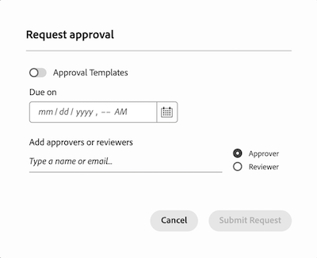

# Använd godkännanden och korrektur av nya dokument tillsammans

Godkännanden av nya dokument i Workfront innehåller en ny uppsättning funktioner som hjälper dig att granska och godkänna dokument. Du kan använda arbetsflödet för godkännande av nya dokument med det befintliga korrekturläsaren för att lägga till kommentarer och markeringar i dokument som granskas.

Det finns några viktiga skillnader i arbetsflödet när du använder godkännanden av nya dokument och korrektur tillsammans:

* Beslutsknappar visas inte i korrekturläsaren

* Deltagare visas i dokumentsammanfattningen, inte i korrekturarbetsflödet

* Information om Skickat, Öppnat, Kommentar, beslut (SOCD) i dokumentlistan är korrekturrelaterad och återspeglar inte dokumentets beslutsstatus.

## Överföra ett dokument och skapa ett korrektur

1. Gå till projektet, uppgiften eller utgåvan där du vill lägga till ett nytt dokument.
1. Klicka på fliken **Dokument** och klicka sedan på listrutan **Lägg till ny** .
eller
Dra dokumentet till dokumentlistan.

   >[!NOTE]
   >
   >Om du har **Generera korrektur automatiskt när dokument** överförs i din användarprofil skapas ett enkelt korrektur automatiskt.

1. Håll pekaren över dokumentet, klicka på länken **Skapa korrektur** som visas under dokumentnamnet och välj **Enkelt korrektur**. Du måste skapa ett enkelt korrektur eftersom du inte kommer att använda arbetsflödet för korrektur för godkännanden.

Användare som tilldelats som deltagare kan använda korrekturläsaren för att lägga till kommentarer och markeringar i dokumentet. Fortsätt till nästa avsnitt för att lära dig hur du lägger till granskningsdeltagare.

## Öppna dokumentsammanfattningen och tilldela deltagare

Du kan välja att tilldela granskare, godkännare eller en blandning av båda:

* **Granskare** kan lägga till kommentarer och kommentera resurser. När de är klara kan de markera granskningen som slutförd. Det är inte nödvändigt att markera granskningen som slutförd för att dokumentet ska gå framåt i godkännandeprocessen.
* **Godkännare** kan lägga till kommentarer och kommentera resurser. De måste fatta beslut om att flytta godkännandeprocessen framåt.

Så här tilldelar du deltagare:

1. Markera dokumentet som du överförde och öppna dokumentsammanfattningen.
   

1. Bläddra ned till avsnittet Godkännanden och klicka sedan på **Lägg till**.

1. (Valfritt) Välj en befintlig godkännandemall. Användare med en standardlicens kan skapa återanvändbara godkännandemallar under Konfigurera. Mer information finns i [Skapa en godkännandemall för resurser och dokument](/help/quicksilver/review-and-approve-work/document-reviews-and-approvals/manage-document-approvals/create-approval-template.md).

1. (Valfritt) Ange en tidsgräns för godkännandet. Användare och team meddelas via e-post 72 timmar, sedan 24 timmar före den angivna tidsgränsen.

1. Om du vill lägga till en godkännare klickar du på knappen Godkännare och börjar skriva in ett användar- eller teamnamn.

1. Om du vill lägga till en granskare klickar du på knappen Granskare och börjar skriva in ett användar- eller teamnamn.

   

1. När du har lagt till alla granskare och godkännare klickar du på **Skicka begäran**. Deltagare meddelas via e-post.

## Skapa en ny version efter behov

Om du behöver en ny granskningsrunda och ett godkännande kan du skapa en ny korrekturversion.  <!-- and add the previous participants, new participants, or a mix of both. --> Du kan visa information om tidigare versioner och deltagare i dokumentsammanfattningen.

Lägga till en ny version:

1. Dra och släpp den nya filen ovanpå det tidigare dokumentet i Workfront. En ny version skapas automatiskt.

1. När dokumentet har överförts markerar du dokumentet och klickar sedan på **Skapa korrektur** > **Enkelt korrektur**.

1. Markera dokumentet igen och öppna dokumentsammanfattningen.
   

1. Bläddra ned till avsnittet Godkännanden och klicka sedan på **Lägg till**.

1. (Valfritt) Välj en befintlig godkännandemall. Användare med en standardlicens kan skapa återanvändbara godkännandemallar under Konfigurera. Mer information finns i [Skapa en godkännandemall för resurser och dokument](/help/quicksilver/review-and-approve-work/document-reviews-and-approvals/manage-document-approvals/create-approval-template.md).

1. (Valfritt) Ange en tidsgräns för godkännandet. Användare och team meddelas via e-post 72 timmar, sedan 24 timmar före den angivna tidsgränsen.

1. Om du vill lägga till en godkännare klickar du på knappen Godkännare och börjar skriva in ett användar- eller teamnamn.

1. Om du vill lägga till en granskare klickar du på knappen Granskare och börjar skriva in ett användar- eller teamnamn.

   

1. När du har lagt till alla granskare och godkännare klickar du på **Skicka begäran**. Deltagare meddelas via e-post.

<!-- add info about reusing previous participants once released -->

## Granska bevisen och fatta ett beslut

Dokumentet flyttas inte till en godkänd status förrän alla tilldelade godkännare väljer&quot;Godkänd&quot;.

Om någon av godkännarna väljer&quot;behöver arbete&quot; ändras dokumentets status omedelbart till Behöver arbete. Dokumentet måste revideras och laddas upp som en ny version med ett nytt arbetsflöde för godkännande.

>[!IMPORTANT]
>
>Dokumentbeslutsknappar visas inte i korrekturläsaren. Du måste gå tillbaka till sidan Dokumentsammanfattning eller Dokumentinformation för att fatta ditt beslut eller markera din granskning som slutförd.

Så här granskar och godkänner du ett dokument:

1. Gå till e-postmeddelandet för din granskning och klicka på **Gå till granskning**.

1. När du är i Workfront klickar du på **Gå till korrektur**.

1. Granska innehållet och lägg in kommentarer och markeringar. Mer information om hur du använder korrekturläsaren finns i [Granska korrektur i Adobe Workfront: artikelindex](/help/quicksilver/review-and-approve-work/proofing/reviewing-proofs-within-workfront/review-proofs-in-wf.md).

1. När du är klar med granskningen stänger du korrekturläsaren.

1. Om du är på sidan Dokumentinformation finns beslutsknapparna i skärmens övre högra hörn.

1. Välj något av följande:

   * **Godkänn**: Dokumentet behöver inte ändras och är klart att användas.
   * **Godkänn med ändringar**: Dokumentet behöver ändras och är klart att användas när de har gjorts. Ytterligare godkännande krävs inte.
   * **Behöver arbete**: Dokumentet behöver ändras och är inte klart att användas. När de angivna ändringarna har gjorts måste dokumentet överföras som en ny version och gå igenom en ny godkännandeomgång. Mer information om hur du överför en ny version finns i [Skapa en ny version efter behov](#create-a-new-version-as-needed) i den här artikeln.

När du har fattat ett beslut meddelas dokumentägaren via e-post.

