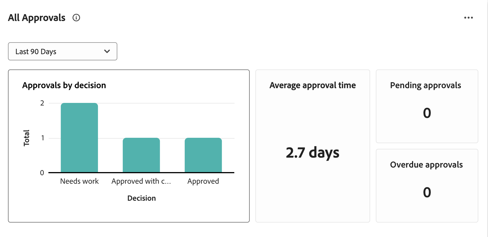

# Kom igång med granskning och godkännande av resurser med Frame.io

Det nya arbetsflödet för granskning och godkännande av resurser bygger på en nära integrering mellan Workfront och Frame.io. Integreringen tar det bästa av det varje produkt har att erbjuda och kombinerar dem för att skapa en upplevelse som gör att alla som arbetar med innehållsframtagning kan arbeta med sina favoritverktyg, samtidigt som de har tillgång till kommentarer, filer och statusuppdateringar - som synkroniseras i båda systemen i realtid.

Mer information om Frame.io finns i [Komma igång med Frame.io](https://support.frame.io/en/collections/49298-getting-started).

## Arbetsplanering i Workfront

Workfront-administratören aktiverar integreringen mellan Workfront och Frame.io genom att konfigurera standardkontot för Frame.io under Konfigurera och sedan ange Frame.io-användare i Workfront. Detta gör att koordinatorn kan planera och initiera arbetet med Workfront-projekt och formella gransknings- och godkännandearbetsflöden.

### Konfigurera standardkontot för Frame.io [!BADGE Kommer snart]{type=Informative}

Workfront-administratörer initierar integreringen av Workfront och Frame.io genom att lägga till ett standard-konto för Frame.io under Konfigurera i Workfront. När standardkontot för Frame.io har ställts in har projekt som skapats i Workfront ett spegelprojekt som skapats i Frame.io.

>[!IMPORTANT]
>
>Den här funktionen kommer snart. För närvarande läggs Frame.io-konton till manuellt av Workfront-teamet. Kontakta din kontorepresentant på Adobe om du behöver hjälp.

<!--For more information, see [Configure the [!DNL Workfront] and [!DNL Frame.io] integration](/help/quicksilver/administration-and-setup/configure-integrations/configure-wf-and-frame.md).

 in procedure article we need to cover how groups work with projects and how the frame account is associated with a group. And that accounts other than the default can be added on a 1:1 basis using the dev token. -->

### Aktivera Frame.io-användare Tillgängliga nu

Workfront-användare som regelbundet använder Frame.io bör markeras som Frame.io-användare. Workfront-administratörer kan ange Frame.io-användare i Workfront användarprofil.

>[!TIP]
>
>Vi rekommenderar att användare som regelbundet arbetar med kreativa verktyg kan aktivera och överföra material för granskning och godkännande som Frame.io-användare.

När en användare har markerats som en Frame.io-användare i Workfront och läggs till i ett projekt:

* De läggs till som medarbetare i Frame.io.
* De kan skicka material från Frame.io till Workfront för granskning och godkännande.
* De kan visa information i den enkelriktade synkroniseringsmappen från Workfront. [!BADGE Kommer snart]{type=Informative}

Mer information finns i [Konfigurera [!DNL Workfront] och [!DNL Frame.io] integration](/help/quicksilver/administration-and-setup/configure-integrations/configure-wf-and-frame.md).

### Skapa ett projekt som är kopplat till Frame.io

När standardkontot Frame.io har lagts till och Frame.io-användare har utsetts kan projektsamordnare skapa Workfront-projekt som är kopplade till Frame.io. När du skapar ett anslutet projekt kan du

* **Tilldela Frame.io-användare till uppgifter**: Frame.io-aktiverade användare meddelas via e-post när de tilldelas till en Workfront-uppgift och talar om att det finns arbete att slutföra.
* **Dela projektet med Frame.io-användare**: När ett projekt delas med Frame.io-aktiverade användare får de tillgång till projektet inifrån både Workfront och Frame.io.
* **Dela kreativt material med Frame.io**: Projektsamordnare kan skicka instruktioner och material från Workfront direkt till den kreativa användaren i Frame.io med hjälp av en envägs projektmapp för synkronisering. [!BADGE Kommer snart]{type=Informative}
* **Spåra uppgiftsförloppet**: Kreatörer kan skicka färdigt material och markera uppgifter som slutförda - allt utan att behöva lämna Frame.io.

Mer information finns i [Skapa ett projekt som är kopplat till Frame.io](/help/quicksilver/manage-work/projects/create-projects/create-frame-connected-project.md).

## Skapa och samarbeta kring material i Frame.io

Kreatörerna kan behålla sina valverktyg och ha friheten att skapa, upprepa och genomföra granskningar inuti Frame.io.

När en kreatör läggs till i ett anslutet projekt kan de göra följande i Frame.io:

<!--* Access instructions from the project coordinator -->
* Utföra informella peer-granskningar
* Skicka det färdiga materialet till Workfront för granskning och godkännande
* Ändra status för en uppgift eller markera den som slutförd
* Ladda upp nya versioner och skicka sedan in dem igen för godkännande <!--do they have to send to frame.io again?-->

Mer information om Frame.io finns i [Jag har blivit inbjuden att samarbeta i ett projekt](https://support.frame.io/en/articles/11125-i-ve-been-invited-to-collaborate-on-a-project).

## Granska och godkänn resurser

När en kreatör skickar en färdig mediefil till Workfront från Frame.io kan projektsamordnaren initiera den formella gransknings- och godkännandeprocessen i Workfront.

När arbetsflödet för godkännande har skapats går granskare och godkännare tillbaka till Frame.io för att lägga till kommentarer och kommentera resursen. De kan också fatta beslut om godkännande i Frame.io-visningsprogrammet.

### Starta formella granskningar och godkännanden i Workfront

Projektsamordnare kan skapa engångs- och godkännandemallar eller återanvändbara mallar för godkännande. All gransknings- och godkännandeaktivitet i Frame.io registreras också i Workfront.

Projektsamordnare kan välja att tilldela granskare, godkännare eller en blandning av båda:

* **Granskare** kan lägga till kommentarer och kommentera resurser. När de är klara kan de markera granskningen som slutförd. Att markera granskningen som slutförd krävs inte för att resursen ska gå framåt i godkännandeprocessen.
* **Godkännare** kan lägga till kommentarer och kommentera resurser. De måste fatta beslut om att flytta godkännandeprocessen framåt.

#### Skapa ett arbetsflöde för granskning och godkännande

Granskare och godkännare kan läggas till i ett arbetsflöde för engångsgodkännande eller i en återanvändbar godkännandemall:

* **Godkännanden för enstaka användning**: I det projekt eller den uppgift där resursen finns kan projektkoordinatorn tilldela granskare och godkännare och ange en sluttid. Granskare och godkännare får påminnelser via e-post 72 och 24 timmar före ansökningsdeadline samt om själva deadline.

  Mer information finns i [Skapa en begäran om dokumentgranskning eller godkännande](/help/quicksilver/review-and-approve-work/document-reviews-and-approvals/manage-document-approvals/create-a-document-approval.md). <!--I think this needs to be renamed? -->

* **Godkännandemallar**: Under Konfigurera i Workfront kan projektsamordnare skapa återanvändbara mallar för godkännande. I en mall kan användare lägga till granskare och godkännare och ange en tidsram för slutförande. När godkännandemallen används för en resurs beräknas tidsgränsen från den angivna tidsramen.

  När en mall har skapats kan den tillämpas på resurser som skickas från Frame.io för att starta den formella gransknings- och godkännandeprocessen i Workfront.

  Mer information finns i [Skapa en godkännandemall](/help/quicksilver/review-and-approve-work/document-reviews-and-approvals/manage-document-approvals/create-approval-template.md)

#### Öppna Frame.io-visningsprogrammet

Användarna kan öppna Frame.io-visningsprogrammet på följande sätt:

* Workfront e-postmeddelanden
* The Awaiting my approval widget in the new Workfront Home area
  

>[!NOTE]
>
>Externa Workfront-användare meddelas via e-post och uppmanas att skapa en Frame.io-inloggning för att granska och godkänna mediefiler.

#### Lägga till kommentarer och markera resurser

Alla kommentarer som görs i Frame.io-visningsprogrammet registreras också på fliken Workfront Updates. Svar gjorda i Workfront visas inte i Frame.io. Om kommentarer är markerade som&quot;Endast team&quot; i Frame.io-visningsprogrammet visas de inte på fliken Workfront-uppdateringar.

#### Fatta ett beslut

När all granskningsaktivitet är klar måste godkännarna fatta något av följande beslut:

* **Godkänn**: Resursen behöver inte ändras och är klar att användas.
* **Godkänn med ändringar**: Resursen behöver ändras och är klar att användas när den är klar. Ytterligare godkännande krävs inte.
* **Behöver göras**: Resursen behöver ändras och är inte klar att användas. När de angivna ändringarna har gjorts måste resursen överföras som en ny version och gå igenom en ny godkännandeomgång. <!--is the same approval workflow automatically applied? Does the coordinator have to do anything to get the approval going? -->

Granskarna kan markera sin granskning som komplett inuti Frame.io-visningsprogrammet, men detta krävs inte för att resursen ska gå framåt i godkännandeprocessen.

Mer information om beslut i Workfront finns i [Översikt över dokumentets beslutsstatus](/help/quicksilver/review-and-approve-work/document-reviews-and-approvals/manage-document-approvals/document-approval-status.md).

<!-- upload assets directly to workfront to be reviewed in Frame.io/ Will have to send manually at first

Reviewer/approver needs to go through email to get to frame vier
-->

### Spåra gransknings- och godkännandestatistik

Projektsamordnare kan övervaka förloppet för alla pågående godkännanden i Workfront Home-området med följande widget:

* **Alla godkännanden**: Visar 2 diagram med information om genomsnittlig godkännandetid och beslut samt en lista över väntande och försenade godkännanden.
  