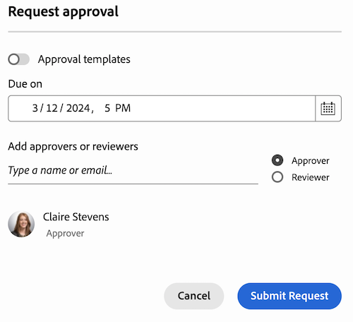

# Skapa ett arbetsflöde för dokumentgodkännande

Den markerade informationen på den här sidan hänvisar till funktioner som ännu inte är allmänt tillgängliga. Den är bara tillgänglig i sandlådemiljön för förhandsgranskning.

Du kan begära godkännande från andra användare eller team för ett dokument i Adobe Workfront, eller begära att de granskar ett dokument utan att behöva godkänna det.

>[!IMPORTANT]
>
>Innehållet i den här artikeln hänvisar till den uppdaterade funktionen för dokumentgodkännande som bara är tillgänglig för specifika konton. Mer information om standardgodkännandeprocesser finns i artiklarna i [Arbetsgodkännanden](/help/quicksilver/review-and-approve-work/manage-approvals/manage-approvals.md).

## Åtkomstkrav

+++ Expandera om du vill visa åtkomstkrav för funktionerna i den här artikeln.

<table style="table-layout:auto"> 
 <col> 
 <col> 
 <tbody> 
  <tr> 
   <td role="rowheader">Adobe Workfront package</td> 
   <td> 
Alla
 </td> 
  </tr> 
  <tr> 
   <td role="rowheader">Adobe Workfront-licens</td>  
   <td>
   
Medarbetare eller högre

   
Granska eller högre

   
Om du använder Frame.io-integreringen måste du ha en standardlicens för att skapa arbetsflöden för godkännande.

   </td> 
  </tr> 
  <tr> 
   <td role="rowheader">Konfigurationer på åtkomstnivå</td> 
   <td> 
Visa eller ge senare åtkomst till projekt, uppgifter, ärenden, mallar, portföljer, program, rapporter, instrumentpaneler och kalendrar, dokument
 </td> 
  </tr>
  <tr> 
   <td role="rowheader">Objektbehörigheter</td> 
   <td> 
Hantera åtkomst till objektet som är associerat med åtkomstbegäran eller godkännandet 
 </td> 
  </tr> 
 </tbody> 
</table>

Mer information finns i [Åtkomstkrav i Workfront-dokumentationen](/help/quicksilver/administration-and-setup/add-users/access-levels-and-object-permissions/access-level-requirements-in-documentation.md).

+++

## Skapa en dokumentgranskning eller godkännandebegäran från dokumentsidan i produktionsmiljön

1. Håll muspekaren över dokumentet och klicka sedan på Dokumentinformation.
   

1. I närheten av dokumentnamnet väljer du den version av dokumentet som du vill skapa ett godkännande för i listrutan. Den senaste versionen är markerad som standard.

1. Klicka på **Godkännanden** på den vänstra panelen.

1. (Valfritt) Ange en tidsgräns för godkännandet. Användare och team meddelas via e-post 72 timmar, sedan 24 timmar före den angivna tidsgränsen.

1. Om du vill lägga till en godkännare klickar du på **Godkännaren** och börjar skriva in ett användar- eller teamnamn.

1. Om du vill lägga till en granskare klickar du på kryssrutan **Granskare** och börjar skriva in ett användar- eller teamnamn.

   

1. Upprepa föregående steg om du vill lägga till ytterligare godkännare eller granskare.

## Skapa en dokumentgranskning eller godkännandebegäran från panelen Dokumentsammanfattning i produktionsmiljön

1. Gå till projektet, aktiviteten eller utgåvan som innehåller dokumentet och välj sedan **Dokument**.

1. Klicka på det dokument du behöver så öppnas vänsterpanelen Dokumentsammanfattning för det dokumentet.

1. Välj den version av dokumentet som du vill skapa ett godkännande för i listrutan. Den senaste versionen är markerad som standard.

1. Bläddra ned till avsnittet **Godkännanden** i rutan Dokumentsammanfattning och klicka sedan på **Lägg till**.

1. (Valfritt) Ange en tidsgräns för godkännandet. Användare och team meddelas via e-post 72 timmar, sedan 24 timmar före den angivna tidsgränsen.

1. Om du vill lägga till en godkännare klickar du på **Godkännaren** och börjar skriva in ett användar- eller teamnamn.

1. Om du vill lägga till en granskare klickar du på kryssrutan **Granskare** och börjar skriva in ett användar- eller teamnamn.

   

1. Upprepa föregående steg om du vill lägga till ytterligare godkännare eller granskare.

## Skapa ett arbetsflöde för godkännande från panelen Sammanfattning i förhandsvisningsmiljön i det äldre dokumentområdet

Om ditt företag använder Workfront-lagring visas det äldre dokumentområdet när du öppnar dokument i Workfront. Mer information om Workfront-lagring finns i [Workfront-lagring jämfört med Adobe Enterprise-lagring](/help/quicksilver/review-and-approve-work/esm-overview.md#workfront-storage-vs-adobe-enterprise-storage).

Så här skapar du ett arbetsflöde för godkännande:

1. Gå till det projekt, den uppgift eller det problem som innehåller dokumentet och välj sedan **Dokument** i den vänstra panelen.

1. Klicka på det dokument du behöver så öppnas dokumentsammanfattningspanelen för det dokumentet.

1. Välj den version av dokumentet som du vill skapa ett godkännande för i listrutan. Den senaste versionen är markerad som standard.

1. Bläddra ned till avsnittet **Godkännanden** och klicka sedan på **Skapa arbetsflöde**.

1. Fyll i följande uppgifter:

   <table>
   <tr>
   <td><strong>Scennamn</strong></td>
   <td>Lägg till ett scennamn. Du kan ändra namnet till något mer beskrivande, till exempel <em>Inledande granskning</em> eller <em>Slutligt godkännande</em>.</td>
   </tr>
   <tr>
   <td><strong>Lägg till namn eller e-post</strong></td>
   <td>Börja skriva ett användar- eller teamnamn som ska läggas till som godkännare eller granskare. Om du bara har granskare meddelas de och har möjlighet att slutföra granskningen, men inget beslut krävs eller fattas.</td>
   </tr>
   <tr>
   <td><strong>Ett beslut krävs (valfritt)</strong></td>
   <td>Den första personen som fattar ett beslut slutför steget.</td>
   </tr>
   <tr>
   <td><strong>Förfallodatum (valfritt)</strong></td>
   <td>Ange ett förfallodatum för godkännandet. Användare och team meddelas via e-post 72 timmar och sedan 24 timmar före det angivna förfallodatumet.</td>
   </tr>
   </table>

1. (Valfritt) Upprepa föregående steg om du vill lägga till ytterligare steg.

   >[!NOTE]
   >
   >Om du lägger till flera faser fortsätter arbetsflödet för godkännande i den ordning som faserna listas. När alla nödvändiga beslut fattas börjar nästa steg och den föregående fasen låses.

   

## Skapa ett arbetsflöde för godkännande från panelen Sammanfattning i det nya dokumentområdet

Om ditt företag använder Enterprise-lagring visas det nya dokumentområdet när du öppnar dokument i Workfront. Mer information om Enterprise-lagring finns i [Översikt över Enterprise-lagring](/help/quicksilver/review-and-approve-work/esm-overview.md).

Så här skapar du ett arbetsflöde för godkännande:

1. Gå till det projekt, den uppgift eller det problem som innehåller dokumentet och välj sedan **Dokument** i den vänstra panelen.

1. Klicka på dokumentet och sedan på ikonen Godkännanden till höger på sidan.

   

1. Klicka på **Skapa arbetsflöde** och fyll sedan i följande information:

   <table>
   <tr>
   <td><strong>Scennamn</strong></td>
   <td>Lägg till ett scennamn. Du kan ändra namnet till något mer beskrivande, till exempel <em>Inledande granskning</em> eller <em>Slutligt godkännande</em>.</td>
   </tr>
   <tr>
   <td><strong>Lägg till namn eller e-post</strong></td>
   <td>Börja skriva ett användar- eller teamnamn som ska läggas till som godkännare eller granskare. Om du bara har granskare meddelas de och har möjlighet att slutföra granskningen, men inget beslut krävs eller fattas.</td>
   </tr>
   <tr>
   <td><strong>Ett beslut krävs (valfritt)</strong></td>
   <td>Den första personen som fattar ett beslut slutför steget.</td>
   </tr>
   <tr>
   <td><strong>Förfallodatum (valfritt)</strong></td>
   <td>Ange ett förfallodatum för godkännandet. Användare och team meddelas via e-post 72 timmar och sedan 24 timmar före det angivna förfallodatumet.</td>
   </tr>
   </table>

1. (Valfritt) Upprepa föregående steg om du vill lägga till ytterligare steg.

   >[!NOTE]
   >
   >Om du lägger till flera faser fortsätter arbetsflödet för godkännande i den ordning som faserna listas. När alla nödvändiga beslut fattas börjar nästa steg och den föregående fasen låses.

   

<!--
## Resubmit an approval on a new version

Document approval decisions are not automatically reset when you upload a new version. For example, if your document is approved with changes, the decision will show "changes" as the decision, even if you upload a new version with the specified changes. You can clear the decision on a new version if you manually resubmit the approval.

1. Go to the project, task, or issue that contains the document, then select **Documents**.
1. Find the document you need.

1. Scroll down to the **Approvals** section in the Summary, click the More icon, then click Resubmit.

   
-->
