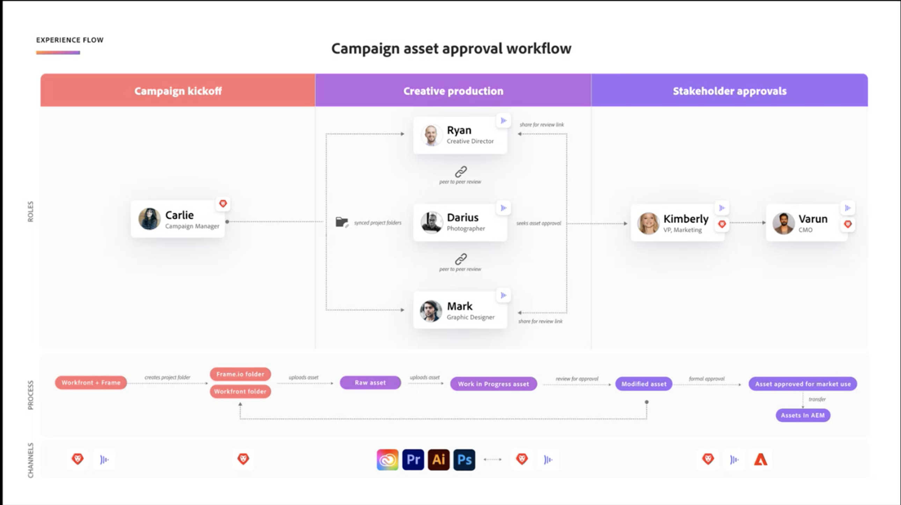

# Översikt över resursgranskning och godkännande

Det nya arbetsflödet för granskning och godkännande av resurser bygger på en nära integrering mellan Workfront och Frame.io. Integrationen tar det bästa av det varje produkt har att erbjuda och kombinerar den för att skapa en upplevelse som gör att alla personer som arbetar med innehållsframtagning kan arbeta med sina valfria verktyg, samtidigt som de har tillgång till kommentarer, filer och statusuppdateringar synkroniserade i båda systemen i realtid.

Mer information om Frame.io finns i [Komma igång med Frame.io](https://support.frame.io/en/collections/49298-getting-started).

## Arbetsplanering i Workfront

Workfront-administratören aktiverar integreringen mellan Workfront och Frame.io genom att konfigurera standardkontot för Frame.io under Konfigurera och sedan ange Frame.io-användare i Workfront. Detta gör att koordinatorn kan planera och initiera arbetet med Workfront Projects och formella gransknings- och godkännandearbetsflöden.

### Konfigurera ett standardkonto för Frame.io

Workfront-administratörer initierar integreringen av Workfront och Frame.io genom att lägga till ett standard-konto för Frame.io under Konfigurera i Workfront. När ett Frame.io-standardkonto har konfigurerats har projekt som skapats i Workfront ett spegelprojekt som skapats i Frame.io.

Mer information finns i [].

<!-- in procedure article we need to cover how groups work with projects and how the frame account is associated with a group. And that accounts other than the default can be added on a 1:1 basis using the dev token. -->

### Aktivera Frame.io-användare

Workfront-användare som regelbundet använder Frame.io bör markeras som Frame.io-användare. Workfront-administratörer kan ange Frame.io-användare i Workfront användarprofil.

När en användare har markerats som en Frame.io-användare i Workfront och läggs till i ett projekt,

* De läggs till som medarbetare i Frame.io
* De kan skicka material från Frame.io till Workfront för granskning och godkännande
* De kan visa information i den enkelriktade synkroniseringsmappen från Workfront

>[!TIP]
>
>Vi rekommenderar att användare som regelbundet arbetar med kreativa verktyg kan aktivera och överföra material för granskning och godkännande som Frame.io-användare.

Mer information finns i [].

### Skapa ett projekt som är kopplat till Frame.io

När standardkontot Frame.io har lagts till och Frame.io-användare har utsetts kan projektsamordnare skapa Workfront-projekt som är kopplade till Frame.io. När du skapar ett anslutet projekt kan du

* **Tilldela Frame.io-användare till uppgifter**: Frame.io-aktiverade användare meddelas via e-post när de tilldelas till en uppgift och talar om att det finns arbete att slutföra.
* **Dela projektet med Frame.io-användare**: Projekt som delas med Frame.io-aktiverade användare ger åtkomst till projektet inuti Frame.io.
* **Dela kreativt material med Frame.io**: Du kan skicka instruktioner och material från Workfront direkt till den kreativa användaren i Frame.io med en envägsprojektmapp för synkronisering.
* **Spåra uppgiftsförloppet**: Kreatörer kan skicka färdigt material och markera uppgifter som slutförda utan att lämna Frame.io.

Mer information finns i [].

<!--Preassign approval templates to tasks coming in the future-->

## Skapa och samarbeta kring material i Frame.io

Kreatörerna kan behålla sina valverktyg och ha friheten att skapa, upprepa och genomföra granskningar inuti Frame.io.

När en kreatör läggs till i ett anslutet projekt kan de göra följande utan att lämna Frame.io:

* Åtkomstinstruktioner från projektkoordinatorn
* Utföra informella peer-granskningar
* Skicka det färdiga materialet till Workfront för granskning och godkännande
* Ändra status för en uppgift eller markera den som slutförd
<!-- * Notification of decision
* Upload new versions of connected assets marked as needs more work < will automatically connect>-->

Mer information om granskning av resurser i Frame.io finns i

## Granska och godkänn resurser

När en kreatör skickar en färdig mediefil till Workfront från Frame.io kan projektsamordnaren initiera den formella gransknings- och godkännandeprocessen i Workfront.

När godkännandet har skapats går användarna tillbaka till Frame.io för att kommentera och markera resursen. De kan också fatta ett beslut om godkännande i Frame.io-visningsprogrammet.

### Starta formella granskningar och godkännanden i Workfront

Projektsamordnare kan skapa engångs- och godkännandemallar eller återköpsbara godkännandemallar under Konfigurera i Workfront. Alla gransknings- och godkännandeaktiviteter som gjorts i Frame.io registreras också i Workfront.

#### Lägg till granskare och godkännare

Projektsamordnare kan välja att tilldela granskare, godkännare eller en blandning av båda:

* **Granskare** kan kommentera och kommentera resurser. När de är klara kan de markera granskningen som slutförd. <!--example of when to add reviewers-->
* **Godkännare** kan kommentera och kommentera resurser. De måste fatta beslut om att flytta godkännandeprocessen framåt.

#### Skapa ett arbetsflöde för granskning och godkännande

Granskare och godkännare kan läggas till i ett enda arbetsflöde, en enda arbetsgång för godkännande eller i en godkännandemall:

<!--can also assign teams and set deadline-->
E-post - deadline e-post 72, 24 och inom deadline.

* **Godkännanden för enstaka användning**: Ange godkännandedeadlines

* **Godkännandemallar**
I området Workfront Setup kan användare med en standardlicens skapa återanvändbara godkännandemallar. I en mall kan användare ange en tidsram och lägga till granskare och godkännare. <!--do we want to mention any upcoming plans here? -->

  När en mall har skapats kan den tillämpas på resurser som skickas från Frame.io för att starta den formella gransknings- och godkännandeprocessen i Workfront.
  

<!-- can set timreframe which calculates deadline once approval is started. >

    For more information, see [Create and manage Approval Templates](/)<!--don't forget link-->

* Ladda upp en mediefil från Workfront och skicka den till en bildruta för granskning och godkännande - Kommer snart?

### Godkänn resurser i Frame.io

Intressenter kan granska och godkänna anslutna resurser med Frame.io-visningsprogrammet.

#### Öppna Frame.io-visningsprogrammet

Användarna kan öppna Frame.io-visningsprogrammet på följande sätt:

* The Awaiting my approval widget in the new Workfront Home area
* Workfront e-postmeddelanden.

Externa Workfornt-användare ombeds att skapa en Frame.io-inloggning för att granska och godkänna resurser.

#### Kommentera och kommentera resurser

Alla kommentarer som görs i Frame.io-visningsprogrammet registreras också på fliken Workfront Update (Uppdatering). Svar gjorda i Workfront visas inte i Frame.io. Kommentarer som bara är markerade för Team visas inte på fliken Workfront Updates.

#### Fatta ett beslut

Godkännarna måste fatta något av följande beslut:

* Godkänn: Detta
* Godkänn med ändringar
* Behöver göras

Granskarna kan markera sin granskning som komplett inuti Frame.io-visningsprogrammen.

<!-- include screenshot from frame.io-->

<!-- upload assets directly to workfront to be reviewed in Frame.io/ Will have to send manually at first

Reviewer/approver needs to go through email to get to frame vier
-->

### Spåra gransknings- och godkännandestatistik

Snabbrapport för godkännande av widgetar hemma -

<!--
### Published approved assets to Adobe Experience Manager Assets

Use the native integration to send approved assets to AEM.
-->

## Exempel på arbetsflöde för godkännande av kampanjresurser

Inro para?

 <!-- probbly need a different version of this but add something similar rather than typing all out?-->
