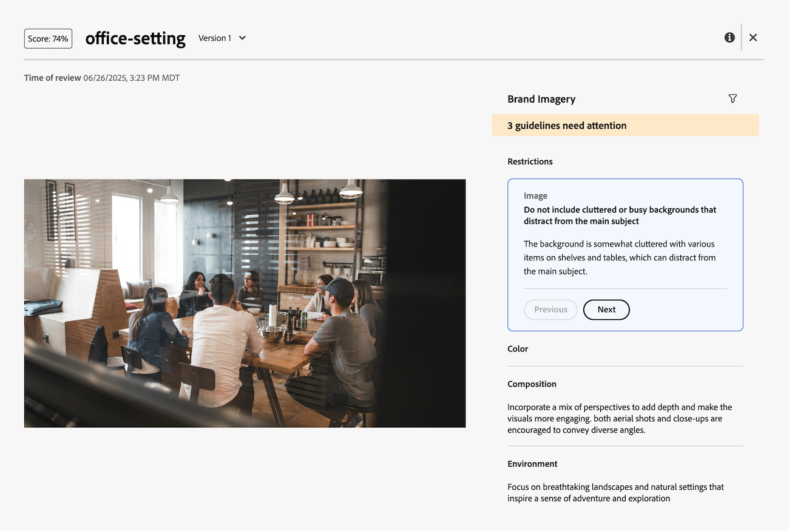

# Visa AI Reviewer-poäng och feedback

>[!NOTE]
>
>Den här funktionen är för närvarande i betaversion.

Sekunder efter att du har skickat gransknings- och godkännandebegäran kan du visa resultatet och feedback från AI Reviewer på panelen Dokumentsammanfattning.

AI Reviewer är inte avsedd som beslutsfattare i arbetsflödet för granskning och godkännande. Det ger bara poäng och rekommendationer för att anpassa resursen efter de angivna varumärkeskraven.

## Visa poäng och feedback

Du kan visa AI Reviewer-poängen och feedback från panelen Dokumentsammanfattning eller på fliken Godkännanden på sidan Dokumentinformation.

1. Klicka på **Gå till granskning** i e-postmeddelandet från Workfront.
eller
Gå till området Dokument där dokumentet överförs och öppna panelen Dokumentsammanfattning.
1. Klicka på **Poäng**.
   

I spåret och i feedbackfönstret ger AI Reviewer en förklaring till hur resursen inte uppfyller de angivna riktlinjerna.

## Ladda upp en ny version och lägg till AI-granskare igen

Om du behöver justera resursen baserat på AI Reviewer-feedback kan du överföra en ny version och starta en ny granskning.

Mer information finns i [Överföra en ny dokumentversion och begära ett godkännande](/help/quicksilver/review-and-approve-work/document-reviews-and-approvals/manage-document-approvals/upload-new-doc-version.md).
