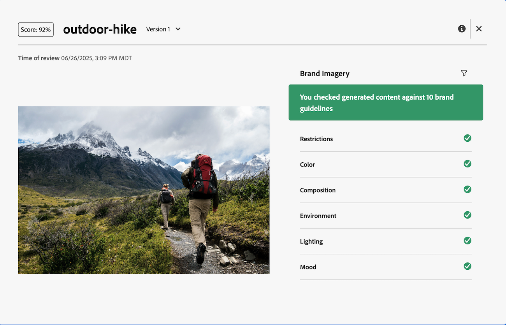

# Kom igång med Workfront AI Reviewer

>[!NOTE]
>
>Den här funktionen är för närvarande i betaversion.

Med Workfront AI Reviewer kan ni öka innehållets hastighet och optimera varumärkesefterlevnaden i gransknings- och godkännandearbetsflödet. Du kan lägga till AI-granskare i godkännandemallar eller enskilda gransknings- och godkännandebegäranden i Workfront.

## Åtkomstkrav

Om du vill konfigurera AI-granskare i Workfront måste du vara systemadministratör.

Alla användare kan lägga till AI Reviewer i en gransknings- och godkännandebegäran.

## Förutsättningar

* Din organisation måste ha migrerat till Adobe IMS (Identity Management System).
* Enhetliga godkännanden måste vara aktiverat för din Workfront-instans.
* Adobe måste ha ett signerat Adobe Gen AI-avtal till hands.
Mer information om hur du signerar avtalet finns i [Signera Adobe Gen AI-avtalet](/help/quicksilver/workfront-basics/ai-assistant/ai-assistant-overview.md#sign-the-adobe-gen-ai-agreement).

## Filtyper som stöds {#supported-file-types-ai-reviewer}

>[!CONTEXTUALHELP]
>id="wf_document_approvals_ai_supported_files"
>title="Filtypen stöds inte"
>abstract="Denna AI Reviewer stöder inte den valda filtypen. Överför en filtyp som stöds eller ta bort AI-granskaren för att skicka begäran."

AI Reviewer kan granska följande filtyper:

* PNG (.png)
* JPEG (.jpeg, .jpg)
* WEBP (.webp)
* Icke-animerad GIF (.gif)

## Ställ in varumärkesriktlinjer

Workfront AI Reviewer använder de varumärkesriktlinjer som fastställts i Genstudio för Performance Marketing när du granskar ditt innehåll. För närvarande kan du bara ange varumärkesriktlinjer för bilder. Mer information finns i [Kom igång med Adobe GenStudio for Performance Marketing](https://experienceleague.adobe.com/en/docs/genstudio-for-performance-marketing/user-guide/get-started).

## Skapa AI-granskare

När minst ett varumärke har konfigurerats i GenStudio Foundations kan Workfront-administratörer börja skapa AI-granskare under Konfigurera. Dessa AI-granskare kan sedan tilldelas till godkännandemallar och individuella gransknings- och godkännandebegäranden. Just nu kan AI-granskare bara granska bildernas varumärkesriktlinjer.

Mer information finns i [Skapa AI-granskare](/help/quicksilver/review-and-approve-work/document-reviews-and-approvals/set-up-ai-reviewer.md).

## Lägg till AI-granskare för granskning och godkännande

Användare kan lägga till AI-granskare i befintliga godkännandemallar eller i enskilda gransknings- och godkännandebegäranden.

### Godkännandemallar

Om din organisation ofta lägger till samma personer för att granska och godkänna begäranden, kan standardlicensanvändare skapa godkännandemallar under Konfigurera i Workfront.

Användare kan lägga till AI-granskare i godkännandemallar för att automatiskt kontrollera om en mall används för att skapa en begäran.

När du har skapat en mall för godkännande kan du använda den för resurser i området Dokument i ett projekt, en uppgift eller en utgåva.

Mer information finns i [Skapa en godkännandemall för resurser och dokument](/help/quicksilver/review-and-approve-work/document-reviews-and-approvals/manage-document-approvals/create-approval-template.md).

### Individuell begäran om granskning och godkännande

När användare skapar enskilda gransknings- och godkännandeförfrågningar kan de lägga till en AI Reviewer i med andra deltagare eller skapa en enda förfrågan med endast AI Reviewer för att kontrollera varumärkesefterlevnaden.

Mer information finns i [Skapa en begäran om dokumentgranskning eller godkännande](/help/quicksilver/review-and-approve-work/document-reviews-and-approvals/manage-document-approvals/create-a-document-approval.md).

## Visa AI Reviewer-poäng och feedback

Sekunder efter det att gransknings- och godkännandebegäran med en AI Reviewer har skickats är poängen och feedback från AI Reviewer tillgängliga på panelen Dokumentsammanfattning, även om andra deltagare fortfarande granskar och fattar beslut.

Godkännandeägare får också ett e-postmeddelande som meddelar dem om att en granskning har slutförts av resursen. Klicka på **Gå till granskning** i e-postmeddelandet och se poängen och feedback i Workfront.

AI Reviewer är inte avsedd som beslutsfattare i arbetsflödet för granskning och godkännande. Det ger bara poäng och rekommendationer för att anpassa resursen efter de angivna varumärkeskraven.

Om bilden så länge uppfyller varumärkesriktlinjerna kan den som skapar bilden ladda upp en ny version och den som ansvarar för godkännandet kan skapa en andra förfrågan om granskning och godkännande med AI Reviewer, så att du kan växla mellan versionerna och jämföra feedback.

Mer information om hur du visar bakgrundsmusik och feedback finns i [Visa bakgrundsmusik för AI Reviewer och feedback](/help/quicksilver/review-and-approve-work/document-reviews-and-approvals/view-ai-reviewer-feedback.md).

## Videogenomgång

>[!VIDEO](https://video.tv.adobe.com/v/3470847/)