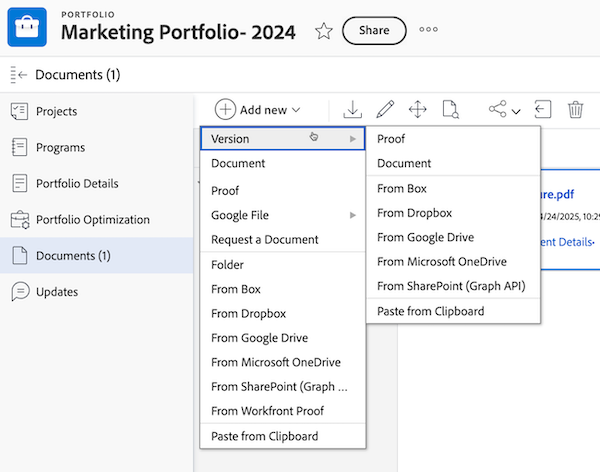

# Skapa en ny version av ett korrektur

<!-- Audited: 4/2025 -->

Det kan vara en utmaning att hantera feedback i flera versioner eller revisioner av ett verk. Adobe Workfront förenklar den här processen genom att du kan skapa och jämföra flera versioner av ett korrektur.

Tänk på följande när du skapar en ny version av ett korrektur:

* Du kan ge en användare behörighet att se en version men inte en annan. Omvänt gäller att om du delar en senare version med en användare kan användaren inte se tidigare versioner såvida du inte går tillbaka och ger användaren åtkomst till de tidigare versionerna.
* Du måste ha redigeringsbehörighet för beviset för att kunna skapa en ny version.

  Mer information finns i [Hantera profilroller i Workfront Proof](../../../workfront-proof/wp-work-proofsfiles/share-proofs-and-files/manage-proof-roles.md) och [Korrekturbehörighetsprofiler i Workfront Proof](../../../workfront-proof/wp-acct-admin/account-settings/proof-perm-profiles-in-wp.md).

  Mer information om att dela korrekturversioner finns i  [Dela ett bevis i Workfront Proof](../../../workfront-proof/wp-work-proofsfiles/share-proofs-and-files/share-proof.md).

>[!IMPORTANT]
>
>Om ett korrektur skapas i Adobe Workfront måste alla nya versioner för det korrekturet också skapas i Workfront. Du kan inte skapa en ny version av ett bevis i Workfront Proof om det beviset har skapats i Workfront.

## Åtkomstkrav

+++ Expandera om du vill visa åtkomstkrav för funktionerna i den här artikeln.

<table style="table-layout:auto"> 
 <col> 
 <col> 
 <tbody> 
  <tr> 
   <td role="rowheader">Adobe Workfront package</td> 
   <td> 
Alla
 </td> 
  </tr> 
  <tr> 
   <td role="rowheader">Adobe Workfront-licens</td> 
   <td> 
Standard
 
   
Arbete eller plan

   </td> 
  </tr> 
  <tr> 
   <td role="rowheader">Behörighetsprofil för bevis </td> 
   <td>Chef eller högre</td> 
  </tr> 
  <tr> 
   <td role="rowheader">Konfigurationer på åtkomstnivå</td> 
   <td> 
Redigera åtkomst till dokument
 </td> 
  </tr> 
 </tbody> 
</table>

Mer information finns i [Åtkomstkrav i Workfront-dokumentationen](/help/quicksilver/administration-and-setup/add-users/access-levels-and-object-permissions/access-level-requirements-in-documentation.md).

+++

## Skapa en ny korrekturversion i Workfront

Det finns flera sätt att överföra en ny korrekturversion i Workfront. Standardinställningarna för korrektur kan eventuellt överföras från den tidigare versionen beroende på vilken metod du väljer:

* **Generera automatiskt korrektur när dokument överförs**: Om den här inställningen är aktiverad i din användarprofil överförs inte standardkorrekturinställningarna när du drar och släpper en ny version.
* **Skapa korrektur > Enkel**: Om du väljer det här alternativet överförs inte standardkorrekturinställningarna från den tidigare versionen.
* **Lägg till ny > Version > Korrektur**: Om du väljer det här alternativet överförs standardinställningarna för korrektur från den tidigare versionen.
* **Skapa korrektur > Avancerat**: Om du väljer det här alternativet överförs standardkorrekturinställningarna från den tidigare versionen.

Så här skapar du en ny version av ett korrektur:

1. Öppna dokumentlistan som innehåller korrekturet.
1. Dra och släpp en ny fil från datorns filsystem över korrekturet.

   eller

   Markera den rad där korrekturet visas, klicka på **Lägg till ny** > **Version** och klicka sedan på det alternativ du vill använda för att lägga till den nya versionen av korrekturet.

   

## Skapa en ny korrekturversion från korrekturläsaren (endast Workfront Proof)

Om du använder den fristående Workfront Proof-versionen kan du skapa en ny version av ett korrektur som innehåller en enda fil eller webbfångst. 

>[!NOTE]
>
>Om ditt konto finns i en Enterprise-plan och du överför flera filer eller webbklipp kommer de automatiskt att kombineras till en enda ny version. Mer information finns i [Skapa ett flersidigt korrektur](../../../review-and-approve-work/proofing/creating-proofs-within-workfront/create-multi-page-proof.md).

Så här skapar du en ny version av ett korrektur i Workfront Proof:

1. Öppna beviset.
1. Klicka på listrutan **Version** i det övre vänstra hörnet och klicka sedan på **+ Ny version** i rutan som visas. Den nya korrekturversionen öppnas.

   

1. I avsnittet **Lägg till filer** överför du en fil som den nya korrekturversionen genom att dra och släppa den från datorn eller genom att klicka på **bläddra** och välja en fil.

   eller

   Spara en webbsida som en ny version av korrekturet genom att ange en URL.

   >[!NOTE]
   >
   >Dra och släpp är bara tillgängligt i webbläsare som har fullt stöd för HTML5. Detta utesluter Internet Explorer 7 till 9 och Safari.

1. (Valfritt) Markera korrekturtiteln och ange ett nytt **korrekturnamn** för versionen.

1. Gör någon av följande ändringar i avsnittet **Arbetsflöde** för att lägga till granskare för den här korrekturversionen (detta ersätter granskarna i den tidigare versionen):

   * (Valfritt) Ändra **ägaren** för versionen till en annan användare i ditt konto.

     Mer information finns i [Korrekturbehörighetsprofiler i Workfront Proof](../../../workfront-proof/wp-acct-admin/account-settings/proof-perm-profiles-in-wp.md).

   * (Valfritt) Lägg till granskare i versionen med hjälp av **Skriv kontaktnamnet eller e-postadressen för att lägga till en mottagare**. Du kan sedan välja en typ av **korrekturroll** och **e-postaviseringar** för varje mottagare.

     Mer information finns i [Lägg till grupper i ett korrektur](../../../workfront-proof/wp-mnguserscontacts/groups/add-groups.md) och [Hantera korrekturroller i Workfront Proof](../../../workfront-proof/wp-work-proofsfiles/share-proofs-and-files/manage-proof-roles.md).

     >[!NOTE]
     >
     >Om korrekturläsaren eller ägaren har inaktiverat e-postmeddelandet&quot;Korrektur&quot; som standard i sina personliga inställningar, kommer de inte att få något e-postmeddelande om korrektur gjort eller nytt korrektur, även om rutan **Meddela mottagare om det här korrekturet** är markerad på sidan Nytt korrektur. Mer information finns i [Konfigurera e-postaviseringsinställningar i Workfront Proof](../../../workfront-proof/wp-emailsntfctns/email-alerts/config-email-notification-settings-wp.md), [Korrekturmeddelanden via e-post](../../../workfront-proof/wp-emailsntfctns/proof-notifications-and-reminders/proof-made-email.md) och [Nytt korrektur-e-postmeddelande](../../../workfront-proof/wp-emailsntfctns/proof-notifications-and-reminders/new-proof-email.md).

   * (Valfritt) Ange en korrekturdeadline.

   * (Valfritt och villkorligt) Välj en ny primär beslutsfattare i listrutan **Överför primära beslutsrättigheter till**.

   * (Valfritt) Markera rutan **Kräv endast ett beslut för det här steget** om du vill ta bort alternativet att ange en användare som ny primär beslutsfattare.

1. Välj någon av följande inställningar i avsnittet **E-postmeddelande**:

   * (Valfritt) **Meddela mottagarna om det här korrekturet**: Välj det här alternativet om du vill meddela granskarna om den nya versionen. Ditt val loggas i avsnittet **Aktivitet** på sidan **Korrekturinformation**. Mer information finns i [Hantera korrekturinformation i Workfront Proof](../../../workfront-proof/wp-work-proofsfiles/manage-your-work/manage-proof-details.md).

   * (Villkorligt och valfritt) **Lägg till anpassat ämne och meddelande**: Välj det här alternativet om du vill lägga till en anpassad ämnesrad och ett anpassat meddelande i e-postmeddelandet.

1. Välj någon av följande inställningar i avsnittet **Organisation**:

   * Använd en eller flera taggar på korrekturet. Mer information finns i [Skapa och hantera taggar i Workfront Proof](../../../workfront-proof/wp-work-proofsfiles/organize-your-work/create-and-manage-tags.md).

   * Lägg till versionen i en mapp. Mappen kopieras från den tidigare versionen av korrekturet. Om du väljer en annan mapp flyttas hela korrekturet, som innehåller alla versioner. Mer information finns i [Hantera mappar i Workfront Proof](../../../workfront-proof/wp-work-proofsfiles/organize-your-work/manage-folders.md).

   * Faktureringsadministratörer och administratörer kan göra mappfältet obligatoriskt för hela kontot på fliken **Inställningar**.

1. Välj någon av följande inställningar i avsnittet **Korrekturinställningar**:

   * Kräv att en användare loggar in för att visa korrekturet.
   * Kräv elektroniska signaturer på beviset (endast Enterprise-planen).
   * Lås beviset när alla beslut fattas.
   * Tillåt hämtning av originalfilen.
   * Tillåt allmän delning av beviset.
   * Tillåt prenumeration på korrekturet.

     De val som görs i det här avsnittet visas på sidan **Korrekturinformation** (där vissa fält kan redigeras). Mer information finns i [Hantera korrekturinformation i Workfront Proof](../../../workfront-proof/wp-work-proofsfiles/manage-your-work/manage-proof-details.md).

<!--
<h2 data-mc-conditions="QuicksilverOrClassic.Draft mode">Create a new version of a proof from the proofing viewer</h2>
-->

<!--

To create a new version from the proofing viewer

-->

<!--
<ol data-mc-conditions="QuicksilverOrClassic.Draft mode">
<li value="1">Open the proof.</li>
<li value="2"> 
Click the <strong>Version</strong> drop-down menu in the upper-left corner, then click <strong>+ New version</strong> in the box that appears.
 
On the <strong>New proof version of</strong> page that appears, you can see all the reviewers from the previous version, including their roles and email notification settings. You can easily edit the roles and notifications of existing reviewers or remove existing reviewers from the new version on this page.
 </li>
<li value="3"> 
Under <strong>Add files</strong>, upload a file as a new version of the proof by dragging and dropping from your computer or by clicking <strong>browse</strong> and selecting the file you want. You can type a&nbsp;<strong>Proof name</strong>&nbsp;for the version or leave this box blank to&nbsp;use the same filename with a version number added on the end.
 
Or 
 
Capture a web page as a new version of the proof by typing a URL
 <note type="note">
Drag and drop is available only with browsers that fully support HTML5. This excludes Internet Explorer 7 through 9 and Safari.
 
</note> </li>
<li value="4"> 
Under <strong>Workflow</strong>, make any of the following changes to specify the reviewers for this version of the proof.
 
Reviewers from the previous version are replaced by the reviewers you add.

<ul>
<li>Change the <strong>Owner</strong> of the version to another user in your account. For information about owner permissions, see <a href="../../../workfront-proof/wp-acct-admin/account-settings/proof-perm-profiles-in-wp.md" class="MCXref xref">Proof Permissions Profiles in Workfront Proof</a>.</li>
<li> 
Using the <strong>Type contact name or email address to add a recipient box</strong>, add reviewers to the version. You can specify a <strong>Proof role</strong> and an <strong>Email alerts</strong> type for each recipient.
 
For information about adding groups to the proof, see&nbsp;<a href="../../../workfront-proof/wp-mnguserscontacts/groups/add-groups.md" class="MCXref xref">Add Groups to a Proof</a>.&nbsp;For information about roles, see <a href="../../../workfront-proof/wp-work-proofsfiles/share-proofs-and-files/manage-proof-roles.md" class="MCXref xref">Manage Proof Roles in Workfront Proof</a>.
 <note type="note">
If the creator or owner of&nbsp;&nbsp;the proof has
<a href="../../../workfront-proof/wp-emailsntfctns/proof-notifications-and-reminders/proof-made-email.md" class="MCXref xref">The Proof Made email</a> disabled by default (in their personal settings), they won't receive any Proof made or New proof emails even if the Notify people by email box is checked on the New proof page. For information about email notifications, see
<a href="../../../workfront-proof/wp-emailsntfctns/email-alerts/config-email-notification-settings-wp.md" class="MCXref xref">Configure email notification settings in Workfront Proof</a>.&nbsp;See also
<a href="../../../workfront-proof/wp-emailsntfctns/proof-notifications-and-reminders/proof-made-email.md" class="MCXref xref">The Proof Made email</a> and
<a href="../../../workfront-proof/wp-emailsntfctns/proof-notifications-and-reminders/new-proof-email.md" class="MCXref xref">New proof email</a>.
 
</note> </li>
<li>Set a proof deadline for the version.</li>
<li>Hover over a reviewer's name to see any decisions he or she made on a previous version.</li>
</ul> </li>
<li value="5">Under <strong>Email notification</strong>, do any of the following:
<ul>
<li>Specify whether you want to notify the reviewers of the new version. Your selection will be logged in the Proof activity section on the Proof details page.</li>
<li>Add a custom subject and message.</li>
</ul></li>
<li value="6">Under Proof settings, make any of the changes below:
<ul>
<li>Require login on the proof</li>
<li>Require electronic signatures on the proof (Enterprise plan only)</li>
<li>Lock the proof when all decisions are made</li>
<li>Allow or block download of original file</li>
<li>Public sharing of the proof,&nbsp;including public sharing settings</li>
<li>Subscription to the proof The selections made in this section will be shown in the Proof details page.</li>
</ul></li>
</ol>
-->

## Om meddelandet Ny version

Om det fanns ett eget ämne/meddelande i den tidigare versionen av korrekturet visas det som standard på sidan Ny version. Du kan:

* Redigera ämnet och meddelandet.
* Avmarkera rutan Meddela personer via e-post, vilket innebär att inga e-postmeddelanden skickas till granskarna för att meddela dem att de har en ny version att granska.

  >[!NOTE]
  >
  >Detta påverkas inte av något anpassat standardämne/standardmeddelande som sparats i dina personliga inställningar.

Om du har ett standardämne och ett standardmeddelande sparat i dina personliga inställningar, avgör detta vilket meddelande som visas som standard på sidan Ny version:

* Om du har meddelat granskarna om den tidigare korrekturversionen med hjälp av standardmeddelandet (t.ex. inget anpassat ämne/meddelande) visas ditt standardämne/standardmeddelande (dina personliga inställningar) på sidan Ny version. Du kan sedan redigera det anpassade ämnet och meddelandet eller avmarkera rutan Meddela personer via e-post, vilket innebär att inga e-postmeddelanden skickas till granskarna för att meddela dem att de har en ny version att granska.
* Om du inte har meddelat granskarna om den tidigare korrekturversionen (t.ex. ingen standard eller anpassad e-postadress) kommer sidan Ny version inte att innehålla något meddelande som standard. Om du vill meddela granskarna om den nya versionen klickar du på länken Skicka ett meddelande, som visar ditt standardämne/standardmeddelande (enligt dina personliga inställningar). Du kan sedan redigera det anpassade ämnet och meddelandet efter behov.

Om du inte har något standardämne och ett standardmeddelande sparat i dina personliga inställningar visas följande på sidan Ny version:

* Om du har meddelat granskarna om den tidigare korrekturversionen via standardmeddelandet (t.ex. inget anpassat ämne/meddelande), kommer alternativet Meddela personer via e-post att vara valt som standard på sidan Ny version. Klicka på länken om du vill lägga till ett eget meddelande.
* Om du inte har meddelat granskarna om den tidigare korrekturversionen (t.ex. ingen standard eller anpassad e-postadress) kommer den nya versionssidan inte att innehålla något meddelande som standard. Om du vill meddela granskarna om den nya versionen klickar du på länken Skicka ett meddelande. Du kan sedan lägga till ett eget ämne och meddelande genom att klicka på länken Lägg till anpassat meddelande.
