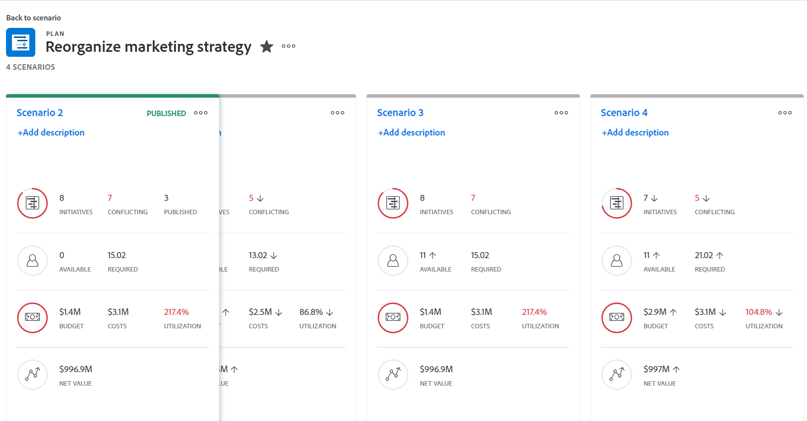
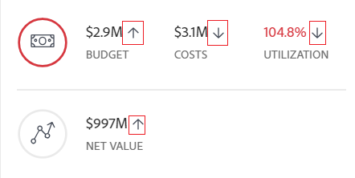

# Skapa och jämföra planscenarier i [!DNL Scenario Planner]

När ni planerar företagets långsiktiga strategi finns det mycket information som ni kanske inte har eller tänker på i början. Det tar tid och experimenterande att komma fram till en slutlig strategi som era intressenter kan acceptera. Genom att utföra en konsekvensanalys för att skapa flera scenarier för din plan kan du förutse och utvärdera potentiella omständigheter på ett korrekt sätt och i slutändan utveckla den bästa möjliga planen.

## Åtkomstkrav

Du måste ha följande:

<table style="table-layout:auto"> 
 <col> 
 <col> 
 <tbody> 
  <tr> 
   <td> 
[!DNL Adobe Workfront]<b> plan*</b> 
 </td> 
   <td>[!UICONTROL Business] eller högre</td> 
  </tr> 
  <tr> 
   <td> 
[!DNL Adobe Workfront]<b> licens*</b> 
 </td> 
   <td> 
[!UICONTROL Review] eller högre
 </td> 
  </tr> 
  <tr> 
   <td><b>Produkt</b> </td> 
   <td> 
Du måste köpa ytterligare en licens för [!DNL Adobe Workfront Scenario Planner] för att få tillgång till funktioner som beskrivs i den här artikeln.
 
Mer information om hur du får [!DNL Workfront Scenario Planner], se <a href="../scenario-planner/access-needed-to-use-sp.md" class="MCXref xref">Åtkomst krävs för att använda [!DNL Scenario Planner]</a>. 
 </td> 
  </tr> 
  <tr data-mc-conditions=""> 
   <td><strong>Konfigurationer på åtkomstnivå*</strong> </td> 
   <td> 
Redigera åtkomst eller högre till [!DNL Scenario Planner]
 
Obs! Om du fortfarande inte har åtkomst kan du fråga [!DNL Workfront] om de anger ytterligare begränsningar för din åtkomstnivå. Information om hur en Workfront-administratör kan ändra åtkomstnivån finns i <a href="../administration-and-setup/add-users/configure-and-grant-access/create-modify-access-levels.md" class="MCXref xref">Skapa eller ändra anpassade åtkomstnivåer</a>.
 </td> 
  </tr> 
  <tr data-mc-conditions=""> 
   <td> 
<strong>Objektbehörigheter</strong> 
 </td> 
   <td> 
[!UICONTROL Manage] behörigheter till en plan
 
Mer information om hur du begär ytterligare åtkomst till en plan finns i <a href="../scenario-planner/request-access-to-plan.md" class="MCXref xref">Begär åtkomst till en plan i [!DNL Scenario Planner]</a>.
 </td> 
  </tr> 
 </tbody> 
</table>

&#42;Kontakta [!DNL Workfront] administratör.

## Skapa scenarier

Ett scenario är en kopia av en plan. Du kan skapa så många scenarier du behöver. Vi rekommenderar dock att du håller antalet scenarier så lågt som möjligt så att du enkelt kan jämföra dem.

1. Klicka på **[!UICONTROL Main Menu]** icon och sedan klicka [!UICONTROL Scenarios].

1. Skapa en plan.

   Mer information om att skapa planer finns i [Skapa och redigera planer i [!DNL Scenario Planner]](../scenario-planner/create-and-edit-plans.md).

   Den första plan du skapar sparas automatiskt som[!UICONTROL Initial scenario].&quot;

1. Klicka på nedåtpilen bredvid ett befintligt scenario och klicka sedan på **[!UICONTROL Copy]** ikon.

   

   Detta skapar ett nytt scenario med samma information som det kopierade scenariot. Den får automatiskt namnet &quot;[!UICONTROL Scenario 2]&quot; om det är det andra scenariot i din plan, &quot;[!UICONTROL Scenario 3]&quot;om det är den tredje, och så vidare. Du kan inte byta namn på dina scenarier.

   <!--
   <MadCap:conditionalText data-mc-conditions="QuicksilverOrClassic.Draft mode">
   (NOTE:this might change)
   </MadCap:conditionalText>
   -->

1. Uppdatera ditt nya scenario på något av följande sätt:

   * Skapa, uppdatera eller ta bort initiativ

      >[!TIP]
      >
      >När du tar bort ett initiativ i ett scenario tas det bara bort från det valda scenariot, inte från alla scenarier.

      Mer information om hur du skapar initiativ finns i [Skapa och redigera i [!DNL Scenario Planner]](../scenario-planner/create-and-edit-initiatives.md).

   * Uppdatera prioriteringarna i era initiativ
   * Justera personer eller budgetinformation
   * Granska och justera initialkonflikter i ditt scenario

      Mer information om hur du löser konflikter finns i [Lös initialkonflikter i [!DNL Scenario Planner]](../scenario-planner/resolve-conflicts-in-sp.md).

1. Klicka **[!UICONTROL Save Plan]** för att spara ändringarna.

## Jämför scenarier

När du har skapat dina scenarier kan du jämföra dem för att hitta det bästa för din organisation.

1. Gå till planen som du vill jämföra scenarier för.
1. Klicka på **[!UICONTROL Compare scenarios]**. Scenariojämförelsesidan visas.

   Alla befintliga scenarier för planen visas sida vid sida i kortformat. Det inledande scenariot visas alltid först och är statiskt.

   

1. (Valfritt) Bläddra till höger om du vill visa alla scenariokort.

   Följande information visas på ett scenariokort:

   <table style="table-layout:auto"> 
    <col> 
    <col> 
    <tbody> 
     <tr> 
      <td>Namn på scenariot</td> 
      <td> 
Ett namn som genererats automatiskt av Workfront och som inte kan redigeras. Till exempel "[!UICONTROL Initial scenario]", "[!UICONTROL Scenario 2]och så vidare. 
 </td> 
     </tr> 
     <tr> 
      <td>Scenariobeskrivning</td> 
      <td>En manuell inmatning där du kan beskriva detaljerad information om scenariot. </td> 
     </tr> 
     <tr> 
      <td>Tillgängliga jobbroller</td> 
      <td>Antalet jobbroller som är tillgängliga från planens budget under planens varaktighet. </td> 
     </tr> 
     <tr> 
      <td>Obligatoriska jobbroller</td> 
      <td>Antalet jobbroller som krävs, baserat på dina initiativ. </td> 
     </tr> 
     <tr> 
      <td>Budget</td> 
      <td>Den totala budgeten som har definierats för planen i det här scenariot. Budgetinformation om planer finns i <a href="../scenario-planner/plans-overview.md" class="MCXref xref">Planer - översikt i [!DNL Scenario Planner]</a>. </td> 
     </tr> 
     <tr> 
      <td>Kostnader</td> 
      <td>De kostnader som är förknippade med satsningarna på scenariot. Information om kostnader finns i <a href="../scenario-planner/initiatives-overview.md" class="MCXref xref">Översikt över initiativen i [!DNL Scenario Planner]</a>. </td> 
     </tr> 
     <tr> 
      <td>Användning</td> 
      <td>The [!UICONTROL Budget Utilization] Procentandel för planen i det här scenariot. Mer information om [!UICONTROL Budget Utilization] procent, se <a href="../scenario-planner/plans-overview.md" class="MCXref xref">Planer - översikt i [!DNL Scenario Planner]</a>. </td> 
     </tr> 
     <tr> 
      <td>Nettovärde</td> 
      <td>The [!UICONTROL Net Value] i planen i detta scenario. Mer information om [!UICONTROL Net Value] för en plan, se <a href="../scenario-planner/plans-overview.md" class="MCXref xref">Planer - översikt i [!DNL Scenario Planner]</a>. </td> 
     </tr> 
     <tr> 
      <td>Initiativ</td> 
      <td>Antalet initiativ för planen i det här scenariot.</td> 
     </tr> 
     <tr> 
      <td>Konflikt</td> 
      <td>Antalet initiativ som visar någon typ av konflikt i planen för det här scenariot. Mer information om initieringskonflikter finns i <a href="../scenario-planner/resolve-conflicts-in-sp.md" class="MCXref xref">Lös initialkonflikter i [!DNL Scenario Planner]</a>. </td> 
     </tr> 
    </tbody> 
   </table>

   >[!NOTE]
   >
   >När informationen skiljer sig mellan det inledande scenariot och ytterligare scenarier visas en upp- eller nedpil bredvid värdet som ändrats för att ange en ökning eller minskning av det värdet, jämfört med det ursprungliga scenariot.
   >
   >
   >
   >
   >Till exempel budgeten, antalet jobbroller och antalet initiativ kan ändras från ett scenario till ett annat.

1. Klicka på namnet på ett scenario för att komma åt det och ändra det.

   Mer information finns i [Skapa scenarier](#create-scenarios) i den här artikeln.

1. Klicka **[!UICONTROL Add description]** för att lägga till en beskrivning av scenariot

   eller

   Klicka på beskrivningsfältet för att uppdatera det och klicka sedan var som helst på skärmen för att spara ändringarna.

1. (Valfritt) Klicka på **[!UICONTROL More]** meny  till **[!UICONTROL Copy]** eller **[!UICONTROL Delete]** scenariot.

   

   När du kopierar ett scenario visas det automatiskt på kortsidan och får ett nytt namn enligt följande mönster: &quot;[!UICONTROL Scenario] `<next number in order>`.&quot;

1. (Villkorligt) Om du klickade **[!UICONTROL Delete]**, klicka **[!UICONTROL Yes, delete it]** för att bekräfta.

   Borttagna scenarier kan inte återställas.

   Mer information om att ta bort scenarier finns i [Ta bort planer i [!DNL Scenario Planner]](../scenario-planner/delete-plans.md).

1. Klicka **[!UICONTROL Save Plan]** för att spara dina scenarier och din plan.
