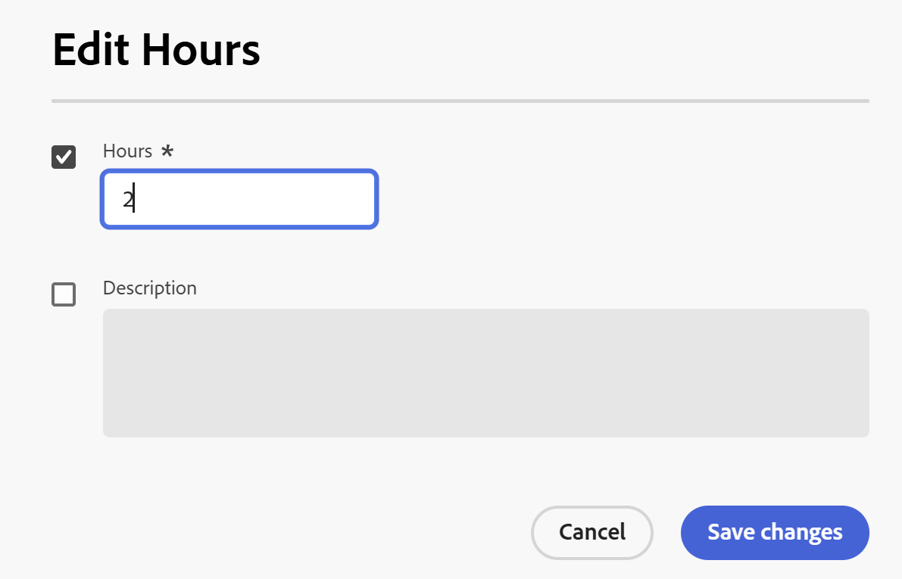

# Loggtid

<!--Audited: 12/2023-->

<!--remove all preview and production references if any-->
<!--update screen shots for the general hour entries and the mixed selection of hours at production, if they fixed the bugs -->

Du kan logga tiden för arbetsobjekt i Adobe Workfront för att ange hur många timmar du ska arbeta med dem. Du kan också logga tid som inte är relaterad till arbetet, som semester, sjuktid eller tid som du tillbringar i möten. Den tid du loggar visas i tidrapporten.

Mer information om vilken typ av timmar du kan logga in i Workfront finns i [Hantera timtyper](../../administration-and-setup/set-up-workfront/configure-timesheets-schedules/hour-types.md).

## Åtkomstkrav

+++ Expandera om du vill visa åtkomstkrav för funktionerna i den här artikeln.

Du måste ha följande åtkomst för att kunna utföra stegen i den här artikeln och logga Project Specific hours:

<table style="table-layout:auto"> 
 <col> 
 <col> 
 <tbody> 
  <tr> 
   <td role="rowheader">Adobe Workfront</td> 
   <td> 
Alla
 </td> 
  </tr> 
  <tr> 
   <td role="rowheader">Adobe Workfront-licens*</td> 
   <td> 
Nytt:

   <ul><li>
 Ljus eller högre för att logga timmar för en aktivitet, ett problem eller allmänna timmar på en tidrapport

   <li>
Standard för att logga timmar i projekt
</li></ul>
   

   
Aktuell: 
   <ul><li>Granska eller senare för att logga allmänna timmar i en tidrapport</li>
   <li>Arbeta eller senare för att logga timmar i ett projekt, en uppgift eller ett ärende</li></ul> </td> 
  </tr> 
  <tr> 
   <td role="rowheader">Konfigurationer på åtkomstnivå</td> 
   <td> 
Redigera åtkomst till den typ av arbetspost som du loggar tid för 
 
Du behöver till exempel Redigera-åtkomst till Problem för att kunna logga tid för problem
 </td> 
  </tr> 
  <tr> 
   <td role="rowheader">Objektbehörigheter</td> 
   <td> 
Contribute eller högre behörigheter för det arbetsobjekt du loggar tid för, inklusive behörigheter för loggtimmar
 </td> 
  </tr> 
 </tbody> 
</table>

*Mer information finns i [Åtkomstkrav i Workfront-dokumentation](/help/quicksilver/administration-and-setup/add-users/access-levels-and-object-permissions/access-level-requirements-in-documentation.md).

+++

## Att tänka på när du loggar tid i Workfront

* Du kan logga tid för projekt, uppgifter eller problem eller logga tid direkt i tidrapporten.

  Mer information om hur du skapar tidrapporter finns i [Skapa en tidrapport för engångsbruk](../../timesheets/create-and-manage-timesheets/create-tmshts.md).

* All tid som loggas via andra verktyg än tidrapporten visas i tidrapporten för motsvarande tidsperiod.
* Uppgifter och ärenden i ett projekt som inte är aktuellt fylls inte i i förväg i en tidrapport.
* Den tid som är inloggad i tidrapporten används omedelbart för uppgiften, utgåvan eller projektet.
* Tidrapporter innehåller den totala tiden för alla loggade datum. Helger inkluderas alltid, även när tidslinjeberäkningar har konfigurerats för att exkludera dem (enligt beskrivningen i [Konfigurera systemomfattande projektinställningar](../../administration-and-setup/set-up-workfront/configure-system-defaults/set-project-preferences.md)).
* Det maximala antalet objekt som visas i en tidrapport är 45. Om det finns fler än 45 objekt vars datum matchar tidsramen för tidrapporten visas endast de senast uppdaterade objekten.
* Timposter som ingår i fakturerade faktureringsposter är nedtonade och kan inte redigeras i tidrapporten. Mer information finns i [Skapa faktureringsposter](../../manage-work/projects/project-finances/create-billing-records.md).
* Personliga uppgifter visas inte som standard i tidrapporten. Personliga uppgifter visas bara i tidrapporten när de har loggat tid. När du har loggat tiden för en personlig uppgift kan du fästa uppgiften på tidrapporten och den kommer att finnas kvar på tidrapporten om den är fäst. Mer information finns i [Skapa arbetsobjekt och projekt från Hem-området](../../workfront-basics/using-home/using-the-home-area/create-work-items-in-home.md).

## Loggtid {#log-time-section}

Du kan logga tid i följande områden i Workfront:

* [Tidrapport](#timesheet)
* [Startsida](#home)
* [Projekt, aktivitet eller problem](#project-task-or-issue)
* [Panelen Sammanfattning](#summary-panel)
* [Varumärkena](#boards)
* [Mobilapp](#mobile-app)

### Tidrapport {#timesheet}

#### Logga tid på en tidrapport {#log-time-on-a-timesheet}

Du kan logga tid på följande objekt i tidrapporten:

* I förväg ifyllda uppgifter, utgåvor och projekt som visas automatiskt, baserat på hur Workfront-administratören anger tidrapportinställningarna. Mer information om hur tidrapporter är förifyllda finns i [Konfigurera tidrapport och timinställningar](../../administration-and-setup/set-up-workfront/configure-timesheets-schedules/timesheet-and-hour-preferences.md).

  Endast de uppgifter och utgåvor som du har tilldelats är ifyllda i tidrapporten. Uppgifter och ärenden som tilldelats dina team eller jobbroller fyller inte i din tidrapport automatiskt.

  Om du klickar på Arbeta på ett objekt som har tilldelats dina team tilldelas objektet till dig och objektet visas i tidrapporten.

* Uppgifter, ärenden eller projekt som du lägger till manuellt.
* Uppgifter, ärenden eller projekt som du redan har loggat in på någon annan plats i Workfront.
* Allmän tid (semester, utbildning, overheadtime).

>[!NOTE]
>
>Granska användare som tilldelats en tidrapportprofil kan se området Tidrapporter och logga allmänna timmar. De kan dock inte logga timmar för uppgifter eller ärenden som tilldelats dem och som visas på tidrapporten.

Så här loggar du tid på en tidrapport:

{{step1-click-main-menu}}

1. Klicka på [!UICONTROL **Tidrapporter**]. Din aktuella tidrapport visas som standard.
   

1. (Valfritt) Klicka på ikonen **helskärm**  om du vill visa tidrapporten i helskärmsläge och klicka sedan på ikonen **avsluta helskärm**  om du vill återgå till tidrapporten.

   <!-- drafted for the resize columns in timesheet story: 1. (optional) Click on the separator lines between weeks or between the time frame area and the work item area to resize the columns of the timesheet.-->

1. (Valfritt) Om du vill lägga till ett projekt, en uppgift eller ett problem i tidrapporten klickar du på listrutan **Lägg till objekt** i det övre vänstra hörnet av tidrapporten och sedan på **Lägg till projekt**, **Lägg till aktiviteter** eller **Lägg till problem** .

   En lista med projekt, uppgifter eller problem visas.

   <!--drafted for full screen mode for add projects story - align it with the rest of the steps when you enable this:: 1. (Optional) Click the **full-screen** icon  to display the list of objects in full-screen mode.-->

1. (Valfritt) Klicka på sökikonen  om du vill söka efter ett visst objekt med ett nyckelord som ska läggas till i tidrapporten.

1. (Valfritt) Expandera listrutorna för filter, vy och gruppering för att tillämpa eller anpassa en och visa önskad objektinformation.

1. Markera ett eller flera objekt i listan och klicka sedan på **Lägg till**.

   Om du har lagt till färre än 50 objekt samtidigt läggs objekten till i tidrapporten. Uppgifter och ärenden visas under namnet på projektet.

   >[!NOTE]
   >
   >När du lägger till uppgifter eller utgåvor i tidrapporten läggs även projektet till.

1. (Villkorligt) Om du lägger till 50 eller fler objekt samtidigt visas ett bekräftelsemeddelande med antalet objekt som har lagts till i tidrapporten.

   Klicka på **Lägg till alla** för att lägga till alla objekt
eller
Klicka på **Avbryt** om du vill sluta lägga till de markerade objekten och sedan på **Avbryt** om du vill stänga objektlistan.

   Uppgifter och ärenden visas under namnet på projektet.

   >[!NOTE]
   >
   >Objekten som du lägger till manuellt i tidrapporten är fästa och kommer att finnas kvar på aktuella och framtida tidrapporter tills du tar bort dem manuellt. Information om hur du tar bort objekt från tidrapporten genom att ta bort dem finns i steg 10.

   <!--(ensure this stays accurate)-->

1. (Valfritt) Klicka på ikonerna **Komprimera**  eller **Expandera**  bredvid projektnamnet för att visa eller dölja listan med aktiviteter och ärenden för projektet.

   >[!TIP]
   >
   >   När du använder ett vanligt QWERTY-tangentbord och klickar på namnet på ett projekt i tidrapporten trycker du på följande uppsättning tangenter för att komprimera eller utöka projektet:
   >   * Så här expanderar du projektet och visar dess arbetsobjekt:
   >     * Skift + Alt + Uppil för Windows-datorer
   >     * Skift + Alt + Uppil för Mac-datorer
   >   * Så här komprimerar du projektet och döljer dess arbetsobjekt:
   >     * Skift + Alt + Nedpil för Windows-datorer
   >     * Skift + Alt + Nedåtpil för Mac-datorer.

1. (Valfritt) Om du vill fästa ett objekt som visas automatiskt på tidrapporten manuellt håller du pekaren över objektets namn och klickar sedan på ikonen **pin**  .

   >[!TIP]
   >
   >   När du använder ett vanligt QWERTY-tangentbord efter att ha klickat på ett objekt i tidrapporten trycker du på följande uppsättning tangenter för att fästa ett objekt:
   >   * Alternativ + P för både Windows- och Mac-datorer.

1. (Valfritt) Klicka på sökikonen  och börja skriva ett nyckelord för att hitta ett projekt, en aktivitet eller ett problem i tidrapporten.

1. (Villkorligt) Om din Workfront- eller gruppadministratör har aktiverat inställningen **Tilldela jobbroller till timposter manuellt** väljer du en jobbroll i listrutan. Den roll som anges när du tilldelas arbetsuppgiften visas som standard. Om du inte har tilldelats någon roll för objektet visas din primära roll som standard. Mer information om den här inställningen finns i artikeln [Konfigurera tidrapport och timinställningar](../../administration-and-setup/set-up-workfront/configure-timesheets-schedules/timesheet-and-hour-preferences.md).

   

1. (Valfritt) Klicka på ikonen **+** om du vill lägga till en till rad och välj sedan en ny timtyp i listrutan i kolumnen [!UICONTROL Hour Type] om du vill logga tiden för en annan timtyp.

   

   >[!TIP]
   >
   >   Beroende på operativsystem eller webbläsare och när du använder ett vanligt QWERTY-tangentbord trycker du på följande uppsättning med tangenter för att lägga till ytterligare en rad:
   >   * Ctrl + Alt + + + för Windows-datorer
   >   * Cmd + Option + + för Mac-datorer

   Timtyper är tillgängliga beroende på vad som har definierats på system-, projekt- och användarnivå, vilket beskrivs i [Definiera timtyper och tillgänglighet](define-hour-types-and-availability.md).

   Timtypen kan inte ändras efter att en tidrapport har stängts.

   >[!TIP]
   >
   >Om du tidigare loggade tid och timtypen som du valde nu är inaktiverad tonas hela raden för den loggade tiden ned. Om du väljer en annan timtyp och uppdaterar sidan tas alternativet för inaktiverad timtyp bort från listrutan så att du inte kan lägga till ytterligare timmar till den timtypen.
   >
   >Överväg att lägga till en ny rad för arbetsuppgiften som du vill logga ytterligare tid för och välja en ny timtyp om du vill behålla den inaktiverade timtypen som är kopplad till den senaste loggade tiden.

1. Klicka på ikonen **delete**  bredvid jobbrollen för att ta bort den. När du loggat för rollen tas även den bort.

   >[!TIP]
   >
   >   Beroende på operativsystem eller webbläsare och när du använder ett vanligt QWERTY-tangentbord trycker du på följande uppsättning tangenter för att ta bort en rad:
   >   * Ctrl + Alt + - för Windows-datorer
   >   * Cmd + Option + - för Mac datorer

1. Ange hur lång tid du vill logga in en viss dag i tidslinjesektionen i tidrapporten och klicka sedan utanför timrutan för att spara timposten. Timmarna sparas automatiskt. Raden som du loggar tid för markeras med ljusblått och rutan för timuppgifterna markeras med mörkblått.

   

   Du loggar tid i timmar eller dagar. Den här inställningen konfigureras av användare med en planlicens eller av systemadministratören, enligt beskrivningen i [Konfigurera om tiden är inloggad i timmar eller dagar](../../timesheets/config-timesheet-prefs/config-time-logged-hrs-days.md).

   >[!IMPORTANT]
   >
   >Du måste spara tidrapporten manuellt om något av följande inträffar:
   >
   >* Jobbrollen som är associerad med tiden som du loggade tidigare har ändrats och inställningen **Tilldela jobbroller till timposter manuellt** har inaktiverats. Loggningstiden för nya datum associeras med en annan jobbroll.
   >   
   >   Om rollen har ändrats och inställningen **Tilldela jobbroller till timposter manuellt** är aktiverad, kan du logga tid eller uppdatera rollen så sparas ändringarna automatiskt.
   >
   >* Jobbrollen som tilldelats en aktivitet eller ett problem skiljer sig från jobbrollen som tidrapportägaren loggar tid med <!--or assigned to them_ this last  piece came from a Support note but but sure what role it's referring to. Leaving it out for now.-->.
   >
   >Tidrapporten kommer att spara tiden automatiskt igen när det inte finns fler motstridiga poster mellan de två rollerna.
   >

1. (Valfritt) Ange mängden övertid i fältet Övertid i tidrapporthuvudet.

   >[!TIP]
   >
   >Du kan inte logga ett större antal övertidstimmar än det aktuella totala antalet timmar på tidrapporten. Om du till exempel har loggat 7 timmar på tidrapporten hittills kan du inte logga 8 timmars övertid.

1. (Valfritt) Klicka på **Kommentar** om du vill lägga till en kommentar för timposten.

   

   >[!TIP]
   >
   >   När du använder ett vanligt QWERTY-tangentbord när du har klickat på rutan för timmatning, trycker du på följande uppsättning tangenter för att öppna kommentarsrutan:
   >   * Skift+F2 för både Windows- och Mac-datorer.

1. Klicka på **Klar** för att spara kommentaren.

   >[!TIP]
   >
   >   När du använder ett vanligt QWERTY-tangentbord kan du trycka på följande uppsättning tangenter i kommentarsrutan för att spara kommentaren:
   >   * Ctrl + Retur för Windows-datorer.
   >   * Cmd + Retur för Mac-datorer.

1. (Valfritt) Klicka på **Visa kommentarer** i verktygsfältet om du vill visa timingkommentarer under arbetsposten.

   

   >[!TIP]
   >
   >   Alla ändringar du gör i tidrapporten sparas automatiskt.

1. (Valfritt) Klicka på raden för en uppgift eller ett problem och klicka sedan på **Öppna sammanfattning** i det övre högra hörnet av tidrapporten om du vill lägga till en uppdatering eller uppdatera information om uppgiften eller problemet. Panelen Sammanfattning öppnas till höger.

   

   Din uppdatering visas i uppdateringsområdet för den arbetsuppgift som är associerad med den loggade tiden.

   >[!TIP]
   >
   >Du kan inte kommentera projekt eller allmänna timtävlingsbidrag för tid.

1. Klicka på [!UICONTROL **Stäng sammanfattning**] för att stänga sammanfattningspanelen och återgå till tidrapporten.

1. (Valfritt) Klicka på [!UICONTROL **Uppdateringar**] i den vänstra panelen och lägg sedan till en uppdatering i tidrapporten. Mer information om Workfront-uppdateringar finns i [Uppdatera arbete](../../workfront-basics/updating-work-items-and-viewing-updates/update-work.md).

   

1. (Valfritt) Gå tillbaka till **tidrapporten** om du vill stänga eller skicka tidrapporten.

   * **Stäng**: Stäng tidrapporten när du har uppdaterat den. Det här alternativet är endast tillgängligt när din tidrapport inte är kopplad till en godkännare.

   * **Skicka för godkännande:** Det här alternativet är bara tillgängligt om det finns en godkännare på tidrapporten. Spara ändringarna och skicka in för godkännande. Du kan öppna tidrapporten när du har stängt den genom att klicka på **Återkalla**, om inget godkännande har beviljats ännu. Mer information finns i [Skicka en tidrapport för godkännande](../../timesheets/create-and-manage-timesheets/submit-timesheet-for-approval.md).

   * **Avvisa**: Det här alternativet visas när du är en tidrapportgodkännare och tidrapporten har skickats till dig för godkännande. Om du klickar på den ändras tidrapportens status till Avvisat och tidrapporten förblir öppen.

   * **Godkänn**: Det här alternativet visas när du är en tidrapportgodkännare och tidrapporten har skickats till dig för godkännande. Om du klickar på den ändras tidrapportens status till Godkänd och tidrapporten stängs.

   >[!TIP]
   >
   >Alternativen Avvisa och Godkänn visas också på tidrapporten när du är systemadministratör och tidrapporten är kopplad till en godkännare.

1. (Villkorligt) Om du har stängt eller skickat in tidrapporten för godkännande klickar du på något av följande alternativ:

   * **Öppna igen**: Det här alternativet är tillgängligt för tidrapporter som du redan har stängt och som inte har några godkännare, eller tidrapporter som redan har godkänts. Öppna tidrapporten igen om du vill ändra timposter.
   * **Återkalla**: Det här alternativet är tillgängligt för tidrapporter som har skickats för godkännande, men som ännu inte har godkänts eller avvisats. Klicka på **Återkalla** om du vill öppna tidrapporten igen och ändra timposterna.

#### Ta bort ett objekt från tidrapporten

Du kan ta bort en timpost eller en artikel (projekt, uppgift eller utgåva) från en tidrapport.

Så här tar du bort en timpost från en tidrapport:

1. Gå till tidrapporten och hitta timposten som du vill ta bort.
1. Ersätt de timmar som angetts med 0
eller
Ta bort timmarna och ersätt dem med 0 och tryck sedan på Retur.

   Timmarna tas bort och tidrapporten sparas automatiskt.

Du kan ta bort ett objekt (projekt, uppgift eller utgåva) från tidrapporten genom att ta bort det, om du ännu inte har loggat tid för det, och om du har lagt till objektet manuellt (enligt beskrivning i steg 4-8 i avsnittet [Loggtid på en tidrapport](#log-time-on-a-timesheet) i den här artikeln). <!--ensure this stays accurate-->

Du kan inte ta bort objekt som ingår i tidrapporten automatiskt enligt tidrapportinställningarna i ditt Workfront-system eller -grupp som är konfigurerade att fylla i tidrapporterna i förväg (vilket beskrivs i [Konfigurera tidrapport och timinställningar](../../administration-and-setup/set-up-workfront/configure-timesheets-schedules/timesheet-and-hour-preferences.md)). Objekten stoppar förifyllning av tidrapporten när datumen för objekten ligger utanför tidsramen i tidrapporten.

Så här tar du bort ett objekt från tidrapporten som har lagts till manuellt:

1. Kontrollera att ingen tid är inloggad mot objektet.
1. Klicka på ikonen **ta bort**  bredvid objektet om du vill ta bort det från tidrapporten.

   >[!TIP]
   >
   >   När du använder ett vanligt QWERTY-tangentbord efter att ha klickat på ett objekt i tidrapporten trycker du på följande uppsättning tangenter för att ta bort ett objekt:
   > * Alternativ + P för både Windows- och Mac-datorer.

   Objektet tas bort från tidrapporten när du har uppdaterat sidan.

### Startsida {#home}

Du kan logga projektspecifik tid i Hem.

Allmän information om hur du använder Hem-området finns i [Använda Hem-området](../../workfront-basics/using-home/using-the-home-area/use-the-home-area.md).

<!--#### Log time on a work item from the new Home area-->

Du kan logga tid på uppgifter och problem i alla widgetar med hjälp av panelen Sammanfattning i Hem-området. Mer information finns i avsnittet [Sammanfattningspanelen](#summary-panel) i den här artikeln.

Om du dessutom vill logga tiden för ett objekt i widgeten Mitt arbete:

1. Gå till området **Hem**.
1. Lägg till widgeten **Mitt arbete** i ditt hem.
1. (Valfritt) Välj en åtgärd, ett problem eller en förfrågan i en lista och klicka sedan på **Arbeta med den**.
1. Håll muspekaren över uppgiften eller problemet som du vill logga in på och klicka sedan på ikonen **Loggtid**  till höger om aktivitetsinformationen.

   

1. Klicka på **Loggtid**.

   Den loggade tiden visas i objektets Timmar-avsnitt och i din tidrapport.

<!--#### Log time on a work item from the legacy Home area

1. In the **Work List** area, select the item where you want to log time.
1. In the right panel, click **Log Time**.  
  
     

1. In the **Enter Hours** drop-down menu, select the appropriate hour type.  
   Hour types are available depending on what has been defined at the system, project, and user levels, as described in [Define hour types and availability](../../timesheets/create-and-manage-timesheets/define-hour-types-and-availability.md).
1. (Conditional) If your Workfront or group administrator has enabled the **Assign job roles to hour entries manually** setting, select a job role from the drop-down menu. The role specified when you are assigned to the work item displays by default. If you are not assigned a role on the object, your Primary Role displays as the default. For more information on this setting, see the article [Configure timesheet and hour preferences](../../administration-and-setup/set-up-workfront/configure-timesheets-schedules/timesheet-and-hour-preferences.md).
1. Specify the time you want to log, then click **Log Time**.

   The logged time displays in the object's Hours section, nad in your timesheet. -->

### Projekt, uppgift eller utleverans {#project-task-or-issue}

Du kan logga projektspecifik tid för ett projekt, en uppgift eller ett problem i följande avsnitt:

* [Uppdateringsavsnitt](#updates-section)
* [Avsnittet Timmar](#hours-section)

#### Uppdateringsavsnitt{#updates-section}

Om du vill logga tid i uppdateringsavsnittet för ett projekt, en uppgift eller ett problem måste du ha följande:

* Rätt åtkomst och behörigheter, enligt beskrivningen i avsnittet [Åtkomstkrav](#access-requirements) i den här artikeln.

* Workfront-administratören måste aktivera loggtiden direkt i projekt som anges under [!UICONTROL **Tidrapport och timmar**]> [!UICONTROL **Inställningar**] i systemområdet om du vill logga tiden direkt till ett projekt.

  Mer information om hur du tillåter användare att logga timmar direkt till projekt finns i [Konfigurera tidrapport och timinställningar](../../administration-and-setup/set-up-workfront/configure-timesheets-schedules/timesheet-and-hour-preferences.md).

Så här loggar du tid i uppdateringsavsnittet för ett projekt, en uppgift eller ett problem:

1. Gå till ett projekt, en uppgift eller ett ärende.
1. Välj **Uppdateringar** i den vänstra panelen.
1. Klicka på **Loggtid**. <!-- did Anna B change the casing for this button? If yes and if she changed it for the other areas, update screen shot too-->

   Dialogrutan Loggtid visas.

   >[!TIP]
   >
   >   Om din profils inställning är att logga tid i dagar visas rutan Ange dagar.
   >   
   >   I det övre högra hörnet av rutan Ange dagar finns en indikation på hur många timmar en dag ska ha.

   

1. Ange följande information:

   * **Timtyp**: Välj en timtyp på den nedrullningsbara menyn, om den skiljer sig från den som visas som standard.

     Beroende på vilka timtyper som är konfigurerade i systemet kan alternativen här variera. Mer information om hur du konfigurerar timtyper finns i [Definiera timtyper och tillgänglighet](../../timesheets/create-and-manage-timesheets/define-hour-types-and-availability.md).

   * **Jobbroll**: (Villkorligt) Om din Workfront- eller gruppadministratör har aktiverat inställningen **Tilldela jobbroller till timposter manuellt** väljer du en **Jobbroll** i listrutan. Den roll som anges när du tilldelas till objektet visas som standard. Om du inte har tilldelats en roll för objektet visas din primära roll som standard. Mer information om den här inställningen finns i artikeln [Konfigurera tidrapport och timinställningar](../../administration-and-setup/set-up-workfront/configure-timesheets-schedules/timesheet-and-hour-preferences.md).

   * **Timmar**: Ange antalet timmar för projektet, aktiviteten eller utgåvan.

1. Klicka på **Loggtid**.

   Den loggade tiden visas i objektets Timmar-avsnitt och i din tidrapport.

#### Avsnittet Timmar{#hours-section}

Du måste vara Workfront-administratör för att kunna logga tid för projekt, uppgifter och problem i timavsnittet,

eller

Du måste ha alla följande:

* En planlicens med administrativ åtkomst till tidrapporter och timmar. Mer information om hur du beviljar administrativ åtkomst till tidrapporter och timmar finns i [Bevilja användare administrativ åtkomst till vissa områden](../../administration-and-setup/add-users/configure-and-grant-access/grant-users-admin-access-certain-areas.md).
* Contribute eller högre behörigheter för projektet med åtkomst till loggtimmar. Mer information om att bevilja behörigheter för projekt finns i [Dela ett projekt i Adobe Workfront](../../workfront-basics/grant-and-request-access-to-objects/share-a-project.md).
* Workfront-administratören måste aktivera loggtiden direkt i projektinställningarna under **Tidrapport och timmar > Inställningar** i inställningsområdet om du vill logga tiden direkt i ett projekt. Mer information om hur du tillåter användare att logga timmar direkt till projekt finns i [Konfigurera tidrapport och timinställningar](../../administration-and-setup/set-up-workfront/configure-timesheets-schedules/timesheet-and-hour-preferences.md).

Så här loggar du tid i timavsnittet för ett projekt, en uppgift eller ett problem:

1. Gå till ett projekt, en uppgift eller ett ärende.
1. Klicka på **Timmar** i den vänstra panelen.
1. Klicka på **Loggtid**.

   Dialogrutan Loggtimmar visas.

1. Ange följande information:

   * **Ägare:** Ditt namn visas som standard i det här fältet.\
     Om du loggar timmarna för en annan användare anger du användarens namn.

   * **Timtyp**: Välj en timtyp på den nedrullningsbara menyn, om den skiljer sig från den som visas som standard.

     Beroende på vilka timtyper som är konfigurerade i systemet kan alternativen här variera. Mer information om hur du konfigurerar timtyper finns i [Definiera timtyper och tillgänglighet](../../timesheets/create-and-manage-timesheets/define-hour-types-and-availability.md).

   * **Jobbroll**: (Villkorligt) Om din Workfront- eller gruppadministratör har aktiverat inställningen **Tilldela jobbroller till timposter manuellt** väljer du en **Jobbroll** i listrutan. Den roll som anges när du tilldelas till objektet visas som standard. Om du inte har tilldelats en roll för objektet visas din primära roll som standard. Mer information om den här inställningen finns i artikeln [Konfigurera tidrapport och timinställningar](../../administration-and-setup/set-up-workfront/configure-timesheets-schedules/timesheet-and-hour-preferences.md).

     
   * **Timmar**: Ange antalet timmar för projektet, aktiviteten eller utgåvan.

1. Klicka på **Loggtid**.

### Panelen Sammanfattning

Du kan logga tid för uppgifter och problem på panelen Sammanfattning.
Mer information finns i [Sammanfattningsöversikt](../../workfront-basics/the-new-workfront-experience/summary-overview.md).

### Varumärkena {#boards}

Du kan logga in på anslutna kort på ett Workfront-kort. Detta är samma process som när du loggar tid för en uppgift eller ett problem, och de timmar som är inloggade på kortet sparas för den anslutna aktiviteten eller problemet.
Mer information finns i [Använda anslutna kort på kort](/help/quicksilver/agile/get-started-with-boards/connected-cards.md).

### Mobilapp {#mobile-app}

Du kan logga tid från Workfront mobilapp.
Mer information finns i [Adobe Workfront för Android](/help/quicksilver/workfront-basics/mobile-apps/using-the-workfront-mobile-app/workfront-for-android.md) eller [Adobe Workfront för iOS](/help/quicksilver/workfront-basics/mobile-apps/using-the-workfront-mobile-app/workfront-for-ios.md).

## Redigera loggade timmar i listor och rapporter

>[!CAUTION]
>
>* Du kan inte ändra timposter som tillhör en stängd tidrapport. Du måste först öppna tidrapporten igen och sedan ändra informationen för timinmatning.
>* När du ändrar timtyp från en typ som inte räknas som intäkt till en annan typ som räknas som intäkt, ändras också projektets ekonomi. Om du ändrar timtyper från en typ som räknas som intäkt till en typ som inte räknas som intäkt uppdateras även projektets ekonomi.
>
>Mer information finns i [Hantera timtyper](/help/quicksilver/administration-and-setup/set-up-workfront/configure-timesheets-schedules/hour-types.md).
>

Du kan redigera loggade timmar i följande områden:

* Alla områden där du lade till timmarna, inklusive öppna tidrapporter
* Timlistor och rapporter.

Du kan redigera följande element för en timinmatning när du redigerar en timinmatning i en lista eller rapport:

* Antal timmar
* Timtyp
* Jobbroll som är associerad med timinmatningen
* Beskrivning av timinmatningen

Beroende på vilken typ av timposter du redigerar kan du redigera följande fält i en timlista eller rapport:

* När du redigerar projektspecifika timmar:

   * Antal timmar
   * Timtyp. Du kan bara ändra timtypen till projektspecifika typer.
   * Jobbrolltilldelning. Du kan bara ändra jobbrolltilldelningen om den aktiverades i installationsprogrammet. Mer information finns i [Konfigurera tidrapport och timinställningar](/help/quicksilver/administration-and-setup/set-up-workfront/configure-timesheets-schedules/timesheet-and-hour-preferences.md)
   * Beskrivning av timposten.

  

* När du redigerar allmänna timmar:

   * Antalet timmar.
   * Timtyp. Du kan bara ändra timtypen till allmänna typer.
   * Beskrivning av timposten.

>[!TIP]
>
> Du kan inte ändra timjobbrolltilldelningen eftersom allmänna timmar inte kan associeras med roller.

<!--update the screen shot at production - we should not see the job role field for general hours-->

* När du redigerar en blandning av allmänna och projektspecifika timmar, gruppvis:

   * Antalet timmar.
   * Beskrivning av timposten.

>[!TIP]
>
>* Du kan inte ändra timtyp eftersom allmänna timtyper inte kan ändras till projektspecifika typer och projektspecifika timtyper inte kan ändras till allmänna typer.
>* Du kan inte ändra jobbrolltilldelningen eftersom allmänna timmar inte kan associeras med roller.

<!--update the screen shot at production - we should not see the job role and the hour type fields for mixed hour types-->

Så här redigerar du timtyper i en timrapport eller timlista:

1. Gå till en timlista eller rapport.
1. Klicka i rutan till vänster om en eller flera timposter för att markera dem.
1. Klicka på ikonen **Redigera**  högst upp i listan.

   Rutan **Redigera timme** eller **Redigera timmar** öppnas.
1. Uppdatera följande tillgängliga fält:

   * Timmar. Detta är ett obligatoriskt fält.
   * Timtyp. Detta är ett obligatoriskt fält.
   * Jobbroll
   * Beskrivning

   >[!TIP]
   >
   >   Alla fält är inte tillgängliga, beroende på vilken timtyp som är associerad med de valda timposterna.

1. Klicka på **Spara ändringar**.

   Informationen om timinmatning uppdateras.
Om du har markerat mer än en timmes inmatning och ändrat fältet Timmar, fördelas samma antal timmar till alla valda timinmatningar. De ursprungliga timmarna ersätts med det nya värdet för alla valda timtransaktioner.

