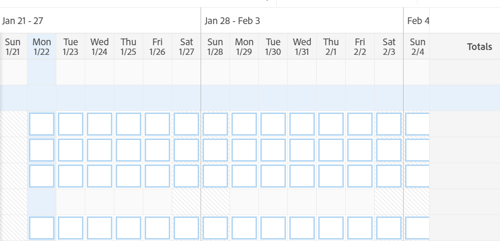

# Översikt över tidrapportslayout

<!-- Audited: 12/2023 -->

<!--The highlighted information on this page refers to functionality not yet generally available. It is available only in the Preview environment for all customers or in Production for customers who enabled fast releases. 

For information about fast releases, see [Enable or disable fast releases for your organization](/help/quicksilver/administration-and-setup/set-up-workfront/configure-system-defaults/enable-fast-release-process.md).

For information about the current release schedule, see [Second Quarter 2024 release overview](/help/quicksilver/product-announcements/product-releases/24-q2-release-activity/24-q2-release-overview.md).-->

I den här artikeln beskrivs layouten för tidrapporter i Adobe Workfront, så att du bättre kan förstå hur du anpassar och använder tidrapporter för att spela in tid.

Inställningarna för tidrapport och timme styr vad som visas på en tidrapport. I den här artikeln finns en översikt över alla tillgängliga alternativ. Information om hur du väljer alternativ finns i [Konfigurera tidrapport och timinställningar](../../administration-and-setup/set-up-workfront/configure-timesheets-schedules/timesheet-and-hour-preferences.md).

Mer information om hur du loggar tid på ett tidrapport finns i [Loggtid](../../timesheets/create-and-manage-timesheets/log-time.md).

Här nedan beskrivs ett område i en tidrapport:

* [Tidrapporthuvud](#timesheet-header)
* [Den vänstra panelen](#the-left-panel)
* [Arbetsobjekt](#work-items)
* [Verktygsfält](#toolbar)
* [Sidfot i tidrapport](#timesheet-footer)
* [Jobbroll](#job-role)
* [Timtyp](#hour-type)
* [Uppdateringsområdet i den vänstra panelen](#updates-area-in-the-left-panel)
* [Panelen Sammanfattning](#summary-panel)
* [Tidsram och timingområde](#time-frame-and-hour-entry-area)
* [Kommentarer till timinginlägg](#hour-entry-comments)
* [Timmar](#hours)
* [Summor](#totals)

## Tidrapporthuvud

Tidrapporthuvudet innehåller följande information:

* Tidsramen för tidrapporten.
* Området Åtgärder som innehåller följande:
   * En stjärnikon som lägger till tidrapporterna i favoritlistan.
   * Ikonen Mer med alternativet Ta bort som gör att du kan ta bort tidrapporten.
* Namnet på tidrapporgens ägare.
* Totalt antal timmar för loggade timmar för objekt som visas i tidrapporten.
* Antalet övertidstimmar. Det här är en manuell post och den visas bara när inställningen **Övertid** är aktiverad på en tidrapport. Mer information finns i [Redigera tidrapportinformation](../create-and-manage-timesheets/edit-timesheets.md).

>[!TIP]
>
>Du kan inte logga ett större antal övertidstimmar än det aktuella totala antalet timmar på tidrapporten. Om du till exempel har loggat 7 timmar på tidrapporten hittills kan du inte logga 8 timmars övertid.

* Tidrapportens status.

## Den vänstra panelen

Följande avsnitt finns i den vänstra panelen:

* **Tidrapport**: Visar den faktiska tidrapporten.
* **Uppdateringar**: Visar kommentarer och systemuppdateringar för tidrapporten. Mer information finns i avsnittet [Uppdateringar i den vänstra panelen](#updates-area-in-the-left-panel) i den här artikeln.

## Arbetsobjekt

Arbetsobjekten är de projekt, uppgifter och problem som du vill logga tid för. Om du klickar på den nedåtriktade pilen i rubrikraden komprimeras projekten och aktiviteterna och problemen som listas under. När du klickar på den nedåtriktade pilen bredvid ett projekts namn komprimeras arbetsobjekten för det projektet.

Uppgifter, utleveranser och projekt där tiden spelas in utanför tidrapporten eller objekt som planerats under tidsperioden för tidrapporten visas här automatiskt.

## Verktygsfält

Verktygsfältet innehåller följande alternativ:

* Knappen **Lägg till objekt** som gör att du kan lägga till projekt, uppgifter eller problem.
* Snabbfilterikonen som används för att söka efter uppgifter eller problem i tidrapporten.
* Inställningen **Visa kommentarer** som gör att du kan visa eller dölja timkommentarer som är loggade för projekt, aktiviteter eller utleverans.
* Helskärmsikonen som visar tidrapporten i helskärmsläge.
* Knappen **Öppna sammanfattning** (eller **Stäng sammanfattning**) om du vill öppna eller stänga panelen Sammanfattning om du vill visa mer information om aktiviteter eller problem. Den här knappen är inte tillgänglig för projekt.

Mer information finns i [Loggtid](../create-and-manage-timesheets/log-time.md).

## Sidfot i tidrapport

Du kan klicka på knapparna **Skicka för godkännande**, **Stäng**, **Godkänn** och **Avvisa** i det här området om du vill stänga eller avvisa ett godkännande av tidrapporten.

Det här området innehåller även information om när tidrapporten senast sparades. Alla ändringar du gör i informationen i tidrapporten sparas automatiskt.

## Jobbroll

Du kan välja en annan jobbroll att associera med timposterna. Workfront-administratören måste aktivera inställningen **Tilldela jobbroller till timposter** manuellt. Jobbrollen som anges för dig när du tilldelas uppgiften eller problemet visas som standard. Om du inte har tilldelats en jobbroll för aktiviteten eller problemet visas din primära roll som standard. Mer information finns i [Konfigurera tidrapport och timinställningar](../../administration-and-setup/set-up-workfront/configure-timesheets-schedules/timesheet-and-hour-preferences.md).

Du kan logga flera timposter för samma arbetsuppgift för olika roller. Mer information finns i [Loggtid](../create-and-manage-timesheets/log-time.md).

## Timtyp

Du kan välja olika timtyper att associera med timposterna för varje artikel. Det här fältet visas bara när Workfront-administratören aktiverar det för din miljö. Mer information finns i [Konfigurera tidrapport och timinställningar](../../administration-and-setup/set-up-workfront/configure-timesheets-schedules/timesheet-and-hour-preferences.md).

Du kan logga flera timposter för samma arbetsuppgift för olika timtyper. Mer information finns i [Loggtid](../create-and-manage-timesheets/log-time.md).

## Uppdateringsområdet i den vänstra panelen

Du kan kommentera i en tidrapport för att kommunicera med tidrapportgodkännare eller andra användare i uppdateringsavsnittet på den vänstra panelen i tidrapporten.

Eventuella kommentarer som gjorts i tidrapporten visas i det här området.

## Panelen Sammanfattning

Du kan öppna panelen Sammanfattning för uppgifter och utgåvor som visas i en tidrapport. Härifrån kan du kommentera uppgifter och problem eller uppdatera deras information. Mer information finns i [Sammanfattningsöversikt](../../workfront-basics/the-new-workfront-experience/summary-overview.md).

Kommentarerna som du anger för arbetsobjekt på panelen Sammanfattning av tidrapporter visas under Uppdateringar för uppgiften eller problemet. Panelen Sammanfattning är inte tillgänglig för projekt.

## Tidsram och timingområde

Tidsperioden för tidrapporten visas till höger om arbetsobjekten.

Du kan skapa tidrapporter för en, två eller fyra veckor.

Tidsramen visas i helveckorsintervall. Dagar utanför den angivna tidsramen för tidrapporten är nedtonade. Du kan inte logga tid för dagar som ligger utanför tidrapportens tidsram.

Mer information finns i [Skapa en enskild tidrapport](../create-and-manage-timesheets/create-tmshts.md) eller [Skapa, redigera och tilldela tidrapportprofiler](../create-and-manage-timesheets/create-timesheet-profiles.md).

<!--drafted for the resize columns in timesheets story - make this blurb a TIP when the story is released: 
You can resize the columns that display different weeks, the time frame, or the work item areas by dragging and dropping the vertical lines that separate them.-->

## Kommentarer till timinginlägg

Du kan lägga till en kommentar för varje timmes inlägg som du lägger till i tidrapporten.

Kommentarerna som du anger i kommentarrutan för timinmatning visas i tidrapporten, under varje arbetsobjekt där du loggade den tid då inställningen **Visa kommentarer** är aktiverad i verktygsfältet.

## Timmar

Tidrapporten innehåller indatafält för varje arbetsuppgift och dag i tidrapportintervallet för att registrera den tid som har använts för att arbeta med artikeln. När du loggar tid visas objektet som du loggar tid för högdagrar i ljusblått och timrutan med en mörkblå kontur.

## Summor

Granska summan av alla timmar som angetts i tidrapporten, summerat per dag (i tidrapporthuvudet) samt per objekt (i den sista kolumnen).
