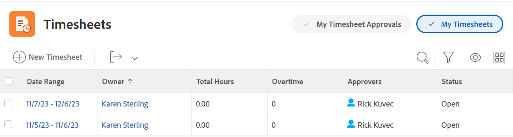

# Översikt över tidrapporter

Du kan använda tidrapporter för att spåra den tid du tillbringar på arbetet, både internt och externt, i Adobe Workfront.

Du kan logga projekttid för arbetsobjekt, t.ex. projekt, uppgifter och ärenden. Den tid som du loggar in på uppgifter, utgåvor och projekt visas automatiskt i tidrapporten.

Du kan även logga icke-projektrelaterad tid för icke-arbetsrelaterade objekt som möten, utbildning eller tid utanför kontoret direkt på din tidrapport under Allmänna timmar.

Mer information om hur du loggar tid i Workfront finns i [Loggtid](../../timesheets/create-and-manage-timesheets/log-time.md).

>[!TIP]
>
>Om du är Workfront- eller gruppadministratör kan du skapa tidrapporter och associera dem med dina användare. Mer information om hur du skapar tidrapporter finns i [Skapa och hantera tidrapporter: artikelindex](../create-and-manage-timesheets/create-and-manage-timesheets.md).

## Förstå projekttid jämfört med icke-projekttid

Tidrapporter gör det enkelt att hålla reda på tiden, både när det gäller projekt och icke-projektarbeten:

* **Projekttid:** Direkt från uppgiften eller projektet där du vill hålla reda på tiden.

  Timmar som registreras för uppgifter, utleveranser och projekt via en tidrapport kopplas till respektive arbetsobjekt för att ge en korrekt bild av den insats som har gjorts för projekt och uppgifter. Utan korrekt tidsangivelse kanske dina data inte är korrekta om de är avsedda för fakturering.

  När en resurs registrerar timmar direkt i uppgifter, visas dessutom automatiskt utleveranser och projekt när användaren öppnar tidrapporten. Detta förutsätter att datumintervallet för tidrapporten sträcker sig över de datum då timmarna registrerades.

* **Ej projekttid:** Direkt på användarens tidrapport. Mer information om hur du spårar tid i Workfront finns i   [Loggtid](../../timesheets/create-and-manage-timesheets/log-time.md).

  På en tidrapport kan du registrera semestertimmar, sjuka timmar, öppethållande, timmar som använts för att reparera eller underhålla utrustningen, eller vilka allmänna intäktstider du vill skapa.

## Få åtkomst till tidrapporter i området Tidrapporter

Tidrapportområdet är som standard tillgängligt för alla användare. Workfront-administratörer kan ändra detta i layoutmallen efter behov. Mer information finns i [Anpassa huvudmenyn med hjälp av en layoutmall](/help/quicksilver/administration-and-setup/customize-workfront/use-layout-templates/customize-main-menu.md).

Så här öppnar du en tidrapport:

{{step1-to-timesheets}}

Alla dina tidrapporter och tidrapporter som du har tillgång till som standard. Mer information om tidrapportslayouten i Adobe Workfront finns i [Översikt över tidrapportslayout](../../timesheets/timesheets/timesheet-layout.md).

1. Klicka på något av följande alternativ i det övre högra hörnet för att visa tidrapporterna:

   * **Mina tidrapporter** för att bara visa dina tidrapporter.

   

   * **Mina tidrapportgodkännanden** om du bara vill visa tidrapporter som du godkänner.

     

1. (Valfritt) Uppdatera vyn, filtret och grupperingen högst upp i listan med tidrapporter. Mer information finns i [Rapportelement: filter, vyer och grupperingar](../../reports-and-dashboards/reports/reporting-elements/reporting-elements-overview.md).

1. Klicka på **Datumintervall** av en tidrapport för att öppna den.

   Varje tidrapport visar alla uppgifter, ärenden och projekt som du har loggat in på. I en tidrapport visas även upp till 45 uppgifter, utgåvor eller projekt som du har tilldelats med datum inom tidrapportens tidsram, men som du kanske inte har loggat tid för ännu.

   Mer information finns i [Konfigurera tidrapport och timinställningar](../../administration-and-setup/set-up-workfront/configure-timesheets-schedules/timesheet-and-hour-preferences.md).
