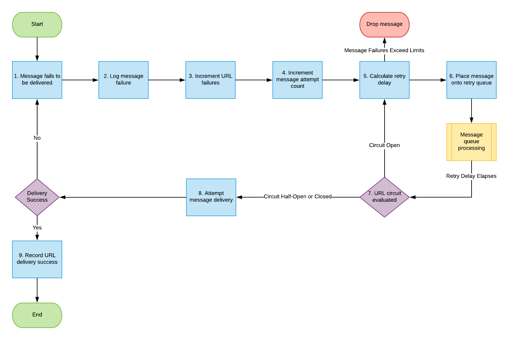

# Återkommande prenumerationer

När du implementerar ett meddelandesystem finns det några kavattningar som måste åtgärdas för att säkerställa stabilitet, konsekvens och en bra användarupplevelse. Ett av bristerna i ett system för meddelandeleverans är att säkerställa att meddelandena når sin destination med framgång och veta vad som ska göras när de inte kommer fram.

Vissa integreringar kan acceptera leveransfel och sedan släppa meddelandet och gå vidare till nästa meddelande.  I andra integreringar kan man inte ignorera om ett meddelande inte levereras. En finansiell integrering kan till exempel försöka leverera ett meddelande, men i stället får en HTTP-statuskod på 404, vilket anger att servern inte kunde hitta slutpunkten som meddelandet skulle levereras till. I sådana fall kan ett saknat meddelande innebära att någon inte får betalt för sin tid eller att en organisation överskridit budgeten för kontraktsanställda resurser.

## Adobe Workfront Strategy for Event Subscription Retries

Eftersom kunderna utnyttjar Workfront-plattformen som en viktig del av sitt dagliga kunskapsarbete, erbjuder Workfront ramverk för händelseteckning en mekanism som säkerställer att man försöker leverera varje budskap i största möjliga utsträckning.

Händelseutlösta utgående meddelanden som inte kan levereras till kundens slutpunkter skickas igen tills leveransen har slutförts i upp till 48 timmar. Under denna tid sker återförsök med en stegvis reducerad frekvens tills leveransen är framgångsrik eller tills 48 timmar har gått.

Kunderna måste se till att alla slutpunkter som förbrukar utgående meddelanden från Workfront Event Subscriptions är inställda på att returnera ett 200-nivåsvarsmeddelande till Workfront när leveransen är klar.

## Hantering av misslyckade händelser utlösta utgående meddelanden

I följande flödesschema visas strategin för att försöka skicka meddelanden igen med Workfront Event Subscription (Händelseprenumerationer):

Följande förklaringar motsvarar stegen i flödesdiagrammet:

1. Meddelandet kan inte levereras.
1. Information om misslyckad meddelandeleverans loggas.

   Alla misslyckade försök att leverera ett meddelande loggas så att felsökning kan utföras för att fastställa grundorsaken till ett visst fel eller en serie fel.

1. URL-fel har ökat.
1. Antalet meddelandeförsök ökar.
1. Beräkna fördröjningen tills meddelandets leverans försöker igen.
1. Meddelandet placeras i kön för nya meddelandeförsök.

   Som framgår av det föregående flödesdiagrammet är den meddelandekö som används för att bearbeta leveransförsök för meddelanden en separat kö än den som bearbetar det ursprungliga leveransförsöket för varje meddelande. Detta gör att det nästan hela realtidsflödet av meddelanden kan fortsätta utan hinder av att delmängder av meddelanden misslyckas.

1. URL-kretsens status utvärderas. Något av följande inträffar:

   * Om kretsen är öppen och inte tillåter leveranser just nu, startar du om processen i steg 5.
   * Om kretsen är halvöppen betyder det att kretsen är öppen, men att det finns tillräckligt med tid för att kunna testa URL:en för att se om problemet med att leverera till den har lösts.
   * Om gränsen för meddelandeleverans har nåtts (48 timmar efter återförsök) tas meddelandet bort

1. Om webbadresskretsen är stängd och leveranserna tillåts, försök leverera meddelandet. Om leveransen misslyckas startas meddelandet om i steg 1

1. Om webbadresskretsen är stängd och leveranserna tillåts, försök leverera meddelandet. Om leveransen misslyckas startas meddelandet om i steg 1.

   <!--
   <li value="10" data-mc-conditions="QuicksilverOrClassic.Draft mode">Workfront disables Event Subscriptions when both of the following criteria are met:
   <ul>
   <!--
   <li data-mc-conditions="QuicksilverOrClassic.Draft mode">The Event Subscription has failed 1000 delivery attempts consecutively</li>
   <li data-mc-conditions="QuicksilverOrClassic.Draft mode">48 hours have passed since the last successful delivery</li>
   </ul></li>
   -->
