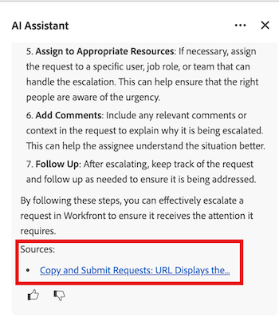

# AI Assistant-frågor och bästa praxis

Workfront AI Assistant är ett kraftfullt verktyg som hjälper dig att uppnå ditt arbete effektivare genom att erbjuda användbar information om dina kontouppgifter och specifika objekttyper.

I den här artikeln får du lära dig mer om de bästa metoderna för AI Assistant, bland annat hur du skriver tydliga uppmaningar, vilka objekttyper du kan be om information om och hur du får tillgång till ytterligare resurser för att verifiera information när det behövs.

Mer information om AI Assistant finns i [Översikt över AI Assistant](/help/quicksilver/workfront-basics/ai-assistant/ai-assistant-overview.md).

>[!NOTE]
>
>Allteftersom AI Assistant utvecklas kommer antalet förfrågningar och frågor att utökas. Vi rekommenderar att du tittar på den här artikeln när nya AI Assistant-funktioner släpps för att lära dig mer om tillgängliga frågor som du kan använda.

## Objekttyper tillgängliga för AI Assistant

AI-assistenten kan tillhandahålla data för följande objekttyper:

* Portföljer
* Program
* Projekt
* Uppgifter
* Problem
* Egna formulär
* Användare
* Workfront Planning - poster

>[!NOTE]
>
>Du måste ha nödvändig behörighet på åtkomstnivån för ett objekt innan du kan begära dess data från AI Assistant.

## Bästa praxis

### Ange tydliga uppmaningar

För att få tillgång till den mest användbara informationen från AI Assistant är det viktigt att du skapar uppmaningar som ger dig det svar du söker. Följande lista innehåller principer som kan hjälpa dig att formulera rätt uppmaningar:

* **Använd klart och specifikt språk**: Genom att undvika vaga och allmänna uppmaningar får du hjälp att vägleda AI-assistenten till de data du försöker ta emot.
* **Inkludera tidsramar**: Om du anger specifika tidsramar för AI Assistant för ett objekt kan du begränsa vilka data som ska bearbetas, vilket resulterar i mer riktad information i objektets svar.
* **Fråga bara om en sak åt gången**: När flera, orelaterade begäranden ingår i en enda prompt kan AI Assistant inte tillhandahålla rätt information.

Mer information om rekommenderade uppmaningar finns i följande avsnitt i den här artikeln: [Uppmaningsexempel](#prompt-examples).

### Verifiera AI Assistant-svar

I det här skedet av AI Assistant rekommenderar vi att du kontrollerar informationen när du frågar efter information om Workfront processer. Du kan göra det genom att klicka på artikellänken i avsnittet Källor i promptsvaret.

Mer information om uppmaningar om Workfront-processer finns i [Uppmaningar att lära sig mer om Workfront-åtgärder](#prompts-to-learn-about-workfront-actions) i den här artikeln.

## Exempel på fråga

Tabellerna nedan innehåller exempel på uppmaningar som du kan använda för att generera information om ditt arbete och lära dig mer om specifika Workfront-processer eller åtgärder som du vill utföra.

### Uppmanar dig att hitta information om ditt arbete

<table>
    <tr>
        <td><b>Objekttyp</b></td>
        <td><b>Fråga</b></td>
    </tr>
        <tr>
        <td>Projekt</td>
        <td><em>Vad är förfallodatumet för [PROJEKTNAMN]?</em>
        </td>
    </tr>
    <tr>
        <td>Projekt</td>
        <td><em>Vad är statusen för [PROJEKTNAMN]?</em>
        </td>
    </tr>
    <tr>
        <td>Projekt </td>
        <td><em>Vem är projektägare för [PROJEKTNAMN]?</em></td>
    </tr>
    <tr>
        <td>Uppgifter</td>
        <td><em>Vilka uppgifter tilldelas mig den här veckan?</em></td>
    </tr>
       <tr>
        <td>Problem </td>
        <td><em>Vilka öppna ärenden tilldelas mitt team?</em></td>
           <tr>
        <td>Användare</td>
        <td><em>Vem ingår i det kreativa teamet för [PROJECT NAME]?</em></td>
    </tr>
           <tr>
        <td>Användare </td>
        <td><em>Hur många uppgifter tilldelas [USER]?</em></td>
    </tr>
   </table>

### Uppmaningar att lära sig mer om Workfront åtgärder

<table>
    <tr>
        <td><b>Objekttyp</b></td>
        <td><b>Fråga</b></td>
    </tr>
    <tr>
        <td>Projekt</td>
        <td><em>Hur skapar jag ett nytt projekt från en mall?</em>
        </td>
    </tr>
    <tr>
        <td>Projekt </td>
        <td><em>Vad är skillnaden mellan ett projekt och ett program?</em></td>
    </tr>
    <tr>
        <td>Uppgifter</td>
        <td><em>Hur tilldelar jag flera användare en uppgift?</em></td>
    </tr>
       <tr>
        <td>Uppgifter</td>
        <td><em>Vad betyder statusen Klar att starta?</em></td>
    </tr>
       <tr>
        <td>Problem </td>
        <td><em>Hur konverterar jag en förfrågan till en uppgift?</em></td>
    </tr>
           <tr>
        <td>Problem </td>
        <td><em>Hur lång är livscykeln för ett problem i Workfront?</em></td>
    </tr>
        </tr>
           <tr>
        <td>Problem </td>
        <td><em>Hur eskalerar jag en förfrågan?</em></td>
    </tr>
           <tr>
        <td>Dokument</td>
        <td><em>Hur överför jag en ny version av ett dokument?</em></td>
    </tr>
           <tr>
        <td>Dokument </td>
        <td><em>Kan jag ange arbetsflöden för dokumentgodkännande?</em></td>
    </tr>
   </table>

## Aktuella begränsningar för AI Assistant

AI Assistant är ett kraftfullt verktyg, men det finns vissa typer av frågor och förfrågningar som det inte kan tillhandahålla data för just nu. Tabellen nedan innehåller exempel på frågor som AI Assistant inte kan visa data för.

<table>
    <tr>
        <td><b>Frågetyp</b></td>
        <td><b>Exempel</b></td>
    </tr>
    <tr>
        <td>Frågor om anpassade konfigurationer</td>
        <td><em>Vilken anpassad integreringslogik körs i vår Workfront-instans?</em>
        </td>
    </tr>
    <tr>
        <td>Frågor om data utanför Workfront </td>
        <td><em>Kan du visa min Outlook-kalender för i dag?</em></td>
    </tr>
             <tr>
        <td>Frågor om icke-integrerade Adobe-produkter </td>
        <td><em>Hur redigerar jag en PDF i Acrobat härifrån?</em></td>
         <tr>
        <td>Frågor som kräver omdöme</td>
        <td><em>Ska projektet spärras?</em></td>
    </tr>
    </tr>
       <tr>
        <td>Begäranden om bulkuppdateringar</td>
        <td><em>Tilldela om alla försenade uppgifter för [USER].</em></td>
    </tr>
       <tr>
        <td>Begäranden om prediktiv analys</td>
        <td><em>Föreslå en ny projektplan baserad på våra historiska data.</em></td>
    </tr>
           <tr>
        <td>Begäranden om information ovanför din åtkomstnivå</td>
        <td><em>Visa alla faktureringstaxor i kontot.</em></td>
    </tr>
           <tr>
        <td>Begäranden som innehåller otydlig information </td>
        <td><em>Fixa mitt projekt.</em></td>
    </tr>
   </table>
