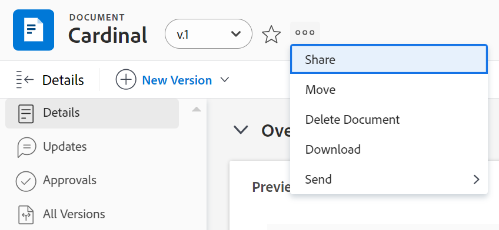

# Dela ett dokument

Workfront-administratören styr vem som kan visa eller redigera dokument i Access Levels-området i Setup. För mer information, se [Bevilja tillgång till dokument](../../administration-and-setup/add-users/configure-and-grant-access/grant-access-documents.md).

Användare kan också dela dokument de har laddat upp eller har tillgång till, vilket ger andra tillåtelse att visa eller hantera dem.

* Behörigheter gäller för enskilda objekt och definierar vilka åtgärder någon kan utföra.
* Personen som laddar upp ett dokument får automatiskt full kontroll (Hantera behörigheter).
* För att dela en hel mapp, se [Dela en dokumentmapp](../../workfront-basics/grant-and-request-access-to-objects/share-a-document-folder.md).

>[!NOTE]
>
>Om din Workfront-instans använder Adobe företagslagring kan du inte dela enskilda dokument. Istället ger du tillgång på projektnivå. Tänk på att delning av projektet kan ge tillgång till känslig projektinformation som finansiella uppgifter beroende på vilken behörighetsnivå som valts.

## Åtkomstkrav

+++ Expandera om du vill visa åtkomstkrav för funktionerna i den här artikeln. 

<table style="table-layout:auto"> 
 <col> 
 <col> 
 <tbody> 
  <tr> 
   <td role="rowheader">Adobe Workfront-paketet</td> 
   <td> 
Vilken som helst 
 </td> 
  </tr> 
  <tr> 
   <td role="rowheader">Adobe Workfront-licens</td> 
   <td> 
Standard
 
   
Arbeta eller högre

   </td> 
  </tr> 
  <tr> 
   <td role="rowheader">Konfigurationer på åtkomstnivå</td> 
   <td> 
Visa åtkomst eller senare till de objekt som du vill dela
 </td> 
  </tr> 
  <tr> 
   <td role="rowheader">Objektbehörigheter</td> 
   <td> 
Visa behörigheter eller högre för de objekt som du vill dela
</td> 
  </tr> 
 </tbody> 
</table>

Mer information om informationen i den här tabellen finns i [Åtkomstkrav i Workfront-dokumentationen](/help/quicksilver/administration-and-setup/add-users/access-levels-and-object-permissions/access-level-requirements-in-documentation.md).

+++

## Dela ett dokument

Användaren som överför ett dokument till Workfront har som standard behörigheten Hantera.

{{step1-to-documents}}

1. På sidan **Dokument** för du muspekaren över dokumentet som du vill dela och klickar på länken **Dokumentinformation** som visas. Sidan **Dokumentinformation** öppnas.

   

1. Klicka på ikonen **Mer**  till höger om dokumentnamnet och klicka sedan på **Dela**. Dialogrutan **Dela [dokumentnamn]** öppnas.

   

1. I fältet **Bevilja dokumentåtkomst till** börjar du skriva namnet på den användare, det team, den roll, den grupp eller det företag som du vill dela dokumentet med och klickar sedan på namnet när det visas i listrutan.

   >[!TIP]
   >
   >Du kan bara dela ett dokument med aktiva användare, team, roller eller företag.

1. (Valfritt) Välj listrutan **Vem har åtkomst** och välj dokumentets åtkomstnivå:

   * **Endast inbjudna personer har åtkomst:** Endast användare som är inbjudna till dokumentet har åtkomst till det (Standard).
   * **Alla i systemet kan visa**: Alla användare i systemet kan visa dokumentet utan en inbjudan.

1. (Valfritt) Om du vill göra dokumentet offentligt klickar du på kugghjulsikonen  och klickar sedan på rutan i linje med **Gör den offentlig för externa användare**. Knappen **Kopiera offentlig länk** visas längst ned i dialogrutan.

1. Klicka på rullgardinsmenyn till höger om användarens namn och välj deras behörighetsnivå för detta dokument:

   * **Visa**: Användaren kan granska och dela dokumentet.
   * **Hantera**: Användaren har fullständig åtkomst till dokumentet utan administratörsbehörighet, som ges på åtkomstnivån (inklusive alla visningsbehörigheter).

1. (Valfritt) Klicka på ikonen för avancerade alternativ bredvid behörighetsnivån som du har tilldelat för att konfigurera specifika behörigheter i dokumentet.

   

1. (Valfritt) Om du vill inaktivera ärvda behörigheter för dokumentets underordnade objekt klickar du på **Inaktivera** inline med **Ärvda behörigheter**.

1. (Villkorligt) Om du vill kopiera den offentliga länken som gör att du kan dela dokumentet med externa användare klickar du på **Kopiera offentlig länk**.

   >[!CAUTION]
   >
   >Vi rekommenderar att du är försiktig när du delar ett dokument som innehåller konfidentiell information med externa användare. Detta gör att de kan se information utan att vara Workfront-användare eller en del av din organisation.

1. Klicka på **Spara**.

## Dela dokument i bulk

{{step1-to-documents}}

1. Under fliken **Alla dokument** på **sidan Dokument,** håll ner **Command** (Mac) eller **Ctrl** (Windows) på tangentbordet och klicka sedan på varje dokument du vill dela.

1. Högst upp på sidan, klicka på dela-ikonen ****. Delningsmodulen öppnas.

   

1. I fältet **Bevilja dokumentåtkomst till** börjar du skriva namnet på den användare, det team, den roll, den grupp eller det företag som du vill dela dokumenten med och klickar sedan på namnet när det visas i listrutan.

   >[!TIP]
   >
   >Du kan bara dela dokument med aktiva användare, team, roller eller företag.

1. (Valfritt) Välj listrutan **Vem har åtkomst** och välj dokumentets åtkomstnivå:

   * **Endast inbjudna personer har åtkomst:** Endast användare som är inbjudna till dokumenten har åtkomst till det (Standard).
   * **Alla i systemet kan visa**: Alla användare i systemet kan visa dokumenten utan en inbjudan.

1. Klicka på listrutan till höger om användarens namn och välj behörighetsnivå för dokumenten:

   * **Visa**: Användaren kan granska och dela dokumenten.
   * **Hantera**: Användaren har fullständig åtkomst till dokumenten utan administratörsbehörighet, som ges på åtkomstnivån (inklusive alla visningsbehörigheter).

1. (Valfritt) Klicka på ikonen för avancerade alternativ bredvid behörighetsnivån som du har tilldelat för att konfigurera specifika behörigheter för dokumenten.

   

1. Klicka på **Spara**.

## Dokumentdelning med Adobe företagslagring

Workfront övergår till Adobes företagslagringslösning för att ge bättre anslutning till Adobe Creative Clouds produkter. Befintliga kunder kommer att flyttas till den nya modellen i etapper. För mer information om fördelarna med Adobe företagslagring, besök [Adobe företagslagringsöversikt](/help/quicksilver/review-and-approve-work/esm-overview.md).

Om din Workfront-instans använder Adobe företagslagring kan du inte dela enskilda dokument direkt. Istället måste du ge tillgång på projektnivå.

>[!IMPORTANT]
>
>Att dela ett projekt kan också ge användare tillgång till känslig projektinformation, såsom ekonomi, beroende på vilken behörighetsnivå du väljer.
>
>Se till att noggrant granska behörighetsinställningarna innan du delar med dig.

## Dokumentbehörigheter

Behörigheter är specifika för ett element i Workfront och definierar vilka åtgärder man kan vidta på det objektet. För information om objektbehörigheter, se [Översikt över delningsbehörigheter på objekt](../../workfront-basics/grant-and-request-access-to-objects/sharing-permissions-on-objects-overview.md).

Följande tabell visar vilka behörigheter du kan ge användare när du tillåter dem att visa eller hantera dokument:

<table border="2" cellspacing="15" cellpadding="1"> 
 <col> 
 <col> 
 <col> 
 <thead> 
  <tr> 
   <th> 
<strong>Åtgärd</strong> 
 </th> 
   <th> 
<strong>Hantera</strong> 
 </th> 
   <th> 
<strong>Vy</strong> 
 </th> 
  </tr> 
 </thead> 
 <tbody> 
  <tr> 
   <td scope="row">Skapa</td> 
   <td>✓</td> 
   <td> </td> 
  </tr> 
  <tr> 
   <td scope="row">Redigera dokumentdetaljer</td> 
   <td>✓</td> 
   <td> </td> 
  </tr> 
  <tr> 
   <td scope="row">Ta bort*</td> 
   <td>✓</td> 
   <td> </td> 
  </tr> 
  <tr> 
   <td scope="row">Ladda ned</td> 
   <td>✓</td> 
   <td>✓</td> 
  </tr> 
  <tr> 
   <td scope="row">Utcheckning</td> 
   <td>✓</td> 
   <td> </td> 
  </tr> 
  <tr> 
   <td scope="row">Lägg till godkännare</td> 
   <td>✓</td> 
   <td> </td> 
  </tr> 
  <tr> 
   <td scope="row">Godkänn dokument</td> 
   <td>✓</td> 
   <td>✓</td> 
  </tr> 
  <tr> 
   <td scope="row">Bifoga eget formulär</td> 
   <td>✓</td> 
   <td> </td> 
  </tr> 
  <tr> 
   <td scope="row">Redigera anpassade fält</td> 
   <td>✓</td> 
   <td> </td> 
  </tr> 
  <tr> 
   <td scope="row">Flytta till (objekt)</td> 
   <td>✓</td> 
   <td> </td> 
  </tr> 
  <tr> 
   <td scope="row">Skicka till (integration)</td> 
   <td>✓</td> 
   <td> </td> 
  </tr> 
  <tr> 
   <td scope="row">Uppdateringar/kommentarer</td> 
   <td>✓</td> 
   <td>✓</td> 
  </tr> 
  <tr> 
   <td scope="row">Ladda upp ny version</td> 
   <td>✓</td> 
   <td> </td> 
  </tr> 
  <tr> 
   <td scope="row">Ta bort version</td> 
   <td>✓</td> 
   <td> </td> 
  </tr> 
  <tr> 
   <td scope="row">Visa dokument</td> 
   <td>✓</td> 
   <td>✓</td> 
  </tr> 
  <tr> 
   <td scope="row">Förhandsgranska</td> 
   <td>✓</td> 
   <td>✓</td> 
  </tr> 
  <tr> 
   <td scope="row">Korrektur**</td> 
   <td>✓</td> 
   <td>✓</td> 
  </tr> 
  <tr> 
   <td scope="row">Generera bevis**</td> 
   <td>✓</td> 
   <td> </td> 
  </tr> 
  <tr> 
   <td scope="row">Ta bort korrektur**</td> 
   <td>✓</td> 
   <td> </td> 
  </tr> 
  <tr> 
   <td scope="row">Dela*</td> 
   <td>✓</td> 
   <td>✓</td> 
  </tr> 
  <tr> 
   <td scope="row">Dela systemomfattande*</td> 
   <td>✓</td> 
   <td> </td> 
  </tr> 
  <tr> 
   <td scope="row">Dela dokument offentligt*</td> 
   <td>✓</td> 
   <td> </td> 
  </tr> 
  <tr> 
   <td scope="row">Dela med en extern e-postadress</td> 
   <td> </td> 
   <td>✓</td> 
  </tr> 
  <tr> 
   <td scope="row">Lägg till/ta bort</td> 
   <td>✓</td> 
   <td>✓</td> 
  </tr> 
  <tr> 
   <td scope="row">Byt namn</td> 
   <td>✓</td> 
   <td> </td> 
  </tr> 
  <tr> 
   <td scope="row">Länk (med integration)</td> 
   <td>✓</td> 
   <td>✓</td> 
  </tr> 
  <tr> 
   <td scope="row">Avlänka (med integration)</td> 
   <td>✓</td> 
   <td> </td> 
  </tr> 
 </tbody> 
</table>

&#42; Handling delas av både Dokument- och Dokumentmappar.

&#42;&#42; Du måste ha en separat korrekturlicens kopplad till ditt Workfront-konto för att kunna bevisa dokument. Kontakta din kontoansvarige om du vill skaffa en korrekturlicens. Mer information om korrektur i Workfront finns i [Korrektur](../../review-and-approve-work/proofing/proofing.md).

## Att tänka på vid dokumentdelning

Förutom övervägandena nedan, se även [Översikt över delningsbehörigheter för objekt](../../workfront-basics/grant-and-request-access-to-objects/sharing-permissions-on-objects-overview.md).

>[!NOTE]
>
>En Workfront-administratör kan lägga till eller ta bort behörigheter för alla objekt i systemet, för alla användare, utan att vara ägare av dessa objekt.

* Att dela ett dokument påminner om att dela andra objekt i Workfront. Mer information om hur du delar dokument i Workfront finns i [Dela ett objekt](../../workfront-basics/grant-and-request-access-to-objects/share-an-object.md).
* Du kan ge följande behörigheter till dokument:

   * Visa
   * Hantera

* Du kan också dela ett dokument offentligt eller i hela systemet.

  >[!CAUTION]
  >
  >Vi rekommenderar att du använder försiktighet när du delar objekt som innehåller konfidentiell information med externa användare. Detta gör att de kan se information utan att vara Workfront-användare eller en del av din organisation.

* Du kan dela ett dokument med någon som inte har ett Workfront-konto genom att lägga till deras e-postadress i fältet Ge dokumentåtkomst.
* När du delar ett dokument har användarna samma åtkomst till alla dokumentversioner och alla dokumentbevis.\
  För mer information om korrekturläsning i Workfront, se [avsnittet Korrekturläsning](../../review-and-approve-work/proofing/proofing.md) .

* Du kan ärva behörigheter till dokument från de objekt de är kopplade till. Din Workfront-administratör kan begränsa ärvningen av behörigheter för dokument på din åtkomstnivå.

  Mer information om att begränsa ärvda behörigheter i dokument finns i [Skapa eller ändra anpassade åtkomstnivåer](../../administration-and-setup/add-users/configure-and-grant-access/create-modify-access-levels.md).

  Du kan ta bort ärvda behörigheter i dokument manuellt. Mer information finns i [Ta bort behörigheter från objekt](../../workfront-basics/grant-and-request-access-to-objects/remove-permissions-from-objects.md)

* Ett bifogat dokument ärver endast behörigheter från det objekt som det bifogades till. Om du skapar en mapp på objektet och flyttar dokumentet till mappen, ärver den mappens behörigheter. Men om du skapar en mapp i ett överordnat eller indirekt överordnat objekt och flyttar dokumentet till den mappen, ärver den inte mappens behörigheter.