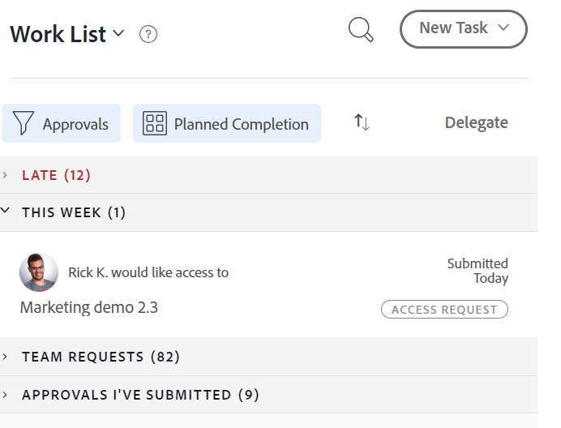

# Bevilja åtkomst till objekt i Hem-området

Användare kan begära åtkomst till objekt i Adobe Workfront. Mer information om hur du begär åtkomst finns i  [Begär åtkomst till objekt](../../workfront-basics/grant-and-request-access-to-objects/request-access.md).

Om du är ägare till ett objekt kan du bevilja eller neka åtkomst till objekt från Hem-området.

## Åtkomstkrav

<!--drafted for P&P:

<table style="table-layout:auto"> 
 <col> 
 <col> 
 <tbody> 
  <tr> 
   <td role="rowheader">Adobe Workfront plan*</td> 
   <td> 
Any
 </td> 
  </tr> 
  <tr> 
   <td role="rowheader">Adobe Workfront license*</td> 
   <td> 
Current license: Standard
 
   Or
   
Legacy license: Work or higher

   </td> 
  </tr> 
  <tr> 
   <td role="rowheader">Access level configurations*</td> 
   <td> 
View access or higher to projects, tasks, issues, or documents
 
<b>NOTE</b>
   
   If you still don't have access, ask your Workfront administrator if they set additional restrictions in your access level. For information on how a Workfront administrator can modify your access level, see <a href="../../administration-and-setup/add-users/configure-and-grant-access/create-modify-access-levels.md" class="MCXref xref">Create or modify custom access levels</a>.
 </td> 
  </tr> 
  <tr> 
   <td role="rowheader">Object permissions</td> 
   <td> 
View permissions or higher to projects, tasks, issues, or documents
 
For information on requesting additional access, see <a href="../../workfront-basics/grant-and-request-access-to-objects/request-access.md" class="MCXref xref">Request access to objects </a>.
 </td> 
  </tr> 
 </tbody> 
</table>

-->

Du måste ha följande åtkomst för att kunna utföra stegen i den här artikeln:

<table style="table-layout:auto"> 
 <col> 
 <col> 
 <tbody> 
  <tr> 
   <td role="rowheader">Adobe Workfront-plan*</td> 
   <td> 
Alla
 </td> 
  </tr> 
  <tr> 
   <td role="rowheader">Adobe Workfront-licens*</td> 
   <td> 
Arbeta eller högre
 </td> 
  </tr> 
  <tr> 
   <td role="rowheader">Konfigurationer på åtkomstnivå*</td> 
   <td> 
Visa åtkomst eller högre till projekt, uppgifter, utgåvor eller dokument
 
<b>ANMÄRKNING</b>

Om du fortfarande inte har åtkomst frågar du Workfront-administratören om de anger ytterligare begränsningar för din åtkomstnivå. Information om hur en Workfront-administratör kan ändra åtkomstnivån finns i <a href="../../administration-and-setup/add-users/configure-and-grant-access/create-modify-access-levels.md" class="MCXref xref">Skapa eller ändra anpassade åtkomstnivåer</a>.
 </td>
</tr> 
  <tr> 
   <td role="rowheader">Objektbehörigheter</td> 
   <td> 
Visa behörigheter eller högre för projekt, uppgifter, utgåvor eller dokument
 
Mer information om hur du begär ytterligare åtkomst finns i <a href="../../workfront-basics/grant-and-request-access-to-objects/request-access.md" class="MCXref xref">Begär åtkomst till objekt </a>.
 </td> 
  </tr> 
 </tbody> 
</table>

&#42;Kontakta Workfront-administratören om du vill veta vilken plan, licenstyp eller åtkomst du har.

## Bevilja åtkomst till objekt i Hem-området

1. Klicka på **Startsida** icon  i det övre vänstra hörnet av Adobe Workfront.

   >[!NOTE]
   >
   >Workfront-administratören kan göra följande ändringar av hemikonen i din miljö:
   >
   >* Ersätt den med en bild som är anpassad för att illustrera organisationen. I det här fallet ser ikonen annorlunda ut än i den här artikeln.
   >* Ersätt den länkade sidan med en annan sida. I det här fallet klickar du på **Huvudmeny**  i sidans övre högra hörn och klicka sedan på **Startsida**.

1. I **Arbetslista** markerar du den åtkomstbegäran som du vill hantera.\
   

1. Klicka på knappen Ge åtkomst i det övre högra hörnet.\
   Beroende på vilken typ av åtkomst som begärts ändras knappens namn. Om den som gjorde begäran till exempel frågar efter åtkomst till vyn, visas det på knappen **Bevilja åtkomst till vy**.\
   

1. (Valfritt) Om du vill ge en annan åtkomstnivå än den som begärts klickar du på pilen bredvid knappen Ge åtkomst och väljer den nya åtkomsten.\
   Ett meddelande visas som bekräftar att åtkomst har beviljats.\
   ELLER\
   Klicka **Ignorera** för att neka åtkomst.\
   Ett meddelande visas som bekräftar att åtkomst ignorerades.

## Konfigurera e-postmeddelanden för begäranden

Du kan konfigurera om du ska få e-postmeddelanden för åtkomstbegäranden. Din Workfront-administratör kan inaktivera den här funktionen (enligt beskrivningen i [Konfigurera händelsemeddelanden för alla i systemet](../../administration-and-setup/manage-workfront/emails/configure-event-notifications-for-everyone-in-the-system.md)).

1. Klicka på **Huvudmeny** icon  i det övre högra hörnet av Adobe Workfront och klicka sedan på **Inställningar** .

1. Klicka **Inställningar** eller bläddra till avsnittet Inställningar.
1. I **Skicka e-post när** nedrullningsbar lista, markera eller avmarkera **Någon begär åtkomst från mig**, beroende på om du vill få e-postmeddelanden när en annan användare begär åtkomst från dig eller inte.

1. Klicka **Spara ändringar**.
