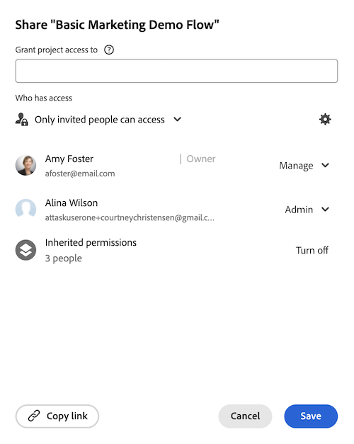

# Ta bort behörigheter från objekt

<!--Audited: 01/2024-->

Du kan ta bort andra användares behörigheter för objekt som du har åtkomst till Dela. Att ta bort behörigheter från objekt är identiskt för alla objekt som kan delas.

Liknande överväganden som för att dela objekt gäller för borttagning av behörigheter från objekt. Mer information finns i avsnittet [Att tänka på när du delar objekt](../../workfront-basics/grant-and-request-access-to-objects/sharing-permissions-on-objects-overview.md#consider) i artikeln [Översikt över delningsbehörigheter för objekt](../../workfront-basics/grant-and-request-access-to-objects/sharing-permissions-on-objects-overview.md)

## Åtkomstkrav

Du måste ha följande för att kunna dela objekt:

<table style="table-layout:auto"> 
 <col> 
 <col> 
 <tbody> 
  <tr> 
   <td role="rowheader">Adobe Workfront</td> 
   <td> 
Alla 
 </td> 
  </tr> 
  <tr> 
   <td role="rowheader">Workfront-licens*</td> 
   <td> 
Ny licens: Medarbetare eller högre

   eller  
   
Aktuell licens: Begär eller högre

   
<b>ANMÄRKNING</b>

Vissa objekt kräver högre åtkomst än Request. 

För den nya licensen kan till exempel en medarbetare dela problem, men bara standardlicensanvändare kan dela ett projekt.

För den aktuella licensen kan en begärande dela utgåvor, men bara arbetare eller planerare kan dela ett projekt.
 
   </td> 
  </tr> 
  <tr> 
   <td role="rowheader">Konfigurationer på åtkomstnivå</td> 
   <td> 
Visa åtkomst eller senare till de objekt som du vill dela
 </td> 
  </tr> 
  <tr> 
   <td role="rowheader">Objektbehörigheter</td> 
   <td> 
Visa behörigheter eller högre för de objekt som du vill dela
 
Hantera behörigheter för att ta bort ärvda behörigheter för objekt
  </td> 
  </tr> 
 </tbody> 
</table>

*Kontakta Workfront-administratören om du vill veta vilken plan, licenstyp eller åtkomst du har. Mer information finns i [Åtkomstkrav för Workfront-dokumentation](/help/quicksilver/administration-and-setup/add-users/access-levels-and-object-permissions/access-level-requirements-in-documentation.md).

## Ta bort enheter från delningslistan för ett objekt {#remove-entities-from-the-sharing-list-of-an-object}

Du kan ta bort enheter (användare, jobbroller, team, grupper, företag) från delningslistan för ett objekt. Detta tar bort deras behörigheter till objektet.

1. Gå till objektet som du vill ta bort behörigheter från.

   Mer information om vilka objekt som kan delas finns i [Översikt över delningsbehörigheter för objekt](../../workfront-basics/grant-and-request-access-to-objects/sharing-permissions-on-objects-overview.md).

1. (Villkorligt) Gör följande för program, portföljer och dokument:

   1. Klicka på ikonen **Mer** bredvid objektnamnet och klicka sedan på **Dela** eller **Dela**.

      

   1. Klicka på **x** bredvid namnet på en användare, ett team, en grupp, ett företag eller en jobbroll för att ta bort dem i rutan för objektåtkomst.

      

   1. I listrutan **&lt; Användarnamn > tas Workfront-åtkomst bort från den här**-menyn väljer du om du vill att deras åtkomst ska tas bort från det markerade objektet eller från alla underordnade objekt som är kopplade till det.

1. (Villkorligt) Gör följande för projekt, uppgifter och ärenden:

   1. Klicka på **Dela** till höger om objektets namn.

      
   1. Hitta den användare, roll, det team, den grupp eller det företag som du vill ta bort från objektet.
   1. Klicka på **Ta bort**.
I listrutan **Ta bort &lt; användarnamn > från** väljer du om du vill att deras åtkomst ska tas bort från det markerade objektet eller från alla underordnade objekt som är kopplade till det.

      

   Följande scenarier finns:

   * Om du bara tar bort entiteten från objektet förlorar entiteten sina behörigheter för objektet och deras ärvda behörigheter till de underordnade objekten. Om de tidigare beviljats behörigheter till de underordnade objekten individuellt behåller de samma behörigheter för alla underordnade objekt som är kopplade till dem när du väljer det här alternativet.
   * Om du tar bort entiteten från objektet och alla underordnade objekt förlorar entiteten sina behörigheter till objektet och alla underordnade objekt, även när de tidigare fått individuell behörighet för varje underordnat objekt.

1. Klicka på **Spara**.

## Ta bort behörigheter från flera objekt samtidigt

Du kan ta bort enheter (användare, jobbroller, team, grupper, företag) från flera objekt samtidigt när du markerar dem i en lista.

>[!NOTE]
>
>Du kan inte visa vilka åtkomstentiteter som har för alla markerade objekt när du markerar dem gruppvis. Du måste veta vilken enhet du vill ta bort från delningen av de markerade objekten innan du tar bort deras behörigheter.

1. Gå till listan med objekt som du vill dela.

   Mer information om vilka objekt som kan delas finns i [Översikt över delningsbehörigheter för objekt](../../workfront-basics/grant-and-request-access-to-objects/sharing-permissions-on-objects-overview.md).

1. Markera flera objekt i listan och klicka sedan på ikonen **Dela**  längst upp i listan.
1. Skriv namnet på användaren, rollen, teamet, gruppen eller företaget som du vill ta bort åtkomsten för i fältet **Redigera `<Object Name>` åtkomst till**.
1. Välj **Ingen åtkomst** på den nedrullningsbara menyn.

   

1. I den här listrutan för `<User Name>` tas åtkomsten till Workfront bort. Välj om du vill att åtkomsten ska tas bort från de objekt som du har markerat eller från alla andra underordnade objekt som är kopplade till den.\
   Följande scenarier finns:

   * Om du bara tar bort entiteten från objektet förlorar entiteten sina behörigheter för objektet och deras ärvda behörigheter till de underordnade objekten. Om de tidigare beviljats behörigheter till de underordnade objekten individuellt behåller de samma behörigheter för alla underordnade objekt som är kopplade till dem när du väljer det här alternativet. 
   * Om du tar bort entiteten från objektet och alla underordnade objekt förlorar entiteten sina behörigheter till objektet och alla underordnade objekt, även när de tidigare fått individuell behörighet för varje underordnat objekt.

   **Exempel:** Välj om du vill ta bort behörigheter till enbart de uppgifter du har markerat i en lista eller till de utgåvor och dokument som är kopplade till aktiviteterna.

   

1. (Valfritt) Om du vill ändra flera behörigheter gruppvis för flera objekt väljer du en annan nivå för delning för den valda entiteten.

   Om de till exempel har behörigheten Hantera väljer du Contribute eller Visa i stället.

1. Klicka på **Spara**.

## Ta bort ärvda behörigheter

Ärvda behörigheter kan tas bort från objekt, vilket gör det möjligt för ägare att specifikt identifiera vem som får åtkomst till underordnade objekt oavsett om en användare har åtkomst till ett överordnat objekt.

>[!IMPORTANT]
>
>Endast användare med behörigheten Hantera kan ta bort ärvda behörigheter.

Så här tar du bort ärvda behörigheter:

1. Gå till ett objekt som du har behörigheten Hantera för. Gå till exempel till en uppgift.
1. Gå till åtkomstrutan för objekt enligt beskrivningen i avsnittet [Ta bort entiteter från delningslistan för ett objekt](#remove-entities-from-the-sharing-list-of-an-object) i den här artikeln.
1. Markera **x** bredvid **Ärvd behörighet** i delningsrutan om du vill ta bort alla som finns där.

   

   Detta garanterar att ingen som har behörighet till det överordnade objektet (till exempel projektet) har behörighet till den här uppgiften som standard. Du måste lista  enskilda enheter i delningslistan för uppgiften att bevilja behörigheter för uppgiften.

   >[!TIP]
   >
   >Du kan inte ta bort enskilda enheter från listan Ärvda behörigheter. Du kan bara inaktivera ärvda behörigheter för alla enheter i listan.

1. Klicka på **Spara**. 

## Gör ett objekt privat

Om du har delat ett objekt i hela systemet, eller om du har delat det med externa användare genom att göra det offentligt, kan du göra det privat igen genom att ta bort behörigheten för hela systemet eller för offentliga användare. 

Mer information om hur du gör ett objekt tillgängligt för hela systemet, eller för allmänheten, finns i [Dela ett objekt](../../workfront-basics/grant-and-request-access-to-objects/share-an-object.md).

Så här gör du ett objekt privat:

1. Gå till det objekt som du vill göra privat.\
   Navigera till exempel till en rapport.
1. Klicka på **Rapportera åtgärder** och sedan på **Dela**.

   

1. Klicka på **Ta bort offentlig åtkomst** för att ta bort externa användares åtkomst till rapporten.
1. Klicka på **Ta bort systemomfattande åtkomst** om du vill sluta dela den med alla Workfront-användare. 
1. Klicka på **Spara**.
