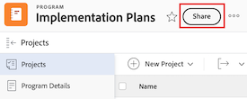
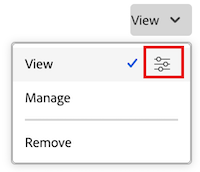
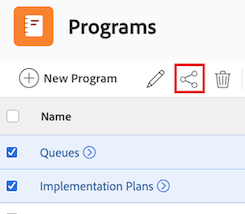

# Dela ett program

Din Adobe Workfront-administratör kan ge dig åtkomst till att visa eller redigera program när du tilldelar din åtkomstnivå. Du måste ha en planlicens för att kunna redigera ett program. Mer information finns i [Bevilja åtkomst till program](../../administration-and-setup/add-users/configure-and-grant-access/grant-access-programs.md).

Förutom den åtkomstnivå du har beviljats kan du även få behörighet att visa eller hantera specifika program från användare som kan dela dem med dig. Mer information om åtkomstnivåer och behörigheter finns i [Hur åtkomstnivåer och behörigheter fungerar tillsammans](../../administration-and-setup/add-users/access-levels-and-object-permissions/how-access-levels-permissions-work-together.md).

Behörigheterna är specifika för varje objekt i Workfront och definierar vilka åtgärder som användare kan vidta för det objektet.

## Åtkomstkrav

+++ Expandera om du vill visa åtkomstkrav för funktionerna i den här artikeln. 

<table style="table-layout:auto"> 
 <col> 
 <col> 
 <tbody> 
  <tr> 
   <td role="rowheader">Adobe Workfront package</td> 
   <td> 
Alla
 </td> 
  </tr> 
  <tr> 
   <td role="rowheader">Adobe Workfront-licens</td> 
   <td> 
Standard
 
   
Arbeta eller högre
 
   </td> 
  </tr> 
  <tr> 
   <td role="rowheader">Konfigurationer på åtkomstnivå</td> 
   <td> 
Visa åtkomst eller senare till de objekt som du vill dela
 </td> 
  </tr> 
  <tr> 
   <td role="rowheader">Objektbehörigheter</td> 
   <td> 
Visa behörigheter eller högre för de objekt som du vill dela
</td> 
  </tr> 
 </tbody> 
</table>

Mer information om informationen i den här tabellen finns i [Åtkomstkrav i Workfront-dokumentationen](/help/quicksilver/administration-and-setup/add-users/access-levels-and-object-permissions/access-level-requirements-in-documentation.md).

+++

## Att tänka på när du delar ett program

Förutom övervägandena nedan, se även [Översikt över delningsbehörigheter för objekt](../../workfront-basics/grant-and-request-access-to-objects/sharing-permissions-on-objects-overview.md).

>[!NOTE]
>
>En Workfront-administratör kan lägga till eller ta bort behörigheter för alla objekt i systemet, för alla användare, utan att vara ägare av dessa objekt.

* Skaparen av ett program har som standard behörigheten Hantera.

* Du kan dela program individuellt eller dela flera program samtidigt.

  Mer information om objektdelning i Workfront finns i [Dela ett objekt](../../workfront-basics/grant-and-request-access-to-objects/share-an-object.md).

* Du kan bara ge behörigheterna Visa eller Hantera för program:

* När du delar ett program ärver användarna som standard samma behörigheter till alla underordnade objekt som är associerade med programmet.

  Mer information om objekthierarkin i Workfront finns i [Förstå objekt i Adobe Workfront](../../workfront-basics/navigate-workfront/workfront-navigation/understand-objects.md).

* Du kan ta bort ärvda behörigheter från programmet. Mer information om hur du tar bort behörigheter från objekt finns i   [Ta bort behörigheter från objekt](../../workfront-basics/grant-and-request-access-to-objects/remove-permissions-from-objects.md).

## Dela ett program

{{step1-to-programs}}

1. På sidan **Program** väljer du det program du vill dela. Programsidan öppnas.

1. Klicka på **Dela** till höger om programnamnet. Dialogrutan **Dela [programnamn]** öppnas.

   

1. I fältet **Bevilja programåtkomst till** börjar du skriva namnet på den användare, det team, den roll, den grupp, det företag eller den affärsprofil som du vill dela programmet med och klickar sedan på namnet när det visas i listrutan.

   >[!TIP]
   >
   >Du kan bara dela ett program med aktiva användare, team, roller eller företag.

1. (Valfritt) Välj listrutan **Vem har åtkomst** och välj programmets åtkomstnivå:

   * **Endast inbjudna personer har åtkomst:** Endast användare som är inbjudna till programmet har åtkomst till det (Standard).
   * **Alla i systemet kan visa**: Alla användare i systemet kan visa programmet utan en inbjudan.

1. Klicka på listrutan till höger om användarens namn och välj behörighetsnivå för det här programmet:

   * **Visa**: Användaren kan granska och dela programmet.
   * **Hantera**: Användaren har fullständig åtkomst till programmet utan administratörsbehörighet, som ges på åtkomstnivån (inklusive alla visningsbehörigheter).

1. (Valfritt) Klicka på ikonen för avancerade alternativ bredvid behörighetsnivån som du har tilldelat för att konfigurera specifika behörigheter för programmet.

   

1. (Valfritt) Om du vill inaktivera ärvda behörigheter för programmets underordnade objekt klickar du på **Inaktivera** inline med **Ärvda behörigheter**.

1. (Valfritt) Om du snabbt vill dela programmet via en länk klickar du på **Kopiera länk** och vidarebefordrar den till mottagaren.

1. Klicka på **Spara**.

## Dela program i grupp

{{step1-to-programs}}

1. På sidan **Program** markerar du rutan till vänster om varje program som du vill dela och klickar sedan på ikonen **Dela**  längst upp på sidan. Delningen modal öppnas.

   

1. I fältet **Bevilja programåtkomst till** börjar du skriva namnet på den användare, det team, den roll, den grupp, det företag eller den affärsprofil som du vill dela programmen med och klickar sedan på namnet när det visas i listrutan.

   >[!TIP]
   >
   >Du kan bara dela program med aktiva användare, team, roller eller företag.

1. (Valfritt) Välj listrutan **Vem har åtkomst** och välj åtkomstnivå för programmen:

   * **Endast inbjudna personer har åtkomst:** Endast användare som är inbjudna till programmen har åtkomst till dem (Standard).
   * **Alla i systemet kan visa**: Alla användare i systemet kan visa programmen utan en inbjudan.

1. Klicka på listrutan till höger om användarens namn och välj behörighetsnivå för programmen:

   * **Visa**: Användaren kan granska och dela programmen.
   * **Hantera**: Användaren har fullständig åtkomst till programmen utan administratörsbehörighet, som ges på åtkomstnivån (inklusive alla visningsbehörigheter).

1. (Valfritt) Klicka på ikonen för avancerade alternativ bredvid behörighetsnivån som du har tilldelat för att konfigurera specifika behörigheter för programmen.

   

1. Klicka på **Spara**.

## Programbehörigheter

I följande tabell visas vilka behörigheter du kan ge användarna när de får visa eller hantera ett program:

| **Åtgärder** | **Hantera** **Visa** |
| --- | --- |--- |
| Redigera programinformation | ✓ |   |
| Visa ett program | ✓ | ✓ |
| Ta bort ett program | ✓ |   |
| Bifoga ett eget formulär | ✓ |   |
| Redigera ett anpassat fält | ✓ |   |
| Lägg till eller ta bort ett projekt&#42; | ✓ |   |
| Godkänn ett projekt | ✓ |   |
| Lägg till en dokumentmapp &#42; | ✓ | ✓ |
| Lägga till ett dokument | ✓ | ✓ |
| Lägg till uppdateringar/kommentarer | ✓ | ✓ |
| Dela | ✓ | ✓ |
| Dela hela systemet |   | ✓ |
| Redigera faktureringstariffer &#42; | ✓ |   |
| Redigera kostnadstariffer&#42; | ✓ |   |
| Redigera allmän ekonomi &#42; | ✓ |   |
| Visa faktureringstariffer &#42; | ✓ | ✓ |
| Visa kostnadstariffer&#42; | ✓ | ✓ |
| Visa allmän ekonomi &#42; | ✓ | ✓ |

*Dessa behörigheter styrs av åtkomstnivån och behörigheterna för andra objekt, som projekt.

