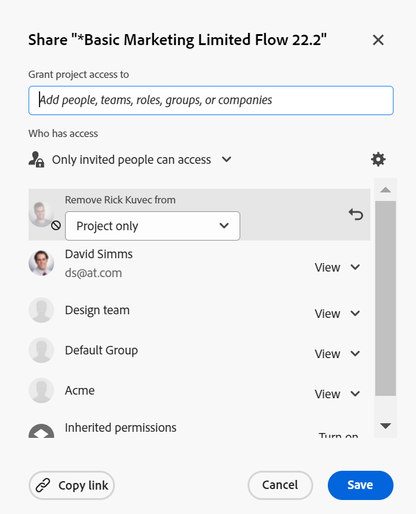

# Dela ett objekt

<!--Audited: 01/2024-->

Din Adobe Workfront-administratör ger användarna åtkomst till att visa eller redigera objekt när de tilldelar åtkomstnivåer. Mer information om hur du beviljar åtkomst till objekt finns i [Skapa eller ändra anpassade åtkomstnivåer](../../administration-and-setup/add-users/configure-and-grant-access/create-modify-access-levels.md).

Förutom den åtkomstnivå som användare har beviljats kan du även ge dem behörighet att visa eller redigera specifika objekt som du har skapat eller har åtkomst till att dela. Mer information om åtkomstnivåer och behörigheter finns i [Hur åtkomstnivåer och behörigheter fungerar tillsammans](../../administration-and-setup/add-users/access-levels-and-object-permissions/how-access-levels-permissions-work-together.md).

Behörigheterna är specifika för ett objekt i Workfront och definierar vilka åtgärder man kan vidta för det objektet.

Mer information om att dela behörigheter för objekt finns i [Översikt över delningsbehörigheter för objekt](../../workfront-basics/grant-and-request-access-to-objects/sharing-permissions-on-objects-overview.md).

>[!NOTE]
>
>En Workfront-administratör kan lägga till eller ta bort behörigheter för alla objekt i systemet, för alla användare, utan att vara ägare av dessa objekt.

I den här artikeln beskrivs hur du delar följande objekt:

* Projekt, uppgifter, problem
* Portfolio, program
* Dokument

Mer information om hur du delar alla andra objekt i Workfront finns i följande artiklar:

* Mer information om mallar finns i [Dela projektmallar](../../manage-work/projects/create-and-manage-templates/share-project-template.md).
* Korrektur finns på [Dela ett korrektur i Workfront Proof](../../workfront-proof/wp-work-proofsfiles/share-proofs-and-files/share-proof.md).
* Rapporter, kontrollpaneler och kalendrar finns i följande artiklar:

   * [Dela en rapport i Adobe Workfront](../../reports-and-dashboards/reports/creating-and-managing-reports/share-report.md)
   * [Dela en kontrollpanel](../../reports-and-dashboards/dashboards/creating-and-managing-dashboards/share-dashboard.md)
   * [Dela en kalenderrapport](../../reports-and-dashboards/reports/calendars/share-a-calendar-report.md)

  Mer information finns i [Dela rapporter, kontrollpaneler och kalendrar](../../workfront-basics/grant-and-request-access-to-objects/permissions-reports-dashboards-calendars.md) för allmän information om att dela rapporter, kontrollpaneler och kalendrar.

* Information om filter, vyer och grupperingar finns i [Dela ett filter, en vy eller en grupp](../../reports-and-dashboards/reports/reporting-elements/share-filter-view-grouping.md).
* Information om dokumentmappar finns i [Dela en dokumentmapp](../../workfront-basics/grant-and-request-access-to-objects/share-a-document-folder.md).
* Information om planer finns i [Dela en plan i scenarioplanen](../../scenario-planner/share-a-plan.md).

  Detta kräver ytterligare en licens.

* För mål, se [Dela ett mål i Workfront-mål](../../workfront-goals/workfront-goals-settings/share-a-goal.md). Detta kräver ytterligare en licens.

## Åtkomstkrav

Du måste ha följande för att kunna dela objekt:

<table style="table-layout:auto"> 
 <col> 
 <col> 
 <tbody> 
  <tr> 
   <td role="rowheader">Adobe Workfront</td> 
   <td> 
Alla 
 </td> 
  </tr> 
  <tr> 
   <td role="rowheader">Adobe Workfront-licens*</td> 
   <td> 
Ny licens: Standard
 
   eller
   
Aktuell licens: Arbeta eller högre

   </td> 
  </tr> 
  <tr> 
   <td role="rowheader">Konfigurationer på åtkomstnivå</td> 
   <td> 
Visa åtkomst eller senare till de objekt som du vill dela
 </td> 
  </tr> 
  <tr> 
   <td role="rowheader">Objektbehörigheter</td> 
   <td> 
Visa behörigheter eller högre för de objekt som du vill dela
</td> 
  </tr> 
 </tbody> 
</table>

*Kontakta Workfront-administratören om du vill veta vilken plan, licenstyp eller åtkomst du har. Mer information finns i [Åtkomstkrav i Workfront-dokumentation](/help/quicksilver/administration-and-setup/add-users/access-levels-and-object-permissions/access-level-requirements-in-documentation.md).

## Dela ett objekt {#share-a-single-object}

1. Gå till objektet som du vill dela.

   Mer information om vilka objekt som kan delas finns i [Översikt över delningsbehörigheter för objekt](../../workfront-basics/grant-and-request-access-to-objects/sharing-permissions-on-objects-overview.md).
1. För projekt, uppgifter och ärenden:

   Klicka på **Dela** intill objektnamnet.

   

   eller

   För dokument, portfolior och program:

   Klicka på **Mer** icon bredvid objektnamnet och klicka sedan på **Delning** eller **Dela.**

   

1. I **Ge &lt; Objektnamn > åtkomst till** (för dokument, portfolior och program), eller **Bevilja &lt; Objektnamn > åtkomst till** (för projekt, uppgifter och ärenden) börja skriva namnet på den användare, det team, den roll, den grupp eller det företag som du vill dela objektet med och klicka sedan på namnet när det visas i listrutan.

   Om du till exempel delar ett projekt använder du **Bevilja projektåtkomst till** fält.

   >[!TIP]
   >
   >Du kan bara dela ett objekt med aktiva användare, team, roller eller företag.

   

   >[!TIP]
   >
   >Om du har flera entiteter med liknande namn visas alla under deras typ. Namnen på enheterna visas i alfabetisk ordning. Den ordning i vilken enhetstyperna visas är dock slumpmässig.
   >
   >
   >   >
   >

1. (Valfritt) Upprepa steg 3 för varje användare, team, roll eller grupp som du vill ge åtkomst till objektet.

   <!--
   <MadCap:conditionalText data-mc-conditions="QuicksilverOrClassic.Draft mode">
   (NOTE: esnure this stays accurate; in the editor it looks like step 4 but one step is conditioned entirely for one version or another)
   </MadCap:conditionalText>
   -->

1. Ange behörigheter för varje användare, team, roll, grupp eller företag som du har lagt till i steg 3 genom att klicka på listrutan och sedan välja den behörighetsnivå som du vill bevilja.

   Information om hur du tar bort behörigheter från ett objekt finns i [Ta bort behörigheter från objekt](/help/quicksilver/workfront-basics/grant-and-request-access-to-objects/remove-permissions-from-objects.md).

   Följande alternativ är tillgängliga:

   * **Visa:** Användare kan granska och dela objektet.
   * **Contribute**: Användare kan göra uppdateringar, logga information, göra mindre ändringar och dela, plus alla visningsbehörigheter.

     >[!TIP]
     >
     >Du kan bara ge Contribute-behörigheter till följande objekt:
     >
     >   
     >   
     >   * Projekt
     >   * Uppgifter
     >   * Problem
     >   
     >

   * **Hantera:** Användare har fullständig åtkomst till objektet utan administratörsbehörighet (som ges på åtkomstnivå). Dessutom har de alla behörigheterna Visa och Contribute.

     >[!NOTE]
     >
     >Workfront-administratören eller objektskaparen kan ta bort behörigheter från dessa entiteter.

     

1. (Valfritt) Klicka på **Avancerade alternativ** för att konfigurera specifika behörigheter för objektet.

   Det finns olika avancerade alternativ för Visa, Hantera och Contribute beroende på vilket objekt som är markerat.\
   Mer information om behörighetsnivåer finns i [Översikt över delningsbehörigheter för objekt](../../workfront-basics/grant-and-request-access-to-objects/sharing-permissions-on-objects-overview.md).

   

1. (Valfritt) Om du vill göra objektet tillgängligt för alla användare i systemet klickar du på **Kugghjul** icon  klickar du på i listrutan **Gör detta synligt för hela systemet**.

   Alla användare kan se objektet baserat på de behörigheter som du anger.

1. (Valfritt och villkorligt) Klicka på **Kugghjul** icon klickar du på i listrutan **Ange som min projektåtkomstmall** för att ange behörigheterna som en mall.\
   När du har definierat behörigheter för ett projekt tillämpas dessa behörigheter automatiskt nästa gång du skapar ett projekt från början.

   >[!NOTE]
   >
   >Projektets åtkomstmall åsidosätter delningsstandardinställningarna som du har fått av Workfront-administratören på din åtkomstnivå.\
   >Mer information om hur du anger delningsstandardvärden för projekt på åtkomstnivå finns i [Bevilja åtkomst till projekt](../../administration-and-setup/add-users/configure-and-grant-access/grant-access-projects.md)

   <!--
   >this note also appears in Understanding Project Permissions-->

   Du kan ange behörigheter för de projekt som ska skapas från en mall när du delar mallen. Mer information finns i [Dela projektmallar](../../manage-work/projects/create-and-manage-templates/share-project-template.md).

1. (Valfritt) Om du vill göra objektet offentligt klickar du på **Gör detta offentligt för externa användare**.

   >[!TIP]
   >
   >Det här alternativet är inte tillgängligt för alla objekt.

   

1. (Villkorligt) Om objektet är offentligt för externa användare klickar du på **kopiera länk** och sedan distribuera länken till externa användare.\
   Alla användare med länken kan visa objektet.

   >[!CAUTION]
   >
   >Vi rekommenderar att du använder försiktighet när du delar objekt som innehåller konfidentiell information med externa användare. På så sätt kan de visa information utan att vara Workfront-användare eller del av organisationen.

1. Klicka **Spara**.

## Dela flera objekt samtidigt

Från en lista med objekt kan du dela flera objekt samtidigt med andra användare, team, grupper, jobbroller eller företag.

>[!IMPORTANT]
>
>När du delar objekt i grupp visas inte namnen på de enheter som har behörighet till de enskilda objekten. När du delar flera objekt samtidigt läggs de enheter som du lägger till i delningslistan till i de markerade objekten. De åsidosätter inte de enheter som är associerade med de enskilda objekten.

Så här delar du flera objekt samtidigt:

1. Navigera till en lista med objekt.
1. Markera två eller flera objekt i listan.
1. Klicka på **Dela** icon .\
   Användare som redan har åtkomst till objektet visas inte som tillgängliga vid gruppdelning.

   >[!NOTE]
   >
   >Om du inte har behörighet att dela ett objekt som du har valt **Dela** knappen inte visas.

1. I **Redigera &lt; Objektnamn > åtkomst för** börjar du skriva namnet på en användare, ett team, en grupp, en jobbroll eller ett företag som du vill ge behörighet till.

   Om du till exempel delar ett projekt använder du **Ge projektåtkomst för** fält.

   

1. Fortsätt dela de markerade objekten enligt anvisningarna i steg 4-9 i avsnittet [Dela ett objekt](#share-a-single-object) i den här artikeln.

   <!--
   <MadCap:conditionalText data-mc-conditions="QuicksilverOrClassic.Draft mode">
   (NOTE: ensure these steps stay accurate; always look at them in the viewer; because of condiitoning, the steps numbers in the editor are different!!!!!!*****)
   </MadCap:conditionalText>
   -->

1. Klicka **Spara**.
