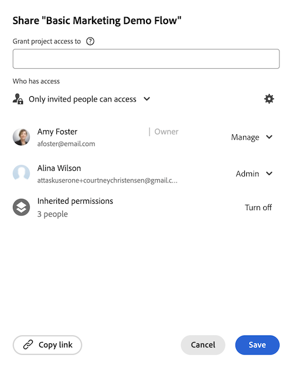

# Visa ärvda behörigheter för objekt

Din Adobe Workfront-administratör kan ge dig åtkomst till att visa eller redigera objekt när du tilldelar åtkomstnivån. Mer information finns i [Bevilja åtkomst till projekt](../../administration-and-setup/add-users/configure-and-grant-access/grant-access-projects.md).

Förutom den åtkomstnivå som användare har beviljats kan du även ge dem behörighet till specifika objekt som du har åtkomst till att dela. Mer information om åtkomstnivåer och behörigheter finns i [Hur åtkomstnivåer och behörigheter fungerar tillsammans](../../administration-and-setup/add-users/access-levels-and-object-permissions/how-access-levels-permissions-work-together.md).

Objekt ärver behörigheter från överordnade objekt i Adobe Workfront.

Mer information om objekthierarkin i Workfront finns i [Förstå objekt i Adobe Workfront](../../workfront-basics/navigate-workfront/workfront-navigation/understand-objects.md).

## Åtkomstkrav

<!--drafted for P&P:

<table style="table-layout:auto"> 
 <col> 
 <col> 
 <tbody> 
  <tr> 
   <td role="rowheader">Adobe Workfront plan*</td> 
   <td> 
Any 
 </td> 
  </tr> 
  <tr> 
   <td role="rowheader">Adobe Workfront license*</td> 
   <td> 
Current license: Standard

   Or
   
Legacy license: Work or higher
 </td> 
  </tr> 
  <tr> 
   <td role="rowheader">Access level configurations*</td> 
   <td> 
View or higher access on the objects you want to view permissions for
 
<b>NOTE</b>
   
   If you still don't have access, ask your Workfront administrator if they set additional restrictions in your access level. For information on how a Workfront administrator can modify your access level, see <a href="../../administration-and-setup/add-users/configure-and-grant-access/create-modify-access-levels.md" class="MCXref xref">Create or modify custom access levels</a>.
 </td> 
  </tr> 
  <tr> 
   <td role="rowheader">Object permissions</td> 
   <td> 
View or higher permissions on the objects you want to view permissions for
 
For information on requesting additional access, see <a href="../../workfront-basics/grant-and-request-access-to-objects/request-access.md" class="MCXref xref">Request access to objects </a>.
 </td> 
  </tr> 
 </tbody> 
</table>
-->

Du måste ha följande:

<table style="table-layout:auto"> 
 <col> 
 <col> 
 <tbody> 
  <tr> 
   <td role="rowheader">Adobe Workfront-plan*</td> 
   <td> 
Alla 
 </td> 
  </tr> 
  <tr> 
   <td role="rowheader">Adobe Workfront-licens*</td> 
   <td> 
Arbeta eller högre
 </td> 
  </tr> 
  <tr> 
   <td role="rowheader">Konfigurationer på åtkomstnivå*</td> 
   <td> 
Visa eller öka åtkomsten för de objekt som du vill visa behörigheter för
 
Obs! Om du fortfarande inte har åtkomst frågar du Workfront-administratören om de anger ytterligare begränsningar för din åtkomstnivå. Mer information om hur en Workfront-administratör kan ändra åtkomstnivån finns i <a href="../../administration-and-setup/add-users/configure-and-grant-access/create-modify-access-levels.md" class="MCXref xref">Skapa eller ändra anpassade åtkomstnivåer</a>.
 </td> 
  </tr> 
  <tr> 
   <td role="rowheader">Objektbehörigheter</td> 
   <td> 
Visa eller ange högre behörigheter för de objekt som du vill visa behörigheter för
 
Mer information om hur du begär ytterligare åtkomst finns i <a href="../../workfront-basics/grant-and-request-access-to-objects/request-access.md" class="MCXref xref">Begär åtkomst till objekt </a>.
 </td> 
  </tr> 
 </tbody> 
</table>

&#42;Kontakta Workfront-administratören om du vill veta vilken plan, licenstyp eller åtkomst du har.

## Visa ärvda behörigheter för ett objekt

Visning av ärvda behörigheter är identiskt för alla objekt.

Så här visar du ärvda behörigheter för ett projekt:

1. Gå till ett projekt vars delningsbehörigheter du vill visa.
1. Klicka på menyn **Mer**  och sedan på **Delning**.

1. Expandera listan **Ärvda behörigheter**.

   I den här listan visas namnen på användare som har åtkomst till antingen portföljen eller det program som projektet tillhör och som även har behörighet till projektet.

   

1. (Valfritt) Mer information om hur du tar bort ärvda behörigheter från ett objekt finns i [Ta bort behörigheter från objekt](../../workfront-basics/grant-and-request-access-to-objects/remove-permissions-from-objects.md).

   >[!NOTE]
   >
   >Du måste ha behörigheten Hantera för ett objekt för att kunna ta bort de ärvda behörigheterna.

 

 
