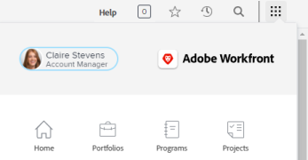

# Återställ lösenordet

{{important-not-on-aec}}

Du kan återställa ditt [!DNL Adobe Workfront]-lösenord. Som en viktig säkerhetsåtgärd rekommenderar vi att du gör detta regelbundet.

>[!NOTE]
>
>En [!DNL Workfront]-administratör kan konfigurera anpassade lösenordsbegränsningar enligt beskrivningen i [Konfigurera systemsäkerhetsinställningar](../../../administration-and-setup/manage-workfront/security/configure-security-preferences.md) och [Konfigurera lösenordsprinciper för autentisering](../../../administration-and-setup/manage-workfront/security/configure-password-policies-authentication.md).
>
><!-- [!DNL Workfront] administrator can also reset your password in an Enhanced Authentication enabled environment. For more information, see [Reset a user's password with Enhanced Authentication](../../../workfront-basics/manage-your-account-and-profile/managing-your-workfront-account/reset-user-password-eauth.md).-->

## Åtkomstkrav

+++ Expandera om du vill visa åtkomstkrav för funktionerna i den här artikeln.

Du måste ha följande:

<table style="table-layout:auto"> 
 <col> 
 </col> 
 <col> 
 </col> 
 <tbody> 
  <tr> 
   <td role="rowheader"><strong>[!DNL Adobe Workfront] plan</strong></td> 
   <td> 
Alla
 </td> 
  </tr> 
  <tr> 
   <td role="rowheader"><strong>[!DNL Adobe Workfront] licens</strong></td> 
   <td> 
      
Nytt:

         <ul>
         <li>
Medarbetare eller högre
</li>
         </ul>
      
Aktuell:

         <ul>
         <li>
Begäran eller senare
</li>
         </ul>
   </td>
  </tr> 
 </tbody> 
</table>

Mer information finns i [Åtkomstkrav i Workfront-dokumentationen](/help/quicksilver/administration-and-setup/add-users/access-levels-and-object-permissions/access-level-requirements-in-documentation.md).

+++

## Återställ ditt lösenord i [!DNL Adobe Workfront]

1. Klicka på ikonen **[!UICONTROL Main Menu]**  i det övre högra hörnet av [!DNL Adobe Workfront] och klicka sedan på ditt användarnamn bredvid din profilbild.

   

1. Klicka på ikonen **[!UICONTROL More menu]**  och sedan på **[!UICONTROL Edit]**.

1. Klicka på **[!UICONTROL Reset Password]** i rutan **[!UICONTROL Edit Person]** som visas under **[!UICONTROL Personal Info]**.

   

   Om din organisation har integrerat [!DNL Workfront] med en SSO-lösning kan du omdirigeras till om du vill återställa dina lösenord via SSO-systemet när du klickar på **[!UICONTROL Reset Password]**. Detta återställer ditt SSO-lösenord, vilket påverkar inloggningen till alla dina andra program i organisationen.

1. Skriv ditt gamla lösenord och skriv sedan det nya lösenordet två gånger.

   Lösenordet måste innehålla minst 8 tecken och innehålla två av följande typer av tecken:

   * Versaler
   * Gemener
   * Nummer
   * Specialtecken (som ! @ # $ %)

   Lösenordsreglerna kan vara mer strikta än detta, beroende på konfigurationsinställningarna som angetts av [!DNL Workfront]-administratören.

1. Klicka på **[!UICONTROL Save Changes]**.
