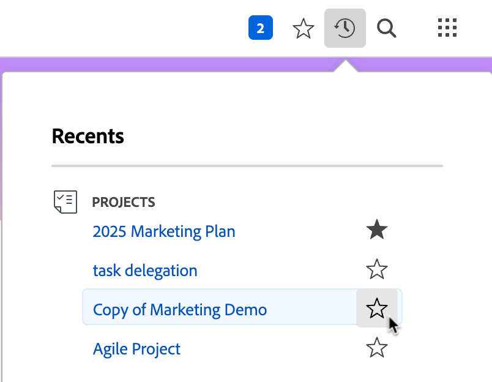

# Visa och hantera favoriter

<!-- Audited: 5/2025 -->

På menyn [!UICONTROL Favorites] kan du komma åt objekt snabbt. Objekten finns kvar på [!UICONTROL Favorites]-menyn tills du tar bort dem. Du kan ha upp till 40 alternativ på Favoriter-menyn.

## Åtkomstkrav

+++ Expandera om du vill visa åtkomstkrav för funktionerna i den här artikeln.

Du måste ha följande åtkomst för att kunna utföra stegen i den här artikeln:

<table style="table-layout:auto"> 
 <col> 
 </col> 
 <col> 
 </col> 
 <tbody> 
  <tr> 
   <td role="rowheader">[!DNL Adobe Workfront] plan</td> 
   <td> 
Alla
 </td> 
  </tr> 
  <tr> 
   <td role="rowheader">[!DNL Adobe Workfront] licens</td> 
   <td> 

      
Nytt: Medarbetare eller högre

      
eller

      
Aktuell: Begäran eller senare
 </td> 
  </tr> 
 </tbody> 
</table>

Mer information om informationen i den här tabellen finns i [Åtkomstkrav i Workfront-dokumentationen](/help/quicksilver/administration-and-setup/add-users/access-levels-and-object-permissions/access-level-requirements-in-documentation.md).

+++

## Visa en favorit

Så här visar du ett objekt som du tidigare har lagt till som favorit:

1. Klicka på ikonen **[!UICONTROL Favorites]**  i det övre högra hörnet på en [!DNL Adobe Workfront]-sida.

1. Klicka på det objekt du vill visa i listan **Favoriter**.

## Lägg till ett objekt som favorit

Du kan lägga till senaste objekt eller den aktuella sidan på menyn [!UICONTROL Favorites].

* [Lägg till senaste objekt som favorit](#add-recent-items-as-a-favorite)
* [Lägg till det aktuella objektet som en favorit](#add-the-current-item-as-a-favorite)

### Lägg till senaste objekt som favorit

1. Klicka på ikonen **[!UICONTROL Recents]**  i det övre högra hörnet på en sida i den nya [!DNL Adobe Workfront]-upplevelsen.
1. Klicka på stjärnan i linje med det objekt du vill spara som favorit. Det senaste objektet visas på menyn **Favoriter**.

   

### Lägg till det aktuella objektet som en favorit

1. Gå till sidan som du vill lägga till som favorit.
1. Klicka på ikonen **[!DNL Favorites]**  i det övre högra hörnet på sidan och klicka sedan på **[!UICONTROL Add Current Page]**.

   

   >[!NOTE]
   >
   >Om du klickar på ikonen **[!UICONTROL Favorites]** för ett objekt som du redan har lagt till som favorit tas objektet bort från menyn [!UICONTROL Favorites].\
   >

## Ta bort ett objekt från menyn [!UICONTROL Favorites]

1. Klicka på ikonen **[!UICONTROL Favorites]**  i det övre högra hörnet på en [!DNL Workfront]-sida.

1. Håll markören över det objekt som du vill ta bort som favorit och klicka sedan på **X** bredvid det.

   eller

   Om du är på sidan som du vill ta bort som favorit klickar du på ikonen **[!UICONTROL Favorites]**  bredvid objektnamnet för att ta bort den från menyn **Favoriter** .
