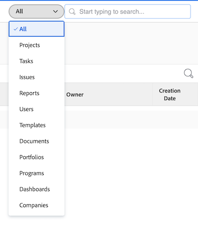

# Sök [!DNL Adobe Workfront]

<!-- Audited: 5/2025 -->

Du kan enkelt hitta objekt i [!DNL Adobe Workfront] genom att söka efter dem när du inte kommer ihåg deras exakta plats.

Du kan se rutan [!UICONTROL Search] i det övre högra hörnet på en sida i [!DNL Workfront].

Du måste ha behörighet att visa ett objekt innan du kan hitta det i en sökning. Därför varierar sökresultaten från användare till användare.

## Åtkomstkrav

+++ Expandera det här avsnittet om du vill visa den åtkomst som behövs för att utföra stegen i den här artikeln.

<table style="table-layout:auto"> 
 <col> 
 <col> 
 <tbody> 
  <tr> 
   <td role="rowheader">Adobe Workfront package</td> 
   <td> 
Alla
 </td> 
  </tr> 
  <tr> 
   <td role="rowheader">Adobe Workfront-licens</td> 
   <td> 
Medarbetare eller högre

   
Begäran eller senare 

   </td> 
  </tr> 
  <tr> 
   <td role="rowheader">Konfigurationer på åtkomstnivå</td> 
   <td> 
[!UICONTROL View] åtkomst till objekttypen 
 
Obs! Om du fortfarande inte har åtkomst frågar du [!DNL Workfront]-administratören om de anger ytterligare begränsningar för din åtkomstnivå. Mer information om hur en [!DNL Workfront]-administratör kan ändra din åtkomstnivå finns i <a href="../../../administration-and-setup/add-users/configure-and-grant-access/create-modify-access-levels.md" class="MCXref xref">Skapa eller ändra anpassade åtkomstnivåer</a>.
</td> 
  </tr> 
  <tr> 
   <td role="rowheader">Objektbehörigheter</td> 
   <td> 
Du måste ha behörighet att visa ett objekt innan du kan hitta det i en sökning.
 
Mer information om hur du begär ytterligare åtkomst finns i <a href="../../../workfront-basics/grant-and-request-access-to-objects/request-access.md" class="MCXref xref">Begär åtkomst till objekt </a>.
 </td> 
  </tr> 
 </tbody> 
</table>

Mer information om informationen i den här tabellen finns i [Åtkomstkrav i Workfront-dokumentationen](/help/quicksilver/administration-and-setup/add-users/access-levels-and-object-permissions/access-level-requirements-in-documentation.md).

+++

## Förstå sökning

### Objekt som är tillgängliga för sökning

Du kan söka efter följande objekt i Workfront:

* Projekt
* Uppgifter
* Problem
* Rapporter
* Användare
* Mallar
* Dokument
* Portföljer
* Program
* Kontrollpaneler
* Företag
* Anteckningar

### Fält som är tillgängliga för sökning

De fält som är tillgängliga för sökning baseras på typen av sökning: Grundläggande eller [!UICONTROL Advanced Search].

* **Grundläggande sökning**: När du söker efter objekt i en grundsökning söker [!DNL Workfront] efter text som kan innehålla dina nyckelord i följande fält:

   * Objektnamn
   * Beskrivning
   * Anpassade datafält
   * Uppdateringar
   * Dokumentnamn (i specifika dokumentsökningar och i en grundläggande sökning)

  Mer information om grundläggande sökning i [!DNL Workfront] finns i följande avsnitt i den här artikeln: [Grundläggande sökning](#basic-search).

* **[!UICONTROL Advanced Search]**: I en [!UICONTROL Advanced Search] kan du konfigurera filter för att söka efter fält som inte är tillgängliga i den grundläggande sökningen. Därför kan du i [!UICONTROL Advanced Search] söka efter alla fält i objektet.

  Mer information om [!UICONTROL Advanced Search] finns i följande avsnitt i den här artikeln: [Avancerad sökning](#advanced-search).

>[!NOTE]
>
>Om du vill utföra en [!UICONTROL Advanced Search] måste du markera alternativet [!UICONTROL Advanced Search] när sökningen börjar. Du kan inte förfina en grundläggande sökning till en [!UICONTROL Advanced Search].

## Förstå begränsningar för [!DNL Workfront]-sökningar

Tänk på följande begränsningar när du använder [!UICONTROL Search] i [!DNL Workfront]:

* Sökningar är inte skiftlägeskänsliga.
* [!DNL Workfront] rättar inte eller förstår inte stavfel.
* Sökningar i [!DNL Workfront] stöder inte jokertecken.
* Sökning i [!DNL Workfront] stöder partiella ordsökningar men stöder inte delsträngssökningar.\
   Söknyckelordet &quot;ställ&quot; returnerar till exempel resultat som innehåller ordet &quot;standard&quot;, men returnerar inte resultat som innehåller ordet &quot;förstå&quot;.

## Sök efter flera ord

När du tar med flera ord i en sökning och bara vill söka efter objekt som matchar alla ord i sökrutan, kan du skriva orden i valfri ordning.

Om du till exempel söker efter&quot;Marknadsföringsdemo&quot; (utan citattecken) hittas objekt med följande namn:

* Marknadsföringsdemo
* Demonstrationsmarknadsföring
* Marknadsanalysdemo för januari

Den hittar även objekt som kan ha &quot;Marknadsföring&quot; i namnet och &quot;Demo&quot; i beskrivningen.

Du kan dock göra följande i rutan [!UICONTROL Search] för att justera sökresultaten som visas:

<table style="table-layout:auto"> 
 <col> 
 <col> 
 <tbody> 
  <tr> 
   <td>Inkludera citattecken</td> 
   <td> 
Om du anger ord i rätt ordning inom citattecken kan du bara söka efter objekt som är exakt likadana. Om du till exempel söker efter"Marknadsföringsdemo" (med citattecken) hittas objekt med följande namn:
 
    <ul> 
     <li> Marknadsföringsdemo</li> 
     <li> Marknadsföringsdemo i januari</li> 
     <li>Marknadsföringsdemoplan</li> 
    </ul> 
Den här sökningen hittar dock inte något objekt med namnet"Demomarknadsföring".
 </td> 
  </tr> 
  <tr> 
   <td>Inkludera ELLER</td> 
   <td> 
Om du kopplar ord med "OR" (utan citattecken) kan du bara söka efter objekt som matchar minst ett av orden i rutan [!UICONTROL Search]. Dessa ord kan anges i valfri ordning. Om du till exempel söker efter"Marknadsföring ELLER demo" (utan citattecken) hittas objekt med följande namn:
 
    <ul> 
     <li> Marknadsanalysdemo</li> 
     <li>Marknadsanalysdemo för januari</li> 
     <li>Demo</li> 
     <li>Marknadsanalys</li> 
    </ul> 
Obs! "OR" måste finnas i versaler. Annars tolkas det som ett annat ord i den fras du söker efter.
 </td> 
  </tr> 
  <tr> 
   <td>Inkludera OCH</td> 
   <td> 
Om du kopplar ord med"AND" (utan citattecken) kan du bara söka efter objekt som matchar alla ord i rutan [!UICONTROL Search]. Dessa ord kan anges i valfri ordning. Om du till exempel söker efter"Marknadsföring och demo" (utan citattecken) hittas objekt med följande namn:
 
    <ul> 
     <li>Marknadsföringsdemo</li> 
     <li>Demonstrationsmarknadsföring</li> 
     <li>Marknadsanalysdemo för januari</li> 
    </ul> 
Obs!"AND" måste finnas i versaler. Annars tolkas det som ett annat ord i den fras du söker efter. Om du tar med "&amp;" (utan citattecken) söker du bara efter objekt som innehåller et-tecknet.
 </td> 
  </tr> 
 </tbody> 
</table>

## Använd sökning i [!DNL Workfront]

[!DNL Workfront] innehåller två typer av sökningar: Grundläggande och Avancerat. Använd Grundläggande sökning om du vill söka efter nyckelord i vanliga objektfält som namn eller beskrivning. Använd [!UICONTROL Advanced Search] om du vill använda filter för att söka efter andra objektfält.

* [Grundläggande sökning](#basic-search)
* [Avancerad sökning](#advanced-search)

### Grundläggande sökning

Med en grundläggande sökning kan du söka efter nyckelord i alla objekt i systemet eller i endast ett objekt i taget (till exempel projekt). [!DNL Workfront] söker sedan efter nyckelorden i några specifika fält. Du kan sedan förfina sökresultaten baserat på andra objektspecifika fält som markerats av [!DNL Workfront].

En lista över de specifika fält som genomsökts i den grundläggande sökningen finns i följande avsnitt i den här artikeln: [Fält tillgängliga för sökning](#fields-available-for-search).

>[!NOTE]
>
>Om du vill utföra en [!UICONTROL Advanced Search] måste du markera alternativet [!UICONTROL Advanced Search] när sökningen börjar. Du kan inte förfina en grundläggande sökning till en [!UICONTROL Advanced Search].

* [Utför en grundläggande sökning](#perform-a-basic-search)
* [Förfina en grundläggande sökning](#refine-a-basic-search)

#### Utför en grundläggande sökning

Du kan göra en grundläggande sökning på något av följande sätt:

* För alla objekt i systemet (allmän sökning).
* Endast ett objekt i taget (objektspecifik sökning).

Så här utför du en grundläggande sökning:

1. Klicka på förstoringsglaset  i det övre högra hörnet på sidan.

1. (Valfritt) Om du vill söka efter ett specifikt objekt klickar du på den nedrullningsbara menyn **[!UICONTROL All]** och markerar det objekt som du vill söka efter.

   

1. I rutan **[!UICONTROL Search]** börjar du skriva den information du söker efter.
Mer information om vilka fält som söks igenom i [!DNL Workfront] finns i följande avsnitt i den här artikeln: [Förstå sökning](#understand-search).
   

   När du börjar skriva i sökfältet gör [!DNL Workfront] rekommendationer baserat på din visningshistorik och det nyckelord du söker efter markeras med blått.

1. Om det objekt du söker efter visas på menyn [!UICONTROL typeahead] klickar du på det.

   eller

   Tryck på Retur (Mac) eller [!UICONTROL Enter] (Windows) på tangentbordet för att utföra en omfattande sökning. Den här sökningen söker igenom hela databasen i stället för de senast visade objekten och öppnar sidan **Sök**.

   Om du utförde en allmän sökning returnerar [!DNL Workfront] resultat för alla objekt som matchar söktermen i något av de sökta fälten, vilket beskrivs i [Förstå sökning](#understand-search). De objekt som matchar sökningen visas i en lista.

   >[!NOTE]
   >
   >Ibland kan varianter av ett ord visas i listan med hittade objekt.\
   >Om du till exempel söker efter&quot;marknadsföring&quot; visas objekt som innehåller antingen&quot;marknadsföring&quot; eller&quot;marknad&quot; i namnet.

1. (Valfritt) Om sökningen genererade för många resultat kan du förfina sökningen enligt beskrivningen i [Förfina en grundläggande sökning](#refine-a-basic-search).

#### Förfina en grundläggande sökning

När du har gjort en grundläggande sökning kan du förfina sökningen.

Använd verktygsfältet till vänster om sökresultaten för att begränsa den information du letar efter.

Så här förfinar du en sökning:

1. (Villkorligt) Om du utförde en allmän sökning markerar du det objekt du sökte efter i objektlistan längst upp till vänster i resultatet.
1. Leta upp fälten som är tillgängliga för de objekt som visas i sökningen i verktygsfältet till vänster om resultatet. Värdena för varje fält visas, sorterade efter antal, upp till 10 värden för varje fält.
1. Klicka i något av de tillgängliga fälten för att förkorta resultatlistan. De markeringar du gör markeras med blått och de fältvärden du inte markerar döljs.
När du har valt varje nytt värde uppdateras resultatet till höger dynamiskt.

   

1. (Valfritt) Klicka på de markerade värdena för att avmarkera dem och visa alla värden för varje fält igen.

### [!UICONTROL Advanced Search]

Med [!UICONTROL Advanced Search] kan du söka med hjälp av fält och filter som inte är tillgängliga för grundläggande sökning. Du kan till exempel söka efter projekt med en viss prioritet eller dokumentägarnamn.

>[!NOTE]
>
>Om du vill utföra en [!UICONTROL Advanced Search] måste du markera alternativet [!UICONTROL Advanced Search] när sökningen börjar. Du kan inte förfina en grundläggande sökning till en [!UICONTROL Advanced Search].

* [Använd [!UICONTROL Advanced Search]](#use-advanced-search)

#### Använd [!UICONTROL Advanced Search]

Du kan använda [!UICONTROL Advanced Search] för att filtrera din sökning baserat på specifika villkor.\
Den här typen av sökning är användbar när du inte kommer ihåg ett nyckelord som är associerat med ett objekt, men du känner till viss specifik information om det objektet (till exempel: Projektprioritet, Dokumentägarnamn osv.).

Så här utför du en avancerad sökning:

1. Klicka på ikonen [!DNL Workfront] **[!UICONTROL Search]** Sök . Menyn **Sök** visas.

1. Klicka på **längst ned på menyn** Sök **[!UICONTROL Advanced Search]**. Sidan **Sök** öppnas med fliken **Avancerad sökning** markerad som standard.
   

1. Välj den typ av objekt du söker efter. **[!UICONTROL Tasks]** är markerat som standard.

   

1. (Valfritt) Skriv ett nyckelord i fältet högst upp i listan.
1. (Valfritt) Förfina sökningen genom att växla **[!UICONTROL Filter your results]** till **På**. Klicka på **Använd** när du är klar.

1. Klicka på **[!UICONTROL Search]**. En lista med objekt som matchar sökningen visas till höger om verktygsfältet **[!UICONTROL Advanced Search]**.
