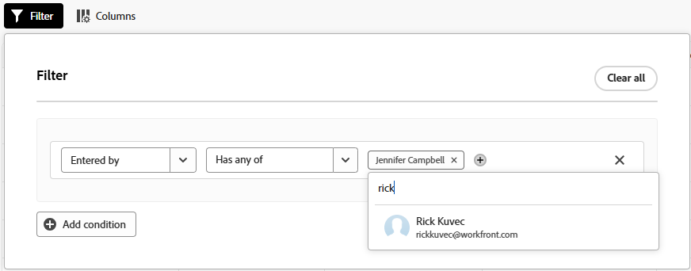
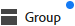

# Använd förbättrade listor

Förbättrade listor finns i vissa delar av Adobe Workfront. De här listorna har ett tabellformat för att visa listobjekten, och de har ett annat utseende och en annan känsla än standardlistorna. Hanteringen av vyer har också förbättrats, bland annat filtrering, gruppering, hantering av kolumner och sökning.

Mer information om standardlistorna finns i [Kom igång med listor i Adobe Workfront](/help/quicksilver/workfront-basics/navigate-workfront/use-lists/view-items-in-a-list.md).

>[!NOTE]
>
>Varje förbättrad lista kan konfigureras på olika sätt så att du kan visa de data du behöver. Alla listor använder inte alla funktioner som beskrivs i den här artikeln och vissa listor kan ha specialfunktioner som bara gäller för den listan.

## Åtkomstkrav

+++ Expandera om du vill visa åtkomstkrav för funktionerna i den här artikeln.

<table style="table-layout:auto">
 <col> 
 <col>
 <tbody> 
  <tr> 
   <td>Adobe Workfront package</td> 
   <td>
Alla
</td> 
  </tr> 
  <tr> 
   <td>Adobe Workfront-licens</td> 
   <td>
   
Medarbetare eller högre

   
Begäran eller senare
</td>
  </tr>
 </tbody> 
</table>

Mer information finns i [Åtkomstkrav i Workfront-dokumentationen](/help/quicksilver/administration-and-setup/add-users/access-levels-and-object-permissions/access-level-requirements-in-documentation.md).

+++

## Objekt som använder utökade listor

Nedan visas några typer av Workfront-objektlistor som använder det förbättrade listformatet och några av de områden där de visas som standard när du har behörighet att visa objektet.

>[!NOTE]
>
>Den här listan är inte heltäckande. Var och en av de här objektlistorna kan också visas i en rapport eller på en kontrollpanel. En Request-rapport eller en kontrollpanel som innehåller en Request-rapport visar till exempel även en lista med begäranden.

| Workfront-lista | Objektlistans plats |
|--- |--- |
| Prioriteringar | <ul><li>Hem > välj ikonen Prioriteter i den vänstra menyn</li><li>Huvudmeny > Prioriteter</li></ul> |
| Lista över begäranden | <ul><li>Begäranden (endast ny upplevelse)</li><li>Widgeten Mina förfrågningar på startsidan</li></ul> |
| Statuslistor, prioriteter, allvarlighetsgrader och valutakurser i installationsprogrammet | <ul><li>Inställningar > Projektinställningar > Status</li><li>Inställningar > Projektinställningar > Prioriteter</li><li>Inställningar > Projektinställningar > Allvarlighetsgrader</li><li>Inställningar > Projektinställningar > Exchange-priser</li></ul> |

## Lägga till objekt i en förbättrad lista

Beroende på vilken förbättrad lista du visar gör du något av följande:

1. Klicka på den blå knappen uppe till höger i listan. Med det här alternativet öppnas en dialogruta där du kan ange information. Data sparas som en ny rad i tabellen.

   ELLER

1. Klicka på **Ny rad** längst ned i listan. Med det här alternativet läggs en ny rad till i tabellen. Dubbelklicka i en cell för att ange information. Varje cell representerar ett fält för listobjektet. Fälten måste finnas innan du kan se dem i listan.

   Förbättrade listor har stöd för följande fälttyper:

   * Text
   * Nummer
   * Valuta
   * Datum
   * Datum och tid
   * Enstaka/flera urvalslistrutor
   * Typeahead
   * Stycke
   * Uppdragare (en eller flera)
   * Färgväljaren

   >[!NOTE]
   >
   >Varje fälttyp har sina egna redigeringsalternativ. Vissa fält kan vara skrivskyddade.

## Redigera objekt med åtgärdsfältet

Du kan använda åtgärdsfältet i en förbättrad lista för att redigera objekt i listan. Alla åtgärdsfält innehåller inte samma alternativ. Vissa listor kanske inte tillåter dig att markera objekt och åtgärdsfältet är inte tillgängligt.

1. Markera kryssrutan bredvid ett objekt i en förbättrad lista.

   Åtgärdsfältet visas längst ned på skärmen.

   >[!NOTE]
   >
   >Beroende på vilken lista du redigerar kan du markera ett eller flera objekt som ska användas i åtgärdsfältet.

1. Klicka på en åtgärd i fältet för att redigera objekt. Exempel på åtgärder du kan välja är:

   * Visa
   * Redigera
   * Ta bort

   Om det inte finns några tillgängliga åtgärder för det valda objektet visas&quot;Inga tillgängliga åtgärder&quot; i åtgärdsfältet.

   

1. Håll markören över det primära fältet för ett listobjekt och klicka sedan på **Mer** meny  för att se ytterligare åtgärder. Vissa åtgärder kan vara specifika för den listan.

   >[!TIP]
   >
   >Det primära fältet visas i den första kolumnen i listan.

   

## Anpassa kolumner

Beroende på vilka objekt du visar i en förbättrad lista kan du dölja, visa och ändra ordning på kolumner i listan.

1. Klicka på **Kolumner** ovanför listan.

   

1. Använd reglagen för att visa eller dölja kolumner i listan.
1. Om du vill ändra ordning på kolumnerna klickar du på ikonen **Dra**  och flyttar en kolumn till önskad plats. När du flyttar kolumner ändras listan automatiskt.

   >[!NOTE]
   >
   >Det primära fältet är den första kolumnen i listan. Den är fast på den första positionen och du kan inte ändra dess kolumn. Om antalet kolumner är stort, fryses det primära fältet till vänster och när du rullar vågrätt visas det alltid.
   >
   >Ikonen bredvid ett fältnamn visar fälttypen, till exempel text eller datumfält.

   En indikator visas på knappen **Kolumner** när kolumnerna är dolda. Indikatorn visas inte när du ändrar ordning på kolumnerna.

   

## Lägga till och ta bort kolumner med kolumnhanteraren

Du kan använda **kolumnhanteraren** i vissa förbättrade listor för att enkelt lägga till och ta bort kolumner i listan. Du kan lägga till eller ta bort både systemfält och anpassade fält som redan finns i Workfront som kolumner i en förbättrad lista.

Så här lägger du till och tar bort kolumner:

1. Klicka på ikonen + i tabellens övre högra hörn för att öppna rutan **Kolumnhanteraren**.
1. Sök efter ett befintligt objektfält i kolumnen **Tillgängligt** och klicka sedan på + till höger om fältnamnet för att lägga till det i kolumnen **Markerat**.
1. Klicka på - till höger om ett fält i kolumnen **Markerad** för att ta bort det från listan.

   >[!NOTE]
   >
   >Vissa fält kan vara åtgärdade och kan inte tas bort.

   <!-- Add info about Properties and KPIs when something gets released with those options -->

1. Klicka på **Spara**.

   

   Listan uppdaterar kolumnerna enligt de val du har gjort.

## Visa data med vyer i en förbättrad lista

En vy är en anpassad uppsättning kolumnupplägg och filter som du kan använda på en lista. Du kan skapa nya vyer och redigera befintliga vyer.

### Använda och skapa vyer

Om du vill använda en vy klickar du på listrutan **Vyer** och väljer den vy som du vill använda i listan.

Så här skapar du en ny vy:

1. Klicka på listrutan **Vyer** och välj **Ny vy**.
1. Ange ett namn för vyn och klicka på **Skapa**.
1. (Valfritt) Dölj, visa eller ordna om kolumnerna. Mer information finns i [Anpassa kolumner i en förbättrad lista](#customize-columns-in-an-enhanced-list).
1. (Valfritt) Filtrera och gruppera listobjekten. Mer information finns i [Filtrera och gruppera objekt i en förbättrad lista](#filter-and-group-items-in-an-enhanced-list).

   Ändringar av vyer sparas automatiskt och ändringarna visas för alla som använder vyn.

   Nästa gång du använder den här vyn behåller du inställningarna för kolumner och filter.

### Dela en vy

I listrutan **Vyer** kan du se tre vykategorier:

* **Systemvyer**: Vyer som systemadministratören har tilldelat dig.
* **Delade vyer**: Vyer som har delats med dig av andra användare.
* **Mina vyer**: Vyer som du har skapat och kan dela med andra. Du kan dela vyer med andra användare, team eller grupper.

Så här delar du en vy:

1. I listrutan **Vyer** för du pekaren över den vy i **Mina vyer** som du vill dela och klickar sedan på menyn med tre punkter när den visas.
1. Välj **Dela**.
1. I dialogrutan Dela anger du namnen på de användare, team eller grupper som du vill dela vyn med och markerar dem sedan i listan när de visas.

   Du kan ge följande behörigheter till mottagarna:

   * **Visa**: Användare kan tillämpa vyn på listan men inte dela den.
   * **Hantera**: Användare kan byta namn på vyn, dela den med andra och ta bort den.

1. Klicka på **Spara**.

## Filtrera och gruppera objekt

Med filter kan du minska mängden information som visas i listan. Grupperingar separerar objekten i listan i områden baserat på specifika kriterier.

### Använda filter

1. Klicka på **Filter** ovanför listan.
1. Klicka på **Lägg till villkor** i rutan Filter.
1. Välj ett fält att filtrera efter.
1. Välj en filtermodifierare, till exempel &quot;Har någon av,&quot; &quot;Har ingen av,&quot; &quot;Är före&quot; eller &quot;Är efter&quot;. Modifieringsalternativen varierar beroende på vilken typ av fält du filtrerar efter.
1. Markera fältvärdet eller -värdena. Beroende på vilken fälttyp du filtrerar efter kan du uppmanas att välja objektet från en lista, söka efter det eller använda en kalender för att välja ett datumintervall.

   

   Filtret tillämpas automatiskt på listan.

   >[!TIP]
   >
   >Om du vill använda ett aktuellt användarens jokertecken väljer du **Jag (inloggad användare)** som fältvärde. Filtret gäller sedan den användare som visar listan. Jokertecknet är tillgängligt i fält där värdet är en användare.

1. Klicka på **Lägg till villkor** om du vill lägga till ytterligare ett villkor i filtret som en OR-programsats.
1. När filtret används kan du öppna alternativen för **Filter** igen och ändra filteralternativen eller ta bort alla filter.

   En indikator visas på knappen **Filter** när ett filter används i listan.

   

### Använd grupperingar

1. Klicka på **Grupp** ovanför listan.
1. Välj en gruppering för att ordna listan.

   

1. När grupperingen används kan du öppna grupperingsalternativen igen om du vill komprimera eller utöka alla grupperingar samtidigt, ändra grupperingen till gruppering i ett annat fält eller ta bort alla grupperingar.

   

   En indikator visas på knappen **Grupp** när en gruppering används i listan.

   

## Sortera och söka i en förbättrad lista

Så här sorterar du enskilda kolumner:

1. Gå till kolumnen och klicka på nedpilen.

   En ikon bredvid ett kolumnnamn anger att listan sorteras efter värdena i den kolumnen och sorteringsriktningen.

   >[!NOTE]
   >
   >Vissa kolumner kanske inte kan sorteras, beroende på listan.

   

Så här sorterar du arbetet i en grupp:

1. Klicka på **Grupp** och välj om du vill sortera i stigande eller fallande ordning.

   

Så här söker du:

1. Skriv söktermen i sökfältet ovanför listan. Resultatet markeras i listan när du skriver.

   
