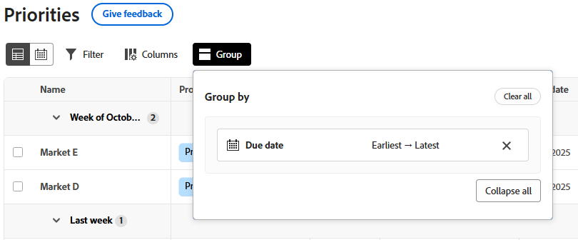

# Använd förbättrade listor

Förbättrade listor finns i vissa delar av Adobe Workfront. De här listorna har ett tabellformat för att visa listobjekten, och de har ett annat utseende och en annan känsla än standardlistorna. Hanteringen av vyer har också förbättrats, bland annat filtrering, gruppering, hantering av kolumner och sökning.

Mer information om standardlistorna finns i [Kom igång med listor i Adobe Workfront](/help/quicksilver/workfront-basics/navigate-workfront/use-lists/view-items-in-a-list.md).

>[!NOTE]
>
>Varje förbättrad lista kan konfigureras på olika sätt så att du kan visa de data du behöver. Alla listor använder inte alla funktioner som beskrivs i den här artikeln och vissa listor kan ha specialfunktioner som bara gäller för den listan.

## Åtkomstkrav

+++ Expandera om du vill visa åtkomstkrav för funktionerna i den här artikeln.

<table style="table-layout:auto">
 <col> 
 <col>
 <tbody> 
  <tr> 
   <td>Adobe Workfront package</td> 
   <td>
Alla
</td> 
  </tr> 
  <tr> 
   <td>Adobe Workfront-licens</td> 
   <td>
   
Medarbetare eller högre

   
Begäran eller senare
</td>
  </tr>
 </tbody> 
</table>

Mer information finns i [Åtkomstkrav i Workfront-dokumentationen](/help/quicksilver/administration-and-setup/add-users/access-levels-and-object-permissions/access-level-requirements-in-documentation.md).

+++

## Objekt som använder utökade listor

Nedan visas några typer av Workfront-objektlistor som använder det förbättrade listformatet och några av de områden där de visas som standard när du har behörighet att visa objektet.

>[!NOTE]
>
>Den här listan är inte heltäckande. Var och en av de här objektlistorna kan också visas i en rapport eller på en kontrollpanel. En projektrapport eller en kontrollpanel som innehåller en projektrapport visar till exempel även en lista med projekt.

| Workfront-lista | Objektlistans plats |
|--- |--- |
| Prioriteringar | <ul><li>Hem > välj ikonen Prioriteter i den vänstra menyn</li><li>Huvudmeny > Prioriteter</li></ul> |
| Lista över begäranden | <ul><li>Begäranden (endast ny upplevelse)</li><li>Widgeten Mina förfrågningar på startsidan</li></ul> |
| Förteckning över valutakurser | <ul><li>Inställningar > Projektinställningar > Exchange-priser</li></ul> |

## Lägga till och redigera objekt i en förbättrad lista

Beroende på hur den förbättrade listan är konfigurerad kan det finnas två sätt att lägga till ett objekt i listan:

* Klicka på en knapp ovanför listan. Med det här alternativet öppnas en dialogruta där du kan ange information och spara den.
* Klicka på **Ny rad** längst ned i listan. Med det här alternativet läggs en ny rad till i tabellen och du anger information i varje cell.

  Förbättrade listor har stöd för följande fälttyper:

   * Text
   * Nummer
   * Valuta
   * Datum
   * Datum och tid
   * Enstaka/flera urvalslistrutor
   * Typeahead
   * Stycke
   * Uppdragare (en eller flera)
   * Färgväljaren

  När du redigerar en cell har varje fälttyp sina egna redigeringsalternativ.

Om du vill redigera ett objekt i listan dubbelklickar du i cellen som du vill redigera och skriver informationen. Vissa celler kan vara skrivskyddade.

## Använda åtgärdsfältet och Mer-menyn i en förbättrad lista

När du markerar kryssrutan bredvid ett objekt i den utökade listan visas åtgärdsfältet längst ned på skärmen och de åtgärder du kan utföra för objektet visas. Vissa åtgärder kan vara specifika för den listan och visas inte i några andra listor.

>[!NOTE]
>
>Olika förbättrade listor kan göra det möjligt att markera ett enstaka objekt, gruppredigera (markera mer än ett objekt) eller inte markera något objekt.

Klicka på en knapp i åtgärdsfältet för att utföra den åtgärden, till exempel visa listobjektet, ta bort objektet eller redigera objektet.

Om det inte finns några tillgängliga åtgärder för det valda objektet anges &quot;Inga tillgängliga åtgärder&quot; i åtgärdsfältet.

Menyn **Mer** är den trepunktsmeny som visas intill ett primärt fält i ett listobjekt när du hovrar över det. (Det primära fältet är kolumnen längst till vänster i tabellen.)

Klicka på menyn om du vill se ytterligare åtgärder för objektet. Vissa åtgärder kan vara specifika för den listan och visas inte i några andra listor.

## Anpassa kolumner i en förbättrad lista

I vissa förbättrade listor kan du dölja och visa kolumner och ändra ordning på kolumnerna.

1. Klicka på **Kolumner** ovanför listan.

   

1. Använd reglagen för att visa eller dölja kolumner i listan.
1. Om du vill ändra ordning på kolumnerna klickar du på ikonen **Dra** och flyttar en kolumn till önskad plats. När du flyttar kolumner ändras listan automatiskt.

   >[!NOTE]
   >
   >Det primära fältet är kolumnen längst till vänster i tabellen. Den är fast på den första positionen och du kan inte ändra dess kolumn. Om antalet kolumner är stort, fryses det primära fältet till vänster och när du rullar vågrätt visas det alltid.
   >
   >Ikonen bredvid ett fältnamn visar fälttypen, till exempel text eller datumfält.

   En indikator visas på knappen **Kolumner** när kolumnerna är dolda. Indikatorn visas inte när du ändrar ordning på kolumnerna.

   

## Filtrera och gruppera objekt i en förbättrad lista

Med filter kan du minska mängden information som visas i listan. Grupperingar separerar objekten i listan i områden baserat på specifika kriterier.

### Använda filter

1. Klicka på **Filter** ovanför listan.
1. Klicka på **Lägg till villkor** i rutan Filter.
1. Välj ett fält att filtrera efter.
1. Välj en filtermodifierare, till exempel &quot;Har någon av,&quot; &quot;Har ingen av,&quot; &quot;Är före&quot; eller &quot;Är efter&quot;. Modifieringsalternativen varierar beroende på vilken typ av fält du filtrerar efter.
1. Markera fältvärdet eller -värdena. Beroende på vilken fälttyp du filtrerar efter kan du uppmanas att välja objektet från en lista, söka efter det eller använda en kalender för att välja ett datumintervall.

   

   Filtret tillämpas automatiskt på listan.

1. Klicka på **Lägg till villkor** om du vill lägga till ytterligare ett villkor i filtret som en OR-programsats.
1. När filtret används kan du öppna alternativen för **Filter** igen och ändra filteralternativen eller ta bort alla filter.

   En indikator visas på knappen **Filter** när ett filter används i listan.

   

### Använd grupperingar

1. Klicka på **Grupp** ovanför listan.
1. Välj en gruppering för att ordna listan.

   

1. När grupperingen används kan du öppna grupperingsalternativen igen om du vill komprimera eller utöka alla grupperingar samtidigt, ändra grupperingen till gruppering i ett annat fält eller ta bort alla grupperingar.

   

   En indikator visas på knappen **Grupp** när en gruppering används i listan.

   

## Sortera och söka i en förbättrad lista

Om du vill sortera enskilda kolumner går du till kolumnen och klickar på nedpilen. En ikon bredvid ett kolumnnamn anger att listan sorteras efter värdena i den kolumnen och sorteringsriktningen.

>[!NOTE]
>
>Vissa kolumner kanske inte kan sorteras.

Om du vill sortera ditt arbete i en gruppering öppnar du **Grupp** och väljer om du vill sortera i stigande eller fallande ordning.

Om du vill söka skriver du söktermen i sökfältet ovanför listan. Resultatet markeras i listan när du skriver.

